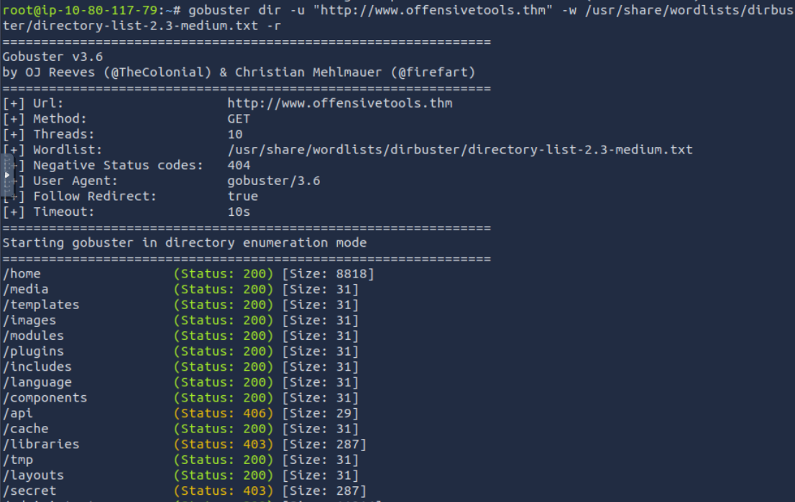
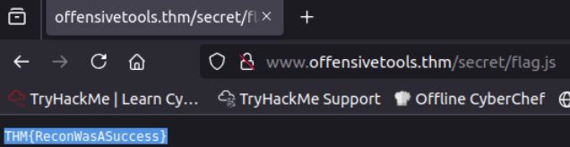
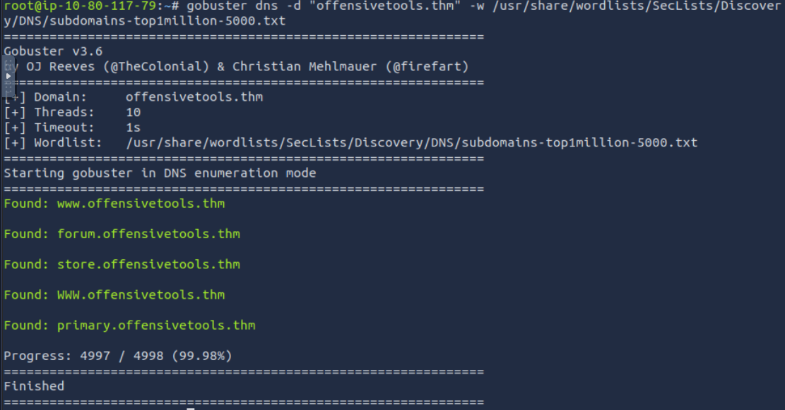
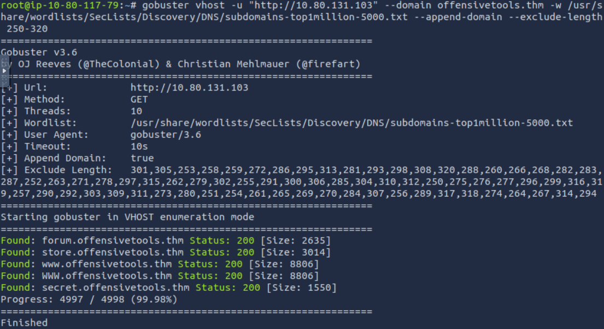

# [Gobuster - The Basics](https://tryhackme.com/room/gobusterthebasics)

## Gobuster: Introduction

You can find installation instructions for Gobuster on your own machine in the official [Gobuster GitHub repository](https://github.com/OJ/gobuster).

Gobuster is an open-source offensive tool written in Golang. It enumerates web directories, DNS subdomains, vhosts, Amazon S3 buckets, and Google Cloud Storage by brute force, using specific wordlists and handling the incoming responses. Many security professionals use this tool for penetration testing, bug bounty hunting, and cyber security assessments. Looking at the phases of ethical hacking, we can place Gobuster between the reconnaissance and scanning phases.

Before exploring Gobuster, let’s briefly discuss the concepts of enumeration and Brute Force.

**Enumeration**

Enumeration is the act of listing all the available resources, whether they are accessible or not. For example, Gobuster enumerates web directories.

**Brute Force**

Brute force is the act of trying every possibility until a match is found. It is like having ten keys and trying them all on a lock until one fits. Gobuster uses wordlists for this purpose.

Let’s look at the flags we will often use throughout this room:

| Short Flag | Long Flag    | Description                                                                                                                                                                                                                                                                                                            |
| ---------- | ------------ | ---------------------------------------------------------------------------------------------------------------------------------------------------------------------------------------------------------------------------------------------------------------------------------------------------------------------- |
| `-t`       | `--threads`  | This flag configures the number of threads to use for the scan. Each of these threads sends out requests with a slight delay. The default number of threads is 10. This number may be slow when using large wordlists. You can increase or decrease the number of threads depending on the available system resources. |
| `-w`       | `--wordlist` | The flag configures a wordlist to use for iterating. Each wordlist entry is attached to the URL you included in the command.                                                                                                                                                                                           |
|            | `--delay`    | This flag defines the amount of time to wait between sending requests. Some web servers include mechanisms to detect enumeration by looking at how many requests are received in a certain period of time. We can increase the delay between subsequent requests to make it look like normal web traffic.              |
|            | `--debug`    | This flag helps us to troubleshoot when our command gives unexpected errors.                                                                                                                                                                                                                                           |
| `-o`       | `--output`   | This flag writes the enumeration results to a file we choose.                                                                                                                                                                                                                                                          |

Let us look at an example of how we would use these commands and flags together to enumerate a web directory:

```
gobuster dir -u "http://www.example.thm/" -w /usr/share/wordlists/dirb/small.txt -t 64
```

- `gobuster dir` indicates that we will use the directory and file enumeration mode.
- `-u "http://www.example.thm/"` tells Gobuster that the target URL is [http://example.thm/](http://example.thm/).
- `-w /usr/share/wordlists/dirb/small.txt` directs Gobuster to use the _small.txt_ wordlist to brute force the web directories. Gobuster will use each entry in the wordlist to form a new URL and send a GET request to that URL. If the first entry of the wordlist were images, Gobuster would send a GET request to [http://example.thm/images/.](http://example.thm/images/.)
- `-t 64` sets the number of threads Gobuster will use to 64. This improves the performance drastically.

### Questions

Q: What flag do we use to specify the target URL?ss

A: `-u`

Q: What **command** do we use for the subdomain enumeration mode?

A: `dns`

## Use Case: Directory and File Enumeration

Gobuster has a `dir` mode, allowing users to enumerate website directories and their files. This mode is useful when you are performing a penetration test and would like to see what the directory structure of a website is and what files it contains. Often, directory structures of websites and web apps follow a particular convention, making them susceptible to Brute Force using wordlists. 

If you want a complete overview of what the Gobuster `dir` command can offer, you can look at the help page. Seeing the extensive help page for the dir command can somewhat be intimidating. So, we will focus on the most essential flags in this room. Type the following command to display the help: `gobuster dir --help`.

| Flag | Long Flag                  | Description                                                                                                                                                                                                                   |
| ---- | -------------------------- | ----------------------------------------------------------------------------------------------------------------------------------------------------------------------------------------------------------------------------- |
| `-c` | `--cookies`                | This flag configures a cookie to pass along each request, such as a session ID.                                                                                                                                               |
| `-x` | `--extensions`             | This flag specifies which file extensions you want to scan for. E.g., .php, .js                                                                                                                                               |
| `-H` | `--headers`                | This flag configures an entire header to pass along with each request.                                                                                                                                                        |
| `-k` | `--no-tls-validation`      | This flag  skips the process that checks the certificate when https is used. It often happens for CTF events or test rooms like the ones on THM a self-signed certificate is used. This causes an error during the TLS check. |
| `-n` | `--no-status`              | You can set this flag when you don’t want to see status codes of each response received. This helps keep the output on the screen clear.                                                                                      |
| `-P` | `password`                 | You can set this flag together with the --username flag to execute authenticated requests. This is handy when you have obtained credentials from a user.                                                                      |
| `-s` | `--status-codes`           | With this flag, you can configure which status codes of the received responses you want to display, such as 200, or a range like 300-400.                                                                                     |
| `-b` | `--status-codes-blacklist` | This flag allows you to configure which status codes of the received responses you don’t want to display. Configuring this flag overrides the -s flag.                                                                        |
| `-U` | `--username`               | You can set this flag together with the `--password` flag to execute authenticated requests. This is handy when you have obtained credentials from a user.                                                                    |
| `-r` | `--followredirect`         | This flags configures Gobuster to follow the redirect that it received as a response to the sent request. A HTTP redirect status code (e.g., 301 or 302) is used to redirect the client to a different URL.                   |
|      |                            |                                                                                                                                                                                                                               |

To run Gobuster in `dir` mode, use the following command format:

```
gobuster dir -u "http://www.example.thm" -w /path/to/wordlist
```

  
Notice that the command also includes the flags `-u` and `-w`, in addition to the `dir` keyword. These two flags are required for the Gobuster directory enumeration to work. Let us look at a practical example of how to enumerate directories and files with Gobuster `dir` mode:

```
gobuster dir -u "http://www.example.thm" -w /usr/share/wordlists/dirbuster/directory-list-2.3-medium.txt -r
```

  
This command scans all the directories located at _www.example.thm_ using the wordlist _directory-list-2.3-medium.txt_. Let’s look a bit closer at each part of the command:

- `gobuster dir`: Configures Gobuster to use the directory and file enumeration mode.
- `-u http://www.example.thm`:

- The URL will be the base path where Gobuster starts looking. So, the URL  above is using the root web directory. For example, in a typical Apache installation on Linux, this is `/var/www/html`. So if you have a “resources” directory and you want to enumerate that directory, you’d set the URL as `http://www.example.thm/resources`. You can also think of this like `http://www.example.thm/path/to/folder`.
- The URL must contain the protocol used, in this case, HTTP. This is important and required. If you pass the wrong protocol, the scan will fail.
- In the host part of the URL, you can either fill in the IP or the HOSTNAME. However, it is important to mention that when using the IP, you may target a different website than intended. A web server can host multiple websites using one IP (this technique is also called virtual hosting). Use the HOSTNAME if you want to be sure.
- Gobuster does not enumerate recursively. So, if the results show a directory path you are interested in, you will have to enumerate that specific directory.

- `-w /usr/share/wordlists/dirbuster/directory-list-2.3-medium.txt` configures Gobuster to use the _directory-list-2.3-medium.txt_ wordlist to enumerate. Each entry of the wordlist is appended to the configured URL.
- `-r` configures Gobuster to follow the redirect responses received from the sent requests. If a status code 301 was received, Gobuster will navigate to the redirect URL that is included in the response.  
    

Let’s look at a second example where we use the `-x` flag to specify what type of files we want to enumerate:

```
gobuster dir -u "http://www.example.thm" -w /usr/share/wordlists/dirbuster/directory-list-2.3-medium.txt -x .php,.js
```

  
This command will look for directories located at [http://example.thm](http://example.thm) using the wordlist _directory-list-2.3-medium.txt_. In addition to directory listing, this command also lists all the files that have a .php or .js extension.
### Questions

Q: Which flag do we have to add to our command to skip the TLS verification? Enter the long flag notation.

A: `--no-tls-validation`

Q: Enumerate the directories of www.offensivetools.thm. Which directory catches your attention?

`obuster dir -u "http://www.offensivetools.thm" -w /usr/share/wordlists/dirbuster/directory-list-2.3-medium.txt -r`



A: `secret`

Q: Continue enumerating the directory found in question 2. You will find an interesting file there with a .js extension. What is the flag found in this file?



A: `THM{ReconWasASuccess}`

## Use Case: Subdomain Enumeration

The next mode we’ll focus on is the `dns` mode. This mode allows Gobuster to brute force subdomains. During a penetration test,  checking the subdomains of your target’s top domain is essential. Just because something is patched in the regular domain, it doesn't mean it is also patched in the subdomain. An opportunity to exploit a vulnerability in one of these subdomains may exist. For example, if TryHackMe owns _tryhackme.thm_ and _mobile.tryhackme.thm_, there may be a vulnerability in _mobile.tryhackme.thm_ that is not present in _tryhackme.thm_. That is why it is important to search for subdomains as well!

The `dns` mode offers fewer flags than the `dir` mode. But these are more than enough to cover most DNS subdomain enumeration scenarios.

| Flag | Long Flag      | Description                                                                       |
| ---- | -------------- | --------------------------------------------------------------------------------- |
| `-c` | `--show-cname` | Show CNAME Records (cannot be used with the `-i` flag).                           |
| `-i` | `--show-ips`   | Including this flag shows IP addresses that the domain and subdomains resolve to. |
| `-r` | `--resolver`   | This flag configures a custom DNS server to use for resolving.                    |
| `-d` | `--domain`     | This flag configures the domain you want to enumerate.                            |

### How to Use dns Mode

To run Gobuster in dns mode, use the following command syntax:  
`gobuster dns -d example.thm -w /path/to/wordlist`  

Notice that the command also includes the flags `-d` and `-w`, in addition to the `dns` keyword. These two flags are required for the Gobuster subdomain enumeration to work. Let us look at an example of how to enumerate  subdomains with Gobuster dns mode:

`gobuster dns -d example.thm -w /usr/share/wordlists/SecLists/Discovery/DNS/subdomains-top1million-5000.txt`

- `gobuster dns` enumerates subdomains on the configured domain.  
    
- `-d example.thm` sets the target to the _example.thm_ domain.  
    
- `-w /usr/share/wordlists/SecLists/Discovery/DNS/subdomains-top1million-5000.txt` sets the wordlist to s_ubdomains-top1million-5000.txt_. Gobuster uses each entry of this list to construct a new DNS query. If the first entry of this list is 'all', the query would be _all.example.thm._

### Questions

Q: Apart from the dns keyword and the -w flag, which **shorthand flag** is required for the command to work?

A:  `-d`

Q: Use the commands learned in this task, how many subdomains are configured for the offensivetools.thm domain?

`gobuster dns -d "offensivetools.thm" -w /usr/share/wordlists/SecLists/Discovery/DNS/subdomains-top1million-5000.txt `



A: `4`

## Use Case: Vhost Enumeration

The last and final mode we’ll focus on is the `vhost` mode. This mode allows Gobuster to brute force virtual hosts. Virtual hosts are different websites on the same machine. Sometimes, they look like subdomains, but don’t be deceived! Virtual hosts are IP-based and are running on the same server. Subdomains are set up in DNS. The  difference between `vhost` and `dns` mode is in the way Gobuster scans:

- `vhost` mode will navigate to the URL created by combining the configured HOSTNAME (-u flag) with an entry of a wordlist.
- `dns` mode will do a DNS lookup to the FQDN created by combining the configured domain name (-d flag) with an entry of a wordlist.

The `vhost` mode offers flags similar to those of the dir mode. Let us have a look at some of the commonly used flags:

| **Short Flag** | **Long Flag**       | **Description**                                                                                       |
| -------------- | ------------------- | ----------------------------------------------------------------------------------------------------- |
| `-u`           | `--url`             | Specifies the base URL (target domain) for brute-forcing virtual hostnames.                           |
|                | `--append-domain`   | Appends the base domain to each word in the wordlist (e.g., word.example.com).                        |
| `-m`           | `--method`          | Specifies the HTTP method to use for the requests (e.g., GET, POST).                                  |
|                | `--domain`          | Appends a domain to each wordlist entry to form a valid hostname (useful if not provided explicitly). |
|                | `--exclude-length`  | Excludes results based on the length of the response body (useful to filter out unwanted responses).  |
| `-r`           | `--follow-redirect` | Follows HTTP redirects (useful for cases where subdomains may redirect).                              |

To run Gobuster in `vhost` mode, type the following command:

```
gobuster vhost -u "http://example.thm" -w /path/to/wordlist
```

  
Notice that the command also includes the flags `-u` and `-w`, in addition to the `vhost` keyword. These two flags are required for the Gobuster vhost enumeration to work.

You will notice that this command is much more complex than the base command syntax. It contains many more configured flags. This will often be the case in realistic tests, depending on how the infrastructure of the domain to test has been set up. In our case, we don't have a fully set up DNS infrastructure. This requires us to give in extra flags like `--domain` and `--append-domain`. We need to look at the web requests Gobuster sends to understand better how these flags work.

Gobuster will send multiple requests, each time changing the `Host:` part of the request. The value of `Host:` in this example is _www.example.thm_. We can break this down into three parts:

- `www`: This is the subdomain. This is the part that Gobuster will fill in with each entry of the configured wordlist.
- `.example`: This is the second-level domain. You can configure this with the `--domain` flag (this needs to be configured together with the top-level domain).
- `.thm`: This is the top-level domain. You can configure this with the `--domain` flag (this needs to be configured together with the second-level domain).

Now that we know how Gobuster sends its request, let's break down the command and examine each flag more closely:  

- `gobuster vhost` instructs Gobuster to enumerate virtual hosts.
- `-u "http://10.80.131.103"` sets the URL to browse to 10.80.131.103.
- `-w /usr/share/wordlists/SecLists/Discovery/DNS/subdomains-top1million-5000.txt` configures Gobuster to use the _subdomains-top1million-5000.txt_ wordlist. Gobuster appends each entry in the wordlist to the configured domain. If no domain is explicitly configured with the `--domain` flag, Gobuster will extract it from the URL. E.g., _test.example.thm_, _help.example.thm_, etc. If any subdomains are found, Gobuster will report them to you in the terminal.  
    
- `--domain example.thm` sets the top- and second-level domains in the `Hostname:` part of the request to _example.thm._  
    
- `--append-domain` appends the configured domain to each entry in the wordlist. If this flag is not configured, the set hostname would be _www_, _blog_, etc. This will cause the command to work incorrectly and display false positives.
- `--exclude-length` filters the responses we get from the sent web requests. With this flag, we can filter out the false positives. If you run the command without this flag, you will notice you will get a lot of false positives like "Found: Orion.example.thm Status: 404 [Size: 279]" or  "Found: pm.example.thm Status: 404 [Size: 276]". These false positives typically have a similar response size, so we can use this to filter out most false positives. We expect to get a 200 OK response back to have a true positive. There are, however, exceptions, but it is not in the scope of this room to go deeper into these.
### Questions

Q: Use the commands learned in this task to answer the following question: How many vhosts on the offensivetools.thm domain reply with a status code 200?

`gobuster vhost -u "http://10.80.131.103" --domain offensivetools.thm -w /usr/share/wordlists/SecLists/Discovery/DNS/subdomains-top1million-5000.txt --append-domain --exclude-length 250-320`



A: `4`

## Section 5

### Questions

Q:

A: ``

Q:

A: ``

Q:

A: ``

Q:

A: ``

Q:

A: ``

Q:

A: 

## Section 6

### Questions

Q:

A: ``

Q:

A: ``

Q:

A: ``

Q:

A: ``

Q:

A: ``

Q:

A: 