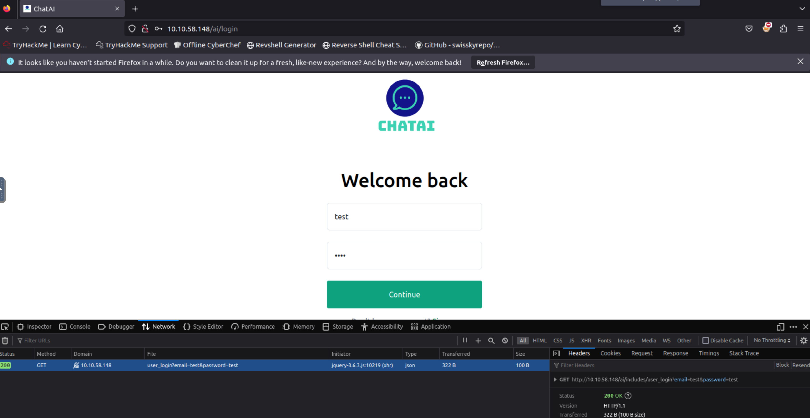
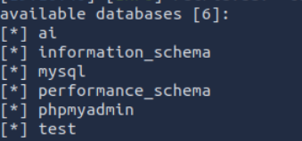
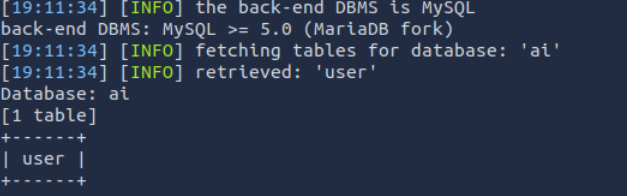
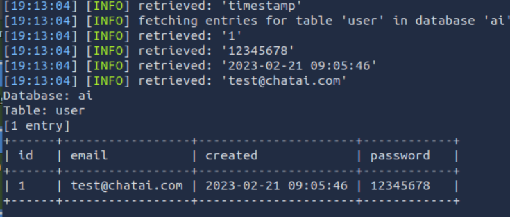

# [SQLMap - The Basics](https://tryhackme.com/room/sqlmapthebasics)

## Section 1

SQL injection is a prevalent vulnerability and has long been a hot topic in cyber security. To understand this vulnerability, we must first learn what a database is and how websites interact with a database.

A database is a collection of data that can be stored, modified, and retrieved. It stores data from several applications in a structured format, making storage, modification, and retrieval easy and efficient. You interact with several websites daily. The website contains some of the web pages where user input is required. For instance, a website with a login page asks you to enter your credentials, and once you enter them, it checks if the credentials are correct and logs you in if they are. As many users log in to that website, how does that website record all these users’ data and verify it during the authentication process? This is all done with the help of a database. These websites have databases that store the user and other information and retrieve it when needed. So when you enter your credentials to a website’s login page, the website interacts with its database to check if these credentials are correct. Similarly, if you have an input field to search for something, for instance, an input field of a bookshop website allows you to search for the available books for sale. When you search for any book, the website will interact with the database to fetch the record of that book and display it on the website.

Now, we know that the website asks the database to retrieve, store, or modify any data. So, how does this interaction take place? The databases are managed by Database Management Systems (DBMS), such as MySQL, PostgreSQL, SQLite, or Microsoft SQL Server. These systems understand the Structured Query Language (SQL). So, any application or website uses SQL queries when interacting with the database.

Once you enter your username and password, the website will receive it, make an SQL query with your credentials, and send it to the database. 

 `SELECT * FROM users WHERE username = 'John' AND password = 'Un@detectable444';`
        

This query will be executed in the database. As per this query, the database will check for a user named `John` and the password of `Un@detectable444`. If it finds such a user, it will return the user’s details to the application. Note that the above query will be successful only if the given user and pass both have a match together in the database as they are separated by the boolean “AND”.

Sometimes, when input is improperly sanitized, meaning that user input is not validated, attackers can manipulate the input and write SQL queries that would get executed in the database and perform the attacker’s desired actions. SQL injection has a very harmful effect in this digital world as all organizations store their data, including their critical information, inside the databases, and a successful SQL injection attack can compromise their critical data.

Let’s assume the website login page we discussed above lacks input validation and sanitization. This means that it is vulnerable to SQL injection. The attacker does not know the password of the user John. They will type the following input in the given fields:

`Username: John`

`Password: abc' OR 1=1;-- -`

This time, the attacker typed a random string `abc` and an injected string `' OR 1=1;-- -`. The SQL query that the website would send to the database will now become the following:

 `SELECT * FROM users WHERE username = 'John' AND password = 'abc' OR 1=1;-- -';`
        
This statement looks similar to the previous SQL query but now adds another condition with the operator `OR`. This query will see if there is a user, John. Then, it will check if John has the password `abc` (which he could not have because the attacker entered a random password). Ideally, the query should fail here because it expects both username and password to be correct, as there is an `AND` operator between them. But, this query has another condition, `OR`, between the password and a statement `1=1`. Any one of them being true will make the whole SQL query successful. The password failed, so the query will check the next condition, which checks if `1=1`. As we know, `1=1` is always true, so it will ignore the random password entered before this and consider this statement as true, which will successfully execute this query. The `-- -` at the end of the query would comment anything after `1=1`, which means the query would be successfully executed, and the attacker would get logged in to John’s user account.

One of the important things to note here is the use of a single quote `'` after `abc`. Without this single quote,`'` the whole string `'abc OR 1=1;-- -'` would be considered the password, which is not intended. However, if we add a single quote `'` after `abc`, the password would look like `'abc' OR 1=1;---'`, which encloses the original string abc in the query and allows us to introduce a logical condition `OR 1=1`, which is always true.

### Questions

Q: Which boolean operator checks if at least one side of the operator is true for the condition to be true?

A: `or`

Q: Is 1=1 in an SQL query always true? (YEA/NAY)

A: `yea`

## Automated SQL Injection Tool

Carrying out an SQL injection attack involves discovering the SQL injection vulnerability inside the application and manipulating the database. However, manually doing all this can take time and effort.

  
SQLMap is an automated tool for detecting and exploiting SQL injection vulnerabilities in web applications. It simplifies the process of identifying these vulnerabilities. This tool is built into some Linux distributions, but you can easily install it if it's not.

As this is a command-line tool, you must open your Linux OS terminal to use it. The `--help` command with SQLMap will list all the available flags you can use. If you don't want to manually add the flags to each command, use the `--wizard` flag with SQLMap. When you use this flag, the tool will guide you through each step and ask questions to complete the scan, making this a perfect option for beginners.

The `--dbs` flag helps you to extract all the database names. Once you get to know the database names, you can extract information about the tables of that database by using `-D database_name --tables`. After obtaining the tables, if you want to enumerate the records in those tables, you can use `-D database_name -T table_name --dump`. The different flags in the SQLMap tool let you extract detailed information from the databases. Now, let's take a practical scenario and use all the above flags to exploit a web application vulnerable to SQL injection.

The first step is to look for a possible vulnerable URL or request. You may often come across some URLs that use GET parameters to retrieve the data. For example, a URL like `http://sqlmaptesting.thm/search?cat=1` uses a parameter `cat` that takes the value `1`. If you see any web application using GET parameters in the URLs to retrieve data, you can test that URL with the -u flag in the SQLMap tool. This is considered to be HTTP GET-based testing. This approach is followed when the application uses GET parameters in the URL to retrieve data from the searches.

We will use a supposedly vulnerable website URL: `http://sqlmaptesting.thm` for the demonstration. Suppose that this website has a search option, and when you click on this search option and search for something, the URL becomes `http://sqlmaptesting.thm/search/cat=1`, which uses the GET parameter `cat=1` in the URL to extract information from the database. As we know, URLs that have GET parameters can be vulnerable to SQL injection; let us scan this URL to identify if it has any SQL injection vulnerability.

```shell-session
sqlmap -u http://sqlmaptesting.thm/search/cat=1
```

The results in the above terminal show us that different types of SQL injection, such as boolean-based blind, error-based, time-based blind, and UNION query, are identified in the target URL. These are different techniques for exploiting a SQL injection vulnerability. For example, in the boolean-based blind SQL injection, the SQL query is modified, and a boolean expression (that is always true, e.g., `1=1`) is included with the query to extract the information. Whereas in the error-based SQL injection, some queries are intentionally modified to generate errors in the results sent by the database. These errors often contain valuable information about the data. Similarly, other SQL injection techniques can also be employed to exploit a database.

The results from the command we executed for our target `http://sqlmaptesting.thm/search/cat=1` tell us that different types of SQL injection are possible on this URL. Let's use SQLMap's flags, which we studied earlier, to exploit them and extract some valuable data from the database.

To fetch the databases, we use the flag `--dbs`.

```shell-session
user@ubuntu:~$ sqlmap -u http://sqlmaptesting.thm/search/cat=1 --dbs
```

After running the above command, we got two database names. Select the `users` database and fetch the tables inside of it. We will define the database after the flag `-D` and use the `--tables` flag at the end to extract all the table names.


```shell-session
user@ubuntu:~$ sqlmap -u http://sqlmaptesting.thm/search/cat=1 -D users --tables
```

Now that we have all the available table names of the database, let's dump the records present in the `thomas` table. To do so, we will define the database with the `-D` flag, the table with the `-T` flag, and for extracting the records of the table, we will use the `--dump` flag.


```shell-session
user@ubuntu:~$ sqlmap -u http://sqlmaptesting.thmsearch/cat=1 -D users -T thomas --dump
```

However, unlike the URL used for testing above, you can also use POST-based testing, where the application sends data in the request's body instead of the URL. Examples of this could be login forms, registration forms, etc. To follow this approach, you must intercept a POST request on the login or registration page and save it as a text file. You can use the following command to input that request saved in the text file to the SQLMap tool:

`user@ubuntu:~$ sqlmap -r intercepted_request.txt`


### Questions

Q: Which flag in the SQLMap tool is used to extract all the databases available?

A:  `--dbs`

Q: What would be the full command of SQLMap for extracting all tables from the "members" database? (Vulnerable URL: http://sqlmaptesting.thm/search/cat=1)

A: `sqlmap -u http://sqlmaptesting.thm/search/cat=1 -D members --tables`

## Practical Exercise

The web application has a login page that is hosted at `http://10.81.140.110/ai/login`. When you visit this URL, you will see a login page that is vulnerable to SQL injection.

In the previous task, we saw that if we see GET parameters in the URL, they might be vulnerable to SQL injection, and we can copy that URL to use it with SQLMap. We also saw that if there is a POST request and the data is sent inside the body rather than the URL, we can intercept the request and use it with the SQLMap tool to exploit a SQL injection vulnerability, if there is any.

However, in this task, on the login page, we have used the GET requests, but the parameters of this request are not visible in the URL as they were on the previous task's website. To test the URL with SQLMap, we need to have the URL along with the GET parameters.

So, to get the complete URL along with its GET parameters, we need to right-click on the login page and click the inspect option (the process may vary slightly from browser to browser). From here, we have to select the Network tab; then we have to enter some test credentials in the username and password fields and click the login button, and we will be able to see the GET request. Click on that request, and we can see the complete GET request with the parameters. We can copy this complete URL and use it with the SQLMap tool to discover SQL injection vulnerabilities inside it and exploit it. The complete request is shown in the screenshot below:




remember to include your URL inside single quotes `'`. This is to avoid errors with special characters in the terminal such as `?`.

**Important Note:** You may not get the results by the simple scan; add `--level=5` at the end of your commands to perform the in-depth scans. Secondly, while running the commands, the tool may ask you some questions; make sure to respond to them as follows to run the scan smoothly:

- It looks like the back-end DBMS is 'MySQL'. Do you want to skip test payloads specific for other DBMSes? [Y/n]: `y`
- For the remaining tests, do you want to include all tests for 'MySQL' extending provided risk (1) value? [Y/n]: `y`
- Injection not exploitable with NULL values. Do you want to try with a random integer value for option '--union-char'? [Y/n]: `y`
- GET parameter 'email' is vulnerable. Do you want to keep testing the others (if any)? [y/N]: `n`

### Questions

Q: How many databases are available in this web application?

`sqlmap -u 'http://10.81.140.110/ai/includes/user_login?email=test&password=test' --level=5 --dbs`



A: `6`

Q: What is the name of the table available in the "ai" database?

`sqlmap -u 'http://10.81.140.110/ai/includes/user_login?email=test&password=test' --level=5 -D ai --tables`



A: `users`


Q: What is the password of the email test@chatai.com?

`sqlmap -u 'http://10.81.140.110/ai/includes/user_login?email=test&password=test' --level=5 -D ai -T user --dump`



A: `12345678`
