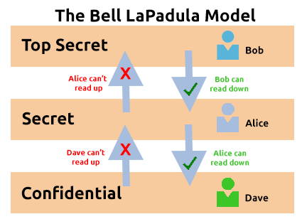
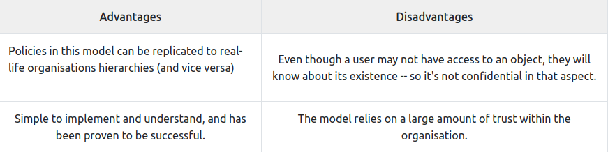
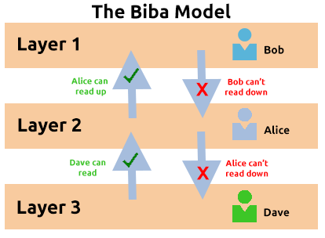
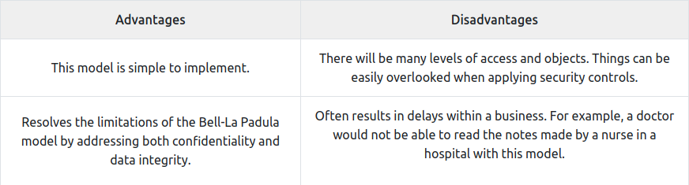
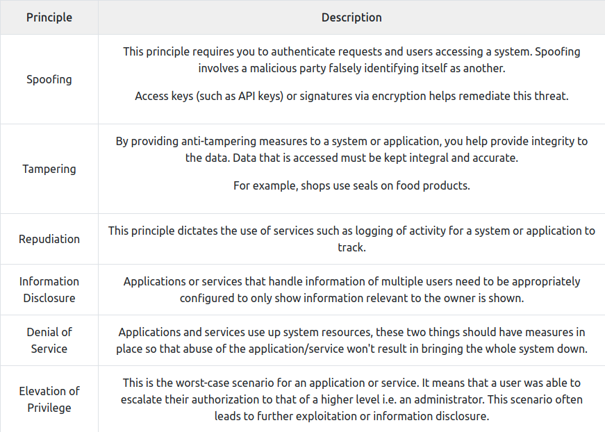
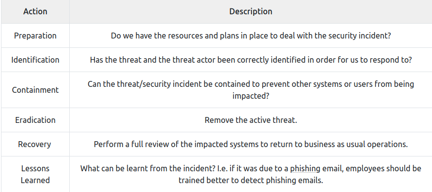

# [Principles of Security](https://tryhackme.com/room/principlesofsecurity)

## The CIA Triad

- Model that creates a security policy.

- Confidentiality, Integrity and Availability have become an industry standard today.

- If one elements of the three is not met, then the other two are useless. If a security policy does not answer these three section, then most likely it is not an effective policy.

### Confidentiality

- Protection of data from unauthorized access and misuse (protect from parties that is not intended for). 

Ex.: Governments using a sensitivity classification rating system (top-secret, classified, unclassified).

### Intergrity

- Information is kept accurate and consistent during storage, tramission and usage, unless authorized changes are made.

- Steps we can take to prevent this are access control and rigorous authentication, hash verification or digital signatures.

### Availability

- Data must be available and acccesible by the user.

- This is achieved through: 

	- having reliable and well-tested software for the servers
	
	- having redundant technology as a backup in case of failure of the primary
	
	- implement well-versed security protocols to protect from attacks.

### Questions:

1. What element of the CIA triad ensures that data cannot be altered by unauthorised people?  

R: *Integrity*

2. What element of the CIA triad ensures that data is available? 

R: *Availability*

3. What element of the CIA triad ensures that data is only accessed by authorised people?

R: *Confidentiality*

## Principles of Privileges

- Level of access to individuals is determined by:
	- his role in the organisation
	- the sensitivity of information stored on the system.

- Two concepts are used to administrate the rights of individuals:

	- **Privileged Identity Management** (**PIM**) -> used to translate the user's role within an organisation into an access role on a system.
	
	- **Privileged Access Management** (**PAM**) -> manages the privileges a system's role has, enforces security policies (password management), auditing policies and reducing the attack surface a system faces.

	- *Principle of least privilege* -> everyone should be given the least amount of privileges such that they could do their job.

### Questions:

1. What does the acronym "PIM" stand for? 

R: *Privileged Identity Management*

2. What does the acronym "PAM" stand for? 

R: *Privileged Access Management*

3. If you wanted to manage the privileges a system access role had, what methodology would you use? 

R: *PAM*

4. If you wanted to create a system role that is based on a users role/responsibilities with an organisation, what methodology is this?

R: *PIM*

## Security Models

### The Bell-La Padula Model

- Used to achieve *confidentiality*.

- Works by granting access to only need to know data. 

- *Motto*: "no write down, no read up".

- Popular governmental or military organisations, because their members went through vetting.

- *vetting* = process that outlines the threat an applicant poses to the organisation

### Biba Model

- equivalent for Bell-La Padula but it for the *integrity* of CIA.

- *Motto*: "no write up, no read down"

- users can only write to objects below their level and read objects higher than their level.

- used in org. where integrity is more important than confidentiality, for example in software develpment companies, where a developer only needs access to what is neccessary to its job, and not access to for ex, the databases.

### Questions:

1.  What is the name of the model that uses the rule "can't read up, can read down"? 

R: *The Bell-LaPadula Model*

2. What is the name of the model that uses the rule "can read up, can't read down"? 

R: *The Biba Model*

3. If you were a military, what security model would you use? 

R: *The Bell-LaPadula Model*

4. If you were a software developer, what security model would the company perhaps use? 

R: *The Biba Model*

## Threat modelling & Incident Response

- Threat modelling = review, improve and test the security protocols in an org. information infrastructure.

- Simple threat modelling process: 

Preparation -> Mitigations -> Reviews -> Identification

- A better one:
    - Threat intelligence
    - Asset identification
    - Mitigation capabilities
    - Risk assessment

- Frameworks that help with this
    - **STRIDE** (Spoofing identity, Tampering with data, Repudiation threats, Information disclosure, Denial of Service and Elevation of privileges) 
    - PASTA (Process for Attack Simulation and Threat Analysis)

- 

- An incident is responded to by a **CSIRT** team (Computer Security Incident Response Team). To solve an incident, these steps are taken:

### Questions:

1. What model outlines "Spoofing"? 

R: *STRIDE*

2. What does the acronym "IR" stand for? 

R: *Incident Response*

3. You are tasked with adding some measures to an application to improve the integrity of data, what STRIDE principle is this? 

R: *Tampering*

4. An attacker has penetrated your organisation's security and stolen data. It is your task to return the organisation to business as usual. What incident response stage is this? 

R: *Recovery*