# REmux The Tmux

## Starting tmux "Sessions" and default tmux "prefix"

- To start a new tmux session just run the tmux command with no arguments. 
- The first session create will have the name "0". 
	- By default, tmux status bar will be green. 
	- With session name on the left. 
- Windows in the middle and window names in the middle. 
	- Hostname, time, and date on the right of the bottom green bar.

- Tmux doesn't allow to create of a nested tmux within a tmux unless you force it to. 
	- When running the tmux command a second time.

- All commands within a tmux session all start with the tmux prefix is. 
	- By default, the tmux prefix is "Ctrl b".

- After the tmux prefix. 
	- To the hotkeys to change the current tmux session's name is "shift $".

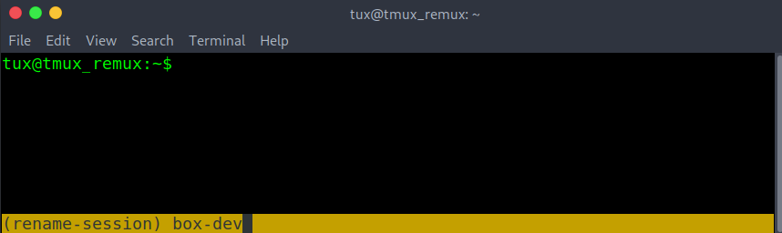

- If there is a need to create another tmux session within the current one, use the `-d` argument with the tmux command to spawn a new tmux session without attaching to it. The `-s` argument is used to specify the session name for the new session. 
- Typed as "`tmux new -s <new-session-name> -d`".

- To list all active tmux sessions. 
- Run tmux with `list-sessions`. 
- Or the short version of list-sessions as `ls`. 
- In the example below. 
- Running tmux ls also shows the current session in use. 
	- Marked by "(attached)".

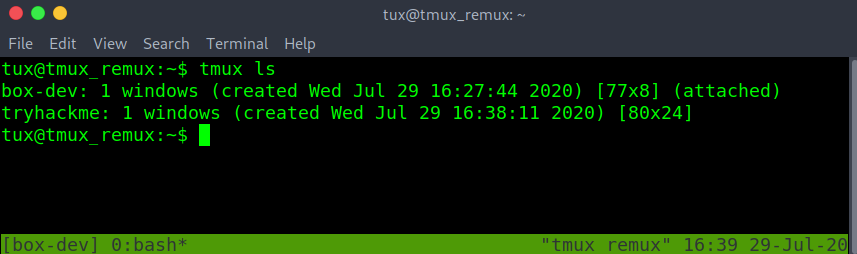

- Exiting a tmux session without closing it can be done with the prefix followed by `d`

- Checking again with the tmux ls command. "(attached)" is missing from both sessions. 
- This means the sessions are active but we are detached and are unable to interact with either session.

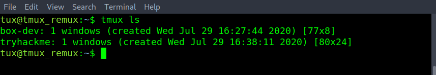

- To reattach to an active tmux session. 
- Run tmux with the attach option and -t followed by the desired session name.
```
tmux attach -t tryhackme
```

- The tmux session name has changed to the attached session of "tryhackme". Double-checking with tmux ls. Can confirm that "(attached)" also on the "tryhackme" session name.

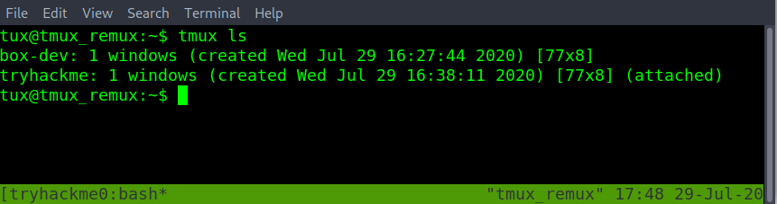

- Delete a single session by its session name. Is done with the kill-session option with tmux. Followed by `-t` and the `<target-session-name-to-delete>`

```
tmux kill-session -t box-dev
```

- In the example below there are many sessions open. 
- Another way to swap sessions without having to detach and reattach to another session. 
- Is to use the prefix followed by the s-key to list all open sessions. 
	- Using up or down arrow keys to navigate to the desired tmux session. 
	- Then enter to select the new session.

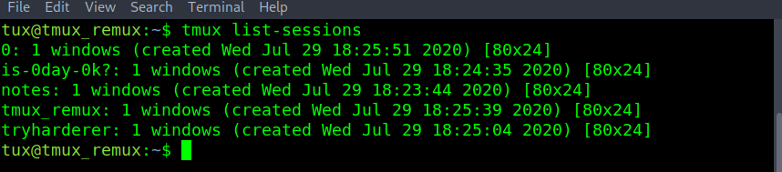

- From the five active sessions above. If there was a need to kill all the sessions except for a single one. When using the tmux kill-session. Use the -a argument to close all sessions except the one specified by the -t argument.

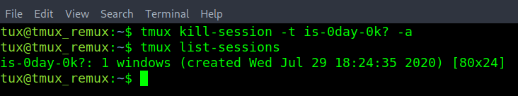

- When spiting the session into different sized panes  
- The new pane will spawn in the directory that the tmux session was first started in.

- To change the base starting directory, you must first learn about tmux prompt or command mode. 
- The tmux prompt allows tmux sessions to run tmux commands without the tmux binary name. 
- Useful when the terminal has been filled with other text. 
- Enter a tmux prompt with prefix shift :

- Followed by "`attach -c /path/to/new/starting/directory`"

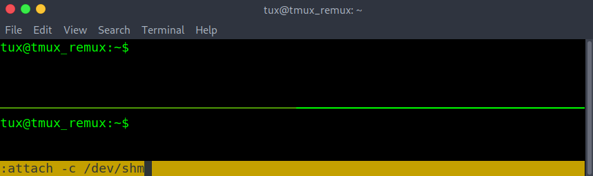

- With the updated starting or base directory done above as /dev/shm. Creating a new pane start in the /dev/shm directory.

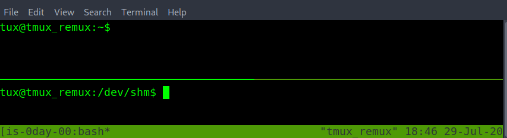

- Just by changing the number of prefix used before the following command. Can determine which session gets the command.

- prefix, prefix, and command. This will run on the second nested tmux session of the ssh ubuntu machine.

- prefix and command. This will run on the first tmux session.

### Questions

Do the ctrl and b keys need to be held down the whole time with every commands to work? yea/nay  

A: nay

How to start tmux with the session with the name "thm"?

A: tmux new -s thm

How to change the current tmux session name?

A: ctrl b shift $

How to quit a tmux session without closing the session? To attach back later.  

A: ctrl b d

How to list all tmux sessions?  

 A: tmux ls

How to reattach to a detached tmux session with the session name of "thm"  

A: tmux a -t thm

How to create a new tmux session from your current tmux session with the name kali?  

A: tmux new -s kali -d

How to switch between two or more tmux sessions without detaching from the current tmux session?  

A: ctrl b s

How do you force kill the tmux session named "thm" if it's not responsive from a new terminal window or tmux session?  

A: tmux kill-session -t thm

Within a nested tmux session. A second tmux session within the first one. How to change the session name of the second/internal tmux session?  

 A: ctrl b ctrl b shift $

How to get into a tmux prompt to run/type tmux commands?  

A: ctrl b shift :

Are there more than one way to exit a tmux prompt? yea/nay  

A: yea

Is tmux case sensitive. Will hitting the caps lock break tmux? yea/nay  

A: yea

Within tmux prompt or command mode how would you change the tmux directory? Where a new window or pane will start from the changed directory of /opt.  

A: a -c /opt

How to kill all tmux sessions accept the one currently in use? With the name "notes".

A: tmux kill-session -t notes -a


## Manage tmux "Panes"

- Tmux panes are used to divide the current session into multiple-sized terminals. 
- That allows multiple commands to run within the same session window.
- To split the currently selected pane horizontally. 
	- Do the prefix. This followed by a shift "
- To split the currently select pane vertically. 
	- Do the prefix. Followed by shift %
- The `exit` command can be used to close the currently selected pane.
- Moving to another pane within the same window can be done with the prefix. Followed by the arrow keys.
- However, the main problem with this method is sometimes when using the arrow keys again. For example, to move the terminal cursor box could move to another tmux pane instead. 

- To resolve this issue can prefix followed by o instead. 
- This can cycle through all the tmux panes. 
	- This has the added benefit of the line cursor not escaping to another pane.
- To swap between the most used tmux panes if more than two panes are open. "ctrl b ;" is the better option. "ctrl b o" is better when there are just two panes open.

- If a tmux pane isn't responsive and ctrl-c isn't resolving the issue. Force close or kill the currently selected tmux pane with the prefix and x. Then y to confirm.

- Managing the placement of panes. Can change the layout without having to exit panes or open create new panes.  

- To move the currently selected pane. In a clockwise rotation. 
	- Do prefix shift }
> Note. All other panes will move clockwise with the currently selected pane.

- To move the currently selected pane counter-clockwise. Do prefix shift {

- Another way to manage the pane location is with five built-in layouts. This can be done with the prefix followed by the escape OR esc key and the desired option from the number selected from 1 to 5.

- To cycle through the built-in pane layouts one at a time. Do the prefix with the spacebar. This can also be an alternative using a clockwise or counter-clockwise option when there are only two panes open on the current tmux window.

- Lastly when it comes to managing panes. There might be a need to swap the place between two panes. When cycling panes don't create the desired pane layout.
- Before swapping, you can identify pane numbers with `ctrl b q`. You must first check the number each pane has been assigned. This also provides the size of each pane.

- For the swap pane example. It will be done within tmux prompt or command mode with prefix shift : then the commands swap-pane. With `-s <source-pane> and -t <destination-pane>`. This will send the move/swap the currently selected pane and keep the currently selected pane selected after the swap.

`:swap-pane -s <source pane final swap location> -t <currently selected destination pane>`

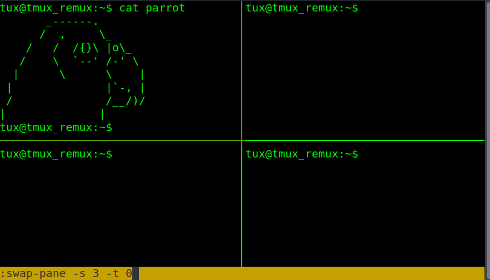

- The currently selected pane of the parrot has moved to the bottom right and has followed the currently selected pane. Still able to start typing within the parrot pane without having to switch to another pane.

- o swap places with another pane and select the other open pane. Instead of the currently selected pane. Have the -`t <destination-pane>` first with the pane you want to swap with. Followed by the `-s <source-pane>` or currently selected pane

`:swap-pane -t <pane to swap with> -s <currently selected pane>`


### Questions

How to create a new pane split horizontally?

A: ctrl b shift "

How to close a tmux pane like closing a ssh session?  

A: exit

How to create a new pane split vertically?  

A: ctrl b shift %

How to cycle between tmux pre built layout options? Starting with the number 1.  

A: ctrl b esc 1

How to cycle/toggle between tmux layouts, one at a time?  

A: ctrl b spacebar

How to force quit a frozen, crashed or borked pane?  

A: ctrl b x y

How to move between the two must used tmux panes for the current tmux window?  

A: ctrl b o

Can you use the arrow to move to the desired pane? yea/nay  

A: yea

How to move the currently selected pane clockwise?  

A: ctrl b shift {
 
How to move the currently selected pane counter-clockwise  

 A: ctrl b shift }
 
Before using swap-pane. How to check for which pane has what number?  

 A: ctrl b q
 
How to swap two panes and move with the swapped pane?  Within tmux prompt mode. 1 -> 3 location

A: :swap-pane -t 3 -s 1

How to swap two panes without changing the currently selected pane location? Within tmux prompt mode. 1 -> 4 pane number

A: swap-pane -s 1 -t 4

## Manage tmux "Windows"

- Tmux windows are like a new terminal tab that you can easily swap from and more. 
- To create a new empty tmux window to work on. 
	- Do prefix c. 
- Shown with the new window number and name. Note the currently selected window will be marked with a * or wildcard star.

- To change the name of the current window. 
	- Do prefix , 
- After retyping the new window name. Hit the enter key to save changes.

- To detach a pane into its own window. move the desired pane to move to its own window. 
	- Then prefix shift !
	- The Nmap has been sent to a new window named "bash". Now able to view the whole Nmap scan without run the Nmap scan again.

- to cycle between windows can be done with **prefix n** for the next window. 
	- Or **prefix p** for the previous windows.

- Another method to switch to the desired window is to use **prefix w**. 
	- This will list all the tmux windows. 
- Using the arrow keys to select the desired windows and enter-key to select the highlighted window.

- If a tmux window has been borked and needs to be terminated quickly. Killing the window will also close any panes open within the currently selected tmux window. To kill or close a tmux window do prefix shift & and followed by y to close the window. Or n to keep it open.

- To join two different windows/panes back into one. Can be done with the window name or number. The command is run within tmux prompt or command mode. Prefix shift : then within the prompt :`join-pane -t <window-name>` OR `:join-pane -s <window-name>`. Where -s is the source name and -t is the destination window name.
- For the join-pane commands adding -h on the end fuses the two panes together horizontally. Adding -v on the end of the join-pane command fuses two panes together vertically.


### Questions

How to create a new empty tmux window?  

 A: ctrl b c

How to change the currently select window's name?  

A: ctrl b ,

How to move the currently selected pane to it's own tmux window?

A: ctrl b shift !

How to fuse two panes together with the "source" window of "bash"? After entering a tmux prompt?  

A: join-pane -s bash

How to fuse two panes together with the "destination" window of "sudo"? After entering a tmux prompt?

A: join-pane -t sudo

What option can added with question 4 and 5 to fuse together vertically?

 A: -v

What option can added with question 4 and 5 to fuse together horizontally?

A: -h

With join-pane can you use the window number instead of the window's name? yea/nay  

A: yea

How to kill or completely close a window. Including all the panes open on that window. If it's unresponsive?  

A: ctrl b shift &

How to view and cycle between all the tmux windows for the current tmux session without detaching from the current session?  

A: ctrl b w

How to move back to the previous tmux window?  

A: ctrl b p

How to move up to the next tmux window?

A: ctrl b n

## Tmux "copy" mode

- Copy mode can be used to scroll up and down the page. If the text is larger than the length of the pane or window size. To start copy mode. Type `ctrl b [` and a number will show up in the top right corner of the current pane or window using copy mode. After scrolling. Exit copy mode with the q key.

- To search up the page. Within copy mode. Type **ctrl r** and the search term or string to search for. To continue searching the same string. Hold down ctrl and press r again to jump to the next string location. Resume scrolling by hitting the enter key. Will stop at the search string/term.

- To search down the page. Is the same basic idea as search up. However, this is done with s instead of r as **ctrl s** and then the search term or string. While holding down ctrl retype s to jump to the next string location. Again resume scrolling by hitting the enter key. Will stop at the search string/term.

- To copy and paste within tmux copy-mode takes 4 steps. 
- Note that this method will only apply to the tmux clipboard as follows.  

0. `ctrl b [ #` enter copy mode

1. **scroll to the start of the block of text you would like to copy**

2. enable highlighting with **ctrl spacebar**. Then use the arrow keys to up to select all the text. Down if you start from the top instead.
3. copy all the highlighted text to the tmux clipboard with **alt w**. Note! Even though the highlight will disappear. The text still copied to the tmux clipboard.
4. create a new file to paste the final text with `ctrl b ]`.
- To double-check what the text that is currently copied to the tmux clipboard. Do prefix followed by shift #
- To quit back to the terminal. Hit the **q key** once.

### Questions

How to start copy mode?  

A: `ctrl b [`

While in copy mode. How to search/grep up the wall of terminal text?  

A: ctrl r

While in copy mode. How to search/grep down the wall of terminal text?  

A: ctrl s

How to exit search up or search down within copy mode?  

A: esc

What single key can also be used to to exit out of copy mode.  

A: q

After starting copy mode. How do you enable text highlighting to select for text copying?

A: ctrl spacebar

After selecting the text you want to copy. How do copy it?  

A: alt w

When in a terminal text editor. How to paste from the tmux clipboard?  

A: `ctrl b ]`

How to double check what is currently copied to the tmux clipboard

A: ctrl b shift #


## Oh My Tmux and beyond

- Tmux by default doesn't have a default configuration file. That doesn't mean you can make one.

- Before crafting a custom configuration file for tmux. It might be a good idea to show all the options of the defaults. With tmux show -g argument for global.

- When creating the tmux configuration script it is important that. The file name is .tmux.conf and .tmux.conf is saved within the user's home directory /home/username/.tmux.conf

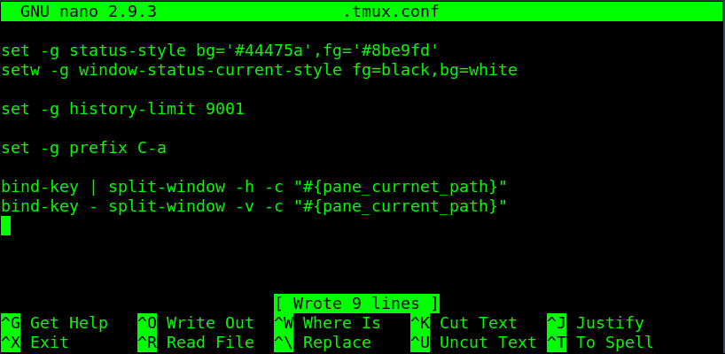

- **set -g status-style bg='#44475a',fg='#8be9fd'**
	- This line is to modify the color of the status bar.

- **setw -g window-status-current-style fg=black,bg=white**
	- This line adds highlight in the color of white for the currently selected window.

- **set -g prefix C-a**
	- Allow changing the prefix from ctrl b to ctrl a. If there is any need to use the alt key instead of ctrl. Then set prefix as M-b or another second character, such as M-a. Changing the prefix from ctrl b to alt a.

- Allow changing the prefix from ctrl b to ctrl a. If there is any need to use the alt key instead of ctrl. Then set prefix as M-b or another second character, such as M-a.

> Note: bind or bind-key options allow adding extra hotkey options without overwriting the default hotkeys. set options overwrite the default tmux hotkeys for the updated ones written within the .tmux.conf file

- Using bind-key with | and - to add extra ways to split-window and create a new pane. The -c argument with "#{pane_current_path}" on the end allows any new pane within a different directory to keep that directory path, even if it is not the directory that session had started in.  

- **ctrl b shift |** # will split horizontally  
- **ctrl b -** # will split vertically

- The set history limit allows copying mode to have a higher max character limit. Useful for copying output that goes beyond the default tmux history limit.

- The left side of the status bar can be customized with status-left within set or set-option. In the example below the first one status-left-length 15. Set the total amount of characters that can be shown on the left. The following line displays 'Try Harderer' with the echo Linux command.

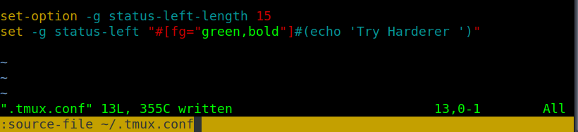

- After reloading the tmux configuration file within the session ctrl b shift : followed by source-file /home/username/.tmux.conf OR source-file ~/.tmux.conf

> NOTE the .tmux.conf can also be reloaded by closing and restarting a new session. Or with the tmux command as `tmux source /home/username/.tmux.conf`

- In addition to calling script though .tmux.conf is calling custom plugins. The plugins are shown were sourced from GitHub.

[https://github.com/tmux-plugins/tmux-resurrect.git](https://github.com/tmux-plugins/tmux-resurrect.git)[](https://github.com/tmux-plugins/tmux-resurrect.git) # save sessions to resume after a system reboot.

[https://github.com/tmux-plugins/tmux-logging.git](https://github.com/tmux-plugins/tmux-logging.git) # plugin for creating command history to review later.

[https://github.com/tmux-plugins/tmux-yank.git](https://github.com/tmux-plugins/tmux-yank.git)[](https://github.com/tmux-plugins/tmux-yank.git) # plugin copy text from outside the tmux clipboard to use with other programs.

- The alternative to building a custom .tmux.conf configuration script it utilize a open-source .tmux.conf script. That can be easily found by searching online with Oh My Tmux. For this example will use the tmuxconfig repository from github. that can be found at the link below.

[https://github.com/chaosma/tmuxconfig.git](https://github.com/chaosma/tmuxconfig.git)[](https://github.com/chaosma/tmuxconfig.git)

> NOTE. That using the tmuxconfig or other tmux.conf configuration files is the only one that loads in. Regardless if the .tmux.conf had been deleted or replaced with another .tmux.conf file. Tmux can be reset back to its default configuration by killing the tmux server. with kill-server

### Questions
  
Does tmux have a default tmux.conf config file? yea/nay  

A: nay

Where can you find examples for custom tmux.conf config files?  

A: /usr/share/doc/tmux

Can you use Hex color codes in place of the color name? yea/nay  

A: yea

What directory must the .tmux.conf be put in to work with the next tmux session  

A: home

How would you update tmux changes without quitting the tmux session from a tmux prompt?  

A: source-file ~/.tmux.conf

How to completely reset tmux to its default and kill all sessions? If the .tmux.conf is borked.  

A: tmux kill-server

How would you select addition hotkeys. Without overwriting the default hotkey?  

A: bind

How would you change the prefix to Ctrl a?  

A: set -g prefix C-a

Can you display shell command output. From a script or one line command? yea/nay  

A: yea

How would you load a plugin into a tmux config file?  

A: set -g @plugin
 
How can you run the desired plugin after loading it?

A: run-shell