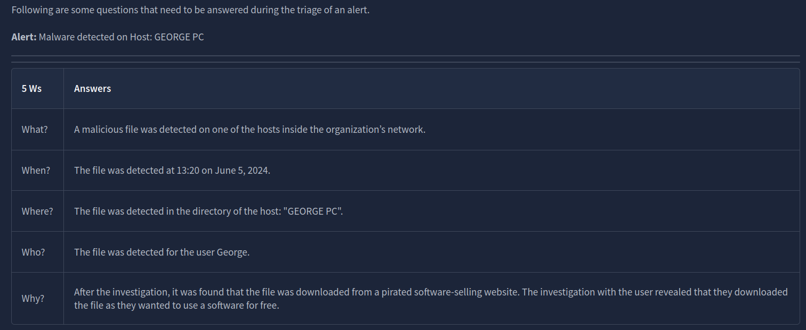
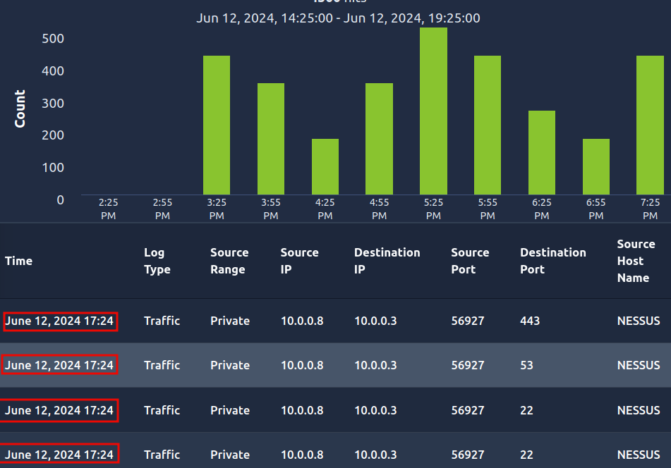

# SOC Fundamentals

## Intro to SOC

A **SOC** (**S**ecurity **O**perations **C**enter) is a dedicated facility operated by a specialized security team. This team aims to continuously monitor an organization’s network and resources and identify suspicious activity to prevent damage. This team works 24 hours a day, seven days a week.

### Questions

What does the term SOC stand for?

A: `Security Operations Center `

## Purpose and Components

### Questions

The main focus of the SOC team is to keep **Detection** and **Response** intact. The SOC team has some resources available in the form of security solutions that help them achieve this. These solutions integrate the whole company’s network and all the systems to monitor them from one centralized location. Continuous monitoring is required to detect and respond to any security incident.

### **Detection**

- **Detect vulnerabilities**: A vulnerability is a weakness that an attacker can exploit to carry out things beyond their permission level. A vulnerability might be discovered in any device’s software (operating system and programs), such as a server or computer. For instance, the SOC might discover a set of MS Windows computers that must be patched against a specific published vulnerability. Strictly speaking, vulnerabilities are not necessarily the SOC’s responsibility; however, unfixed vulnerabilities affect the security level of the entire company.
- **Detect unauthorized activity**: Consider the case where an attacker discovered the username and password of one of the employees and used them to log in to the company system. It is crucial to detect this kind of unauthorized activity quickly before it causes any damage. Many clues, such as geographic location, can help us detect this.
- **Detect policy violations**: A security policy is a set of rules and procedures created to help protect a company against security threats and ensure compliance. What is considered a violation would vary from company to company; examples include downloading pirated media files and sending confidential company files insecurely.
- **Detect intrusions**: Intrusions refer to unauthorized access to systems and networks. One scenario would be an attacker successfully exploiting our web application. Another would be a user visiting a malicious site and getting their computer infected.

### **Response**

- **Support with the incident response**: Once an incident is detected, certain steps are taken to respond to it. This response includes minimizing its impact and performing the root cause analysis of the incident. The SOC team also helps the incident response team carry out these steps.
    

There are three pillars of a SOC. With all these pillars, a SOC team becomes mature and efficiently detects and responds to different incidents. These pillars are **People**, **Process**, and **Technology**.

### Questions

The SOC team discovers an unauthorized user is trying to log in to an account. Which capability of SOC is this?

A: `Detection`

What are the three pillars of a SOC?

A: `People, Process, Technology`

## People

- **SOC Analyst (Level 1):** Anything detected by the security solution would pass through these analysts first. These are the first responders to any detection. SOC Level 1 Analysts perform basic alert triage to determine if a specific detection is harmful. They also report these detections through proper channels.
- ****SOC Analyst (Level 2)**:** While Level 1 does the first-level analysis, some detections may require deeper investigation. Level 2 Analysts help them dive deeper into the investigations and correlate the data from multiple data sources to perform a proper analysis.
- ****SOC Analyst (Level 3)**:** Level 3 Analysts are experienced professionals who proactively look for any threat indicators and support in the incident response activities. The critical severity detection reported by Level 1 and Level 2 Analysts are often security incidents that need detailed responses, including containment, eradication, and recovery. This is where Level 3 analysts’ experience comes in handy.
- **Security Engineer:** All analysts work on security solutions. These solutions need deployment and configuration. Security Engineers deploy and configure these security solutions to ensure their smooth operation.
- **Detection Engineer:** Security rules are the logic built behind security solutions to detect harmful activities. Level 2 and 3 Analysts often create these rules, while the SOC team can sometimes also utilize the detection engineer role independently for this responsibility.
- **SOC Manager:** The SOC Manager manages the processes the SOC team follows and provides support. The SOC Manager also remains in contact with the organization’s CISO (Chief Information Security Officer) to provide him with updates on the SOC team’s current security posture and efforts.
### Questions

Alert triage and reporting is the responsibility of?

A: `SOC Analyst (Level 1)`

Which role in the SOC team allows you to work dedicatedly on establishing rules for alerting security solutions?

A: `Detection Engineer`

## Process

Each role has its own **Processes**, just as we saw the role of Level 1 SOC Analysts as the first responders to carry out alert triage and determine if it is harmful.

### Alert Triage

The alert triage is the basis of the SOC team. The first response to any alert is to perform the triage. The triage is focused on analyzing the specific alert. This determines the severity of the alert and helps us prioritize it. The alert triage is all about answering the 5 Ws. What are these 5 Ws?

### Reporting

The detected harmful alerts need to be escalated to higher-level analysts for a timely response and resolution. These alerts are escalated as tickets and assigned to the relevant people. The report should discuss all the 5 Ws along with a thorough analysis, and screenshots should be used as evidence of the activity.

### Incident Response and Forensics

Sometimes, the reported detections point to highly malicious activities that are critical. In these scenarios, high-level teams initiate an incident response. A few times, a detailed forensics activity also needs to be performed. This forensic activity aims to determine the incident’s root cause by analyzing the artifacts from a system or network.
### Questions

At the end of the investigation, the SOC team found that John had attempted to steal the system's data. Which 'W' from the 5 Ws does this answer?

A: `Who`

The SOC team detected a large amount of data exfiltration. Which 'W' from the 5 Ws does this answer?

A: `What`

## Technology

The **Technology** portion in the SOC pillars refers to the security solutions. These security solutions efficiently minimize the SOC team's manual effort to detect and respond to threats.

An organization’s network consists of many devices and applications. As a security team, individually detecting and responding to threats in each device or application would require significant effort and resources. Security solutions centralize all the information of the devices or applications present in the network and automate the detection and response capabilities.

Let's get a brief understanding of some of these security solutions:

- **SIEM:** Security Information and Event Management (SIEM) is a popular tool used in almost every SOC environment. This tool collects logs from various network devices, referred to as log sources. Detection rules are configured in the SIEM solution, which contains logic to identify suspicious activity. The SIEM solution provides us with the detections after correlating them with multiple log sources and alerts us in case of a match with any of the rules. Modern SIEM solutions surpass this rule based detection analysis, providing us with user behavior analytics and threat intelligence capability. Machine learning algorithms support this to enhance the detection capabilities.

**Note:** The SIEM solution only provides the **Detection** capabilities in a SOC environment.

- **EDR:** Endpoint Detection and Response (EDR) provides the SOC team with detailed real-time and historical visibility of the devices’ activities. It operates on the endpoint level and can carry out automated responses. EDR has extensive detection capabilities for endpoints, allowing you to investigate them in detail and respond with a few clicks.
- **Firewall:** A firewall functions purely for network security and acts as a barrier between your internal and external networks (such as the Internet). It monitors incoming and outgoing network traffic and filters any unauthorized traffic. The firewall also has some detection rules deployed, which help us identify and block suspicious traffic before it reaches the internal network.

Several other security solutions play unique roles in a SOC environment, such as Antivirus, EPP, IDS/IPS, XDR, SOAR, and more. The decision on what Technology to deploy in the SOC comes after careful consideration of the threat surface and the available resources in the organization.

### Questions

Which security solution monitors the incoming and outgoing traffic of the network?

A: `firewall`

Do SIEM solutions primarily focus on detecting and alerting about security incidents? (yea/nay)

A: `yea`

## Practical Exercise of SOC

### Scenario

You are the Level 1 Analyst of your organization’s SOC team. You receive an alert that a port scanning activity has been observed on one of the hosts in the network. You have access to the SIEM solution, where you can see all the associated logs for this alert. You are tasked to view the logs individually and answer the question to the 5 Ws given below.

**Note**: The vulnerability assessment team notified the SOC team that they were running a port scan activity inside the network from the host: `10.0.0.8`

### Questions

What: Activity that triggered the alert?

A: `Port Scan`

When: Time of the activity? 

A: `June 12, 2024 17:24`

Where: Destination host IP? 

A: `10.0.0.3`

Who: Source host name?  

A: `Nessus`

Why: Reason for the activity? Intended/Malicious

A: `Intended`

Additional Investigation Notes: Has any response been sent back to the port scanner IP? 
(yea/nay)

We can observe that the source and destination IP addresses are swapped sometimes in the logs.

A: `yea`

What is the flag found after closing the alert?

The result of the investigation is a false positive because the employees were port scanning inside the organization. Choosing this outcome and then closing the alert yields the flag.

A: `THM{000_INTRO_TO_SOC}`