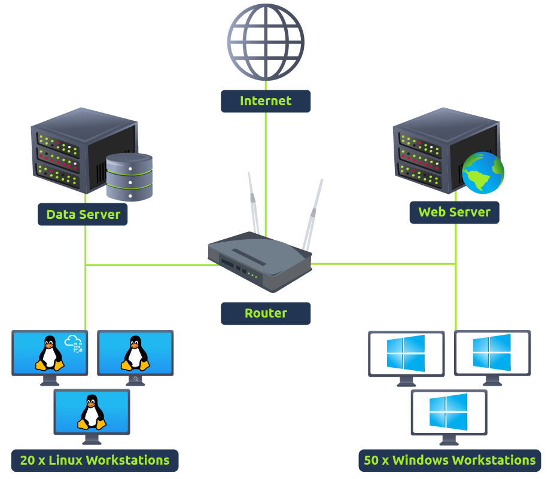
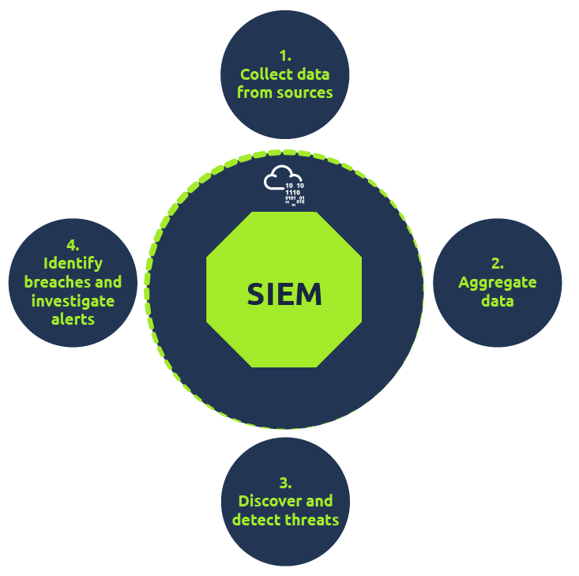
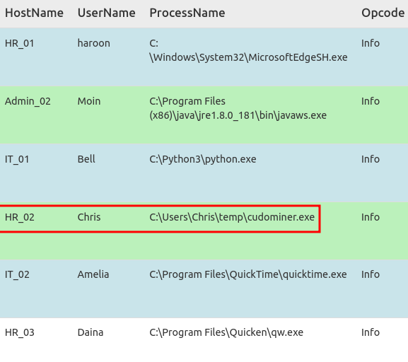
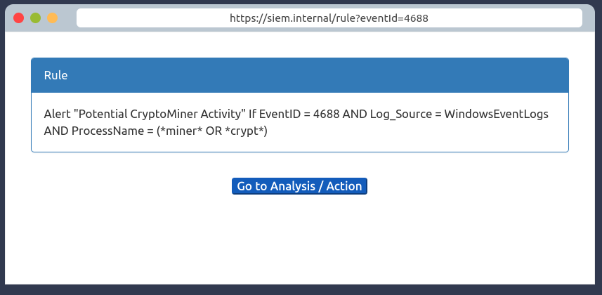

# [Intro to SIEM](https://tryhackme.com/room/introtosiem)

## Logs Everywhere, Answers Nowhere

Security Information and Event Management system (SIEM) is the core security solution that a SOC analyst uses in the security operations center.

### Logs Everywhere

Multiple devices in a network communicate with each other and, most of the time, with the Internet through a router. The image below shows an example of a simple network that comprises multiple Linux/Windows-based Endpoints, one data server, and one website.

These devices continuously generate logs of the activities that occur within them. We can also call these devices log sources. The logs they generate serve as a trail of all the activities and are extremely helpful for identifying malicious activities or general troubleshooting. These log sources are mainly divided into two categories

### 1) Host-Centric Log Sources

These log sources capture events that occurred within or related to the host. Devices that generate host-centric logs include Windows, Linux, servers, etc. Some examples of host-centric logs are:

- A user accessing a file
- A user attempting to authenticate.
- A process execution activity
- A process adding/editing/deleting a registry key or value.
- PowerShell execution

### 2) Network-Centric Log Sources

Network-related logs are generated when the hosts communicate with each other or access the internet to visit a website. Devices that generate network-centric logs are firewalls, IDS/IPS, routers, etc. Some examples of network-centric logs are:

- SSH connection
- A file being accessed via FTP
- Web traffic
- A user accessing the company's resources through VPN.
- Network file sharing Activity

Together, these host-centric and network-centric log sources constantly create numerous logs in a network.

### Answers Nowhere

Until now, it seems pretty straightforward that these log sources generate logs, we analyze them, and identify malicious activities. However, it's not that simple. It has some challenges. Some of them are discussed below:

- **Numerous Log Sources** A network has many log sources, which generate hundreds of events per second. These logs are scattered across different devices, and examining the logs on each device one by one in case of an incident can be tedious.  
      
    
- **No Centralization** As logs reside on the machines on which they are generated,  you may need to connect with each log source via SSH, RDP, etc., to analyze logs from multiple log sources. This is very inefficient and can waste a lot of your valuable time during the investigations.  
      
    
- **Limited Context** Individual logs cannot tell the whole story of an activity. During any incident, the individual activities on different log sources may seem harmless. But if these logs are correlated, they can indicate a whole different story. For instance, you observed a file access event in a system, which is generally normal activity. However, if you correlate different log sources, you might come to know that this file was accessed by a user who accessed this machine through lateral movement after compromising another machine in the network.  
      
    
- **Limited Analysis** The log sources generate numerous logs per second, and analyzing all the logs from all the devices manually to identify any abnormal activity is nearly impossible for humans. Realistically, the analysts will miss a lot of important logs in between the analyses due to their huge number.  
      
    
- **Format Issues** Different log sources generate logs in various formats. Analysts need to know all these formats to analyze them, which can be extremely difficult, especially when dealing with numerous log sources in a network.

### Questions

Q: Is Registry-related activity host-centric or network-centric?

A: `host-centric`

Q: Is VPN-related activity host-centric or network-centric?

A: `network-centric`

## Why SIEM?

Security Information and Event Management (SIEM) is a security solution that collects logs from various types of log sources, standardizes their format into a consistent one, correlates them, and detects malicious activities using detection rules.

### Features of SIEM

The SIEM solution not only solves the issues we discussed in the previous task but also provides capabilities to enhance security operations. Let's discuss some of the core features that a SIEM provides.

- **Centralized Log Collection**  
    SIEM collects logs from all sources (endpoints, servers, firewalls, etc.) and centralizes them in one place. These logs are pulled through lightweight agents or APIs and populated into the SIEM solution. This solves the problem of jumping on every machine individually to analyze its logs.   
      
    
- **Normalization of Logs**  
    Raw logs are of different formats and sizes. A Windows log does not look the same as a Linux log. Since a SIEM solution centralizes these logs in one place, it also ensures that all the logs are broken down into different fields and presented in one consistent format. Breaking down a log into several fields for ease of understanding is known as Parsing, and converting all the logs of various log sources into one consistent format is known as Normalization.   
      
    
- **Correlation of Logs**  
    Individual logs are not very useful. SIEM correlates the logs of different sources and finds any relationship between them. This helps to identify malicious activity by analyzing its pattern. For instance, let's take a look at the following activities happening in a system during a 5-minute timeframe.   
    - Haris logs in via VPN from an IP that he never has previously used
    - Haris accesses some documents on a shared drive
    - Haris executed a PowerShell script
    - The system makes an outbound network connection

Individually assessed, these activities look fine, but the SIEM solution would correlate these activities, which could point to a potential data exfiltration activity resulting from Haris's compromised VPN credentials.

- **Real-time Alerting  
    **SIEM detects malicious activities based on the rules it contains. Many rules come with a SIEM by default. However, analysts make new detection rules based on their requirements to mature future detections. When the conditions for these detection rules are satisfied, alerts are triggered, and the analysts are notified. Analysts can then investigate these alerts within the SIEM platform.    
      
    
- **Dashboards and Reporting  
    **Dashboards are the most important components of any SIEM. SIEM presents the data for analysis after being normalized and ingested. The summary of this analysis is presented in the form of actionable insights with the help of multiple dashboards. Each SIEM solution comes with some default dashboards and provides an option for custom Dashboard creation. Below is some of the information that can be found in a dashboard:

- Alert Highlights
- System Notification
- Health Alert
- List of Failed Login Attempts
- Events Ingested Count
- Rules triggered
- Top Domains Visited

## Log Sources and Ingestion

### Log Sources

Every device in the network generates some kind of log whenever an activity is performed on it, such as a user visiting a website, connecting to SSH, logging into their workstation, etc. Let's see what the logs of some common devices that are found in a network environment look like.

#### Windows Machine

Windows records every event that can be viewed through the Event Viewer. It assigns a unique ID to each type of log activity, making it easy for the analyst to examine and keep track of. To view events in a Windows environment, type `Event Viewer` in the search bar. This takes you to the tool where different logs are stored and can be viewed, as shown below. These logs from all Windows endpoints are forwarded to the SIEM solution for monitoring and better visibility.

#### Linux Machine

Linux OS stores all the related logs, such as events, errors, warnings, etc. These are then ingested into SIEM for continuous monitoring. Some of the common locations where Linux stores logs are:

- /var/log/httpd: Contains HTTP Request  / Response and error logs.
- /var/log/cron: Events related to cron jobs are stored in this location.
- /var/log/auth.log and /var/log/secure: Stores authentication-related logs.
- /var/log/kern: This file stores kernel-related events.

#### Web Server

It is important to monitor all requests/responses coming in and out of the web server for any potential web attack attempt. In Linux, common locations to write all apache-related logs are /var/log/apache or /var/log/httpd.

### Log Ingestion

All these logs provide a wealth of information and can help identify security issues. Each SIEM solution has its own way of ingesting the logs. Some common methods used by these SIEM solutions are explained below:

1. Agent / Forwarder  
    These SIEM solutions provide a lightweight tool called an agent (forwarder by Splunk) that gets installed on the Endpoint. It is configured to capture and send all the important logs to the SIEM server.
2. **Syslog**  
    Syslog is a widely used protocol to collect data from various systems like web servers, databases, etc., and send real-time data to the centralized destination.
3. **Manual Upload**  
    Some SIEM solutions, like Splunk, ELK, etc., allow users to ingest offline data for quick analysis. Once the data is ingested, it is normalized and made available for analysis.
4. **Port-Forwarding**  
    SIEM solutions can also be configured to listen on a certain port, and then the endpoints forward the data to the SIEM instance on the listening port.

An example of how Splunk provides various methods for log Ingestion is shown below:

### Questions

Q: In which location within a Linux environment are HTTP logs stored?

A: `/var/log/httpd`

## Alerting Process and Analysis

### Behind the Triggered Alerts

We learned that a SIEM solution detects threats by correlating logs from the log sources and triggers alerts, but do we know the magic behind these detections?

SIEM solution has detection rules that catch threats. These rules play an important role in the timely detection of threats, allowing analysts to take action on time. Detection rules are pretty much logical expressions set to be triggered. A few examples of detection rules are:

- If a user gets five failed Login Attempts in 10 seconds, raise an alert for `Multiple Failed Login Attempts`
- If login is successful after multiple failed login attempts, raise an alert for `Successful Login After multiple Login Attempts`
- A rule is set to alert every time a user plugs in a USB (Useful if USB is restricted as per the company policy)
- If outbound traffic is > 25 MB, raise an alert to potential data exfiltration Attempt (Usually, it depends on the company policy)

### Use-Case 1:

Adversaries tend to remove the logs during the post-exploitation phase to remove their tracks. A unique Event ID **104** is logged every time a user tries to remove or clear event logs. To create a rule based on this activity, we can set the condition as follows:

**Rule:** If the Log source is WinEventLog **AND** EventID is **104** - Trigger an alert `Event Log Cleared`

### Use-Case 2:

Adversaries use commands like `whoami` after the exploitation/privilege escalation phase. The following Fields will be helpful to include in the rule.

- Log source: Identify the log source capturing the event logs
- Event ID: Which Event ID is associated with Process Execution activity? In this case, Event ID 4688 will be helpful.
- NewProcessName: Which process name will be helpful to include in the rule?

**Rule:** If Log Source is WinEventLog **AND** EventCode is **4688,** and NewProcessName contains **whoami,** then Trigger an ALERT `WHOAMI command Execution DETECTED`

In the previous task, the importance of field-value pairs was discussed. Detection rules keep an eye on the values of certain fields to get triggered. That is the reason why it is important to have normalized logs ingested.

### Alert Investigation

When monitoring SIEM, analysts spend most of their time on dashboards, as they display various key details about the network in a very summarized way. Once an alert is triggered, the events/flows associated with the alert are examined, and the rule is checked to see which conditions are met. Based on the investigation, the analyst determines if it's a True or False positive. Some of the actions that are performed after the analysis are:

- Alert is a False Positive. It may require tuning the rule to avoid similar False positives from occurring again.
- Alert is a True Positive. Perform further investigation.
- Contact the asset owner to inquire about the activity.
- Suspicious activity is confirmed. Isolate the infected host.
- Block the suspicious IP.

### Questions

Q: Which Event ID is generated when event logs are removed?

A: `104`

Q: What type of alert may require tuning?

A: `false positive`

## Lab

### Questions

Q: After clicking on the _Start Suspicious Activity button,_ which process caused the alert?

A: `cudominer.exe`

Q: Find the event that caused the alert and identify the user responsible for the process execution.

A: `chris`

Q: What is the hostname of the suspect user?

A: `HR_02`

Q: Examine the rule and the suspicious process; which term matched the rule that caused the alert?

A: `miner`

Q: Which option best represents the event? Choose from the following:

- False Positive

- True Positive

A: `True Positive`

Q: Selecting the right ACTION will display the FLAG. What is the FLAG?

A: `THM{000_SIEM_INTRO}`

Explore the following rooms and challenges to learn in-depth about how Incidents are investigated.

- [Junior Security Analyst Intro](https://tryhackme.com/room/jrsecanalystintrouxo)
- [Splunk: The Basics](https://tryhackme.com/room/splunk101)
- [Incident Handling with Splunk](https://tryhackme.com/room/splunk201)
- [Benign](https://tryhackme.com/room/benign)
- [Investigating with Splunk](https://tryhackme.com/room/investigatingwithsplunk)
- [Investgating with ELK](https://tryhackme.com/room/investigatingwithelk101)
- [ItsyBitsy](https://tryhackme.com/room/itsybitsy)