# [Vulnerability Scanner Overview](https://tryhackme.com/room/vulnerabilityscanneroverview)

## What Are Vulnerabilities?

Imagine you are living in a small, lovely house. One day, you notice that your roof has many small holes. If not treated, these small holes can cause significant problems. During rain, water can come through these leaks and damage your furniture. Dust particles and insects can enter the house through these tiny holes. These small holes are a weakness in your home that can lead to significant problems in the future if not addressed timely. These weaknesses are known as **Vulnerabilities**. You start repairing the roof to fix this problem and keep your home safe. This process of fixing the vulnerabilities is known as **Patching**.

### Questions

Q: What is the process of fixing the vulnerabilities called?

A: `patching`

## Vulnerability Scanning

Vulnerability scanning is the inspection of digital systems to find weaknesses. Organizations carry critical information in their digital infrastructure. They must regularly scan their systems and networks for vulnerabilities, as attackers can leverage these vulnerabilities to compromise their digital infrastructure, resulting in a considerable loss. Vulnerability scanning is also an important compliance requirement of many regulatory bodies. Some security standards advise performing vulnerability scanning quarterly, while some advise performing it once a year.

### Authenticated vs. Unauthenticated Scans

Authenticated scans require the subject host's credentials and are more detailed than unauthenticated scans. These types of scans are helpful for discovering the threat surface within the host. However, unauthenticated scans are conducted without providing any credentials of the subject host. These scans help identify the threat surface from outside the host.

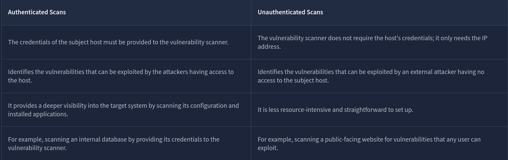

### Internal vs. External Scans

Internal scans are conducted from inside the network, while external scans are conducted from outside the network.

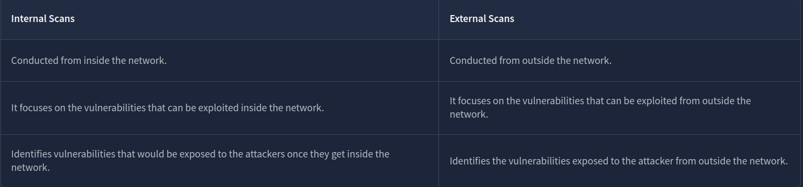

The choice between vulnerability scan types depends on several factors. Authenticated scans are often used for internal vulnerability scanning, while unauthenticated scans are mostly used for external vulnerability scanning.

### Questions

Q: Which type of vulnerability scans require the credentials of the target host?

A: `Authenticated`

Q: Which type of vulnerability scan focuses on identifying the vulnerabilities that can be exploited from outside the network?

A: `External`

## Tools for Vulnerability Scanning

There are many tools available for performing automated vulnerability scanning, each offering unique features. Let’s discuss some of the widely used vulnerability scanners.

### Nessus

[Nessus](https://www.tenable.com/products/nessus) was developed as an open-source project in 1998. It was later acquired by Tenable in 2005 and became proprietary software. It has extensive vulnerability scanning options and is widely used by large enterprises. It is available in both free and paid versions. The free version offers a limited number of scan features. In contrast, its commercial version offers advanced scanning features, unlimited scans, and professional support. Nessus needs to be deployed and managed on-premises.

### Qualys

[Qualys](https://qualys.com/) was developed in 1999 as a subscription-based vulnerability management solution. Along with continuous vulnerability scanning, it provides compliance checks and asset management. It automatically alerts on the vulnerabilities found during continuous monitoring. The best thing about Qualys is that it is a cloud-based platform, which means there is no extra cost or effort to keep it up and running on our physical hardware and manage it.

### Nexpose

[Nexpose](https://www.rapid7.com/products/nexpose/) was developed by Rapid7 in 2005 as a subscription-based vulnerability management solution. It continuously discovers new assets in the network and performs vulnerability scans on them. It gives vulnerability risk scores depending on the asset value and the vulnerability’s impact. It also provides compliance checks against various standards. Nexpose offers both on-premises and hybrid (cloud and on-premises) deployment modes.

### OpenVAS (Open Vulnerability Assessment System)

[OpenVAS](https://www.openvas.org/) is an open-source vulnerability assessment solution developed by Greenbone Security. It offers basic features with known vulnerabilities scanned through its database. It is less extensive than commercial tools; however, it gives you the flavor of a complete vulnerability scanner. It is beneficial for small organizations and individual systems. The next section will explore this tool in more detail by performing vulnerability scanning.

Almost all vulnerability scanners offer reporting capabilities. They generate a detailed report after every vulnerability scan. These reports contain a list of the vulnerabilities discovered, their risk scores, and detailed descriptions. Some vulnerability scanners offer advanced reporting capabilities that provide remediation methods for all the discovered vulnerabilities and allow you to export these vulnerability assessment reports in different formats.

### Questions

Q: Is Nessus currently an open-source vulnerability scanner? (Yea/Nay)

A: `Nay`

Q: Which company developed the Nexpose vulnerability scanner?

A: `Rapid7`

Q: What is the name of the open-source vulnerability scanner developed by Greenbone Security?

A: `OpenVAS`

## CVE & CVSS

### CVE

CVE stands for Common Vulnerabilities and Exposures. Consider CVE a unique number for each of your inquiries and complaints. If there is any update to any issue, you can easily follow up on that using the unique CVE number. Coming out of the help desk example scenario, this CVE number is a unique number given to vulnerabilities. This was developed by the MITRE Corporation. Whenever a new vulnerability is discovered in any software application, it is given a unique CVE number as a reference and published online in a CVE database. This publication aims to make people aware of these vulnerabilities so they can apply protective measures to remediate them. You can find the details of any previously discovered vulnerability in the CVE database.

- **CVE prefix:** Every CVE number has the prefix “CVE” in the beginning.
- **Year:** The second part of every CVE number contains the year it was discovered (e.g., 2024).
- **Arbitrary Digits:** The last part of the CVE numbers contains four or more arbitrary digits (e.g., 9374)

CVSS

CVSS stands for Common Vulnerability Scoring System. If we return to the help desk example again, you would always need to prioritize the complaints. The most efficient way to prioritize the complaints is by their severity level. What if all your complaints are registered with a score ranging from 0 to 10, where a higher score indicates a more severe complaint? This would resolve the problem of prioritizing critical complaints. This is called a CVSS score. In the computing world, just as each vulnerability has a CVE number that uniquely identifies it, each has a CVSS score that tells you its severity. The CVSS score is calculated by considering multiple factors, including its impact, ease of exploitability, etc. 

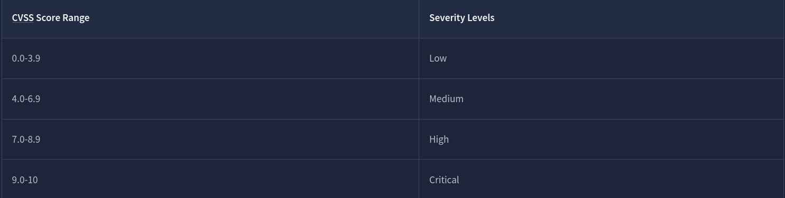

### Questions

Q: CVE stands for?

A: `Common Vulnerabilities and Exposures`

Q: Which organization developed CVE?

A: `MITRE Corporation`

Q: What would be the severity level of the vulnerability with a score of 5.3?

A: `Medium`

## OpenVAS

Once you have completed the installation process mentioned above, you can access the OpenVAS web interface by opening any of your browsers and typing the following in the URL:

`https://127.0.0.1`

This will take you to the login page of OpenVAS. Once you enter the correct login credentials, the following dashboard will open. This dashboard provides a comprehensive overview of all your vulnerability scans:

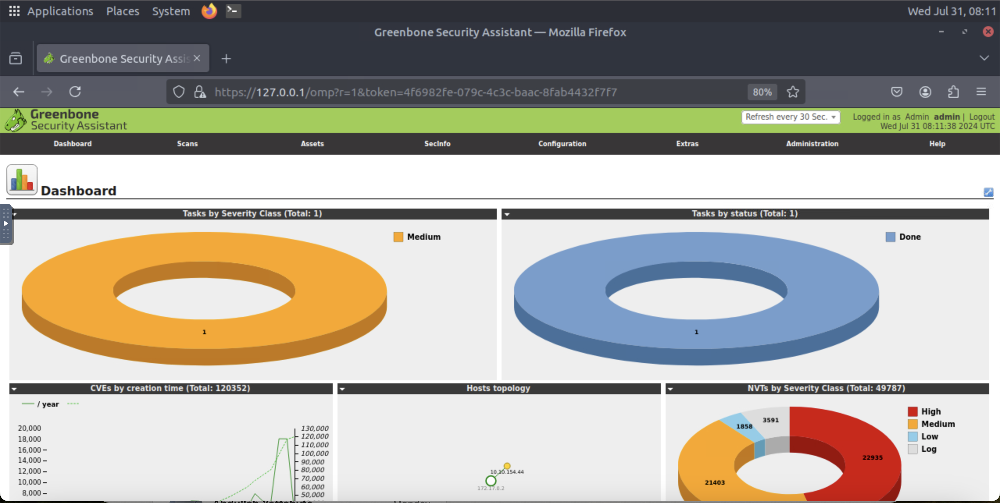

### Performing a Vulnerability Scan

Now, we are going to perform a vulnerability scan on a machine. The first step is to create a task inside the OpenVAS dashboard. We will fill out the details for this task and execute it to run the vulnerability scan.

Click the “Tasks” option available inside the “Scans” option displayed on the dashboard:

You will reach the page where all the running tasks are displayed. We would not see any task on this page because we have not yet performed any scans. To create a task, click the star icon and then the “New Task” option as highlighted in the screenshot:

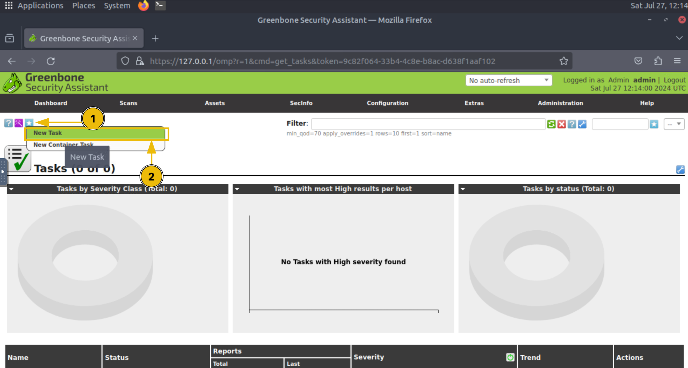

Enter the name of the task, and click the “Scan Targets” option as highlighted in the screenshot:

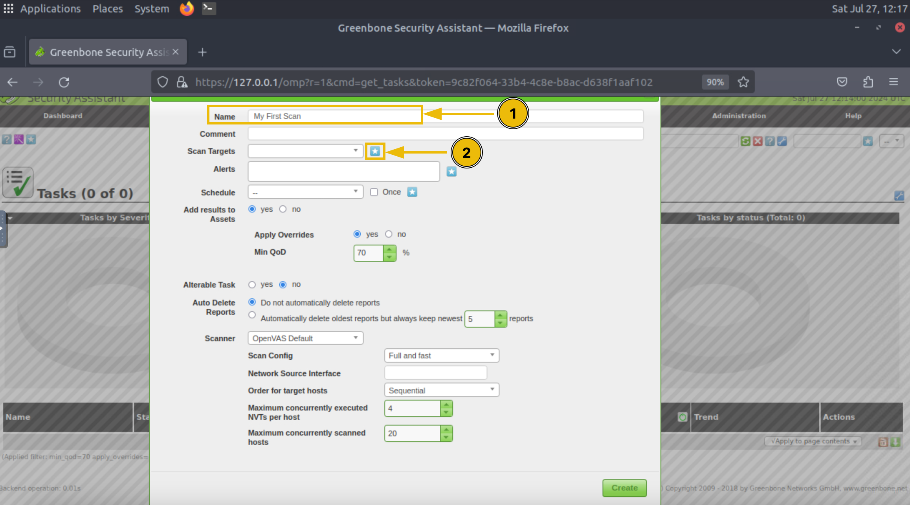

Enter the name of the target machine and its IP address, and click “Create”:

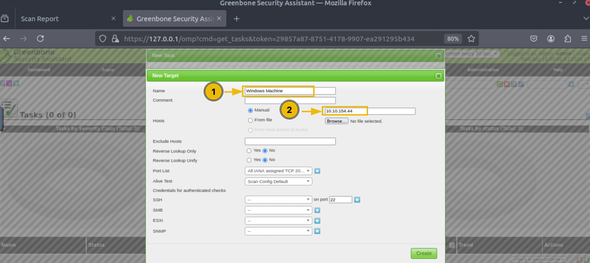

You will have multiple scan options available. Each scan option has its scope of scanning; you can study the details of each scan type and choose accordingly, and then click on the “Create” button:

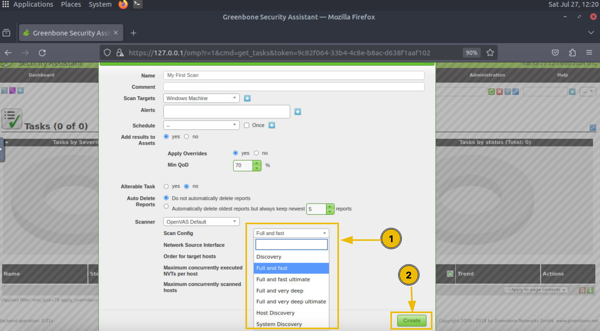

The task is created and will be displayed to you on the Tasks dashboard. To initiate the scan, click the play button in the “Actions” option of the task:

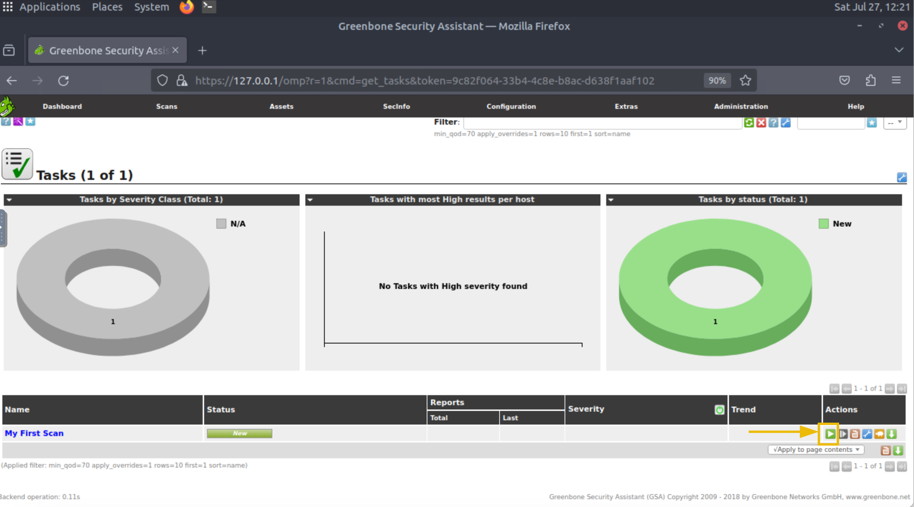

It will take a few minutes to complete the scan. After the scan is completed, you will see its status marked as “Done”. The visualizations inside the Tasks dashboard will display some numbers indicating the severity of vulnerabilities found. To check the details of the scan, you have to click on the task name:

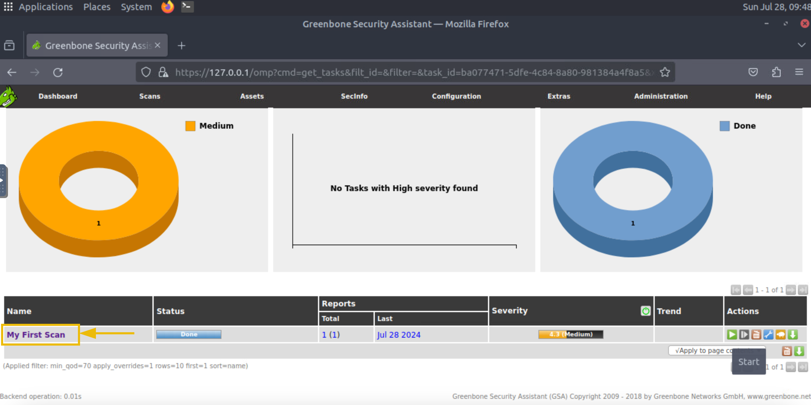

To see the details of all the vulnerabilities discovered during the scan, you can click on the number indicating the count of vulnerabilities found in the subject host:

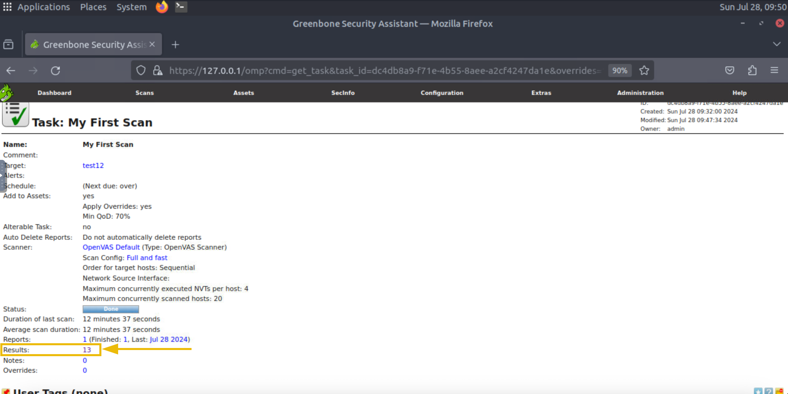

Now, we have a list of all the vulnerabilities found in this machine and their severity. We can also click on any of them to see more details:

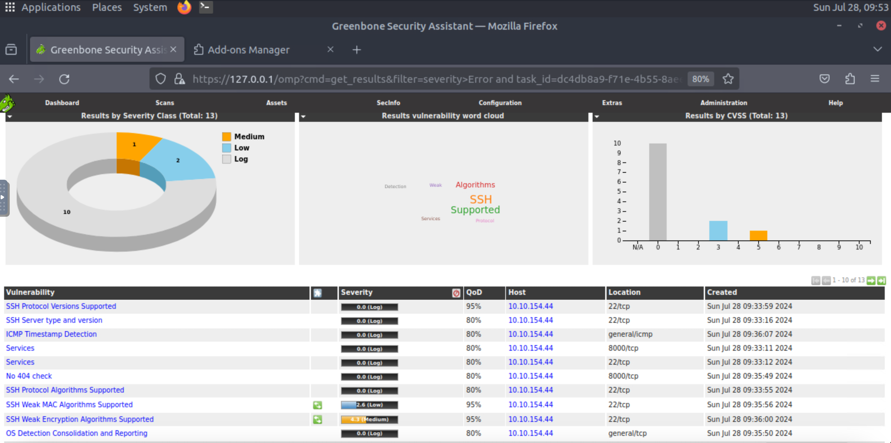

### Questions

Q:  What is the IP address of the machine scanned in this task?

A: `10.10.154.44`

Q: How many vulnerabilities were discovered on this host?

A: `13`

## Practical Exercise

**Scenario:** A reputable firm conducted a vulnerability scan on a server (10.81.146.49) on its network that stores critical information. This activity was intended to enhance the organization’s security posture. The security team conducted the activity using the OpenVAS vulnerability scanner, and the vulnerability scan report was placed on the desktop. You are an information security engineer working for that firm. You are tasked with reviewing this report. You can simply open the report placed on the desktop or perform the vulnerability scan again to answer the questions below. OpenVAS is pre-installed on the host to which you are given access.

**Note:** Performing the vulnerability scan may take some time. This is why we have already placed the scan report on the desktop so you can analyze and answer the questions.

### Questions

Q: What is the score of the single high-severity vulnerability found in the scan?

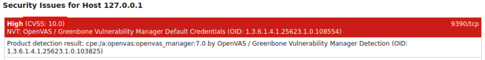

A: `10`

Q: What is the solution suggested by OpenVAS for this vulnerability?

A: `Change the password of the mentioned account(s).`
