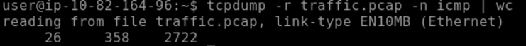
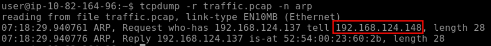
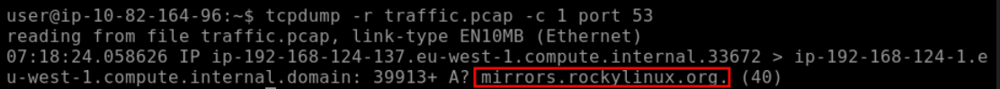
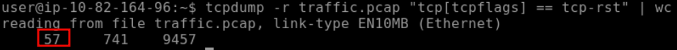
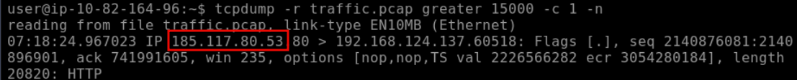
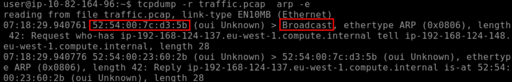

# [Tcpdump - The Basics](https://tryhackme.com/room/tcpdump)

## Basic Packet Capture

The main challenge when studying networking protocols is that we don’t get a chance to see the protocol “conversations” taking place. All the technical complexities are hidden behind friendly and elegant user interfaces. You access resources on your local network without ever seeing an ARP query. Similarly, you would access Internet services for years without seeing a single three-way handshake till you check a networking book or inspect a network traffic capture. The best study aid would be capturing network traffic and taking a closer look at the various protocols; this helps us better understand how networks work.

This room introduces some basic command-line arguments for using Tcpdump. The Tcpdump tool and its `libpcap` library are written in C and C++ and were released for Unix-like systems in the late 1980s or early 1990s. Consequently, they are very stable and offer optimal speed. The `libpcap` library is the foundation for various other networking tools today. Moreover, it was ported to MS Windows as `winpcap`.

You can run `tcpdump` without providing any arguments; however, this is only useful to test that you have it installed! In any real scenario, we must be specific about what to listen to, where to write, and how to display the packets.

### Specify the Network Interface

The first thing to decide is which network interface to listen to using `-i INTERFACE`. You can choose to listen on all available interfaces using `-i any`; alternatively, you can specify an interface you want to listen on, such as `-i eth0`.

A command such as `ip address show` (or merely `ip a s`) would list the available network interfaces.

### Save the Captured Packets

In many cases, you should check the captured packets again later. This can be achieved by saving to a file using `-w FILE`. The file extension is most commonly set to `.pcap`. The saved packets can be inspected later using another program, such as Wireshark. You won’t see the packets scrolling when you choose the `-w` option.

### Read Captured Packets from a File

You can use Tcpdump to read packets from a file by using `-r FILE`.

### Limit the Number of Captured Packets

You can specify the number of packets to capture by specifying the count using `-c COUNT`. Without specifying a count, the packet capture will continue till you interrupt it, for example, by pressing CTRL-C.

### Don’t Resolve IP Addresses and Port Numbers

Tcpdump will resolve IP addresses and print friendly domain names where possible. To avoid making such DNS lookups, you can use the `-n` argument. Similarly, if you don’t want port numbers to be resolved, such as `80` being resolved to `http`, you can use the `-nn` to stop both DNS and port number lookups.

### Produce (More) Verbose Output

If you want to print more details about the packets, you can use `-v` to produce a slightly more verbose output. According to the Tcpdump manual page (`man tcpdump`), the addition of `-v` will print “the time to live, identification, total length and options in an IP packet” among other checks. The `-vv` will produce more verbose output; the `-vvv` will provide even more verbosity; check the manual page for details.

### Summary and Examples

The table below provides a summary of the command line options that we covered.

|Command|Explanation|
|---|---|
|`tcpdump -i INTERFACE`|Captures packets on a specific network interface|
|`tcpdump -w FILE`|Writes captured packets to a file|
|`tcpdump -r FILE`|Reads captured packets from a file|
|`tcpdump -c COUNT`|Captures a specific number of packets|
|`tcpdump -n`|Don’t resolve IP addresses|
|`tcpdump -nn`|Don’t resolve IP addresses and don’t resolve protocol numbers|
|`tcpdump -v`|Verbose display; verbosity can be increased with `-vv` and `-vvv`|

Consider the following examples:

- `tcpdump -i eth0 -c 50 -v` captures and displays 50 packets by listening on the `eth0` interface, which is a wired Ethernet, and displays them verbosely.
- `tcpdump -i wlo1 -w data.pcap` captures packets by listening on the `wlo1` interface (the WiFi interface) and writes the packets to `data.pcap`. It will continue till the user interrupts the capture by pressing CTRL-C.
- `tcpdump -i any -nn` captures packets on all interfaces and displays them on screen without domain name or protocol resolution.

### Questions

Q: What option can you add to your command to display addresses only in numeric format?

A: `-n`

## Filtering Expressions

### Filtering by Host

Let’s say you are only interested in IP packets exchanged with your network printer or a specific game server. You can easily limit the captured packets to this host using `host IP` or `host HOSTNAME`. In the terminal below, we capture all the packets exchanged with `example.com` and save them to `http.pcap`. It is important to note that capturing packets requires you to be logged-in as `root` or to use `sudo`

```bash
sudo tcpdump host example.com -w http.pcap
```

If you want to limit the packets to those from a particular source IP address or hostname, you must use `src host IP` or `src host HOSTNAME`. Similarly, you can limit packets to those sent to a specific destination using `dst host IP` or `dst host HOSTNAME`.

### Filtering by Port

If you want to capture all DNS traffic, you can limit the captured packets to those on `port 53`. Remember that DNS uses UDP and TCP ports 53 by default.

You can limit the packets to those from a particular source port number or to a particular destination port number using `src port PORT_NUMBER` and `dst port PORT_NUMBER`, respectively.

### Filtering by Protocol

The final type of filtering we will cover is filtering by protocol. You can limit your packet capture to a specific protocol; examples include: `ip`, `ip6`, `udp`, `tcp`, and `icmp`

### Logical Operators

Three logical operators that can be handy:

- `and`: Captures packets where both conditions are true. For example, `tcpdump host 1.1.1.1 and tcp` captures `tcp` traffic with `host 1.1.1.1`.
- `or`: Captures packets when either one of the conditions is true. For instance, `tcpdump udp or icmp` captures UDP or ICMP traffic.
- `not`: Captures packets when the condition is not true. For example, `tcpdump not tcp` captures all packets except TCP segments; we expect to find UDP, ICMP, and ARP packets among the results.

### Summary and Examples

The table below offers a summary of the command line options that we covered.

|Command|Explanation|
|---|---|
|`tcpdump host IP` or `tcpdump host HOSTNAME`|Filters packets by IP address or hostname|
|`tcpdump src host IP` or|Filters packets by a specific source host|
|`tcpdump dst host IP`|Filters packets by a specific destination host|
|`tcpdump port PORT_NUMBER`|Filters packets by port number|
|`tcpdump src port PORT_NUMBER`|Filters packets by the specified source port number|
|`tcpdump dst port PORT_NUMBER`|Filters packets by the specified destination port number|
|`tcpdump PROTOCOL`|Filters packets by protocol; examples include `ip`, `ip6`, and `icmp`|

Consider the following examples:

- `tcpdump -i any tcp port 22` listens on all interfaces and captures `tcp` packets to or from `port 22`, i.e., SSH traffic.
- `tcpdump -i wlo1 udp port 123` listens on the WiFi network card and filters `udp` traffic to `port 123`, the Network Time Protocol (NTP).
- `tcpdump -i eth0 host example.com and tcp port 443 -w https.pcap` will listen on `eth0`, the wired Ethernet interface and filter traffic exchanged with `example.com` that uses `tcp` and `port 443`. In other words, this command is filtering HTTPS traffic related to `example.com`.

### Questions

Q: How many packets in `traffic.pcap` use the ICMP protocol?



`tcpdump -r traffic.pcap -n icmp | wc`

A: `26`

Q: What is the IP address of the host that asked for the MAC address of 192.168.124.137?



`tcpdump -r traffic.pcap -n arp`

A: `192.168.124.148`

Q: What hostname (subdomain) appears in the first DNS query?



`tcpdump -r traffic.pcap -n -c 1 port 53`

A: `mirrors.rockylinux.org`

## Advanced Filtering

We can limit the displayed packets to those smaller or larger than a certain length:

- `greater LENGTH`: Filters packets that have a length greater than or equal to the specified length
- `less LENGTH`: Filters packets that have a length less than or equal to the specified length

We recommend you check the `pcap-filter` manual page by issuing the command `man pcap-filter`;

we will focus on one advanced option that allows you to filter packets based on the TCP flags. Understanding the TCP flags will make it easy to build on this knowledge and master more advanced filtering techniques.

### Header Bytes

The purpose of this section is to be able to filter packets based on the contents of a header byte. Consider the following protocols: ARP, Ethernet, ICMP, IP, TCP, and UDP. How can we tell Tcpdump to filter packets based on the contents of protocol header bytes?

Using pcap-filter, Tcpdump allows you to refer to the contents of any byte in the header using the following syntax `proto[expr:size]`, where:

- `proto` refers to the protocol. For example, `arp`, `ether`, `icmp`, `ip`, `ip6`, `tcp`, and `udp` refer to ARP, Ethernet, ICMP, IPv4, IPv6, TCP, and UDP respectively.
- `expr` indicates the byte offset, where `0` refers to the first byte.
- `size` indicates the number of bytes that interest us, which can be one, two, or four. It is optional and is one by default.

To better understand this, consider the following two examples from the pcap-filter manual page (and don’t worry if you find them difficult):

- `ether[0] & 1 != 0` takes the first byte in the Ethernet header and the decimal number 1 (i.e., `0000 0001` in binary) and applies the `&` (the And binary operation). It will return true if the result is not equal to the number 0 (i.e., `0000 0000`). The purpose of this filter is to show packets sent to a multicast address. A multicast Ethernet address is a particular address that identifies a group of devices intended to receive the same data.  
    
- `ip[0] & 0xf != 5` takes the first byte in the IP header and compares it with the hexadecimal number F (i.e., `0000 1111` in binary). It will return true if the result is not equal to the (decimal) number 5 (i.e., `0000 0101` in binary). The purpose of this filter is to catch all IP packets with options.

You can use `tcp[tcpflags]` to refer to the TCP flags field. The following TCP flags are available to compare with:

- `tcp-syn` TCP SYN (Synchronize)
- `tcp-ack` TCP ACK (Acknowledge)
- `tcp-fin` TCP FIN (Finish)
- `tcp-rst` TCP RST (Reset)
- `tcp-push` TCP Push

Based on the above, we can write:

- `tcpdump "tcp[tcpflags] == tcp-syn"` to capture TCP packets with **only** the SYN (Synchronize) flag set, while all the other flags are unset.
- `tcpdump "tcp[tcpflags] & tcp-syn != 0"` to capture TCP packets with **at least** the SYN (Synchronize) flag set.
- `tcpdump "tcp[tcpflags] & (tcp-syn|tcp-ack) != 0"` to capture TCP packets with **at least** the SYN (Synchronize) **or** ACK (Acknowledge) flags set.

### Questions

Q: How many packets have only the TCP Reset (RST) flag set?

`tcpdump -r traffic.pcap "tcp[tcpflags] == tcp-rst" | wc`



Q: What is the IP address of the host that sent packets larger than 15000 bytes?



A: `185.117.80.53`

## Displaying Packets

Tcpdump is a rich program with many options to customize how the packets are printed and displayed. We have selected to cover the following five options:

- `-q`: Quick output; print brief packet information
- `-e`: Print the link-level header
	- If you are on an Ethernet or WiFi network and want to include the MAC addresses in Tcpdump output
	- This is convenient when you are learning how specific protocols, such as ARP and DHCP function. 
	- It can also help you track the source of any unusual packets on your network.
- `-A`: Show packet data in ASCII
	- display all the bytes mapped to English letters, numbers, and symbols.
- `-xx`: Show packet data in hexadecimal format, referred to as hex
- `-X`: Show packet headers and data in hex and ASCII

|Command|Explanation|
|---|---|
|`tcpdump -q`|Quick and quite: brief packet information|
|`tcpdump -e`|Include MAC addresses|
|`tcpdump -A`|Print packets as ASCII encoding|
|`tcpdump -xx`|Display packets in hexadecimal format|
|`tcpdump -X`|Show packets in both hexadecimal and ASCII formats|

### Questions

Q: What is the MAC address of the host that sent an ARP request?



`tcpdump -r traffic.pcap arp -e`

A: `52:54:00:7c:d3:5b`
