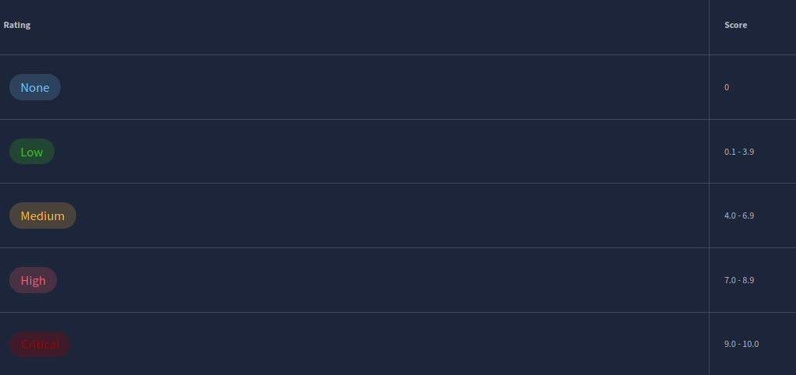

# [Vulnerabilities 101](https://tryhackme.com/room/vulnerabilities101)

## Introduction

You are going to be introduced to:

- What vulnerabilities are
- Why they're worthy of learning about
- How are vulnerabilities rated
- Databases for vulnerability research
- A showcase of how vulnerability research is used on ACKme's engagement

## Introduction to Vulnerabilities

A vulnerability in cybersecurity is defined as a weakness or flaw in the design, implementation or behaviours of a system or application.

NIST: "weakness in an information system, system security procedures, internal controls, or implementation that could be exploited or triggered by a threat source”.

| **Vulnerability**           | **Description**                                                                                                                                                                                                                                    |
| --------------------------- | -------------------------------------------------------------------------------------------------------------------------------------------------------------------------------------------------------------------------------------------------- |
| Operating System            | These types of vulnerabilities are found within Operating Systems (OSs) and often result in privilege escalation.                                                                                                                                  |
| (Mis)Configuration-based    | These types of vulnerability stem from an incorrectly configured application or service. For example, a website exposing customer details.                                                                                                         |
| Weak or Default Credentials | Applications and services that have an element of authentication will come with default credentials when installed. For example, an administrator dashboard may have the username and password of "admin". These are easy to guess by an attacker. |
| Application Logic           | These vulnerabilities are a result of poorly designed applications. For example, poorly implemented authentication mechanisms that may result in an attacker being able to impersonate a user.                                                     |
| Human-Factor                | Human-Factor vulnerabilities are vulnerabilities that leverage human behaviour. For example, phishing emails are designed to trick humans into believing they are legitimate.                                                                      |
### Questions

Q: An attacker has been able to upgrade the permissions of their system account from "user" to "administrator". What type of vulnerability is this?

A: `Operating System`

Q: You manage to bypass a login panel using cookies to authenticate. What type of vulnerability is this?

A: `Application Logic`

## Scoring Vulnerabilities (CVSS & VPR)

Vulnerability management is the process of evaluating, categorising and ultimately remediating threats (vulnerabilities) faced by an organisation.

After all, only approximately 2% of vulnerabilities only ever end up being exploited ([Kenna security., 2020 (opens in new tab)](https://www.kennasecurity.com/resources/prioritization-to-prediction-report/)). Instead, it is all about addressing the most dangerous vulnerabilities and reducing the likelihood of an attack vector being used to exploit a system.

Vulnerability scoring serves a vital role in vulnerability management and is used to determine the potential risk and impact a vulnerability may have on a network or computer system. For example, the popular Common Vulnerability Scoring System (CVSS) awards points to a vulnerability based upon its features, availability, and reproducibility.

### **Common Vulnerability Scoring System**

First introduced in 2005, the Common Vulnerability Scoring System (or CVSS) is a very popular framework for vulnerability scoring and has three major iterations. As it stands, the current version is CVSSv3.1 (with version 4.0 currently in draft) a score is essentially determined by some of the following factors (but many more):

  1. How easy is it to exploit the vulnerability?

  2. Do exploits exist for this?

  3. How does this vulnerability interfere with the CIA triad?

A vulnerability is given a classification (out of five) depending on the score that is has been assigned.

|                                                                                  |                                                                                                                                                                                                                   |
| -------------------------------------------------------------------------------- | ----------------------------------------------------------------------------------------------------------------------------------------------------------------------------------------------------------------- |
| **Advantages of CVSS**                                                           | **Disadvantages of CVSS**                                                                                                                                                                                         |
| CVSS has been around for a long time.                                            | CVSS was never designed to help prioritise vulnerabilities, instead, just assign a value of severity.                                                                                                             |
| CVSS is popular in organisations.                                                | CVSS heavily assesses vulnerabilities on an exploit being available. However, only 20% of all vulnerabilities have an exploit available ([Tenable., 2020 (opens in new tab)](https://www.tenable.com/research)) . |
| CVSS is a free framework to adopt and recommended by organisations such as NIST. | Vulnerabilities rarely change scoring after assessment despite the fact that new developments such as exploits may be found.                                                                                      |

### **Vulnerability Priority Rating (VPR)**

The VPR framework is a much more modern framework in vulnerability management - developed by Tenable, an industry solutions provider for vulnerability management. This framework is considered to be risk-driven; meaning that vulnerabilities are given a score with a heavy focus on the risk a vulnerability poses to the organisation itself, rather than factors such as impact (like with CVSS ).

Unlike CVSS, VPR scoring takes into account the relevancy of a vulnerability. For example, no risk is considered regarding a vulnerability if that vulnerability does not apply to the organisation (i.e. they do not use the software that is vulnerable). VPR is also considerably dynamic in its scoring, where the risk that a vulnerability may pose can change almost daily as it ages.

VPR uses a similar scoring range as CVSS, which I have also put into the table below. However, two notable differences are that VPR does not have a _"None/Informational"_ category, and because VPR uses a different scoring method, the same vulnerability will have a different score using VPR than when using CVSS.

| **Advantages of VPR**                                                                                                                   | **Disadvantages of VPR**                                                                                                                                                                                               |
| --------------------------------------------------------------------------------------------------------------------------------------- | ---------------------------------------------------------------------------------------------------------------------------------------------------------------------------------------------------------------------- |
| VPR is a modern framework that is real-world.                                                                                           | VPR is not open-source like some other vulnerability management frameworks.                                                                                                                                            |
| VPR considers over 150 factors when calculating risk.                                                                                   | VPR can only be adopted apart of a commercial platform.                                                                                                                                                                |
| VPR is risk-driven and used by organisations to help prioritise patching vulnerabilities.                                               | VPR does not consider the CIA triad to the extent that CVSS does; meaning that risk to the confidentiality, integrity and availability of data does not play a large factor in scoring vulnerabilities when using VPR. |
| Scorings are not final and are very dynamic, meaning the priority a vulnerability should be given can change as the vulnerability ages. | _Intentionally left blank._                                                                                                                                                                                            |

### Questions

Q: What year was the first iteration of CVSS published?

A: `2005`

Q: If you wanted to assess vulnerability based on the risk it poses to an organisation, what framework would you use?Note: We are looking for the acronym here.

A: `VPR`

Q: If you wanted to use a framework that was free and open-source, what framework would that be?Note: We are looking for the acronym here.

A: `CVSS`

## Vulnerability Databases

| **Term**               | **Definition**                                                                                                           |
| ---------------------- | ------------------------------------------------------------------------------------------------------------------------ |
| Vulnerability          | A vulnerability is defined as a weakness or flaw in the design, implementation or behaviours of a system or application. |
| Exploit                | An exploit is something such as an action or behaviour that utilises a vulnerability on a system or application.         |
| Proof of Concept (PoC) | A PoC is a technique or tool that often demonstrates the exploitation of a vulnerability.                                |
### NVD – National Vulnerability Database

The National Vulnerability Database is a website that lists all publically categorised vulnerabilities. In cybersecurity, vulnerabilities are classified under “**C**ommon **V**ulnerabilities and **E**xposures” (Or CVE for short).

These CVEs have the formatting of `CVE-YEAR-IDNUMBER`. For example, the vulnerability that the famous malware WannaCry used was `CVE-2017-0144.`

NVD allows you to see all the CVEs that have been confirmed, using filters by category and month of submission.

While this website helps keep track of new vulnerabilities, it is not great when searching for vulnerabilities for a specific application or scenario.

### Exploit-DB

[Exploit-DB (opens in new tab)](https://www.exploit-db.com/) is a resource that we, as hackers, will find much more helpful during an assessment. Exploit-DB retains exploits for software and applications stored under the name, author and version of the software or application.

We can use Exploit-DB to look for snippets of code (known as Proof of Concepts) that are used to exploit a specific vulnerability.

### Questions

Q: Using NVD (opens in new tab), how many CVEs were published in July 2021?

A: `1554`

Q: Who is the author of Exploit-DB (opens in new tab)?

A: `OffSec`

## An Example of Finding a Vulnerability

Throughout an assessment, you will often combine multiple vulnerabilities to get results. For example, in this task, we will leverage the “**Version Disclosure”** vulnerability to find out the version of an application. With this version, we can then use [Exploit-DB (opens in new tab)](https://www.exploit-db.com/) to search for any exploits that work with that specific version. 

Applications and software usually have a version number. This information is usually left with good intentions; for example, the author can support multiple versions of the software and the likes. Or sometimes, left unintentionally.

### Questions

Q: What type of vulnerability did we use to find the name and version of the application in this example?

A: `Version Disclosure`

## Showcase: Exploiting Ackme's Application

### Questions

Q: Follow along with the showcase of exploiting ACKme's application to the end to retrieve a flag. What is this flag?

A: `THM{ACKME_ENGAGEMENT}`
