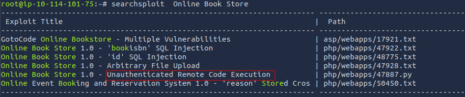
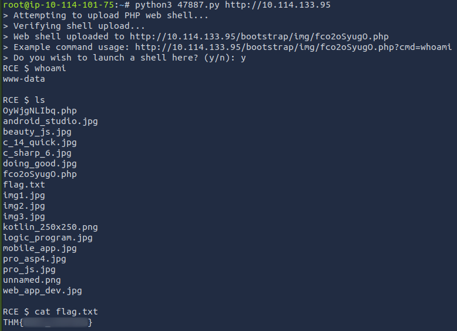

# [Exploit Vulnerabilities](https://tryhackme.com/room/exploitingavulnerabilityv2)

## Automated Vs. Manual Vulnerability Research

The vulnerability scanner [Nessus (opens in new tab)](https://www.tenable.com/products/nessus)has both a free (community) edition and commercial. The commercial version costing thousands of pounds for a year's license will likely be used in organisations providing penetration testing services or audits.

Advantages and disadvantages of using a vulnerability scanner:

| **Advantage**                                                                                               | **Disadvantage**                                                                                                                          |
| ----------------------------------------------------------------------------------------------------------- | ----------------------------------------------------------------------------------------------------------------------------------------- |
| Automated scans are easy to repeat, and the results can be shared within a team with ease.                  | People can often become reliant on these tools.                                                                                           |
| These scanners are quick and can test numerous applications efficiently.                                    | They are extremely "loud" and produce a lot of traffic and logging. This is not good if you are trying to bypass firewalls and the likes. |
| Open-source solutions exist.                                                                                | Open-source solutions are often basic and require expensive licenses to have useful features.                                             |
| Automated scanners cover a wide range of different vulnerabilities that may be hard to manually search for. | They often do not find every vulnerability on an application.                                                                             |

Frameworks such as Metasploit often have vulnerability scanners for some modules.

Manual scanning for vulnerabilities is often the weapon of choice by a penetration tester when testing individual applications or programs. In fact, manual scanning will involve searching for the same vulnerabilities and uses similar techniques as automated scanning.

  

Ultimately, both techniques involve testing an application or program for vulnerabilities. These vulnerabilities include:

| **Vulnerability**          | **Description**                                                                                                                                                                                |
| -------------------------- | ---------------------------------------------------------------------------------------------------------------------------------------------------------------------------------------------- |
| Security Misconfigurations | Security misconfigurations involve vulnerabilities that are due to developer oversight. For example, exposing server information in messages between the application and an attacker.          |
| Broken Access Control      | This vulnerability occurs when an attacker is able to access parts of an application that they are not supposed to be able to otherwise.                                                       |
| Insecure Deserialization   | This is the insecure processing of data that is sent across an application. An attacker may be able to pass malicious code to the application, where it will then be executed.                 |
| Injection                  | An Injection vulnerability exists when an attacker is able to input malicious data into an application. This is due to the failure of not ensuring (known as sanitising) input is not harmful. |

### Questions

Q: You are working close to a deadline for your penetration test and need to scan a web application quickly. Would you use an automated scanner? (Yay/Nay)

A: `Yay`

Q: You are testing a web application and find that you are able to input and retrieve data in a database. What vulnerability is this?

A: `Injection`

Q: You manage to impersonate another user. What vulnerability is this?

A: `Broken Access Control`

## Finding Manual Exploits

### **Rapid7**

Much like other services such as Exploit DB and NVD, Rapid7 is a vulnerability research database. The only difference being that this database also acts as an exploit database. Using this service, you can filter by type of vulnerability (I.e. application and operating system).

Additionally, the database contains instructions for exploiting applications using the popular Metasploit tool.

### **GitHub**

[GitHub (opens in new tab)](https://github.com/)is a popular web service designed for software developers. The site is used to host and share the source code of applications to allow a collaborative effort. However, security researchers have taken to this platform because of the aforementioned reasons as well. Security researchers store & share PoC’s (Proof of Concept) on GitHub, turning it into an exploit database in this context.

GitHub is extremely useful in finding rare or fresh exploits because anyone can create an account and upload – there is no formal verification process like there is with alternative exploit databases. With that said, there is also a downside in that PoC’s may not work where little to no support will be provided.

### **Searchsploit**

Searchsploit is a tool that is available on popular pentesting distributions such as Kali Linux. This tool is an offline copy of Exploit-DB, containing copies of exploits on your system. 

You are able to search searchsploit by application name and/or vulnerability type.

### Questions

Q: What website would you use as a security researcher if you wanted to upload a Proof of Concept?

A: `Github`

Q: You are performing a penetration test at a site with no internet connection. What tool could you use to find exploits to use?

A: `Searchsploit`

## Example of Manual Exploitation

 A foothold is an access to the vulnerable machine’s console, where we can then begin to exploit other applications or machines on the network.

### Questions

Q: What type of vulnerability was used in this attack?

A: `Remote Code Execution`

## Practical: Manual Exploitation

### Questions

Q: Find out the version of the application that is running. What are the name and version number of the application?

Check the main page of the website in the low right corner.

A: `Online Book Store v1.0`

Q: Now use the resources and skills from this module to find an exploit that will allow you to gain remote access to the vulnerable machine.

I searched using `searchsploit` for an exploit and found one RCE script that should work:

I then checked it out using `nano` and saw it only requires the url as a parameter. I ran it and I got a shell on the target:

Q: Use this exploit against the vulnerable machine. What is the value of the flag located in a web directory?

A: `THM{BOOK_KEEPING}`

