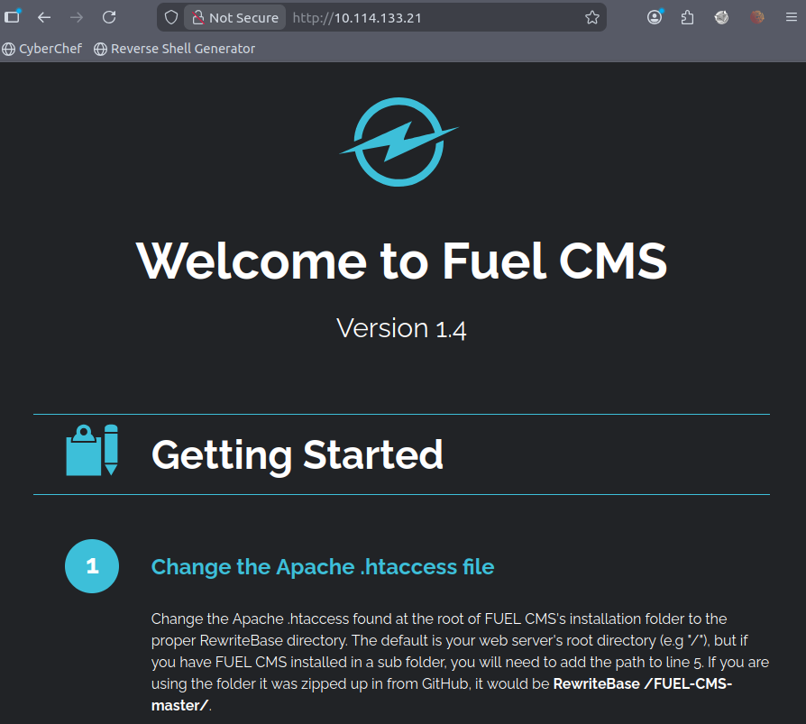
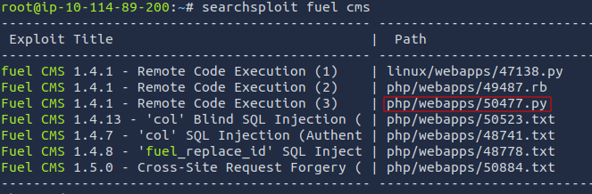
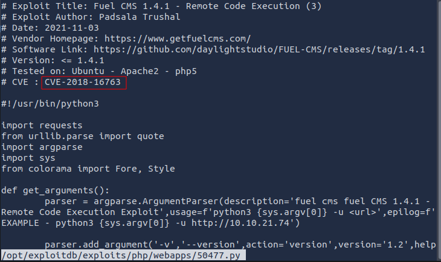
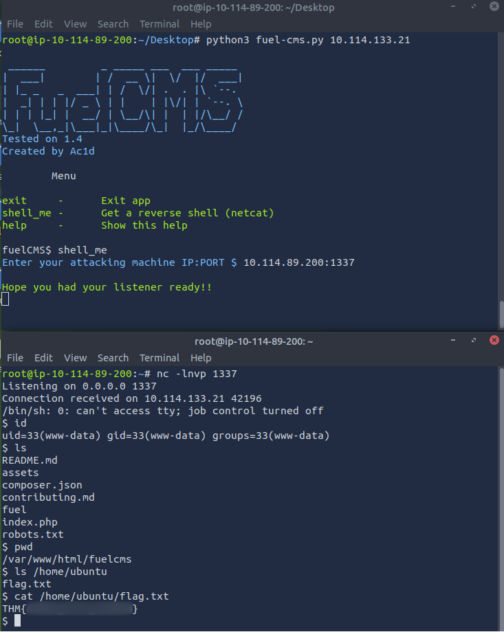

# [Vulnerability Capstone](https://tryhackme.com/room/vulnerabilitycapstone)

## Exploit the Machine (Flag Submission)

It is very obvious from the home page the name and the version of the application: 

I searched `searchsploit` for the name of this application and found a few candidates:

The third one seems the right choice. Checked out the script for the name of the CVE:

I could not get this working, so I googled fuel cms a bit, and found another exploit [here](https://gist.githubusercontent.com/anir0y/8529960c18e212948b0e40ed1fb18d6d/raw/5bf2fb821cbbeae44fed82a256530220c3b62e5c/fuel-cms.py):

After I got a connection, I had to setup a quick reverse shell using `netcat`. 

Since we knew that the flag is in the `/home/ubuntu` directory, it was easy to find.

### Questions

Q: What is the name of the application running on the vulnerable machine?

A: `Fuel CMS`

Q: What is the version number of this application?

A: `1.4`

Q: What is the number of the CVE that allows an attacker to remotely execute code on this application?Format: CVE-XXXX-XXXXX

A: `CVE-2018-16763`

Use the resources & skills learnt throughout this module to find and use a relevant exploit to exploit this vulnerability.Note: There are numerous exploits out there that can be used for this vulnerability (some more useful than others!)

Q: What is the value of the flag located on this vulnerable machine? This is located in /home/ubuntu on the vulnerable machine.

A: `THM{ACKME_BLOG_HACKED}`

