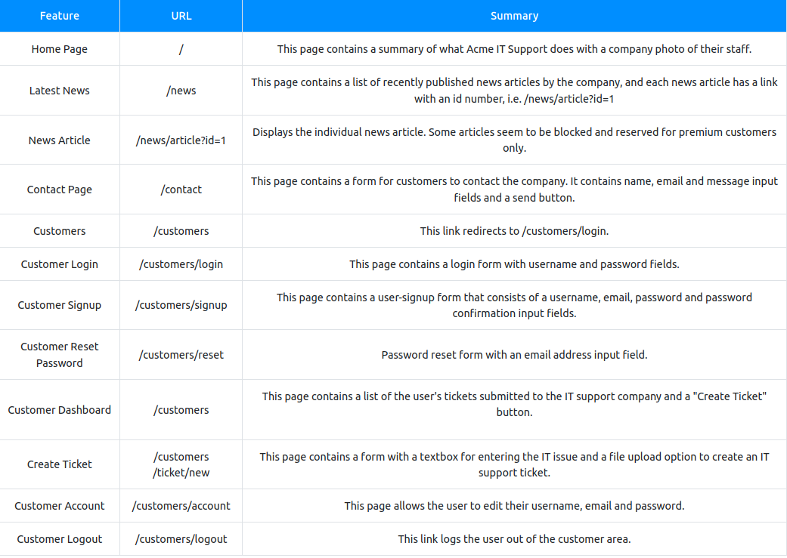
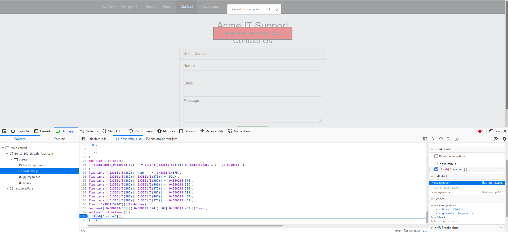

# [Walking An Application](https://tryhackme.com/room/walkinganapplication)

## Exploring the Website

- Finding interactive portions of the website can be as easy as spotting a login form to manually reviewing the website's JavaScript. 

- An excellent place to start is just with your browser exploring the website and noting down the individual pages/areas/features with a summary for each one.

## Viewing The Page Source

- The page source is the human-readable code returned to our browser/client from the web server each time we make a request.

- The returned code is made up of HTML ( *HyperText Markup Language*), CSS ( *Cascading Style Sheets* ) and JavaScript, and it's what tells our browser what content to display, how to show it and adds an element of interactivity with JavaScript.

### How do I view the Page Source?
	
	- While viewing a website, you can right-click on the page, and you'll see an option on the menu that says View Page Source.

    - Most browsers support putting view-source: in front of the URL for example, view-source:https://www.google.com/
    
    - In your browser menu, you'll find an option to view the page source. This option can sometimes be in submenus such as developer tools or more tools.

- Many websites these days aren't made from scratch and use what's called a framework. 
	
	- A framework is a collection of premade code that easily allows a developer to include common features that a website would require, such as blogs, user management, form processing, and much more, saving the developers hours or days of development.

### Questions

1. What is the flag from the HTML comment?

- used the link in the HTML comment

R: THM{HTML_COMMENTS_ARE_DANGEROUS}

2. What is the flag from the secret link?

- followed the link secr

R: THM{NOT_A_SECRET_ANYMORE}

3. What is the directory listing flag?

- accessed the directory folder /assets

R: THM{INVALID_DIRECTORY_PERMISSIONS}

4. What is the framework flag?

- downloaded a zip that i found in the framework change log file

R: THM{KEEP_YOUR_SOFTWARE_UPDATED}

## Developer Tools - Inspector

- The page source doesn't always represent what's shown on a webpage; this is because CSS, JavaScript and user interaction can change the content and style of the page, which means we need a way to view what's been displayed in the browser window at this exact time. 

- Element inspector assists us with this by providing us with a live representation of what is currently on the website.

### Questions

1. What is the flag behind the paywall?

- usde the inspector to inspect the block and to change "display: block" into "display:none" after I pressed on "div class="premium-customer-blocker"

R: THM{NOT_SO_HIDDEN}

## Developer Tools - Debugger

- This panel in the developer tools is intended for debugging JavaScript, and again is an excellent feature for web developers wanting to work out why something might not be working. 

- But as penetration testers, it gives us the option of digging deep into the JavaScript code. 

	- In Firefox and Safari, this feature is called *Debugger*, but in Google Chrome, it's called *Sources*.

### Questions

1.

- used a breakpoint to make flashing red rectangle and then refreshed the page

R: THM{CATCH_ME_IF_YOU_CAN}

## Developer Tools - Network

- The network tab on the developer tools can be used to keep track of every external request a webpage makes. 
	
	- If you click on the Network tab and then refresh the page, you'll see all the files the page is requesting. 

- Try doing this on the contact page; you can press the trash can icon to delete the list if it gets a bit overpopulated.

With the network tab open, try filling in the contact form and pressing the Send Message button. 

- You'll notice an event in the network tab, and this is the form being submitted in the background using a method called *AJAX*. 

	- *AJAX* is a method for sending and receiving network data in a web application background without interfering by changing the current web page.

### Questions

1. What is the flag shown on the contact-msg network request?

- send a message in the contact form and intercept using the Network Tool a file 'contact-msg'. Clicked on it and got a flag

R: THM{GOT_AJAX_FLAG}