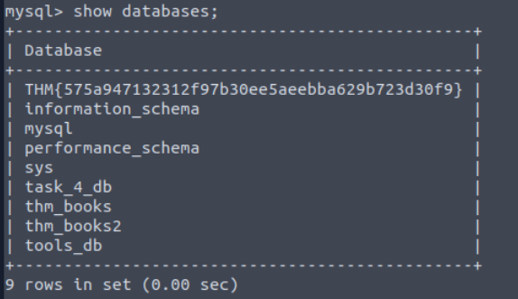
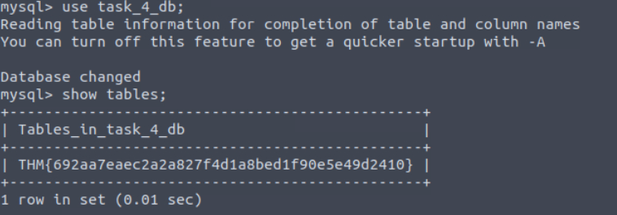
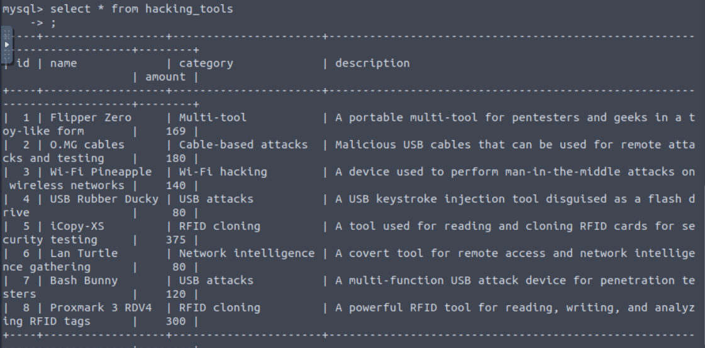
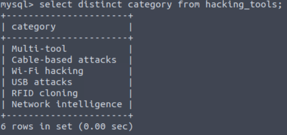
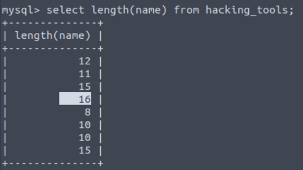
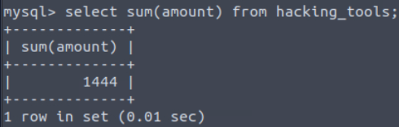

# [SQL Fundamentals](https://tryhackme.com/room/sqlfundamentals)

## Databases 101

Databases are an organised collection of structured information or data that is easily accessible and can be manipulated or analysed. That data can take many forms, such as user authentication data (such as usernames and passwords), which are stored and checked against when authenticating into an application or site (like TryHackMe, for example), user-generated data on social media (Like Instagram and Facebook) where data such as user posts, comments, likes etc are collected and stored, as well as information such as watch history which is stored by streaming services such as Netflix and used to generate recommendations.

### Different Types of Databases

Now it makes sense that something is used by so many and for (relatively) so long that there would be multiple types of implementations. There are quite a few different types of databases that can be built, but for this introductory room, we are going to focus on the two primary types: **relational databases** (aka SQL) vs **non-relational databases** (aka NoSQL).   

![An illustration comparing relational and non-relational databases. On the left, a relational database is shown with structured tables, rows, and columns, connected by relationships between tables. On the right, a non-relational database is depicted with flexible, unstructured data stored in formats like key-value pairs, documents, or collections, with no defined relationships between data points. The relational database emphasizes structured organization and data relationships, while the non-relational database highlights flexibility and scalability for diverse data types.](66c513e4445cb5649e636a36-1727686858009.png)

**Relational databases:** Store structured data, meaning the data inserted into this database follows a structure. For example, the data collected on a user consists of first_name, last_name, email_address, username and password. When a new user joins, an entry is made in the database following this structure. This structured data is stored in rows and columns in a table (all of which will be covered shortly); relationships can then be made between two or more tables (for example, user and order_history), hence the term relational databases.

**Non-relational databases:** Instead of storing data the above way, store data in a non-tabular format. For example, if documents are being scanned, which can contain varying types and quantities of data, and are stored in a database that calls for a non-tabular format. Here is an example of what that might look like: 

```bash
 {
    _id: ObjectId("4556712cd2b2397ce1b47661"),
    name: { first: "Thomas", last: "Anderson" },
    date_of_birth: new Date('Sep 2, 1964'),
    occupation: [ "The One"],
    steps_taken : NumberLong(4738947387743977493)
}
```
  
In terms of what database should be chosen, it always comes down to the context in which the database is going to be used. Relational databases are often used when the data being stored is reliably going to be received in a consistent format, where accuracy is important, such as when processing e-commerce transactions. Non-relational databases, on the other hand, are better used when the data being received can vary greatly in its format but need to be collected and organised in the same place, such as social media platforms collecting user-generated content.

### Primary and Foreign Keys

Once a table has been defined and populated, more data may need to be stored. For instance, we want to create a table named “Authors” that stores the authors of the books sold in the store. Here is a very clear example of a relationship. A book (stored in the Books table) is written by an author (stored in the Authors table). If we wanted to query for a book in our story but also have the author of that book returned, our data would need to be related somehow; we do this with keys. There are two types of **keys**:

![An illustration comparing a Primary Key and a Foreign Key in database tables. On the left, a table is shown with a highlighted column labeled 'Primary Key,' which uniquely identifies each record in that table. On the right, another table is displayed with a highlighted column labeled 'Foreign Key,' which references the Primary Key from the first table. Arrows connect the Foreign Key to the Primary Key, emphasizing the relationship between the two tables, where the Foreign Key enforces referential integrity by linking related data across tables.](66c513e4445cb5649e636a36-1727686918373.png)

**Primary Keys**: A primary key is used to ensure that the data collected in a certain column is unique. That is, there needs to be a way to identify each record stored in a table, a value unique to that record and is not repeated by any other record in that table. Think about matriculation numbers in a university; these are numbers assigned to a student so they can be uniquely identified in records (as sometimes students can have the same name). A column has to be chosen in each table as a primary key; in our example, “id” would make the most sense as an id has been uniquely created for each book where, as books can have the same publication date or (in rarer cases) book title. Note that there can only be one primary key column in a table.

**Foreign Keys**: A foreign key is a column (or columns) in a table that also exists in another table within the database, and therefore provides a link between the two tables. In our example, think about adding an “author_id” field to our “Books” table; this would then act as a foreign key because the author_id in our Books table corresponds to the “id” column in the author table. Foreign keys are what allow the relationships between different tables in relational databases. Note that there can be more than one foreign key column in a table.

### Questions

Q: What type of database should you consider using if the data you're going to be storing will vary greatly in its format?

A: `Non-relational database`

Q: What type of database should you consider using if the data you're going to be storing will reliably be in the same structured format?

A: `relational database`

Q: In our example, once a record of a book is inserted into our "Books" table, it would be represented as a ___ in that table?

A: `row`

Q: Which type of key provides a link from one table to another?

A: `foreign key`

Q: which type of key ensures a record is unique within a table?

A: `primary key`

## SQL

### What is SQL?

Now, all of this theoretically sounds great, but in practice, how do databases work? How would you go and make your first table and populate it with data? What would you use? Databases are usually controlled using a Database Management System (DBMS). Serving as an interface between the end user and the database, a DBMS is a software program that allows users to retrieve, update and manage the data being stored. Some examples of DBMSs include MySQL, MongoDB, Oracle Database and Maria D

The interaction between the end user and the database can be done using SQL (Structured Query Language). SQL is a programming language that can be used to query, define and manipulate the data stored in a relational database.

## The Benefits of SQL and Relational Databases

SQL is almost as ubiquitous as databases themselves, and for good reason. Here are some of the benefits that come with learning and using to use SQL:  

- **It's _fast_:** Relational databases (aka those that SQL is used for) can return massive batches of data almost instantaneously due to how little storage space is used and high processing speeds. 
  
- **Easy to Learn:** Unlike many programming languages, SQL is written in plain English, making it much easier to pick up. The highly readable nature of the language means users can concentrate on learning the functions and syntax.
  
- **Reliable:** As mentioned before, relational databases can guarantee a level of accuracy when it comes to data by defining a strict structure into which data sets must fall in order to be inserted.
  
- **Flexible:** SQL provides all kinds of capabilities when it comes to querying a database; this allows users to perform vast data analysis tasks very efficiently.

`user@tryhackme$ mysql -u root -p`        

### Questions

Q: What serves as an interface between a database and an end user?

A: `DBMS`

Q: What query language can be used to interact with a relational database?

A: `SQL`

## Database and Table Statements

### **CREATE DATABASE**

If a new database is needed, the first step you would take is to create it. This can be done in SQL using the `CREATE DATABASE` statement. This would be done using the following syntax:

`mysql> CREATE DATABASE database_name;`

Run the following command to create a database named `thm_bookmarket_db`:

`mysql> CREATE DATABASE thm_bookmarket_db;`

### **SHOW DATABASES**

Now that we have created a database, we can view it using the `SHOW DATABASES` statement. The `SHOW DATABASES` statement will return a list of present databases. Run the statement as follows:


`mysql> SHOW DATABASES;`       

In the returned list, you should see the database you have just created and some databases that are included by default (mysql, information_scheme, performance_scheme and sys), which are used for various purposes that enable mysql to function. Also present are various tables needed for this lesson.

### **USE DATABASE**

Once a database is created, you may want to interact with it. Before we can interact with it, we need to tell mysql which database we would like to interact with (so it knows which database to run subsequent queries against). To set the database we have just created as the active database, we would run the `USE` statement as follows (make sure to run this on your machine):

`mysql> USE thm_bookmarket_db;`

### **DROP DATABASE**

Once a database is no longer needed (maybe it was created for test purposes, or is no longer required), it can be removed using the `DROP` statement. To remove a database, we would use the following statement syntax (although, in our case, we want to keep our database, so no need to run this one yourself!):

`mysql> DROP database database_name;`

### **CREATE TABLE**

Following the logic of the database statements, creating tables also uses a `CREATE` statement. Once a database is active (you have run the `USE` statement on it), a table can be created within it using the following statement syntax:


`mysql> CREATE TABLE example_table_name (     example_column1 data_type,     example_column2 data_type,     example_column3 data_type );`       

As you can see, there is a little more involved here. In the Databases 101 task, we covered how and when a table is created; it must be decided what columns will make up a record in that table, as well as what data type is expected to be contained within that column. That is what is represented by this syntax here. In the example, there are 3 example columns, but SQL supports many (over 1000). Let's try populating our `thm_bookmarket_db` with a table using the following statement:

`mysql> CREATE TABLE book_inventory (     book_id INT AUTO_INCREMENT PRIMARY KEY,     book_name VARCHAR(255) NOT NULL,     publication_date DATE );`

This statement will create a table `book_inventory` with three columns: `book_id`, `book_name` and `publication_date`. `book_id` is an `INT` (Integer) as it should only ever be a number, `AUTO_INCREMENT` is present, meaning the first book inserted would be assigned book_id 1, the second book inserted would be assigned a book_id of 2, and so on. Finally, `book_id` is set as the `PRIMARY KEY` as it will be the way we uniquely identify a book record in our table (and a primary must be present in a table). 

Book_name has the data type `VARCHAR(255)`, meaning it can use variable characters (text/numbers/punctuation) and a limit of 255 characters is set and `NOT NULL`, meaning it cannot be empty (so if someone tried to insert a record into this table but the book_name was empty it would be rejected. Publication_date is set as the data type `DATE`.

### **SHOW TABLES** 

Just as we can list databases using a SHOW statement, we can also list the tables in our currently active database (the database on which we last used the USE statement). Run the following command, and you should see the table you have just created:

`mysql> SHOW TABLES;`

### **DESCRIBE** 

If we want to know what columns are contained within a table (and their data type), we can describe them using the `DESCRIBE` command (which can also be abbreviated to `DESC`). Describe the table you have just created using the following command:

`mysql> DESCRIBE book_inventory;`        

This will give you a detailed view of the table like so:

`mysql> DESCRIBE book_inventory;`

### **ALTER** 

Once you have created a table, there may come a time when your need for the dataset changes, and you need to alter the table. This can be done using the `ALTER` statement. Let’s now imagine that we have decided that we actually want to have a column in our book inventory that has the page count for each book. Add this to our table using the following statement:

`mysql> ALTER TABLE book_inventory ADD page_count INT;`       

The `ALTER` statement can be used to make changes to a table, such as renaming columns, changing the data type in a column or removing a column. 

### **DROP** 

Similar to removing a database, you can also remove tables using the `DROP` statement. We don’t need to do this, but the syntax you would use for this is:

`mysql> DROP TABLE table_name;`

### Questions

Q: Using the statement you've learned to list all databases, it should reveal a database with a flag for a name; what is it?



A: `THM{575a947132312f97b30ee5aeebba629b723d30f9}`

Q: In the list of available databases, you should also see the  `task_4_db` database. Set this as your active database and list all tables in this database; what is the flag present here?



A: `THM{692aa7eaec2a2a827f4d1a8bed1f90e5e49d2410}`

## CRUD Operations

**CRUD** stands for **C**reate, **R**ead, **U**pdate, and **D**elete, which are considered the basic operations in any system that manages data.

Let's explore all these different operations when working with **MySQL**

### Create Operation (INSERT)

The **Create** operation will create new records in a table. In MySQL, this can be achieved by using the statement `INSERT INTO`, as shown below.  


```shell-session
mysql> INSERT INTO books (id, name, published_date, description)
    VALUES (1, "Android Security Internals", "2014-10-14", "An In-Depth Guide to Android's Security Architecture");

Query OK, 1 row affected (0.01 sec)
```

As we can observe, the `INSERT INTO` statement specifies a table, in this case, **books**, where you can add a new record; the columns **id**, **name**, **published_date**, and **description** are the records in the table. In this example, a new record with an **id** of  **1**, a **name** of **"Android Security Internals**", a **published_date** of "**2014-10-14**", and a **description** stating "**Android Security Internals provides a complete understanding of the security internals of Android devices**" was added.

### Read Operation (SELECT)

The **Read** operation, as the name suggests, is used to read or retrieve information from a table. We can fetch a column or all columns from a table with the `SELECT` statement, as shown in the next example:

`SELECT * FROM books;`

`SELECT name, description FROM books;`

### Update Operation (UPDATE)

The **Update** operation modifies an existing record within a table, and the same statement, `UPDATE`, can be used for this.  

```shell-session
mysql> UPDATE books
    SET description = "An In-Depth Guide to Android's Security Architecture."
    WHERE id = 1;

Query OK, 1 row affected (0.00 sec)
Rows matched: 1  Changed: 1  Warnings: 0     
```

The `UPDATE` statement specifies the table, in this case, **books**, and then we can use `SET` followed by the column name we will update. The `WHERE` clause specifies which row to update when the clause is met, in this case, the one with **id 1**.

### Delete Operation (DELETE)

The **delete** operation removes records from a table. We can achieve this with the `DELETE` statement.

**Note:** There is no need to run the query. Deleting this entry will affect the rest of the examples in the upcoming tasks.

```shell-session
mysql> DELETE FROM books WHERE id = 1;

Query OK, 1 row affected (0.00 sec)    
```

Above, we can observe the `DELETE` statement followed by the `FROM` clause, which allows us to specify the table where the record will be removed, in this case, **books**, followed by the `WHERE` clause that indicates that it should be the one where the **id** is **1**.

### Questions

Q: Using the `tools_db` database, what is the name of the tool in the `hacking_tools` table that can be used to perform man-in-the-middle attacks on wireless networks?



A: `Wi-Fi Pineapple`

Q: Using the `tools_db` database, what is the shared category for both **USB Rubber Ducky** and **Bash Bunny**?

A: `USB attacks`

## Clauses

A clause is a part of a statement that specifies the criteria of the data being manipulated, usually by an initial statement. Clauses can help us define the type of data and how it should be retrieved or sorted. 

In previous tasks, we already used some clauses, such as `FROM` that is used to specify the table we are accessing with our statement and `WHERE`, which specifies which records should be used.

### DISTINCT Clause

The `DISTINCT` clause is used to avoid duplicate records when doing a query, returning only unique values.

```shell-session
SELECT DISTINCT name FROM books;
```

### GROUP BY Clause

The `GROUP BY` clause aggregates data from multiple records and **groups** the query results in columns. This can be helpful for aggregating functions.

```shell-session
SELECT name, COUNT(*)
    FROM books
    GROUP BY name;
```

### ORDER BY Clause

The `ORDER BY` clause can be used to sort the records returned by a query in ascending or descending order. Using functions like `ASC` and `DESC` can help us to accomplish that, as shown below in the next two examples.

```shell-session
SELECT *
    FROM books
    ORDER BY published_date ASC;
```

### HAVING Clause

The `HAVING` clause is used with other clauses to filter groups or results of records based on a condition. In the case of `GROUP BY`, it evaluates the condition to `TRUE` or `FALSE`, unlike the `WHERE` clause `HAVING` filters the results after the aggregation is performed.

```shell-session
SELECT name, COUNT(*)
    FROM books
    GROUP BY name
    HAVING name LIKE '%Hack%';
```


### Questions

Q: Using the `tools_db` database, what is the total number of distinct categories in the `hacking_tools` table?



A: `6`

Q: Using the `tools_db` database, what is the first tool (by name) in ascending order from the `hacking_tools` table?

A: `Bash Bunny`

Q: Using the `tools_db` database, what is the first tool (by name) in descending order from the `hacking_tools` table?

A: `Wi-fi pineapple`

## Operators

When working with **SQL** and dealing with logic and comparisons, **operators** are our way to filter and manipulate data effectively. Understanding these operators will help us to create more precise and powerful queries.

### LIKE Operator

The `LIKE` operator is commonly used in conjunction with clauses like `WHERE` in order to filter for specific patterns within a column. Let's continue using our DataBase to query an example of its usage.

```shell-session
SELECT *
    FROM books
    WHERE description LIKE "%guide%";
```

### AND Operator

The `AND` operator uses multiple conditions within a query and returns `TRUE` if all of them are true.

### OR Operator

The `OR` operator combines multiple conditions within queries and returns `TRUE` if at least one of these conditions is true.

### NOT Operator

The `NOT` operator reverses the value of a boolean operator, allowing us to exclude a specific condition.

### BETWEEN Operator

The `BETWEEN` operator allows us to test if a value exists within a defined **range**.

### Equal To Operator

The `=` (Equal) operator compares two expressions and determines if they are equal, or it can check if a value matches another one in a specific column.

### Not Equal To Operator

The `!=` (not equal) operator compares expressions and tests if they are not equal; it also checks if a value differs from the one within a column.

### Less Than Operator

Less Than Operator

The `<` (less than) operator compares if the expression with a given value is lesser than the provided one.

### Greater Than Operator

The `>` (greater than) operator compares if the expression with a given value is greater than the provided one.

### Less Than or Equal To and Greater  Than or Equal To Operators

The `<=` (Less than or equal) operator compares if the expression with a given value is less than or equal to the provided one. On the other hand, The `>=` (Greater than or Equal) operator compares if the expression with a given value is greater than or equal to the provided one.

### Questions

Q: Using the `tools_db` database, which tool falls under the **Multi-tool** category and is useful for **pentesters** and **geeks**?

A: `Flipper Zero`

Q: Using the `tools_db` database, what is the category of tools with an amount **greater than** or **equal** to **300**?

A: `RFID cloning`

Q: Using the `tools_db` database, which tool falls under the **Network intelligence** category with an amount **less than 100**?

A: `Lan Turtle`

## Functions

### CONCAT() Function

This function is used to add two or more strings together. It is useful to combine text from different columns.

```shell-session
mysql> SELECT CONCAT(name, " is a type of ", category, " book.") AS book_info FROM books;
```

### GROUP_CONCAT() Function

This function can help us to concatenate data from multiple rows into one field. Let's explore an example of its usage.

```shell-session
mysql> SELECT category, GROUP_CONCAT(name SEPARATOR ", ") AS books
    FROM books
    GROUP BY category;
```

### SUBSTRING() Function

This function will retrieve a substring from a string within a query, starting at a determined position. The length of this substring can also be specified.

```shell-session
mysql> SELECT SUBSTRING(published_date, 1, 4) AS published_year FROM books;
```

### LENGTH() Function

This function returns the number of characters in a string. This includes spaces and punctuation.

```shell-session
mysql> SELECT LENGTH(name) AS name_length FROM books;
```

### COUNT() Function

This function returns the number of records within an expression, as the example below shows.

```shell-session
mysql> SELECT COUNT(*) AS total_books FROM books;
```

### SUM() Function

This function sums all values (not NULL) of a determined column.

```shell-session
mysql> SELECT SUM(price) AS total_price FROM books;
```

### MAX() Function

This function calculates the maximum value within a provided column in an expression.

```shell-session
mysql> SELECT MAX(published_date) AS latest_book FROM books;
```

### MIN() Function

This function calculates the minimum value within a provided column in an expression.

```shell-session
mysql> SELECT MIN(published_date) AS earliest_book FROM books;
```

### Questions

Q: Using the `tools_db` database, what is the tool with the longest name based on character length?



A: `USB Rubber Ducky`

Q: Using the `tools_db` database, what is the total sum of all tools?



A: `1444`

Q: Using the `tools_db` database, what are the tool names where the amount does not end in **0**, and **group** the tool names **concatenated** by " & ".

A: `Flipper zero & icopy-XS`