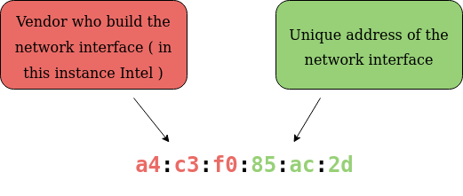
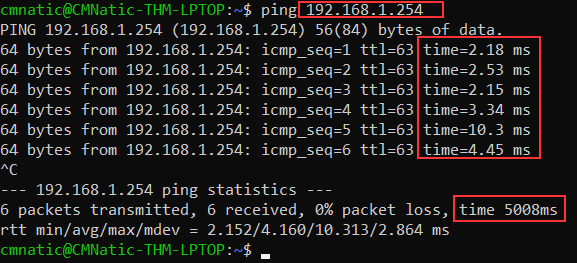

# What Is Networking

## What is the internet?

- *Internet* = networks joined together

- *ARPANET* = first iteration of the internet.

- *World-Wide-Web* (1989 by Tim Berners-Lee), the internet is no longer used as a repository for storing and sharing information.

- A network can be one of the two:

	- *Private network*
	- *Public network*

### Questions

1. Who invented the World Wide Web? 

R: Tim Berners-Lee

## Identifying Devices On A Network

- Devices are identifiable through similar ways as humans (name, fingerprint), one being changeable and the other permeable:

	- An IP address
	- A MAC (Media Access Control) Address 

### IP (Internet Protocol) Adresses

- IP (Internet Protocol) is divided into four *octets*.

- An IP address cannot be active simultaneously more than once in the same network.

- Devices can either be on a private or a public network. Their IP differs.

- A public address is used to identify the device on the internet

- A private address is used to identify the device amongst other devices.

- When two devices communicate in the same private network, they will be able to connect to the internet using the same public IP address.

- IPv4 suports 2^32 (4.29 billion) IP addresses and these may not be sufficient for the near future.

- IPv6 supports up to 2^128 (340 trillion-plus) IP addresses and it is more efficient than IPv4.

### MAC Addresses (Media Access Control)

- unique address assigned at the factory built on the device's physical network interface.

- *12 character hexadecimal number*

- split into two and separated by a colon:

	- first 6: vendor who built the network inteface.

	- last 6: unique address of the network interface.

- MAC addresses can be faked (*spoofed*), when a device pretends to identify as another using its MAC address.

- E.g.: A firewall is configured to allow any communication going to and from the MAC address of the administrator. If a device were to pretend or "spoof" this MAC address, the firewall would now think that it is receiving communication from the administrator when it isn't.

- This is used especially in places  like cafes, coffee shops and hotels.

### Questions

1. What does the term "IP" stand for? 

R: Internet Protocol

2. What is each section of an IP address called?

R: Octet

3. How many sections does an IP address have?

R: 4

4. Deploy the interactive lab and spoof your MAC address to access the site. What is the flag?

R: THM{YOU_GOT_ON_TRYHACKME}

## Ping (ICMP)

- Ping uses *ICMP* (Internet Control Message Protocol) packets to determine the performance of a connection betwewn devices, if it exists or perhaps if it is reliable.

- The time measuring is done usings ICMP's echo packet and then ICMP's echo reply from the target device.

### Questions

1. What protocol does ping use?

R: ICMP

2. What is the syntax to Ping 10.10.10.10?

R: ping 10.10.10.10

3. What flag do you get when you ping 8.8.8.8?

R: THM{I_PINGED_THE_SERVER}