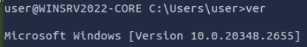
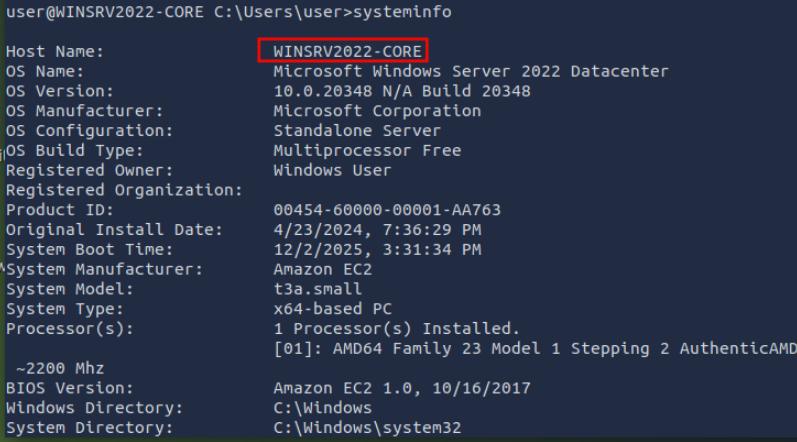
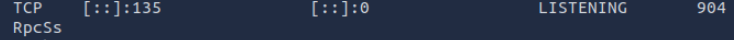
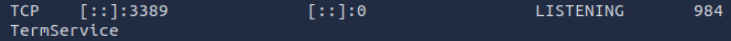
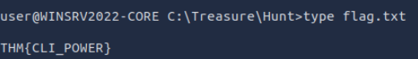

# Windows Command Line

- User: bung3r
- Date: 2nd December 2025
- Description: Learn the essential Windows commands.

Tags: #windows #cmd

## Introduction

There are many other advantages to using a CLI besides speed and efficiency. We will mention a few:

- **Lower resource usage**: CLIs require fewer system resources than graphics-intensive GUIs. In other words, you can run your CLI system on older hardware or systems with limited memory. If you are using cloud computing, your system will require lower resources, which in turn will lower your bill.
- **Automation**: While you can automate GUI tasks, creating a batch file or script with the commands you need to repeat is much easier.
- **Remote management**: CLI makes it very convenient to use SSH to manage a remote system such as a server, router, or an IoT device. This approach works well on slow network speeds and systems with limited resources.

### Questions

What is the default command line interpreter in the Windows environment?

A: `cmd.exe`

## Basic System Information

Before issuing commands, we should note that we can only issue the commands within the Windows Path. You can issue the command `set` to check your path from the command line. The terminal output below shows the path where MS Windows will execute commands, as indicated by the line starting with `Path=`.

```cmd
C:\>set ALLUSERSPROFILE=C:\ProgramData [...] LOGNAME=strategos NUMBER_OF_PROCESSORS=2 OS=Windows_NT Path=C:\Windows\system32;C:\Windows;C:\Windows\System32\Wbem;C:\Windows\System32\WindowsPowerShell\v1.0\;C:\Windows\System32\OpenSSH\;C:\Windows\system32\config\systemprofile\AppData\Local\Microsoft\WindowsApps;C:\Users\strategos\AppData\Local\Microsoft\WindowsApps; [...]
```

The `ver` command determines the operating system (OS) version.

We can run the `systeminfo` command to list various information about the system such as OS information, system details, processor and memory.

You can pipe it through `more` if the output is too long. Then, you can view it page after page by pressing the space bar button. To demonstrate this, try running `driverquery` and compare it with running `driverquery | more`. In the latter, you can display the output page by page and you can exit it using `CTRL + C`.

- `help` - Provides help information for a specific command
- `cls` - Clears the Command Prompt screen.

### Questions

What is the OS version of the Windows VM?



A: `10.0.20348.2655`

What is the hostname of the Windows VM?



A: `WINSRV2022-CORE`

## Network Troubleshooting

You can check your network information using `ipconfig`.

You can also use `ipconfig /all` for more information about your network configuration. As shown in the terminal below, we can view our DNS servers and confirm that DHCP is enabled.

One common troubleshooting task is checking if the server can access a particular server on the Internet. The command syntax is `ping target_name`. Inspired by ping-pong, we send a specific ICMP packet and listen for a response. If a response is received, we know that we can reach the target and that the target can reach us.

Another valuable tool for troubleshooting is `tracert`, which stands for _trace route_. The command `tracert target_name` traces the network route traversed to reach the target. Without getting into more details, it expects the routers on the path to notify us if they drop a packet because its time-to-live (TTL) has reached zero.

One networking command worth knowing is `nslookup`. It looks up a host or domain and returns its IP address. The syntax `nslookup example.com` will look up `example.com` using the default name server; however, `nslookup example.com 1.1.1.1` will use the name server `one.one.one.one`.

`netstat` displays current network connections and listening ports. A basic `netstat` command with no arguments will show you established connections

If you are curious about the other options, you can run `netstat -h`, where `-h` displays the help page. We opted for the following options:

- `-a` displays all established connections and listening ports
- `-b` shows the program associated with each listening port and established connection
- `-o` reveals the process ID (PID) associated with the connection
- `-n` uses a numerical form for addresses and port numbers

We combine these four options and execute the `netstat -abon` command

### Questions

Which command can we use to look up the server’s physical address (MAC address)?

A: `ipconfig /all`

What is the name of the service listening on port 135?

Do a `netstat -abon`



A: `RpcSs`

What is the name of the service listening on port 3389?



A: `TermService`

## File and Disk Management

You can view the child directories using `dir`.

- `dir /a` - Displays hidden and system files as well.
- `dir /s` - Displays files in the current directory and all subdirectories.

You can type `tree` to visually represent the child directories and subdirectories.

To create a directory, use `mkdir directory_name`;

view text files with the command `type`.

for long text files, `more` will display a single page and wait for you to press `Spacebar` to move by one page (flip the page) or `Enter` to move by one line.

The `copy` command allows you to copy files from one location to another.

 you can move files using the `move` command.

we can delete a file using `del` or `erase`
### Questions

What are the file’s contents in C:\Treasure\Hunt?



A: `THM{CLI_POWER}`

## Task and Process Management

We can list the running processes using `tasklist`.

Some filtering is helpful because the output is expected to be very long. You can check all available filters by displaying the help page using `tasklist /?`. Let’s say that we want to search for tasks related to `sshd.exe`, we can do that with the command `tasklist /FI "imagename eq sshd.exe"`. Note that `/FI` is used to set the filter _image name equals_ `sshd.exe`.

With the process ID (PID) known, we can terminate any task using `taskkill /PID target_pid`. For example, if we want to kill the process with PID `4567`, we would issue the command `taskkill /PID 4567`.
### Questions

What command would you use to find the running processes related to notepad.exe?

A: `tasklist /FI "imagename eq notepad.exe"`

What command can you use to kill the process with PID 1516?

A: `taskkill /PID 1516`

## Conclusion/Other commands

- `chkdsk`: checks the file system and disk volumes for errors and bad sectors.
- `driverquery`: displays a list of installed device drivers.
- `sfc /scannow`: scans system files for corruption and repairs them if possible.

Moreover, it is equally important to know that `/?` can be used with most commands to display a help page.

### Questions

The command `shutdown /s` can shut down a system. What is the command you can use to restart a system?

A: `shutdown /r`

What command can you use to abort a scheduled system shutdown?

A: `shutdown /a`