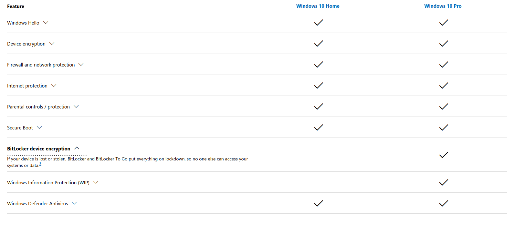
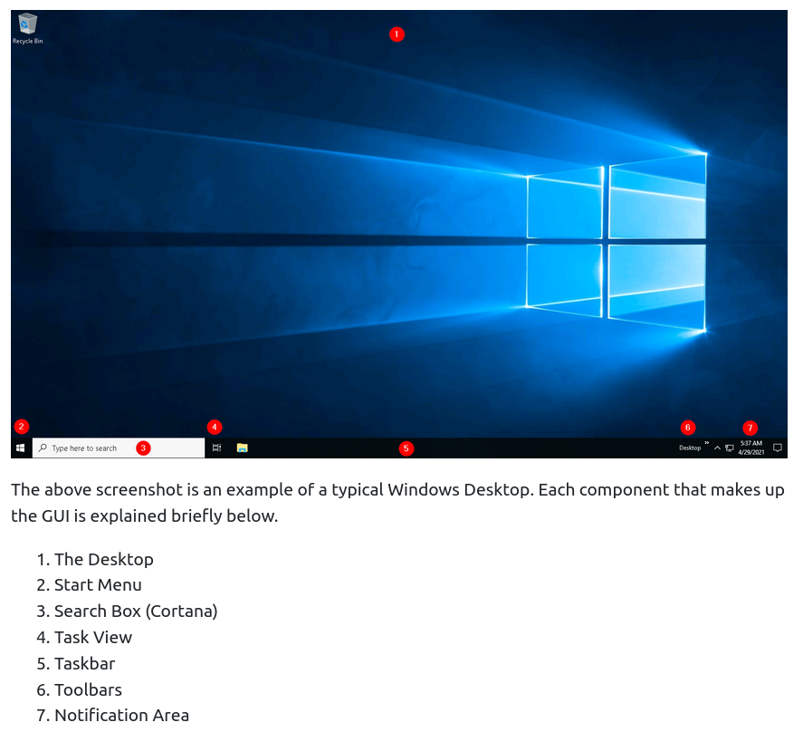
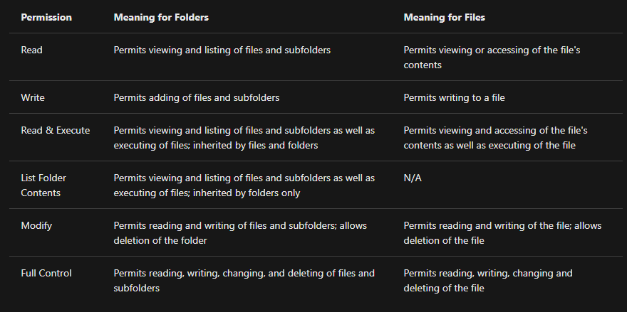
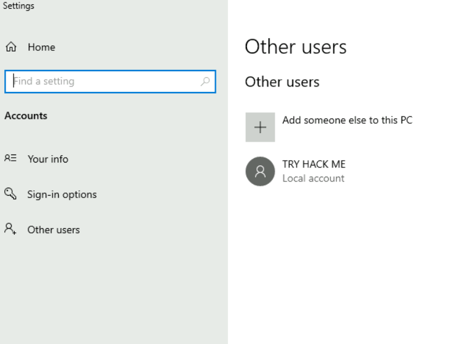
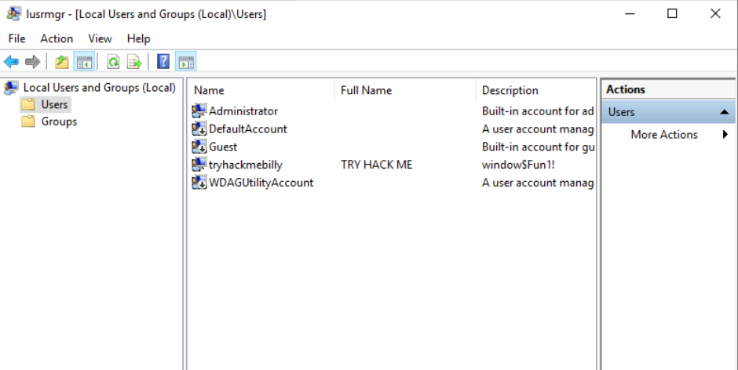
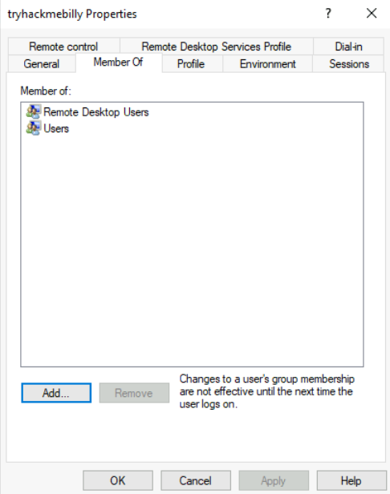
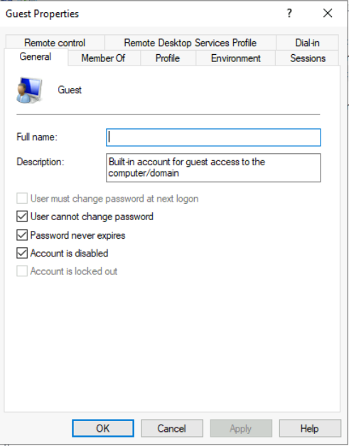
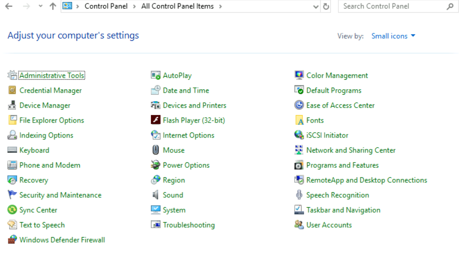

# [Windows Fundamentals 1](https://tryhackme.com/room/windowsfundamentals1xbx)

## Windows Editions

- The Windows operating system has a long history dating back to *1985*, and currently, it is the dominant operating system in both home use and corporate networks.

- **Windows XP** was a popular version of Windows and had a long-running. 

- Microsoft announced **Windows Vista**, which was a complete overhaul of the Windows operating system. 

	- There were many issues with Windows Vista. 

	- It wasn't received well by Windows users, and it was quickly phased out.

- When Microsoft announced the end-of-life date for Windows XP, many customers panicked. 

- Corporations, hospitals, etc., scrambled and tested the next viable Windows version, which was **Windows 7**, against many other hardware and devices. 

- Vendors had to work against the clock to ensure their products worked with Windows 7 for their customers. 

- If they couldn't, their customers had to break their agreement and find another vendor that upgraded their products to work with Windows 7. 

	- It was a nightmare for many, and Microsoft took note of it.

- Windows 7, as quickly as it was released soon after, was marked with an end of support date. 

	- Windows 8.x came and left and it was short-lived, like Vista.

- Then arrived **Windows 10**, which is the current Windows operating system version for desktop computers.

- Windows 10 comes in 2 flavors, `Home` and `Pro`. 

 	- You can read the difference between the Home and Pro [here](https://www.microsoft.com/en-us/windows/compare-windows-10-home-vs-pro). 

- Even though we didn't talk about servers, the current version of the Windows operating system for servers is **Windows Server 2019**.

- Even though we didn't talk about servers, the current version of the Windows operating system for servers is Windows Server 2019.

### Questions

1. What encryption can you enable on Pro that you can't enable in Home? 

- We go to the link provided and check the comparison table:

A: BitLocker

## The Desktop (GUI)

- Here are Microsoft's brief documents for the [Start Menu](https://support.microsoft.com/en-us/windows/see-what-s-on-the-start-menu-a8ccb400-ad49-962b-d2b1-93f453785a13) and  [Notification Area](https://support.microsoft.com/en-us/windows/customize-the-taskbar-notification-area-e159e8d2-9ac5-b2bd-61c5-bb63c1d437c3#WindowsVersion=Windows_10).

### Questions

1. Which selection will hide/disable the Search box?

A: Hidden

2. Which selection will hide/disable the Task View button?

A: Show Task View Button

3. Besides Clock and Network, what other icon is visible in the Notification Area?

A: Action Center

## The File System

#ntfs #hpfs #fat

- The file system used in modern versions of Windows is the **New Technology File System** or simply **NTFS**. 

- Before NTFS, there was **FAT16/FAT32** (**File Allocation Table**) and **HPFS** (**High Performance File System**). 

- You still see FAT partitions in use today. 

	- For example, you typically see FAT partitions in *USB devices*, *MicroSD cards*, etc. but traditionally not on personal Windows computers/laptops or Windows servers.

- [Official documentation](https://docs.microsoft.com/en-us/troubleshoot/windows-client/backup-and-storage/fat-hpfs-and-ntfs-file-systems) on these three types of file systems

- NTFS is known as a **journaling file system**. 

	- In case of a failure, the file system can automatically repair the folders/files on disk using information stored in a log file. 

	- This function is not possible with FAT.   

- NTFS addresses many of the limitations of the previous file systems; such as: 

    - Supports files larger than 4GB
    - Set specific permissions on folders and files
    - Folder and file compression
    - Encryption ([Encryption File System](https://docs.microsoft.com/en-us/windows/win32/fileio/file-encryption) or **EFS**)

- Windows *permissions*:

- How to view permissions on a file or folder:

    - Right-click the file or folder you want to check for permissions.
    - From the context menu, select `Properties`.
    - Within Properties, click on the `Security` tab.
    - In the `Group or user names` list, select the user, computer, or group whose permissions you want to view.

#ads
- Another feature of *NTFS* is **Alternate Data Streams (ADS)**.

- **Alternate Data Streams (ADS)** is a file attribute specific to Windows NTFS (New Technology File System). 

- Every file has at least one data stream (`$DATA`), and ADS allows files to contain more than one stream of data. 

	- Natively Window Explorer doesn't display ADS to the user. 

- There are 3rd party executables that can be used to view this data, but *Powershell* gives you the ability to view ADS for files.

- From a security perspective, malware writers have used ADS to hide data.

- Not all its uses are malicious. 

	- For example, when you download a file from the Internet, there are identifiers written to ADS to identify that the file was downloaded from the Internet.

- [More on ADS](https://blog.malwarebytes.com/101/2015/07/introduction-to-alternate-data-streams/)

### Questions

1.  What is the meaning of NTFS? 

A: New Technology File System

## The Windows\System32 Folders

#system32

- The Windows folder (`C:\Windows`) is traditionally known as the folder which contains the *Windows operating system*. 

- The folder doesn't have to reside in the C drive necessarily. 

	- It can reside in any other drive and technically can reside in a different folder. 

#important
- This is where environment variables, more specifically *system environment variables*, come into play. Even though not discussed yet, the system  environment variable for the Windows directory is `%windir%`.

> Per Microsoft, "Environment variables store information about the operating system environment. This information includes details such as the operating system path, the number of processors used by the operating system, and the location of temporary folders".

- One of the many folders that the Windows folder include is **System32**

- The System32 folder holds the important files that are critical for the operating system. 

- [More](https://www.howtogeek.com/346997/what-is-the-system32-directory-and-why-you-shouldnt-delete-it/) on System32

### Questions

1. What is the system variable for the Windows folder? 

A: %windir%

## User Accounts, Profiles, and Permissions

- User accounts can be one of two types on a typical local Windows system: **Administrator** & **Standard User**. 

- There are several ways to determine which user accounts exist on the system:

	- One way is to click the `Start Menu` and type `Other User`. 

- Since you're the Administrator, you see an option to Add someone else to this PC.

	- Note: A Standard User will not see this option.  

- Another way to access this information, and then some, is using `Local User and Group Management`. 

	- Right-click on the Start Menu and click Run. 
#lusrmgr
		- Type `lusrmgr.msc`.

### Questions

1. What is the name of the other user account?

A: tryhackmebilly

2. What groups is this user a member of?

A: Remote Desktop Users, Users

3. What built-in account is for guest access to the computer?

A: Guest

4. What is the account status?

A: Account is disabled

## User Account Control

#uac

- A user doesn't need to run with high (elevated) privileges on the system to run tasks that don't require such privileges, such as surfing the Internet, working on a Word document, etc. 

- This elevated privilege increases the risk of system compromise because it makes it easier for malware to infect the system. 

- Consequently, since the user account can make changes to the system, the malware would run in the context of the logged-in user.

- To protect the local user with such privileges, Microsoft introduced **User Account Control (UAC)**. 

	- This concept was first introduced with the short-lived Windows Vista and continued with versions of Windows that followed.

> Note: UAC (by default) doesn't apply for the built-in local administrator account. 

- How does UAC work? 

	- When a user with an account type of administrator logs into a system, the current session doesn't run with elevated permissions. 

	- When an operation requiring higher-level privileges needs to execute, the user will be prompted to confirm if they permit the operation to run. 

- More on UAC [here](https://docs.microsoft.com/en-us/windows/security/identity-protection/user-account-control/how-user-account-control-works)

### Questions

1. What does UAC mean?

A: User Account Control

## Settings and the Control Panel

### Settings vs Control Panel

- For a long time, the Control Panel has been the go-to location to make system changes, such as adding a printer, uninstall a program, etc. 

- The Settings menu was introduced in Windows 8, the first Windows operating system catered to touch screen tablets, and is still available in Windows 10.

- Control Panel is the menu where you will access more complex settings and perform more complex actions. 

	- In some cases, you can start in Settings and end up in the Control Panel.

### Questions

1. In the Control Panel, change the view to Small icons. What is the last setting in the Control Panel view? 

A: Windows Defender Firewall

## Task Manager

#taskmanager

- [More](https://www.howtogeek.com/405806/windows-task-manager-the-complete-guide/) on the Task Manager

### Questions

1. What is the keyboard shortcut to open Task Manager? 

A: Ctrl+Shift+Esc
