# [Windows Fundamentals 2](https://tryhackme.com/room/windowsfundamentals2x0x)

## System Configuration

#msconfig #systemconfiguration

- The **System Configuration utility (MSConfig)** is for advanced troubleshooting, and its main purpose is to help diagnose startup issues. 

	- More info [here](https://docs.microsoft.com/en-us/troubleshoot/windows-client/performance/system-configuration-utility-troubleshoot-configuration-errors)

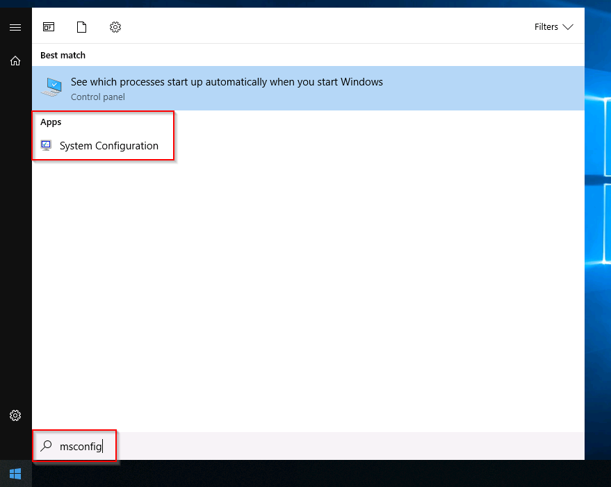

- In the **General** tab, we can select what devices and services for Windows to load upon boot. 

	- The options are: **Normal**, **Diagnostic**, or **Selective**. 

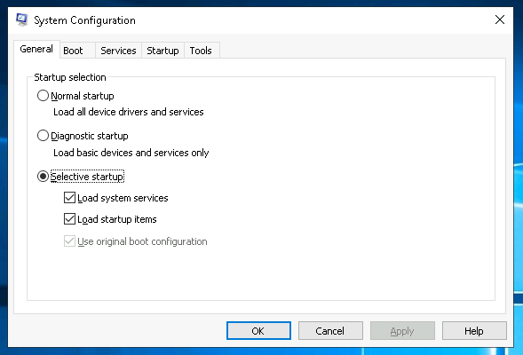

- In the **Boot** tab, we can define various boot options for the Operating System. 

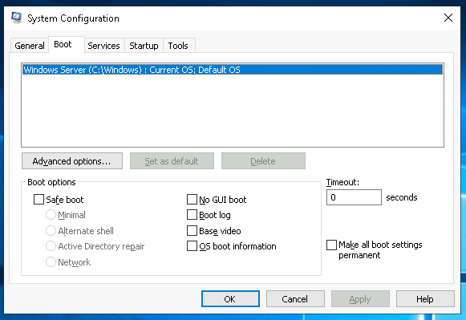

- The **Services** tab lists all services configured for the system *regardless* of their state (running or stopped). 

	- A service is a special type of application that runs in the background.  

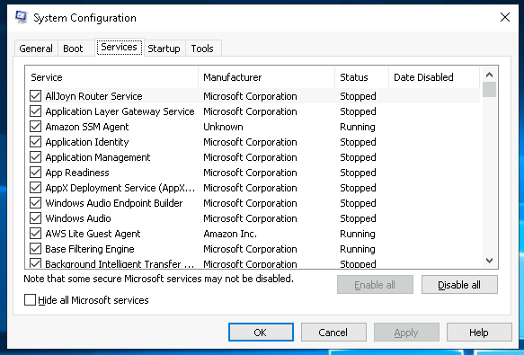

- The **Startup** tab does not show anything interesting

- As you can see, Microsoft advises using Task Manager (**taskmgr**) to manage (enable/disable) startup items. 

	- The System Configuration utility is **NOT** a startup management program. 

- There is a list of various utilities (tools) in the **Tools** tab that we can run to configure the operating system further.

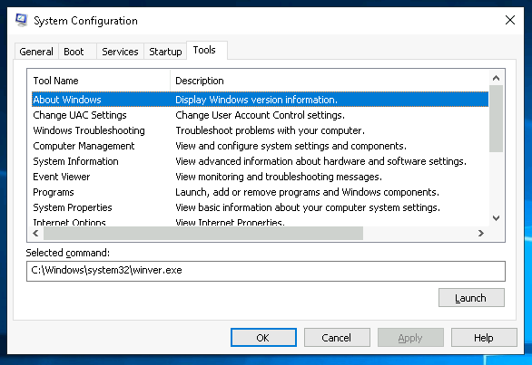

### Questions

1. What is the name of the service that lists Systems Internals as the manufacturer?

- Find System Internals on the Manufacturer column

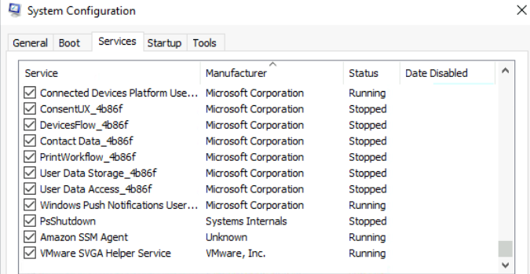

A: PsShutdown

2. Whom is the Windows license registered to?

- In the tools section, I launched the About Windows tool

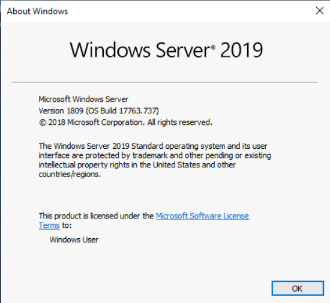

A: Windows User

3. What is the command for Windows Troubleshooting?

- We can find this in the Tools tab

A: C:\Windows\System32\control.exe /name Microsoft.Troubleshooting

4. What command will open the Control Panel? (The answer is  the name of .exe, not the full path)
 
- Again, the answer is in the Tools section

A: control.exe

## Change UAC Settings

#uac

### Questions

1. What is the command to open User Account Control Settings? (The answer is the name of the .exe file, not the full path)

- Find the answer in the Tools section

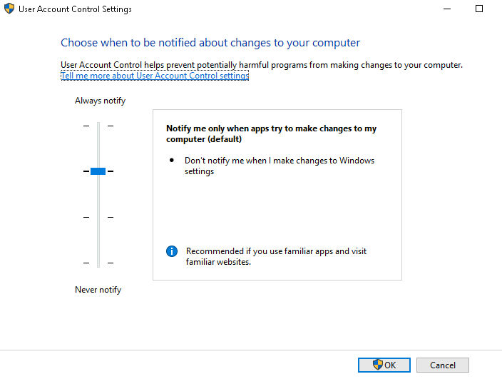

A: UserAccountControlSettings.exe

## Computer Management

#compmgmt

- The **Computer Management (compmgmt)** utility has three primary sections: *System Tools*, *Storage*, and *Services and Applications*.

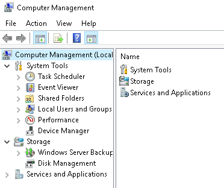

### System Tools

- Let's start with **Task Scheduler**. 

	- Per Microsoft, with Task Scheduler, we can create and manage common tasks that our computer will carry out automatically at the times we specify.

- A task can run an application, a script, etc., and tasks can be configured to run at any point. 

	- A task can run at log in or at log off. 

	- Tasks can also be configured to run on a specific schedule, for example, every five mins.

- **Event Viewer** allows us to view events that have occurred on the computer. 

	- These records of events can be seen as an audit trail that can be used to understand the activity of the computer system. 

	- This information is often used to diagnose problems and investigate actions executed on the system. 

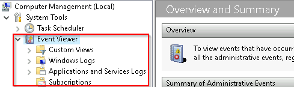

- Event Viewer has three panes.

    - The pane on the left provides a hierarchical tree listing of the event log providers. (as shown in the image above)
    - The pane in the middle will display a general overview and summary of the events specific to a selected provider.
    - The pane on the right is the actions pane.

- There are five types of events that can be logged.

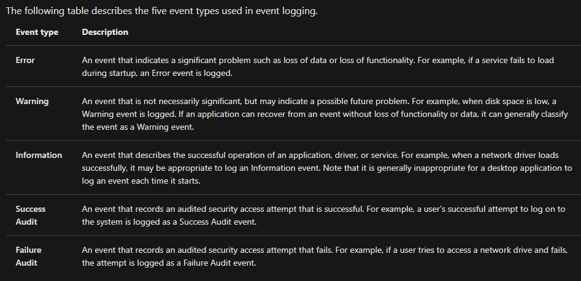

- The standard logs are visible under Windows Logs.

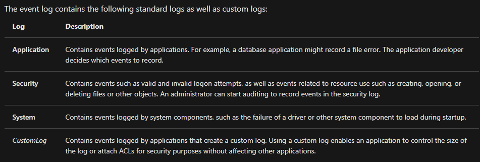

- **Shared Folders** is where you will see a complete list of shares and folders shared that others can connect to. 

- Under **Sessions**, you will see a list of users who are currently connected to the shares. 

- All the folders and/or files that the connected users access will list under **Open Files**.

- The Local Users and Groups section you should be familiar with from Windows Fundamentals 1 because it's **lusrmgr.msc**.

-  In **Performance**, you'll see a utility called **Performance Monitor** (**perfmon**). 

- Perfmon is used to view performance data either in real-time or from a log file. 

	- This utility is useful for troubleshooting performance issues on a computer system, whether local or remote. 

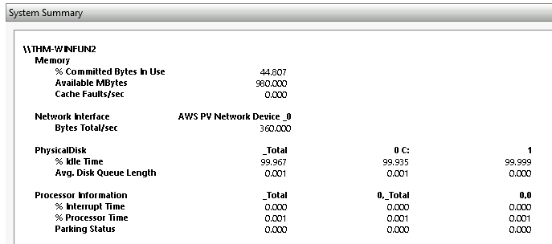

- **Device Manager** allows us to view and configure the hardware, such as disabling any hardware attached to the computer.

### Storage  

- Under Storage is **Windows Server Backup** and **Disk Management**. 

	- We'll only look at Disk Management in this room.

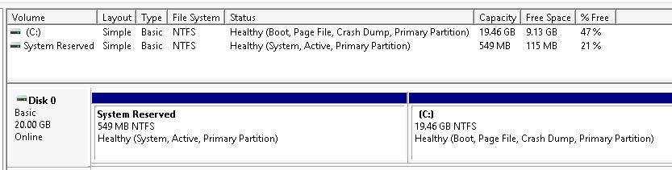

- Disk Management is a system utility in Windows that enables you to perform advanced storage tasks.  Some tasks are:

    - Set up a new drive
    - Extend a partition
    - Shrink a partition
    - Assign or change a drive letter (ex. E:) 

## Services and Applications

- Recall from the previous task; a service is a special type of application that runs in the background. 

	- Here you can do more than enable and disable a service, such as view the Properties for the service. 

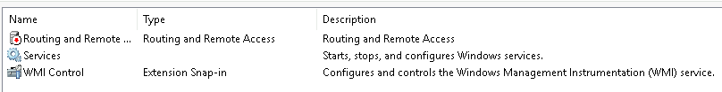

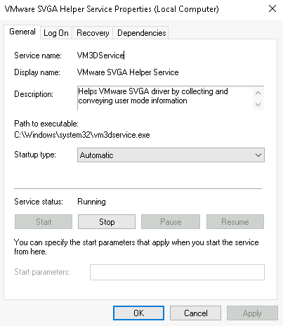

#wmi
- WMI Control configures and controls the **Windows Management Instrumentation (WMI)** service.

>Per Wikipedia, "WMI allows scripting languages (such as VBScript or Windows PowerShell) to manage Microsoft Windows personal computers and servers, both locally and remotely. Microsoft also provides a command-line interface to WMI called Windows Management Instrumentation Command-line (WMIC)."

- Note: The WMIC tool is deprecated in Windows 10, version 21H1. Windows PowerShell supersedes this tool for WMI. 

### Questions

1. What is the command to open Computer Management? (The answer is the name of the .msc file, not the full path)

A: compmgmt.msc

2. At what time every day is the GoogleUpdateTaskMachineUA task configured to run?

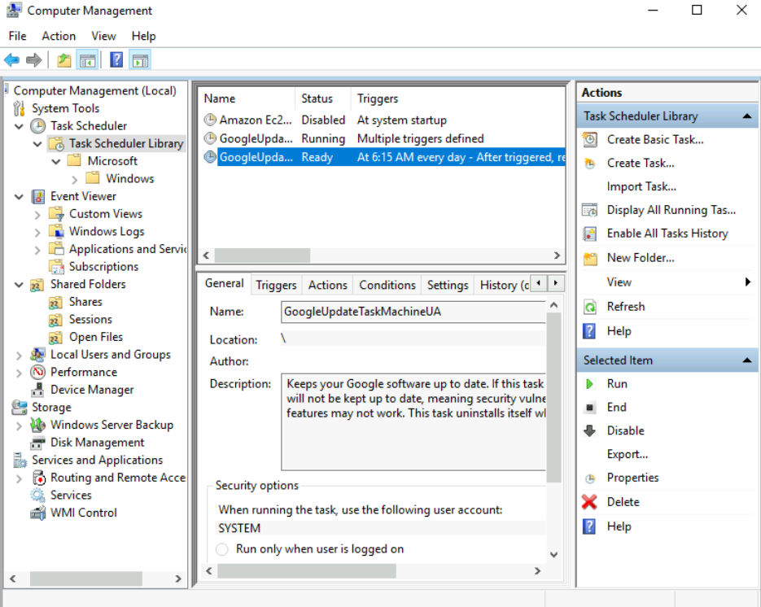

A: 6:15 AM

3. What is the name of the hidden share?

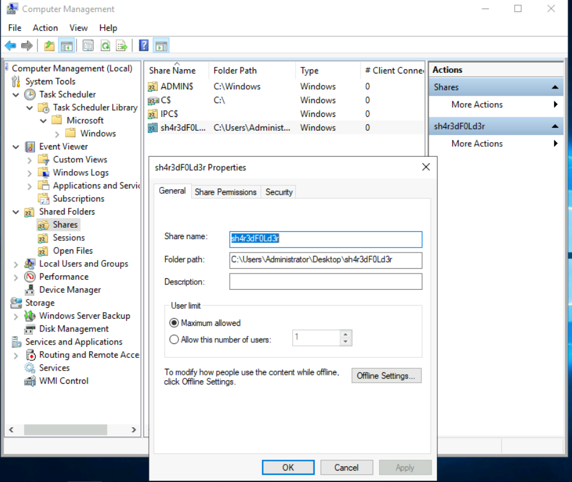

A: sh4r3dF0Ld3r

## System Information

#msinfo32
- What is the System Information (**msinfo32**) tool?

> Per Microsoft, "Windows includes a tool called Microsoft System Information (Msinfo32.exe).  This tool gathers information about your computer and displays a comprehensive view of your hardware, system components, and software environment, which you can use to diagnose computer issues." 

- The  information in System Summary is divided into three sections:

    - **Hardware Resources**
    - **Components**    
    - **Software Environment**

- `System Summary` will display general technical specifications for the computer, such as processor brand and model.

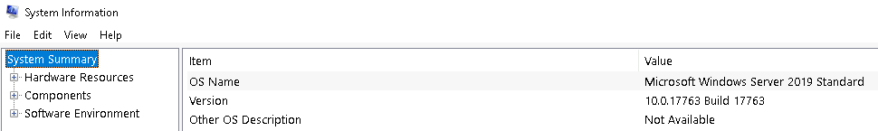

- The information displayed in `Hardware Resources` is not for the average computer user. 

	- If you want to learn more about this section, refer to the official Microsoft [page](https://docs.microsoft.com/en-us/windows-hardware/drivers/kernel/hardware-resources#:~:text=Hardware%20resources%20are%20the%20assignable,of%20bus%2Drelative%20memory%20addresses.).

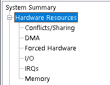

- Under `Components`, you can see specific information about the hardware devices installed on the computer. 

	- Some sections don't show any information, but some sections do, such as `Display` and `Input`.

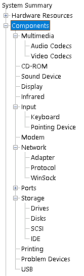

- In the `Software Environment` section, you can see information about software baked into the operating system and software you have installed. 

	- Other details are visible in this section as well, such as the *Environment Variables* and *Network Connections*. 

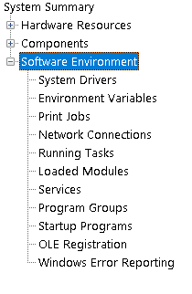

#environmentvariables

> Per Microsoft, "Environment variables store information about the operating system environment. This information includes details such as the operating system path, the number of processors used by the operating system, and the location of temporary folders.

The environment variables store data that is used by the operating system and other programs. For example, the WINDIR environment variable contains the location of the Windows installation directory. Programs can query the value of this variable to determine where Windows operating system files are located".

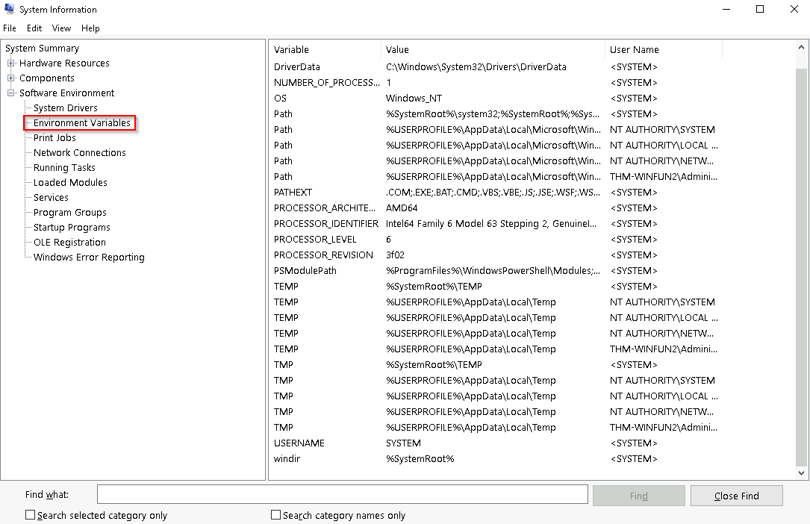

- Another method to view environment variables is `Control Panel > System and Security > System > Advanced system settings > Environment Variables` OR `Settings > System > About > system info > Advanced system settings > Environment Variables`

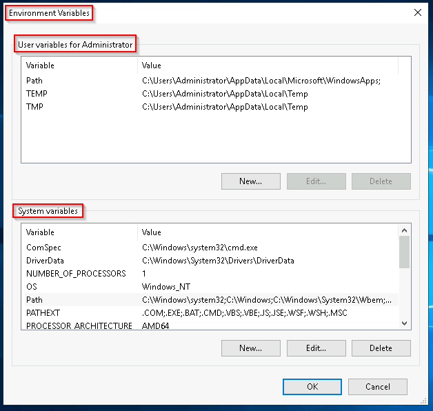

### Questions

1. What is the command to open System Information? (The answer is the name of the .exe file, not the full path)

A: msinfo32.exe

2. What is listed under System Name?

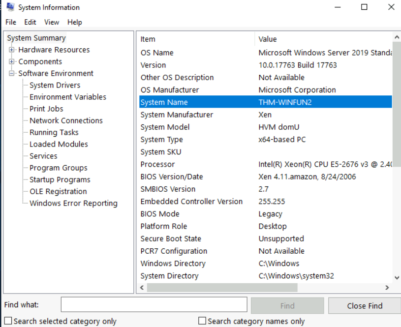

A: THM-WINFUN2

3. Under Environment Variables, what is the value for ComSpec?

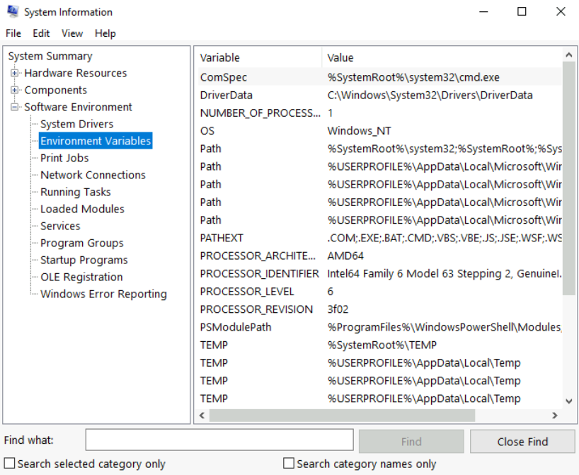

A: %SystemRoot%\system32\cmd.exe

## Resource Monitor

#resmon
- What is Resource Monitor (**resmon**)?

> Per Microsoft, "Resource Monitor displays per-process and aggregate CPU, memory, disk, and network usage information, in addition to providing details about which processes are using individual file handles and modules. Advanced filtering allows users to isolate the data related to one or more processes (either applications or services), start, stop, pause, and resume services, and close unresponsive applications from the user interface. It also includes a process analysis feature that can help identify deadlocked processes and file locking conflicts so that the user can attempt to resolve the conflict instead of closing an application and potentially losing data."

- As some of the other tools mentioned in this room, this utility is geared primarily to advanced users who need to perform advanced troubleshooting on the computer system.

- In the Overview tab, Resmon has four sections:

    - CPU
    - Disk
    - Network
    - Memory

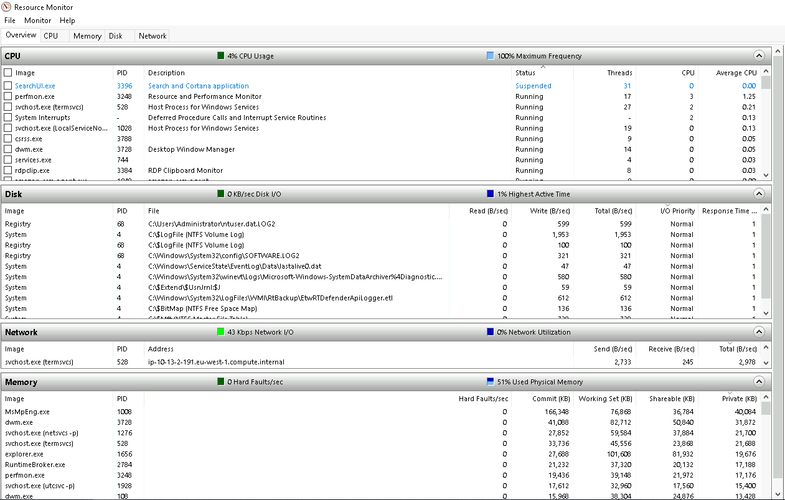

### CPU

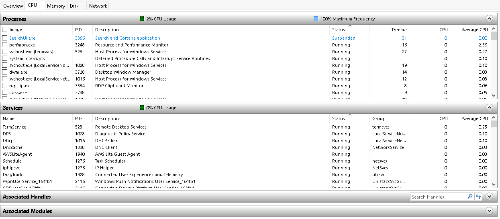

### Memory

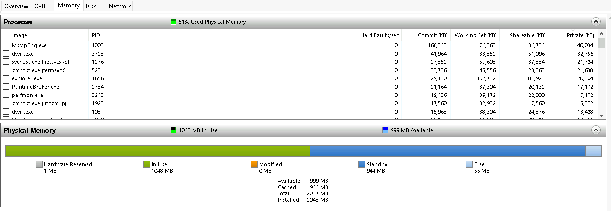

### Disk

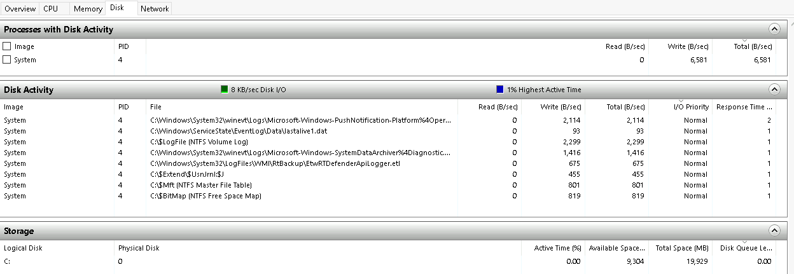

### Network

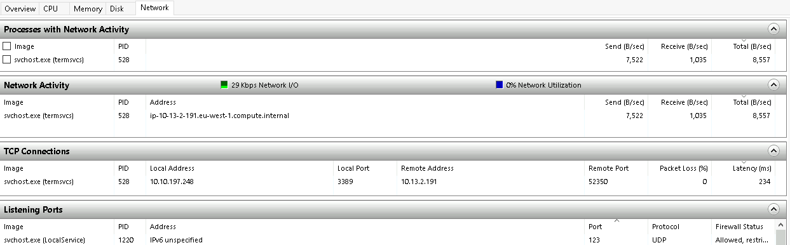

### Questions

1. What is the command to open Resource Monitor? (The answer is the name of the .exe file, not the full path) 

A: resmon.exe

## Command Prompt 

#cmd

- The command `hostname` will output the computer name.

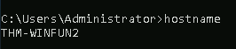

- The command `whoami` will output the name of the logged-in user.

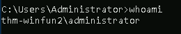

- A command used often is ipconfig. This command will show the network address settings for the computer.

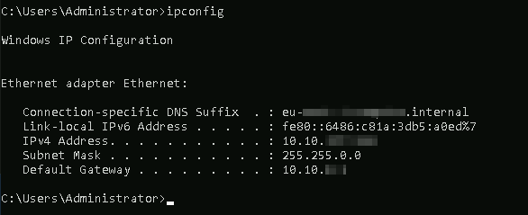

#important
- A  command to retrieve the help manual for a command is `/?`

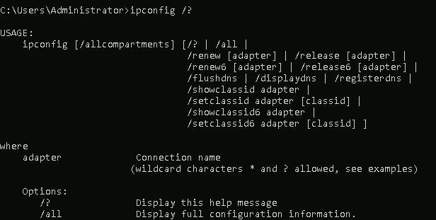

- Note: To clear the command prompt screen, the command is `cls`. 

- The next command is `netstat`. 

	- Per the help manual, this command will display protocol statistics and current TCP/IP network connections. 

- The `net` command is primarily used to manage network resources. 

	- This command supports sub-commands.

- If you type net without a sub-command, the output will show the syntax for the root command showing a few of the sub-commands you can use.

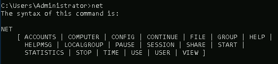

- For the net command, to display the help manual `/?` will not work. In this case, you need to use different syntax, which is `net help`.

- So, if you wish to see the help information for net user , the command is `net help user`. 

### Questions

1. In System Configuration, what is the full command for Internet Protocol Configuration?

A: C:\Windows\System32\cmd.exe /k %windir%\system32\ipconfig.exe

2. For the ipconfig command, how do you show detailed information?

A: ipconfig /all

## Registry Editor

#registry
- The Windows Registry (per Microsoft) is a central hierarchical database used to store information necessary to configure the system for one or more users, applications, and hardware devices.

- The registry contains information that Windows continually references during operation, such as:

    - Profiles for each user
    - Applications installed on the computer and the types of documents that each can create
    - Property sheet settings for folders and application icons
    - What hardware exists on the system
    - The ports that are being used.

#regedit
- There are various ways to view/edit the registry. One way is to use the **Registry Editor** **(regedit)**.

	- [More](https://docs.microsoft.com/en-us/troubleshoot/windows-server/performance/windows-registry-advanced-users) on Windows Registry

### Questions

1. What is the command to open the Registry Editor? (The answer is the name of  the .exe file, not the full path) 

A: regedt32.exe