# [Windows Fundamentals 3](https://tryhackme.com/room/windowsfundamentals3xzx)

## Windows Updates

- Updates are typically released on the 2nd Tuesday of each month. 

	- This day is called **Patch Tuesday**. 

- That doesn't necessarily mean that a critical update/patch has to wait for the next Patch Tuesday to be released. 

	- If the update is urgent, then Microsoft will push the update via the Windows Update service to the Windows devices.

- [More](https://msrc.microsoft.com/update-guide) on Windows Update

- Another way to access Windows Update is from the Run dialog box, or CMD, by running the command `control /name Microsoft.WindowsUpdate`.

- Throughout the years, Windows users have grown accustomed to pushing Windows Updates off to a later date or not installing the updates at all. 

- Microsoft notably addressed this issue with Windows 10. 

	- The updates can no longer be ignored or pushed to the side until forgotten. 

- Windows updates can only be postponed, but eventually, the update will happen, and your computer will reboot. 

	- Microsoft provides these updates to keep the device safe and secure. 

### Questions

1. There were two definition updates installed in the attached VM. On what date were these updates installed? 

A: 5/3/2021

## Windows Security

#windowssecurity

- Per Microsoft, "Windows Security is your home to manage the tools that protect your device and your data".

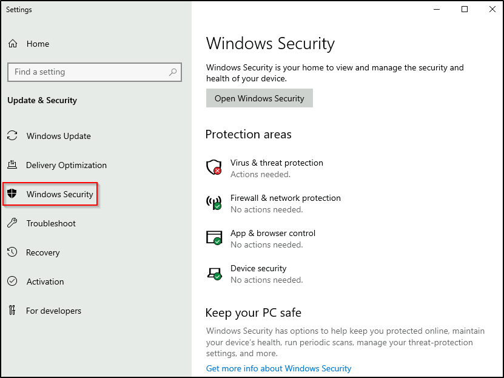

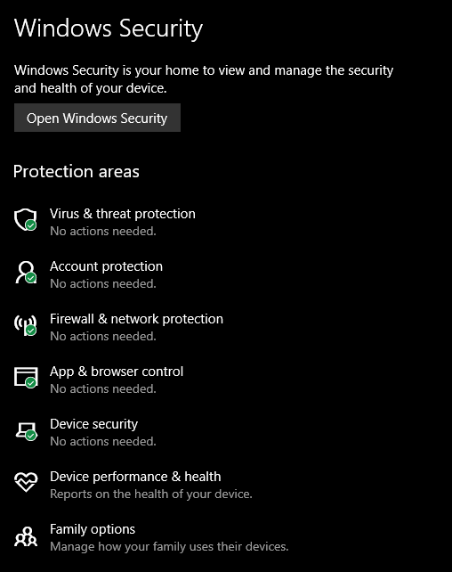

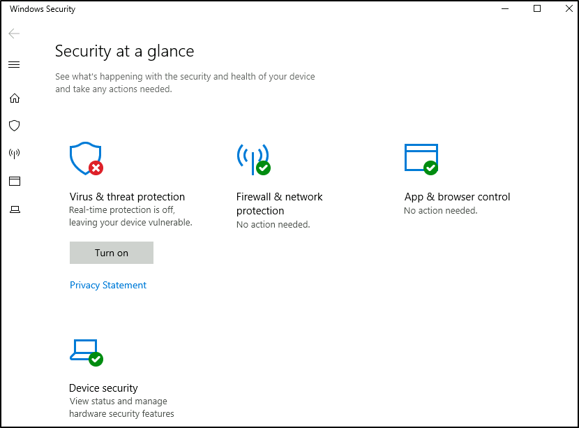

### Questions

1. In the above image, which area needs immediate attention? 

A: Virus & threat protection

## Virus & threat protection

- Virus & threat protection is divided into two parts:

    - Current threats
    - Virus & threat protection settings

The image below only focuses on Current threats. 

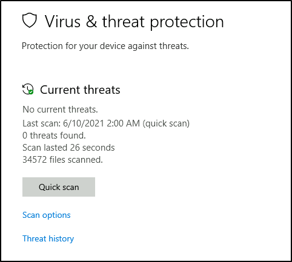

### Current threats

- Scan options

    - `Quick scan` - Checks folders in your system where threats are commonly found.
    - `Full scan` - Checks all files and running programs on your hard disk. This scan could take longer than one hour.
    - `Custom scan` - Choose which files and locations you want to check.

- Threat history

    - `Last scan` - Windows Defender Antivirus automatically scans your device for viruses and other threats to help keep it safe.
    - `Quarantined threats` - Quarantined threats have been isolated and prevented from running on your device. They will be periodically removed.
    - `Allowed threats` - Allowed threats are items identified as threats, which you allowed to run on your device. 

## Virus & threat protection settings

- Manage settings 

    - `Real-time protection` - Locates and stops malware from installing or running on your device.
    - `Cloud-delivered protection` - Provides increased and faster protection with access to the latest protection data in the cloud.
    - `Automatic sample submission` - Send sample files to Microsoft to help protect you and others from potential threats. 
    - `Controlled folder access` - Protect files, folders, and memory areas on your device from unauthorized changes by unfriendly applications.
    - `Exclusions` - Windows Defender Antivirus won't scan items that you've excluded.
    - `Notifications` - Windows Defender Antivirus will send notifications with critical information about the health and security of your device. 
 
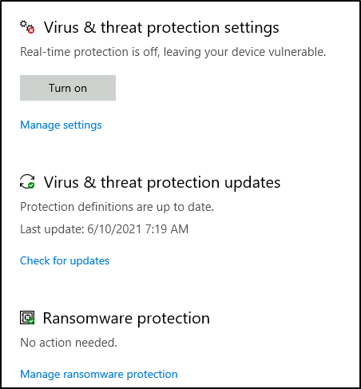

- Tip: You can perform on-demand scans on any file/folder by right-clicking the item and selecting 'Scan with Microsoft Defender'.

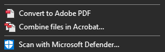

### Questions

1. Specifically, what is turned off that Windows is notifying you to turn on? 

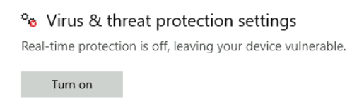

A: Real-time Protection

## Firewall & network protection

#firewall

>Per Microsoft, "Traffic flows into and out of devices via what we call ports. A **firewall** is what controls what is - and more importantly isn't - allowed to pass through those ports. You can think of it like a security guard standing at the door, checking the ID of everything that tries to enter or exit".

- The below image will reflect what you will see when you navigate to Firewall & network protection.

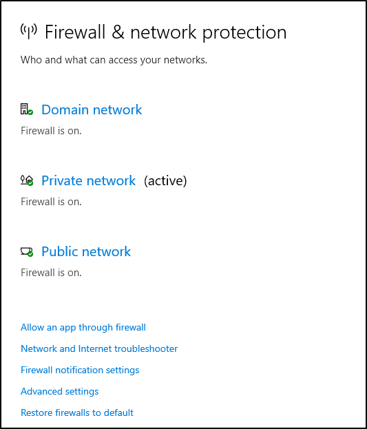

- Per Microsoft, "Windows Firewall offers three firewall profiles: domain, private and public".

    - **Domain** - The domain profile applies to networks where the host system can authenticate to a domain controller. 
    
    - **Private** - The private profile is a user-assigned profile and is used to designate private or home networks.
    
    - **Public** - The default profile is the public profile, used to designate public networks such as Wi-Fi hotspots at coffee shops, airports, and other locations.

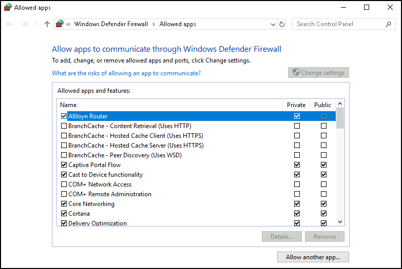

- [Documentation on Windows Firewall](https://docs.microsoft.com/en-us/windows/security/threat-protection/windows-firewall/best-practices-configuring)

- Tip: Command to open the Windows Defender Firewall is `WF.msc`. 

### Questions

1. If you were connected to airport Wi-Fi, what most likely will be the active firewall profile? 

A: public network

## App & browser control

> Per Microsoft, "Microsoft Defender SmartScreen protects against phishing or malware websites and applications, and the downloading of potentially malicious files".

- [More on Microsoft Defender SmartScreen](https://docs.microsoft.com/en-us/windows/security/threat-protection/microsoft-defender-smartscreen/microsoft-defender-smartscreen-overview)

## Device security

### Core isolation

- `Memory Integrity` - Prevents attacks from inserting malicious code into high-security processes.

### Security processor

#tpm

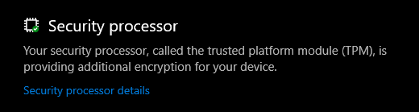

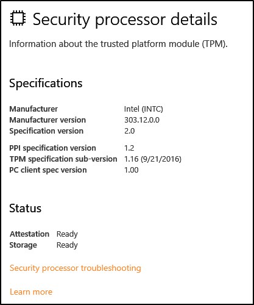

>Per Microsoft, "Trusted Platform Module (TPM) technology is designed to provide hardware-based, security-related functions. A TPM chip is a secure crypto-processor that is designed to carry out cryptographic operations. The chip includes multiple physical security mechanisms to make it tamper-resistant, and malicious software is unable to tamper with the security functions of the TPM".

### Questions

1. What is the TPM? 

A: Trusted Platform Module

## BitLocker

#bitlocker

> Per Microsoft, "BitLocker Drive Encryption is a data protection feature that integrates with the operating system and addresses the threats of data theft or exposure from lost, stolen, or inappropriately decommissioned computers".

- On devices with TPM installed, BitLocker offers the *best protection*.

> Per Microsoft, "BitLocker provides the most protection when used with a Trusted Platform Module (TPM) version 1.2 or later. The TPM is a hardware component installed in many newer computers by the computer manufacturers. It works with BitLocker to help protect user data and to ensure that a computer has not been tampered with while the system was offline".

- [More on Bitlocker](https://docs.microsoft.com/en-us/windows/security/information-protection/bitlocker/bitlocker-overview)

## Questions

1.  What must a user insert on computers that DO NOT have a TPM version 1.2 or later? 

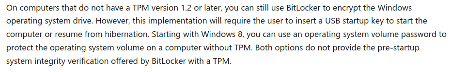

A: USB Startup Key

## Volume Shadow Copy Service

#vss

- Per Microsoft, the **Volume Shadow Copy Service (VSS)** coordinates the required actions to create a consistent shadow copy (also known as a *snapshot* or a *point-in-time copy*) of the data that is to be backed up. 

- Volume Shadow Copies are stored on the *System Volume Information* folder on each drive that has protection enabled.

- If VSS is enabled (**System Protection** turned on), you can perform the following tasks from within advanced system settings. 

    - Create a restore point
    - Perform system restore
    - Configure restore settings
    - Delete restore points

- From a security perspective, malware writers know of this Windows feature and write code in their malware to look for these files and delete them. 

	- Doing so makes it impossible to recover from a ransomware attack unless you have an offline/off-site backup.

- Configuring VSS: 

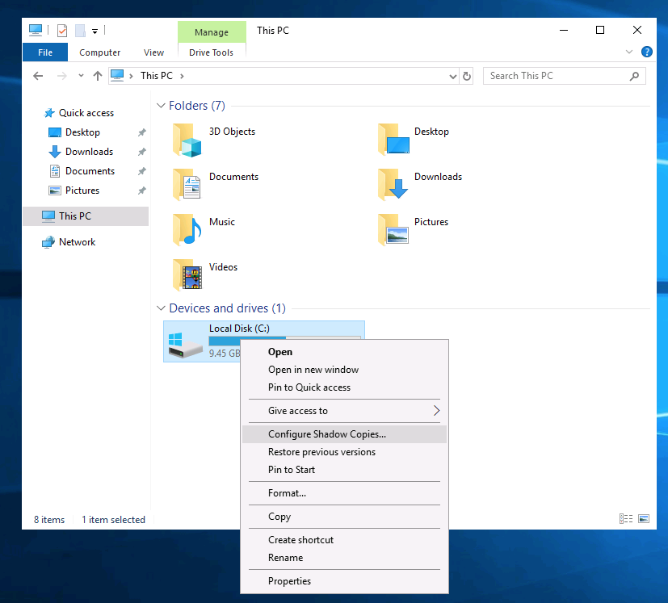

## Questions

1. What is VSS? 

A: Volum Shadow Copy Service

- Note: Attackers use built-in Windows tools and utilities in an attempt to go undetected within the victim environment.  
	- This tactic is known as **Living Off The Land**. Refer to the following resource [here](https://lolbas-project.github.io/) to learn more about this. 

- Further reading material:

    - [Antimalware Scan Interface](https://docs.microsoft.com/en-us/windows/win32/amsi/antimalware-scan-interface-portal)
    - [Credential Guard](https://docs.microsoft.com/en-us/windows/security/identity-protection/credential-guard/credential-guard-manage)
    - [Windows 10 Hello](https://support.microsoft.com/en-us/windows/learn-about-windows-hello-and-set-it-up-dae28983-8242-bb2a-d3d1-87c9d265a5f0#:~:text=Windows%2010,in%20with%20just%20your%20PIN.)
    - [CSO Online - The best new Windows 10 security features](https://www.csoonline.com/article/3253899/the-best-new-windows-10-security-features.html)