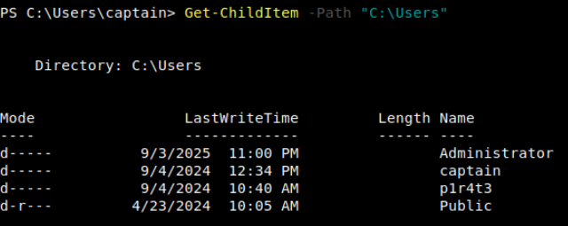
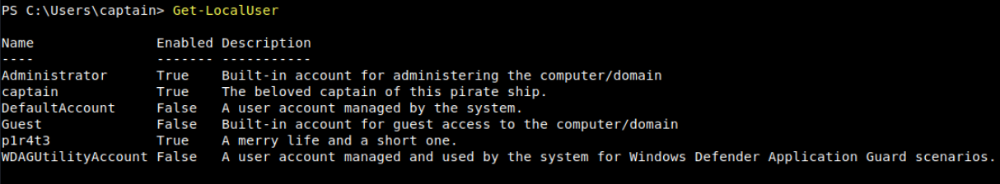
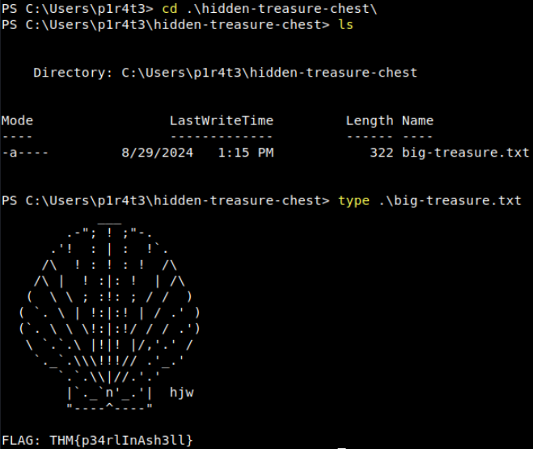
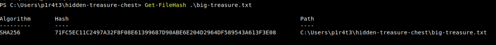

# Windows Powershell

## What is PoweShell

PowerShell is a powerful tool from Microsoft designed for task automation and configuration management. It combines a command-line interface and a scripting language built on the .NET framework. Unlike older text-based command-line tools, PowerShell is object-oriented, which means it can handle complex data types and interact with system components more effectively. Initially exclusive to Windows, PowerShell has lately expanded to support macOS and Linux, making it a versatile option for IT professionals across different operating systems.

In the early 2000s, as Windows was increasingly used in complex enterprise environments, traditional tools like `cmd.exe` and batch files fell short in automating and managing these systems. Microsoft needed a tool that could handle more sophisticated administrative tasks and interact with Windows’ modern APIs.

To fully grasp the power of PowerShell, we first need to understand what an **object** is in this context.

In programming, an **object** represents an item with **properties** (characteristics) and **methods** (actions). For example, a `car` object might have properties like `Color`, `Model`, and `FuelLevel`, and methods like `Drive()`, `HonkHorn()`, and `Refuel()`.

Similarly, in PowerShell, objects are fundamental units that encapsulate data and functionality, making it easier to manage and manipulate information. An object in PowerShell can contain file names, usernames or sizes as data (**properties**), and carry functions (**methods**) such as copying a file or stopping a process.

The traditional Command Shell’s basic commands are text-based, meaning they process and output data as plain text. Instead, when a **cmdlet** (pronounced _command-let_) is run in PowerShell, it returns objects that retain their properties and methods. This allows for more powerful and flexible data manipulation since these objects do not require additional parsing of text.

### Questions

What do we call the advanced approach used to develop PowerShell?

A: `object-oriented`

## PowerShell Basics

 If you are working on a Windows system from the graphical interface (GUI), these are some of the possible ways to launch it:

- **Start Menu**: Type `powershell` in the Windows Start Menu search bar, then click on `Windows PowerShell` or `PowerShell` from the results.
- **Run Dialog**: Press `Win + R` to open the `Run` dialog, type `powershell`, and hit `Enter`.
- **File Explorer**: Navigate to any folder, then type `powershell` in the address bar, and press `Enter`. This opens PowerShell in that specific directory.
- **Task Manager**: Open the Task Manager, go to `File > Run new task`, type `powershell`, and press `Enter`.

Alternatively, PowerShell can be launched from a Command Prompt (`cmd.exe`) by typing `powershell`, and pressing `Enter`.

Cmdlets follow a consistent `Verb-Noun` naming convention. This structure makes it easy to understand what each cmdlet does. The `Verb` describes the action, and the `Noun` specifies the object on which action is performed. For example:

- `Get-Content`: Retrieves (gets) the content of a file and displays it in the console.
- `Set-Location`: Changes (sets) the current working directory.

To list all available cmdlets, functions, aliases, and scripts that can be executed in the current PowerShell session, we can use `Get-Command`. It’s an essential tool for discovering what commands one can use.

 if we want to display only the available commands of type “function”, we can use `-CommandType "Function"`

Another essential cmdlet to keep in our tool belt is `Get-Help`: it provides detailed information about cmdlets, including usage, parameters, and examples.

As shown in the results above, `Get-Help` informs us that we can retrieve other useful information about a cmdlet by appending some options to the basic syntax. For example, by appending `-examples` to the command displayed above, we will be shown a list of common ways in which the chosen cmdlet can be used.

To make the transition easier for IT professionals, PowerShell includes aliases —which are shortcuts or alternative names for cmdlets— for many traditional Windows commands. Indispensable for users already familiar with other command-line tools, `Get-Alias` lists all aliases available. For example, `dir` is an alias for `Get-ChildItem`, and `cd` is an alias for `Set-Location`.

Another powerful feature of PowerShell is the possibility of extending its functionality by downloading additional cmdlets from online repositories.

To search for modules (collections of cmdlets) in online repositories like the PowerShell Gallery, we can use `Find-Module`. Sometimes, if we don’t know the exact name of the module, it can be useful to search for modules with a similar name. We can achieve this by filtering the `Name` property and appending a wildcard (`*`) to the module’s partial name, using the following standard PowerShell syntax: `Cmdlet -Property "pattern*"`.

Once identified, the modules can be downloaded and installed from the repository with `Install-Module`, making new cmdlets contained in the module available for use.
### Questions

How would you retrieve a list of commands that **start with** the verb `Remove`? \[for the sake of this question, avoid the use of quotes (" or ') in your answer\]

A: `Get-Command -Name Remove*`

What cmdlet has its traditional counterpart `echo` as an alias?

Do a `Get-Alias` in the terminal.

A: `Write-Output`

What is the command to retrieve some example usage for the cmdlet `New-LocalUser`?

A: `Get-Help New-LocalUser -examples`

## Navigating the File System and Working with Files

Similar to the `dir` command in Command Prompt (or `ls` in Unix-like systems), `Get-ChildItem` lists the files and directories in a location specified with the `-Path` parameter. It can be used to explore directories and view their contents. If no `Path` is specified, the cmdlet will display the content of the current working directory.

To navigate to a different directory, we can use the `Set-Location` cmdlet.

```powershell
Set-Location -Path ".\Documents"
```

While the traditional Windows CLI uses separate commands to create and manage different items like directories and files, PowerShell simplifies this process by providing a single set of cmdlets to handle the creation and management of both files and directories.

To create an item in PowerShell, we can use `New-Item`. We will need to specify the path of the item and its type (whether it is a file or a directory).

```powershell
New-Item -Path ".\captain-cabin\captain-wardrobe" -ItemType "Directory"
New-Item -Path ".\captain-cabin\captain-wardrobe\captain-boots.txt" -ItemType "File"
```

Similarly, the `Remove-Item` cmdlet removes both directories and files, whereas in Windows CLI we have separate commands `rmdir` and `del`.

```powershell
Remove-Item -Path ".\captain-cabin\captain-wardrobe\captain-boots.txt"
Remove-Item -Path ".\captain-cabin\captain-wardrobe"
```

We can copy or move files and directories alike, using respectively `Copy-Item` (equivalent to `copy`) and `Move-Item` (equivalent to `move`).

```powershell
Copy-Item -Path .\captain-cabin\captain-hat.txt -Destination .\captain-cabin\captain-hat2.txt
```

Finally, to read and display the contents of a file, we can use the `Get-Content` cmdlet, which works similarly to the `type` command in Command Prompt (or `cat` in Unix-like systems).

```powershell
Get-Content -Path ".\captain-hat.txt"
```


### Questions

What cmdlet can you use instead of the traditional Windows command `type`?

A: `Get-Content`

What PowerShell command would you use to display the content of the "C:\Users" directory? [for the sake of this question, avoid the use of quotes (" or ') in your answer]

A: ` Get-ChildItem -Path C:\Users`

How many items are displayed by the command described in the previous question?



A: `4`

## Piping, Filtering, and Sorting Data

In PowerShell, piping is even more powerful because it passes **objects** rather than just text. These objects carry not only the data but also the properties and methods that describe and interact with the data.

For example, if you want to get a list of files in a directory and then sort them by size, you could use the following command in PowerShell:

```powershell
Get-ChildItem | Sort-Object Length
```

To filter objects based on specified conditions, returning only those that meet the criteria, we can use the `Where-Object` cmdlet. For instance, to list only `.txt` files in a directory, we can use:

```powershell
Get-ChildItem | Where-Object -Property "Extension" -eq ".txt"
```

The operator `-eq` (i.e. "**equal to**") is part of a set of **comparison operators** that are shared with other scripting languages (e.g. Bash, Python). To show the potentiality of the PowerShell's filtering, we have selected some of the most useful operators from that list:

- `-ne`: "**not equal**". This operator can be used to exclude objects from the results based on specified criteria.
- `-gt`: "**greater than**". This operator will filter only objects which exceed a specified value. It is important to note that this is a strict comparison, meaning that objects that are equal to the specified value will be excluded from the results.
- `-ge`: "**greater than or equal to**". This is the non-strict version of the previous operator. A combination of `-gt` and `-eq`.
- `-lt`: "**less than**". Like its counterpart, "greater than", this is a strict operator. It will include only objects which are strictly below a certain value.
- `-le`: "**less than or equal to**". Just like its counterpart `-ge`, this is the non-strict version of the previous operator. A combination of `-lt` and `-eq`.

```powershell
Get-ChildItem | Where-Object -Property "Name" -like "ship*"
```

The next filtering cmdlet, `Select-Object`, is used to select specific properties from objects or limit the number of objects returned. It’s useful for refining the output to show only the details one needs.

```powershell
Get-ChildItem | Select-Object Name,Length
```

The last in this set of filtering cmdlets is `Select-String`. This cmdlet searches for text patterns within files, similar to `grep` in Unix-based systems or `findstr` in Windows Command Prompt. It’s commonly used for finding specific content within log files or documents.

```powershell
Select-String -Path ".\captain-hat.txt" -Pattern "hat"
```

### Questions

How would you retrieve the items in the current directory with size greater than 100? \[for the sake of this question, avoid the use of quotes (" or ') in your answer\]

A: `Get-ChildItem | Where-Object -Property Length -gt 100`


## System and Network Information

The `Get-ComputerInfo` cmdlet retrieves comprehensive system information, including operating system information, hardware specifications, BIOS details, and more. It provides a snapshot of the entire system configuration in a single command. Its traditional counterpart `systeminfo` retrieves only a small set of the same details.

Essential for managing user accounts and understanding the machine’s security configuration, `Get-LocalUser` lists all the local user accounts on the system. The default output displays, for each user, username, account status, and description.

Similar to the traditional `ipconfig` command, the following two cmdlets can be used to retrieve detailed information about the system’s network configuration.

`Get-NetIPConfiguration` provides detailed information about the network interfaces on the system, including IP addresses, DNS servers, and gateway configurations.

In case we need specific details about the IP addresses assigned to the network interfaces, the `Get-NetIPAddress` cmdlet will show details for all IP addresses configured on the system, including those that are not currently active.

### Questions

Other than your current user and the default "Administrator" account, what other user is enabled on the target machine?



A: `p1r4t3`

This lad has hidden his account among the others with no regard for our beloved captain! What is the motto he has so bluntly put as his account's description?

A: `A merry life and a short one.`

Now a small challenge to put it all together. This shady lad that we just found hidden among the local users has his own home folder in the "C:\Users" directory.   
Can you navigate the filesystem and find the hidden treasure inside this pirate's home?



A: `THM{p34rlInAsh3ll}`

## Real-Time System Analysis

`Get-Process` provides a detailed view of all currently running processes, including CPU and memory usage, making it a powerful tool for monitoring and troubleshooting.

Similarly, `Get-Service` allows the retrieval of information about the status of services on the machine, such as which services are running, stopped, or paused. It is used extensively in troubleshooting by system administrators, but also by forensics analysts hunting for anomalous services installed on the system.

To monitor active network connections, `Get-NetTCPConnection` displays current TCP connections, giving insights into both local and remote endpoints. This cmdlet is particularly handy during an incident response or malware analysis task, as it can uncover hidden backdoors or established connections towards an attacker-controlled server.

Additionally, we are going to mention `Get-FileHash` as a useful cmdlet for generating file hashes, which is particularly valuable in incident response, threat hunting, and malware analysis, as it helps verify file integrity and detect potential tampering.

```powershell
Get-FileHash -Path .\ship-flag.txt
```


### Questions

In the previous task, you found a marvellous treasure carefully hidden in the target machine. What is the hash of the file that contains it?



A: `71FC5EC11C2497A32F8F08E61399687D90ABE6E204D2964DF589543A613F3E08`

What property retrieved by default by `Get-NetTCPConnection` contains information about the process that has started the connection?

A: `OwningProcess`

It's time for another small challenge. Some vital service has been installed on this pirate ship to guarantee that the captain can always navigate safely. But something isn't working as expected, and the captain wonders why. Investigating, they find out the truth, at last: the service has been tampered with! The shady lad from before has modified the service `DisplayName` to reflect his very own motto, the same that he put in his user description.

With this information and the PowerShell knowledge you have built so far, can you find the service name?

Searching in the output of the command `Get-Service` for something peculiar:


A: `p1r4t3-s-compass`

## Scripting

Simply speaking, scripting is like giving a computer a to-do list, where each line in the script is a task that the computer will carry out automatically. This saves time, reduces the chance of errors, and allows to perform tasks that are too complex or tedious to do manually. 

Learning scripting with PowerShell goes beyond the scope of this room. Nonetheless, we must understand that its power makes it a crucial skill across all cyber security roles.

- For **blue team** professionals such as incident responders, malware analysts, and threat hunters, PowerShell scripts can automate many different tasks, including log analysis, detecting anomalies, and extracting indicators of compromise (IOCs). These scripts can also be used to reverse-engineer malicious code (malware) or automate the scanning of systems for signs of intrusion.
    
- For the **red team**, including penetration testers and ethical hackers, PowerShell scripts can automate tasks like system enumeration, executing remote commands, and crafting obfuscated scripts to bypass defences. Its deep integration with all types of systems makes it a powerful tool for simulating attacks and testing systems’ resilience against real-world threats.
    
- Staying in the context of cyber security, **system administrators** benefit from PowerShell scripting for automating integrity checks, managing system configurations, and securing networks, especially in remote or large-scale environments. PowerShell scripts can be designed to enforce security policies, monitor systems health, and respond automatically to security incidents, thus enhancing the overall security posture.
    

Whether used defensively or offensively, PowerShell scripting is an essential capability in the cyber security toolkit.

Before concluding this task about scripting, we can’t go without mentioning the `Invoke-Command` cmdlet.

`Invoke-Command` is essential for executing commands on remote systems, making it fundamental for system administrators, security engineers and penetration testers. `Invoke-Command` enables efficient remote management and—combining it with scripting—automation of tasks across multiple machines. It can also be used to execute payloads or commands on target systems during an engagement by penetration testers—or attackers alike.

Examples:

```powershell
# ------------- Example 1: Run a script on a server -------------
Invoke-Command -FilePath c:\scripts\test.ps1 -ComputerName Server01
# --------- Example 2: Run a command on a remote server ---------
Invoke-Command -ComputerName Server01 -Credential Domain01\User01 -ScriptBlock { Get-Culture }
```

### Questions

What is the syntax to execute the command `Get-Service` on a remote computer named "RoyalFortune"? Assume you don't need to provide credentials to establish the connection. \[for the sake of this question, avoid the use of quotes (" or ') in your answer\]

A: `Invoke-Command -ComputerName RoyalFortune -ScriptBlock { Get-Service }`

