# [Wireshark - The Basics](https://tryhackme.com/room/wiresharkthebasics)

## Tool Overview

There are multiple purposes for its use:

- Detecting and troubleshooting network problems, such as network load failure points and congestion.
- Detecting security anomalies, such as rogue hosts, abnormal port usage, and suspicious traffic.
- Investigating and learning protocol details, such as response codes and payload data.

Wireshark has two types of packet colouring methods: temporary rules that are only available during a program session and permanent rules that are saved under the preference file (profile) and available for the next program session. You can use the "right-click menu" or **"View --> Coloring Rules"** menu to create permanent colouring rules. The **"Colourise Packet List"** menu activates/deactivates the colouring rules. Temporary packet colouring is done with the "right-click menu" or **"View --> Conversation Filter"** menu

Knowing the file details is helpful. Especially when working with multiple pcap files, sometimes you will need to know and recall the file details (File hash, capture time, capture file comments, interface and statistics) to identify the file, classify and prioritise it. You can view the details by following "**Statistics --> Capture File Properties"** or by clicking the **"pcap icon located on the left bottom"**.

### Questions

Q: Read the **"capture file comments"**. What is the flag?

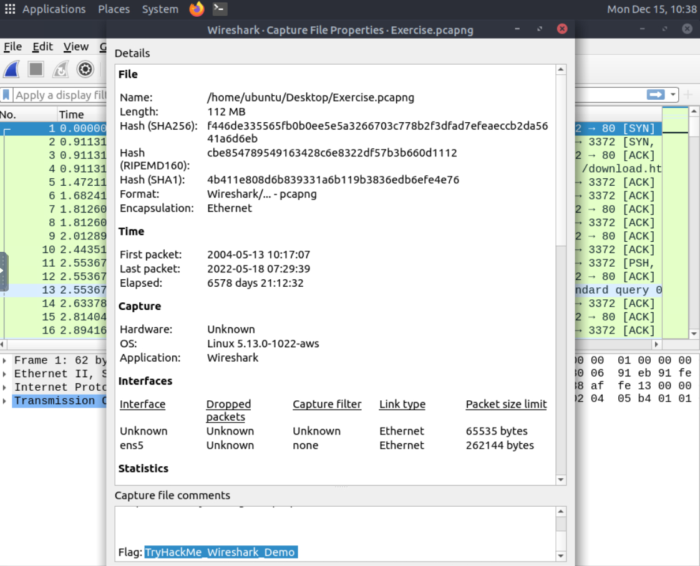

A: `TryHackMe_Wireshark_Demo`

Q: What is the total number of packets?

Check out the details of the capture.

A: `58620`

Q: What is the **SHA256 hash** value of the capture file?

A: `f446de335565fb0b0ee5e5a3266703c778b2f3dfad7efeaeccb2da5641a6d6eb`

## Packet Dissection

Packet dissection is also known as protocol dissection, which investigates packet details by decoding available protocols and fields. Wireshark supports a long list of protocols for dissection, and you can also write your dissection scripts. You can find more details on dissection [**here**](https://github.com/boundary/wireshark/blob/master/doc/README.dissector).

Packets consist of 5 to 7 layers based on the OSI model.

**The Frame (Layer 1):**This will show you what frame/packet you are looking at and details specific to the Physical layer of the OSI model.

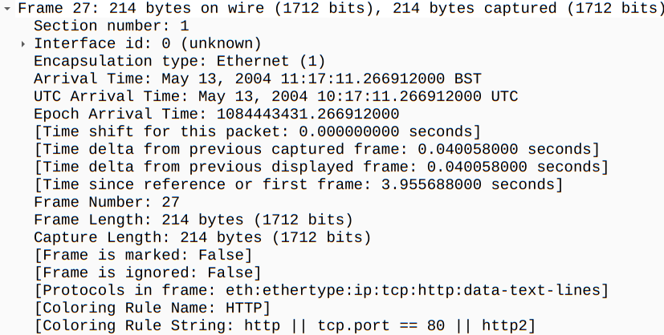

**Source [MAC] (Layer 2):**This will show you the source and destination MAC Addresses; from the Data Link layer of the OSI model.

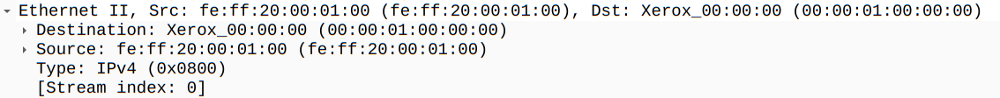

**Source [IP] (Layer 3):**This will show you the source and destination IPv4 Addresses; from the Network layer of the OSI model.

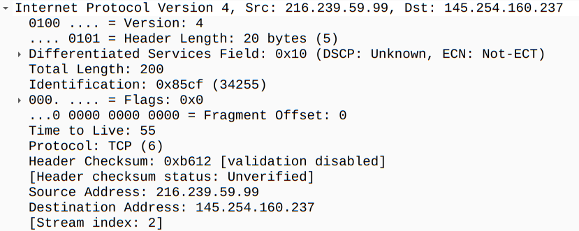 

**Protocol (Layer 4):**This will show you details of the protocol used (UDP/TCP) and source and destination ports; from the Transport layer of the OSI model.

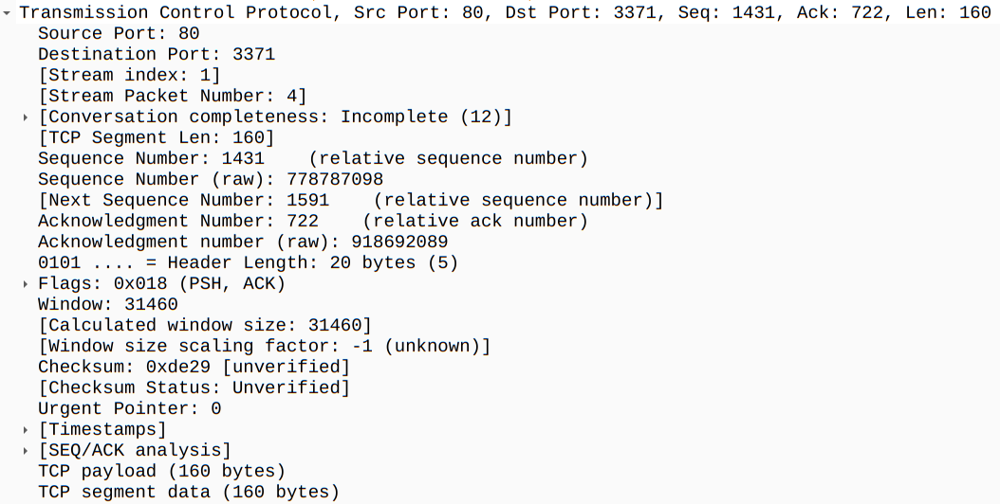

**Protocol Errors:**This continuation of the 4th layer shows specific segments from TCP that needed to be reassembled.

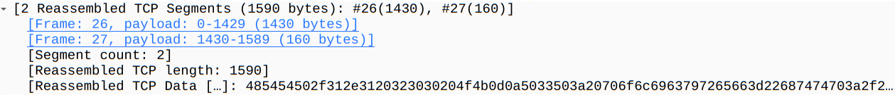

**Application Protocol (Layer 5):**This will show details specific to the protocol used, such as HTTP, FTP,  and SMB. From the Application layer of the OSI model.

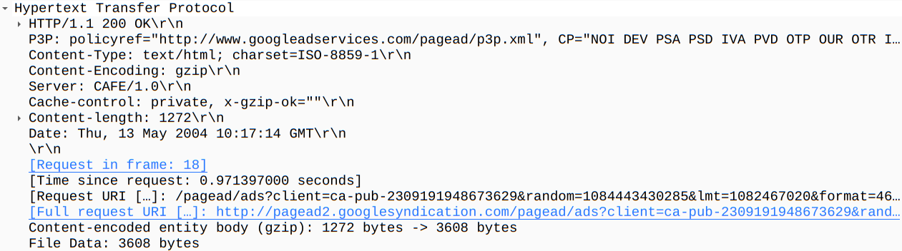

**Application Data:** This extension of the 5th layer can show the application-specific data.

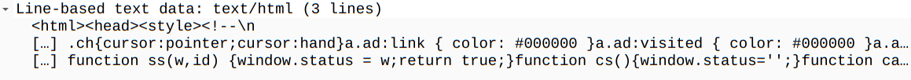

### Questions

Q: Use the "Exercise.pcapng" file to answer the questions. **View packet number 38.** Which markup language is used under the HTTP protocol?

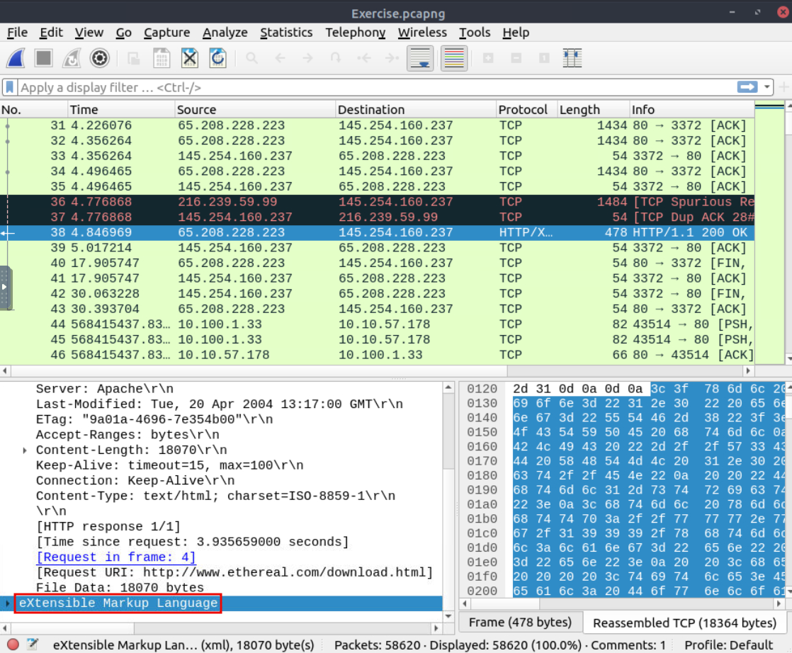

A: `eXtensible Markup Language`

Q: What is the arrival date of the packet? (Answer format: Month/Day/Year)

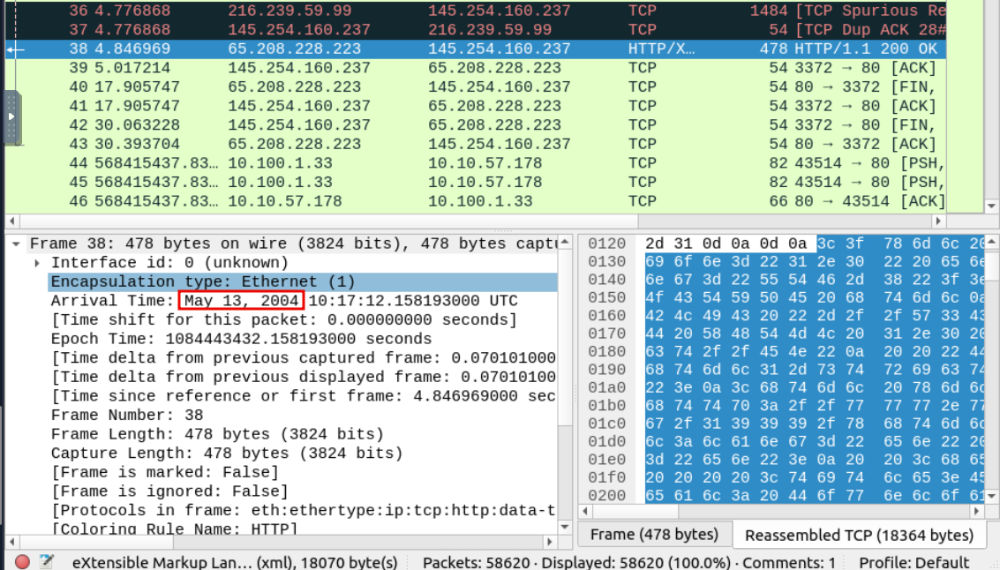

A: `05/13/2004`

Q: What is the TTL value?

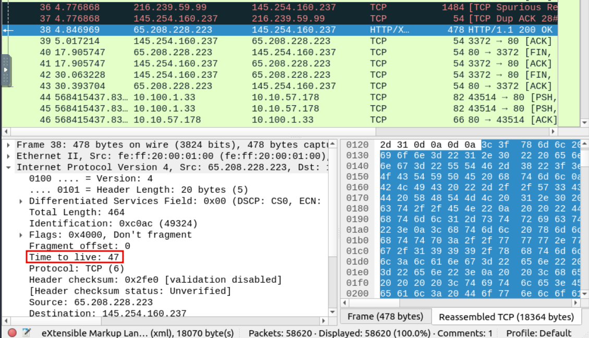

A: `47`

Q: What is the TCP payload size?

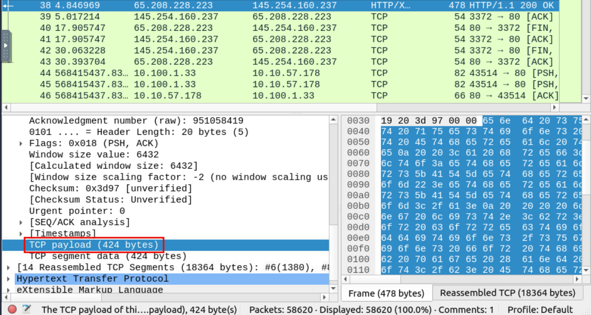

A: `424`

Q: What is the e-tag value?  
(For example: 82ecb-6321-9e904585)

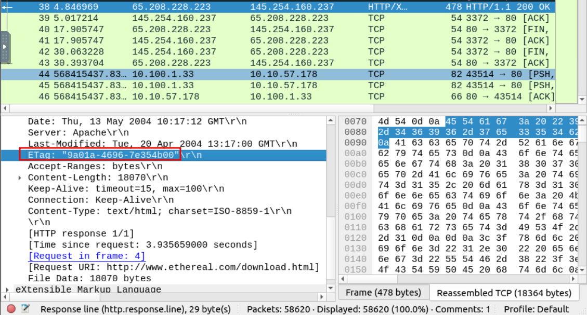

A: `9a01a-4696-7e354b00`

## Packet Navigation

Packet numbers do not only help to count the total number of packets or make it easier to find/investigate specific packets. This feature not only navigates between packets up and down; it also provides in-frame packet tracking and finds the next packet in the particular part of the conversation. You can use the **"Go"** menu and toolbar to view specific packets.

Apart from packet number, Wireshark can find packets by packet content. You can use the **"Edit --> Find Packet"** menu to make a search inside the packets for a particular event of interest. This helps analysts and administrators to find specific intrusion patterns or failure traces.

There are two crucial points in finding packets. The first is knowing the input type. This functionality accepts four types of inputs (Display filter, Hex, String and Regex). String and regex searches are the most commonly used search types. Searches are case insensitive, but you can set the case sensitivity in your search by clicking the radio button.

The second point is choosing the search field. You can conduct searches in the three panes (packet list, packet details, and packet bytes), and it is important to know the available information in each pane to find the event of interest. For example, if you try to find the information available in the packet details pane and conduct the search in the packet list pane, Wireshark won't find it even if it exists.

Apart from packet number, Wireshark can find packets by packet content. You can use the **"Edit --> Find Packet"** menu to make a search inside the packets for a particular event of interest. This helps analysts and administrators to find specific intrusion patterns or failure traces.

There are two crucial points in finding packets. The first is knowing the input type. This functionality accepts four types of inputs (Display filter, Hex, String and Regex). String and regex searches are the most commonly used search types. Searches are case insensitive, but you can set the case sensitivity in your search by clicking the radio button.

The second point is choosing the search field. You can conduct searches in the three panes (packet list, packet details, and packet bytes), and it is important to know the available information in each pane to find the event of interest. For example, if you try to find the information available in the packet details pane and conduct the search in the packet list pane, Wireshark won't find it even if it exists.

Similar to packet marking, commenting is another helpful feature for analysts. You can add comments for particular packets that will help the further investigation or remind and point out important/suspicious points for other layer analysts. Unlike packet marking, the comments can stay within the capture file until the operator removes them.

Capture files can contain thousands of packets in a single file. As mentioned earlier, Wireshark is not an IDS, so sometimes, it is necessary to separate specific packages from the file and dig deeper to resolve an incident. This functionality helps analysts share the only suspicious packages (decided scope). Thus redundant information is not included in the analysis process. You can use the **"File"** menu to export packets.

Wireshark can extract files transferred through the wire. For a security analyst, it is vital to discover shared files and save them for further investigation. Exporting objects are available only for selected protocol's streams (DICOM, HTTP, IMF, SMB and TFTP).

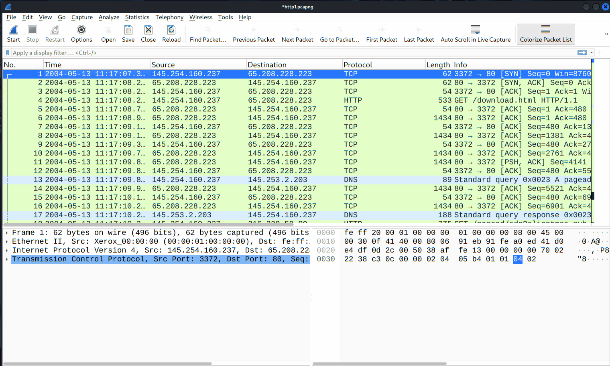

Wireshark lists the packets as they are captured, so investigating the default flow is not always the best option. By default, Wireshark shows the time in "Seconds Since Beginning of Capture", the common usage is using the UTC Time Display Format for a better view. You can use the **"View --> Time Display Format"** menu to change the time display format.

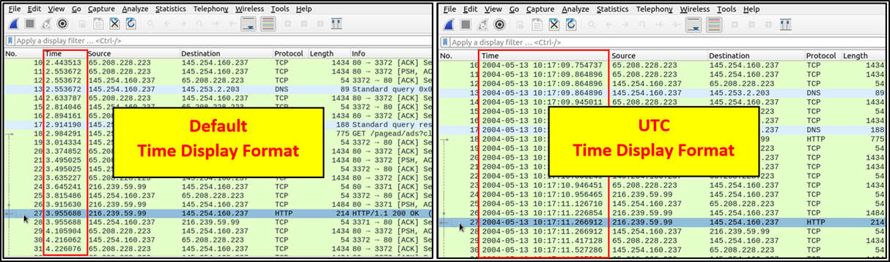

Wireshark also detects specific states of protocols to help analysts easily spot possible anomalies and problems. Note that these are only suggestions, and there is always a chance of having false positives/negatives. Expert info can provide a group of categories in three different severities. Details are shown in the table below.

|   |   |   |
|---|---|---|
|**Severity**|**Colour**|**Info**|
|**Chat**|**Blue**|Information on usual workflow.|
|**Note**|**Cyan**|Notable events like application error codes.|
|**Warn**|**Yellow**|Warnings like unusual error codes or problem statements.|
|**Error**|**Red**|Problems like malformed packets.|

Frequently encountered information groups are listed in the table below. You can refer to [Wireshark's official documentation](https://www.wireshark.org/docs/) for more information on the expert information entries.

|   |   |   |   |
|---|---|---|---|
|**Group**|**Info**|**Group**|**Info**|
|**Checksum**|Checksum errors|**Deprecated**|Deprecated protocol usage|
|**Comment**|Packet comment detection|**Malformed**|Malformed packet detection|

You can use the **"lower left bottom section"** in the status bar or **"Analyse --> Expert Information"** menu to view all available information entries via a dialogue box. It will show the packet number, summary, group protocol and total occurrence.

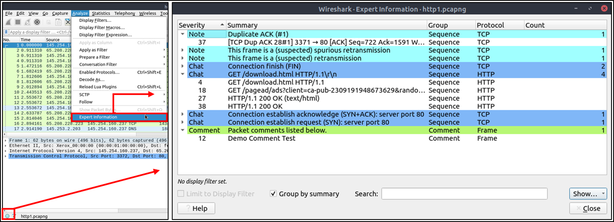

### Questions

Q: Use the "Exercise.pcapng" file to answer the questions. Search the **"r4w" string** in packet details. What is the name of artist 1?

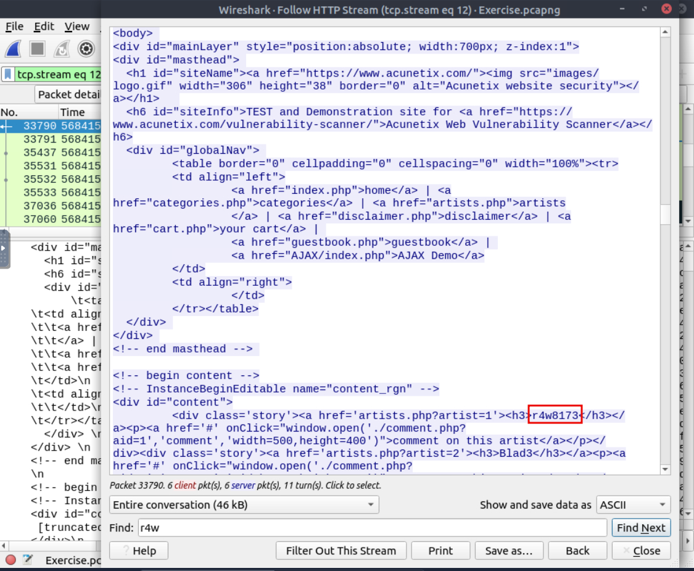

A: `r4w8173`

Q: **Go to packet 12** and read the packet comments. What is the answer?  
Note: use `**md5sum <filename>**` terminal command to get MD5 hash

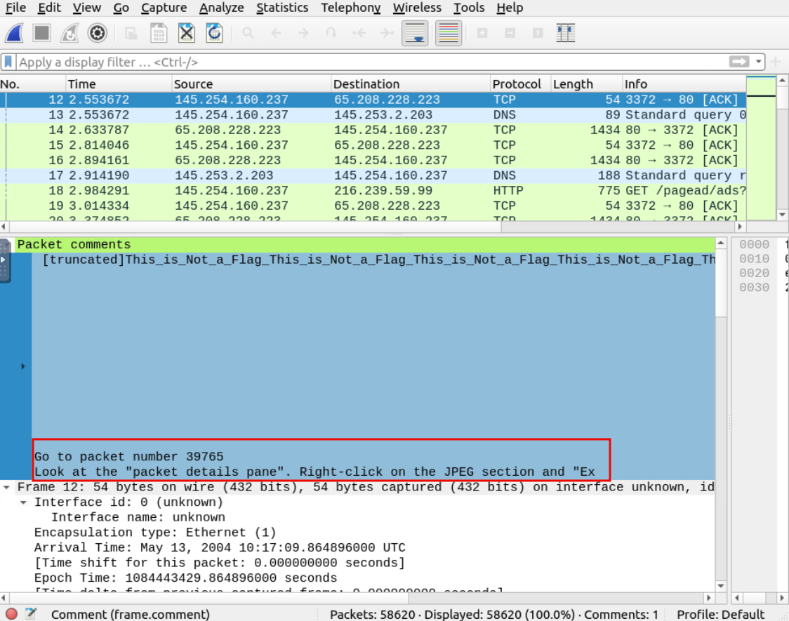

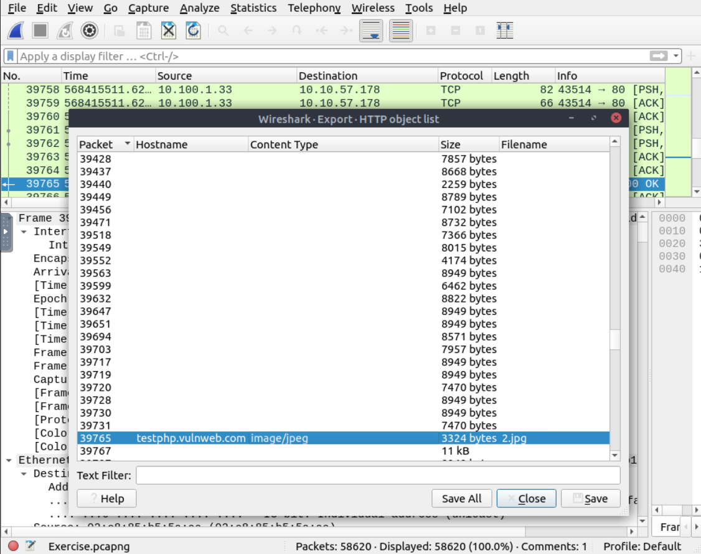

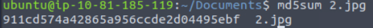

A: `911cd574a42865a956ccde2d04495ebf`

Q: There is a **".txt"** file inside the capture file. Find the file and read it; what is the alien's name?

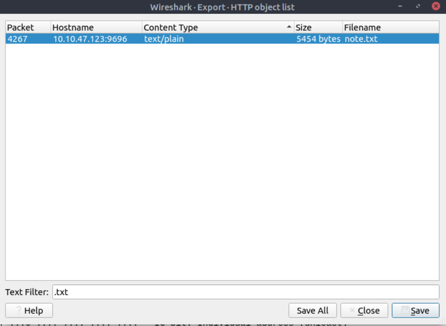

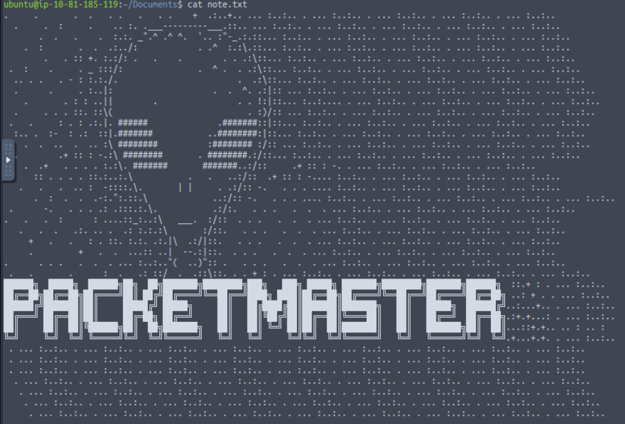

A: `packetmaster`

Q: Look at the expert info section. What is the number of warnings?

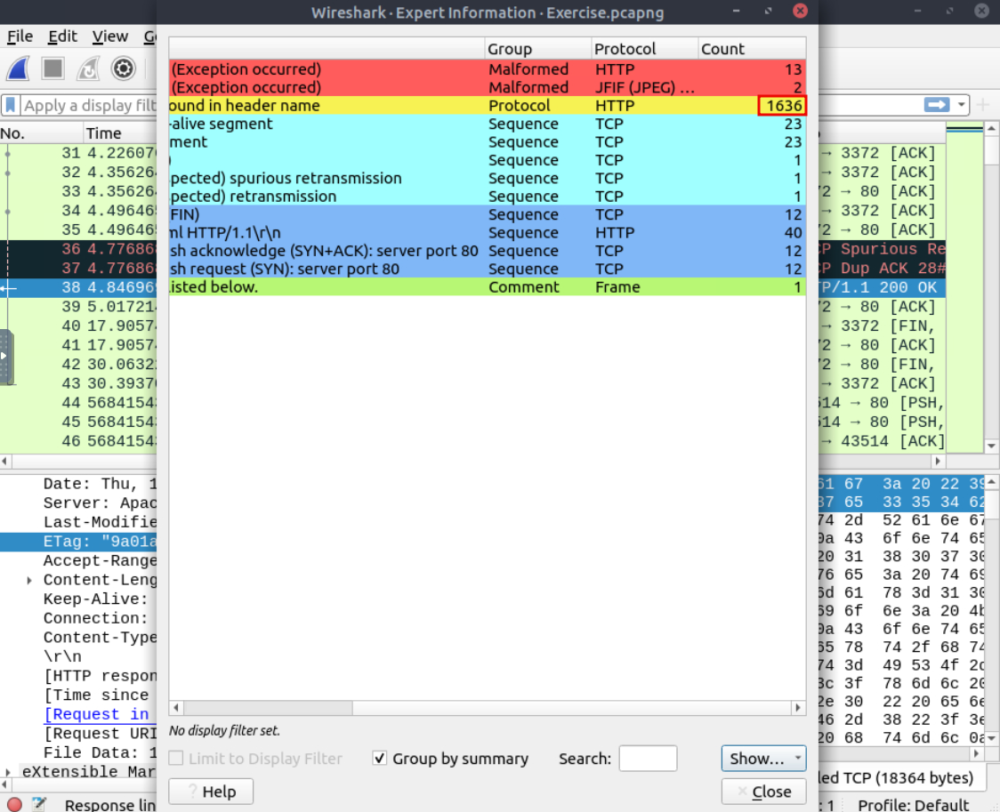

A: `1636`

## Packet Filtering

Wireshark has two types of filtering approaches: capture and display filters. Capture filters are used for **"capturing"** only the packets valid for the used filter. Display filters are used for **"viewing"** the packets valid for the used filter.

Filters are specific queries designed for protocols available in Wireshark's official protocol reference. While the filters are only the option to investigate the event of interest, there are two different ways to filter traffic and remove the noise from the capture file. The first one uses queries, and the second uses the right-click menu. Wireshark provides a powerful GUI, and there is a golden rule for analysts who don't want to write queries for basic tasks: **"If you can click on it, you can filter and copy it"**

### Apply as Filter

This is the most basic way of filtering traffic. While investigating a capture file, you can click on the field you want to filter and use the "right-click menu" or **"Analyse** **--> Apply as Filter"** menu to filter the specific value. Once you apply the filter, Wireshark will generate the required filter query, apply it, show the packets according to your choice, and hide the unselected packets from the packet list pane. Note that the number of total and displayed packets are always shown on the status bar.

### Apply as Filter

This is the most basic way of filtering traffic. While investigating a capture file, you can click on the field you want to filter and use the "right-click menu" or **"Analyse** **--> Apply as Filter"** menu to filter the specific value. Once you apply the filter, Wireshark will generate the required filter query, apply it, show the packets according to your choice, and hide the unselected packets from the packet list pane. Note that the number of total and displayed packets are always shown on the status bar.

### Colourise Conversation

This option is similar to the "Conversation Filter" with one difference. It highlights the linked packets without applying a display filter and decreasing the number of viewed packets. This option works with the "Colouring Rules" option ad changes the packet colours without considering the previously applied colour rule. You can use the "right-click menu" or **"View --> Colourise Conversation"** menu to colourise a linked packet in a single click. Note that you can use the **"View --> Colourise Conversation --> Reset Colourisation"** menu to undo this operation.

### Prepare as Filter 

Similar to "Apply as Filter", this option helps analysts create display filters using the "right-click" menu. However, unlike the previous one, this model doesn't apply the filters after the choice. It adds the required query to the pane and waits for the execution command (enter) or another chosen filtering option by using the **".. and/or.."** from the "right-click menu".

### Apply as Column

By default, the packet list pane provides basic information about each packet. You can use the "right-click menu" or "**Analyse --> Apply as Column**" menu to add columns to the packet list pane. Once you click on a value and apply it as a column, it will be visible on the packet list pane. This function helps analysts examine the appearance of a specific value/field across the available packets in the capture file. You can enable/disable the columns shown in the packet list pane by clicking on the top of the packet list pane.

### Follow Stream

Wireshark displays everything in packet portion size. However, it is possible to reconstruct the streams and view the raw traffic as it is presented at the application level. Following the protocol, streams help analysts recreate the application-level data and understand the event of interest. It is also possible to view the unencrypted protocol data like usernames, passwords and other transferred data.

You can use the"right-click menu" or **"Analyse** **--> Follow TCP/UDP/HTTP Stream"** menu to follow traffic streams. Streams are shown in a separate dialogue box; packets originating from the server are highlighted with blue, and those originating from the client are highlighted with red.

### Questions

Q: Go to packet number **4**. Right-click on the "Hypertext Transfer Protocol" and apply it as a filter.  
Now, look at the filter pane. What is the filter query?

A: `http`

Q: What is the number of displayed packets?

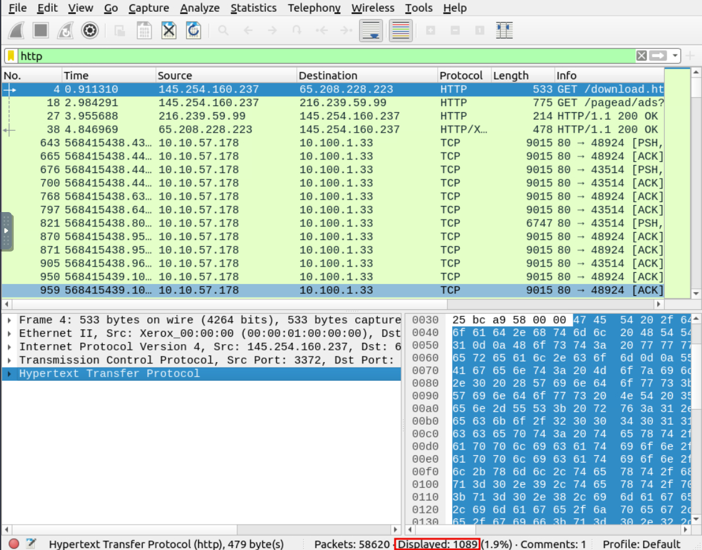

A: `1089`

Q: Go to packet number **33790,** follow the HTTP stream, and look carefully at the responses.  
Looking at the web server's response, what is the total number of artists?

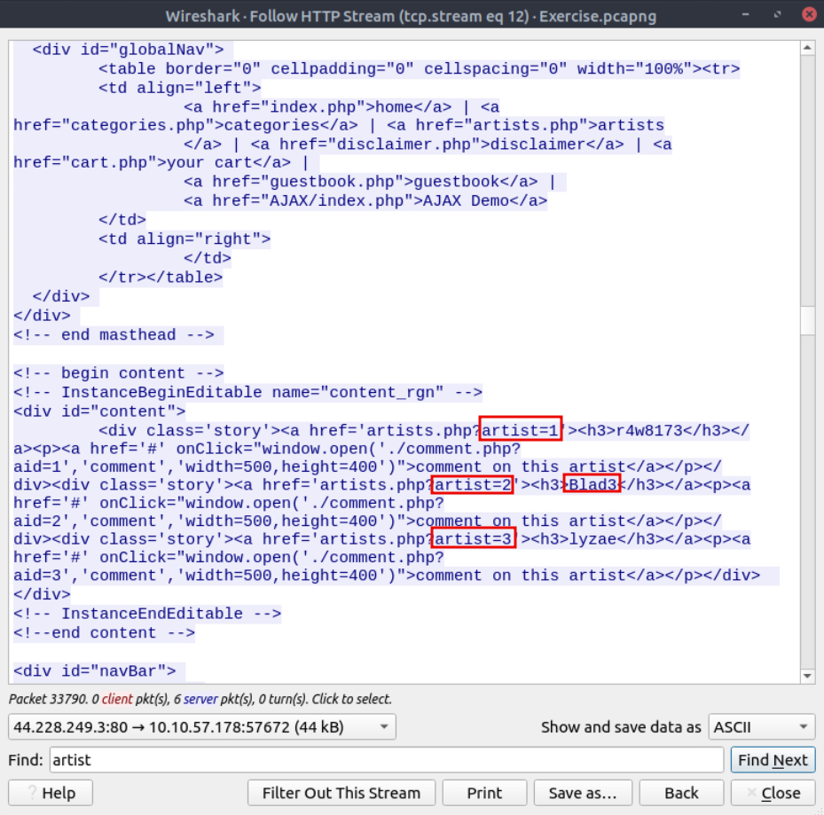

A: `3`

Q: What is the name of the second artist?

A: `Blad3`