# [Yara](https://tryhackme.com/room/yara)

## What is Yara?

- [Docs](https://yara.readthedocs.io/en/stable/writingrules.html)

< "The pattern matching swiss knife for malware researchers (and everyone else)" - VirusTotal, 2020

- Yara can identify information based on both binary and textual patterns, such as hexadecimal and strings contained within a file.

- rules are used to label these patterns

	- Yara rules are frequently written to determine if a file is malicious or not, based upon the pattern it presents.

### Tasks

1. What is the name of the base-16 numbering system that Yara can detect?

A: Hex

2. Would the text "Enter your Name" be a string in an application? (Yay/Nay)

A: Yay

## Intro To Yara Rules

- every Yara command require two arguments to be valid:

	1). The rule file we create
	2). Name of file, directory, or process ID to use the rule for.

- Every rule must have a name and condition.

- Standard file extension for all Yara rules: **.yar**

- we create a .yar file in which we write:

```yara
rule examplerule{
	condition: true 
}
```

- it checks if the file/directory/PID we give as an argument exists.

	- if it exists, we are given the name of the rule: `examplerule`

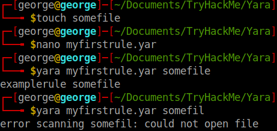

## Expanding on Yara Rules

- Conditions:

### Meta

- This section of a Yara rule is reserved for descriptive information by the author of the rule. 
	
	- For example, you can use `desc`, short for description, to summarise what your rule checks for. 

	- Anything within this section does not influence the rule itself. 

	- Similar to commenting code, it is useful to summarise your rule.

### Strings

- Remember our discussion about strings in Task 2? Well, here we go. 

- You can use strings to search for specific text or hexadecimal in files or programs. 

	- For example, say we wanted to search a directory for all files containing "Hello World!", we would create a rule such as below:

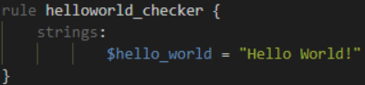

- Of course, we need a condition here to make the rule valid. 

	- In this example, to make this string the condition, we need to use the variable's name. In this case, $hello_world:

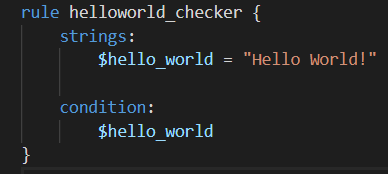

- Essentially, if any file has the string "Hello World!" then the rule will match. 

	- However, this is literally saying that it will only match if "Hello World!" is found and will not match if "hello world" or "HELLO WORLD.

- use `any of them`:

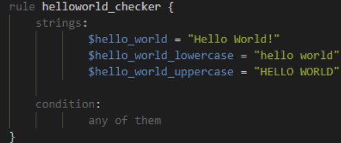

### Conditions

- We have already used the true and any of them condition. Much like regular programming, you can use operators such as: <=, >=, !=.

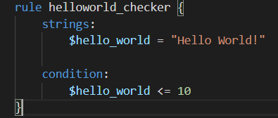

- The rule will now:

	- Look for the "Hello World!" string
	- Only say the rule matches if there are less than or equal to ten occurrences of the "Hello World!" string

### Combining keywords

- To combine multiple conditions. Say if you wanted the rule to match if any .txt files with "Hello World!" is found, you can use a rule like below:

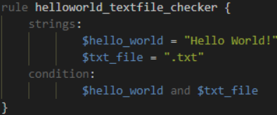

### Anatomy of a Yara Rule


## Yara Modules

- Frameworks such as the [Cuckoo Sandbox](https://cuckoosandbox.org/) or [Python's PE Module](https://pypi.org/project/pefile/) allows you to improve the technicality of your Yara rules ten-fold.

### Cuckoo

- Cuckoo Sandbox is an *automated malware analysis environment*. 

- This module allows you to generate Yara rules based upon the behaviours discovered from Cuckoo Sandbox. 

- As this environment executes malware, you can create rules on specific behaviours such as runtime strings and the likes.

### Python PE

- Python's PE module allows you to create Yara rules from the various sections and elements of the Windows Portable Executable (PE) structure.


## Yara Tools

### Loki

- free open source IOC (*Indicator of Compromise*)

- *Detection* is based on 4 methods:

	1. File Name IOC Check
	2. Yara Rule Check
	3. Hash Check
	4. C2 Back Connect Check

### Thor

- commercial variant of Loki

- multi-platform IOC AND YARA scanner.

- Note that THOR is geared towards corporate customers. THOR Lite is the free version.

### Fenrir

- Fenrir is a bash script; it will run on any system capable of running bash (nowadays even Windows). 

### Yaya

- YAYA is a new open-source tool to help researchers manage multiple YARA rule repositories. 

- YAYA starts by importing a set of high-quality YARA rules and then lets researchers add their own rules, disable specific rulesets, and run scans of files.

## Use Loki

### Tasks

Scenario: You are the security analyst for a mid-size law firm. A co-worker discovered suspicious files on a web server within your organization. These files were discovered while performing updates to the corporate website. The files have been copied to your machine for analysis. The files are located in the `suspicious-files` directory. Use Loki to answer the questions below.

- Command used: `cmnatic@thm-yara:~/suspicious-files/file1$ python ../../tools/Loki/loki.py -p .`

1. Scan file 1. Does Loki detect this file as suspicious/malicious or benign?

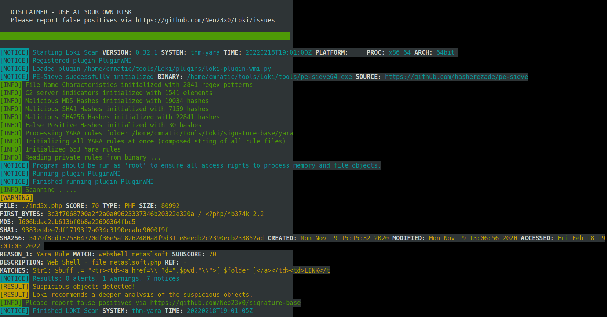

A: Suspicious 

2. What Yara rule did it match on?

A: webshell_metaslsoft

3. What does Loki classify this file as?

A: Web Shell

4. Based on the output, what string within the Yara rule did it match on?

A: Str1

5. What is the name and version of this hack tool?

A: b374k 2.2

6. Inspect the actual Yara file that flagged file 1. Within this rule, how many strings are there to flag this file?

A: 1

7. Scan file 2. Does Loki detect this file as suspicious/malicious or benign?

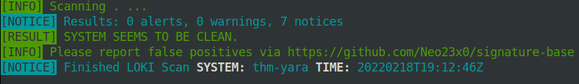

A: benign

8. Inspect file 2. What is the name and version of this web shell?

A: b374k  3.2.3

## Creating Yara rules with yarGen

- file2 did not get flagged on by Loki, so we need to make a Yara rule to detect this specific web shell in our environment

- we can search manually for potential Strings

- we can use *yarGen* = YARA rules generator

- "The main principle is the creation of yara rules from strings found in malware files while removing all strings that also appear in goodware files. Therefore yarGen includes a big goodware strings and opcode database as ZIP archives that have to be extracted before the first use."

```python
python3 yarGen.py -m /home/cmnatic/suspicious-files/file2 --excludegood -o /home/cmnatic/suspicious-files/file2.yar 
```

- Explanations:

	- `-m`: path to the files you want to generate rules for

	- `--excludegood`: force to exclude all goodware strings (these are strings found in legitimate software and can increase false positives)

	- `-o`: location and name you want to output the Yara rule.

- Another tool that go well with this: [yarAnalyzer](https://github.com/Neo23x0/yarAnalyzer/)

- Further reading on yarGen:

	- https://www.bsk-consulting.de/2015/02/16/write-simple-sound-yara-rules/

	- https://www.bsk-consulting.de/2015/10/17/how-to-write-simple-but-sound-yara-rules-part-2/

	- https://www.bsk-consulting.de/2016/04/15/how-to-write-simple-but-sound-yara-rules-part-3/


### Tasks


1. From within the root of the suspicious files directory, what command would you run to test Yara and your Yara rule against file 2?

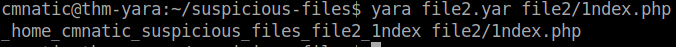

A: yara file2.yar file2/1ndex.php

2. Did Yara rule flag file 2? (Yay/Nay)

A: Yay

3. Copy the Yara rule you created into the Loki signatures directory.

- `cp file2.yar ../tools/Loki/signature-base/`

4. Test the Yara rule with Loki, does it flag file 2? (Yay/Nay)

- `python ../../tools/Loki/loki.py -p . `

A: yay

5. What is the name of the variable for the string that it matched on?

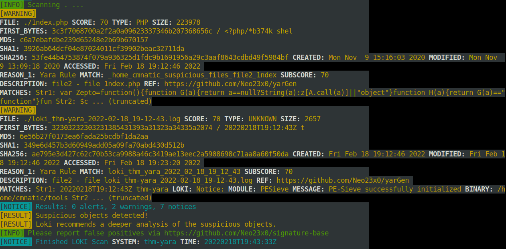

A: Zepto

6. Inspect the Yara rule, how many strings were generated?

A: 20

7. One of the conditions to match on the Yara rule specifies file size. The file has to be less than what amount?

A: 700KB

## Valhalla

- online Yara feed

- "[VALHALLA](https://valhalla.nextron-systems.com/) boosts your detection capabilities with the power of thousands of hand-crafted high-quality YARA rules."

### Tasks
1. Enter the SHA256 hash of file 1 into Valhalla. Is this file attributed to an APT group? (Yay/Nay)

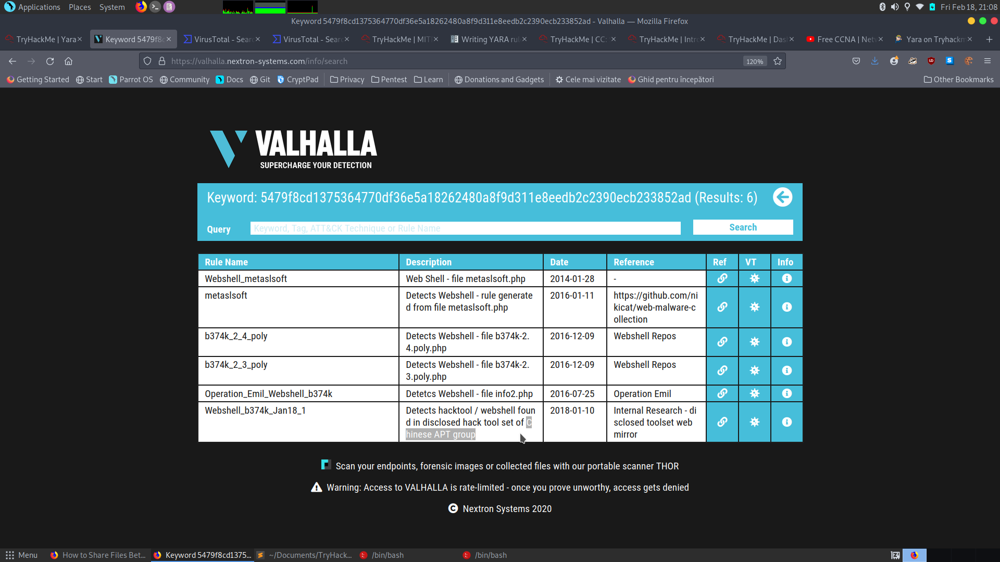

A: Yay

2. Do the same for file 2. What is the name of the first Yara rule to detect file 2?

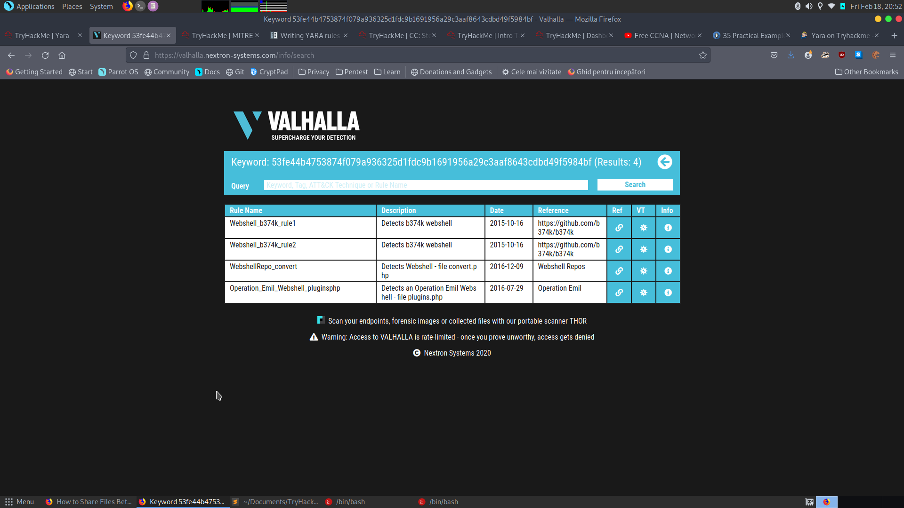

A: Webshell_b374k_rule1

3. Examine the information for file 2 from Virus Total (VT). The Yara Signature Match is from what scanner?

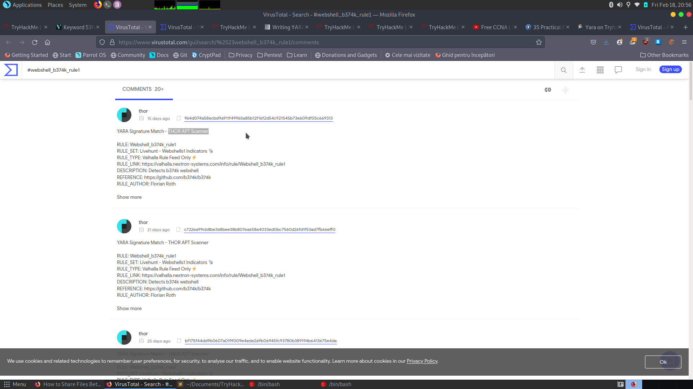

A: THOR APT Scanner

4. Enter the SHA256 hash of file 2 into Virus Total. Did every AV detect this as malicious? (Yay/Nay)

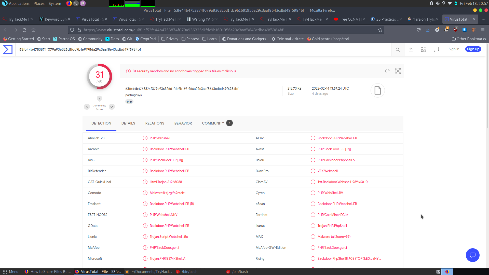

A: Nay

5. Besides .PHP, what other extension is recorded for this file?

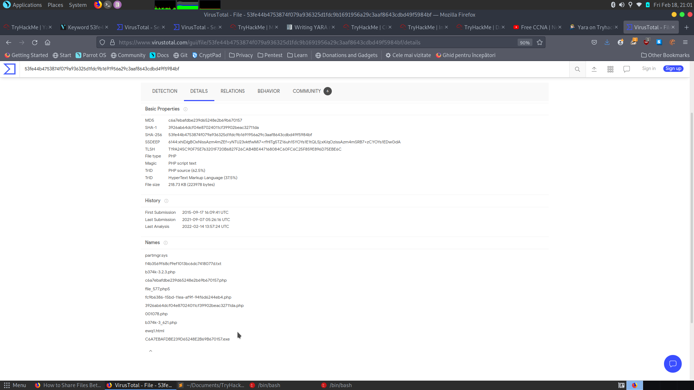

A: exe

6. What JavaScript library is used by file 2?

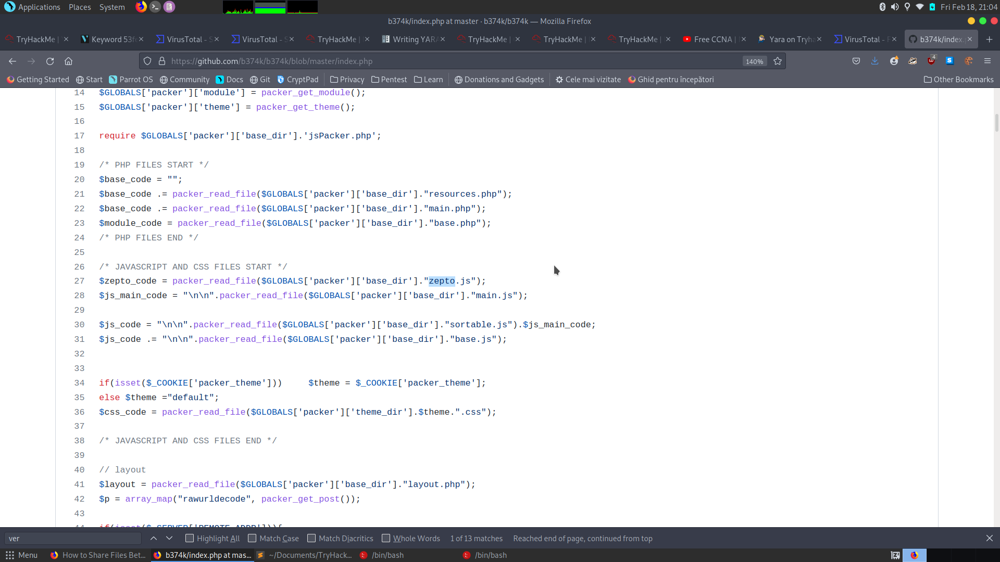

A: zepto

7. Is this Yara rule in the default Yara file Loki uses to detect these type of hack tools? (Yay/Nay)

A: Nay
